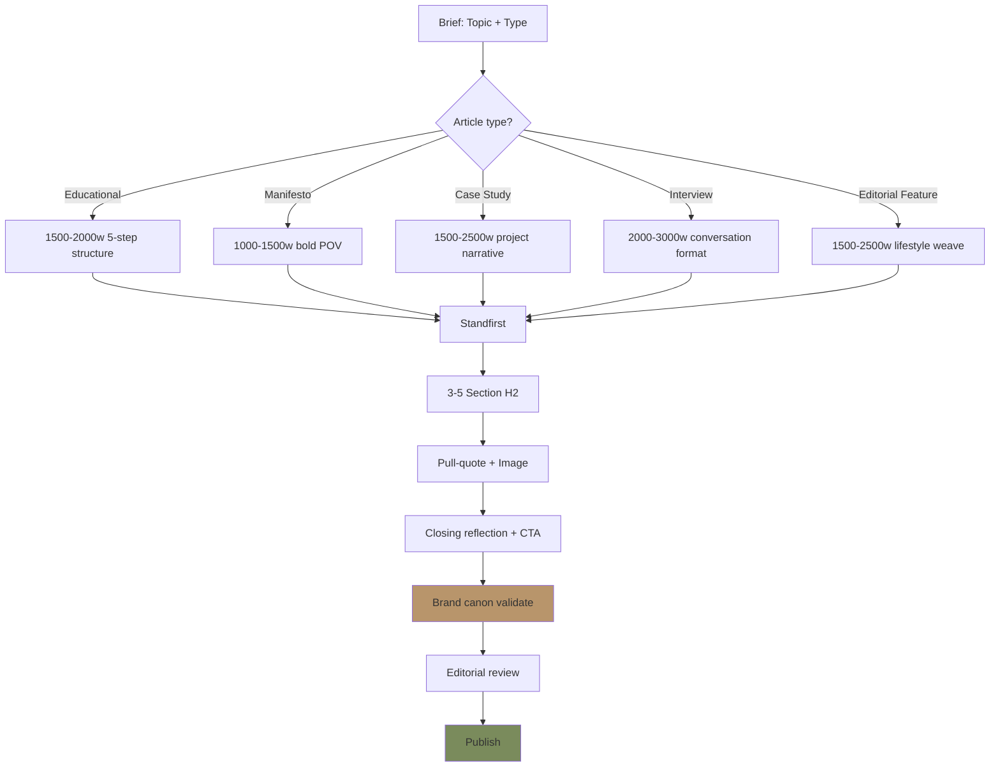
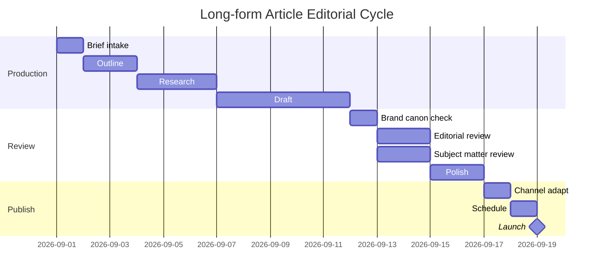

# Long-form Writer (Article, Manuscript, Editorial)

Write long-form content Gerai 1000 Pintu: blog article, manuscript chapter, editorial feature, white paper, project case study. 1500-3000 word, premium hangat, anchor BP Latest reference editorial.

## Triggers

Primary:
- "long form article"
- "tulis artikel"
- "manuscript chapter"

Secondary:
- "white paper"
- "case study writeup"

## Input Required

| Field | Type | Required | Default |
|---|---|---|---|
| topic | string | yes | - |
| article_type | enum | yes | (educational/manifesto/case-study/philosophy/interview) |
| target_persona | enum | no | (default Retail) |
| word_count | number | no | (default 2000) |
| publish_channel | enum | no | (website blog / manuscript / press / Notion internal) |

## Output Template

```markdown
# {Article Title}

**Word count:** {N} words
**Type:** {Educational / Manifesto / Case Study / Philosophy / Interview}
**Target:** {Persona}
**Channel:** {Where published}
**Author:** Gerai 1000 Pintu Editorial

---

## Lead Image Suggestion
{Photography direction: subject + mood + composition}
Alt text: {descriptive Indonesia}

## H1: {Article Title}

### Standfirst (intro paragraph)
{1-2 sentence opening yang capture attention dengan premium hangat tone — frame topic dalam konteks tempat impian / refleksi}

### Section 1: H2 {Section Header}

{Body paragraph — 2-4 sentence}

{Body paragraph continuing — narrative flow}

{Pull-quote OR insight callout kalau perlu}

### Section 2: H2 {Section Header}

{Body content}

#### H3: Sub-section kalau perlu

{Detail}

### Section 3: H2 {Section Header}

{Content with story / case / example}

### Closing: H2 {Reflection / Invitation}

{1-2 paragraph closing}

{Soft CTA: invitation untuk explore atau konsultasi}

---

## Article Type Templates

### Type 1: Educational Article

**Purpose:** Inform + position thought leadership
**Length:** 1500-2000 word
**Structure:**
1. Standfirst (problem / question)
2. Context (industry / cultural / philosophical)
3. Education (4-negara cultural reference, material, craftsmanship)
4. Application (apa artinya untuk tempat customer)
5. Invitation soft

**Example topics:**
- "Filosofi Dunia Pintu (4-negara cultural context): Memahami Karakter Pintu Anda"
- "Brass: Lebih dari Sekedar Material"
- "Memilih Pintu untuk Tempat yang Anda Bangun"
- "Kayu Solid vs Engineered: Pilihan yang Bijak"

### Type 2: Manifesto / Philosophy

**Purpose:** Brand point-of-view, manifesto declaration
**Length:** 1000-1500 word (lebih singkat untuk impact)
**Structure:**
1. Opening statement bold
2. Why we believe X
3. What we reject
4. What we promise
5. Closing call to philosophy alignment

**Example topics:**
- "Kami Percaya Tempat adalah Refleksi"
- "Mengapa Curated Selalu Lebih dari Variety"
- "Door Expert: Bukan Sales, Sebuah Pendampingan"

### Type 3: Case Study / Project Story

**Purpose:** Showcase project + persona resonance
**Length:** 1500-2500 word
**Structure:**
1. Customer profile (anonymized OR with consent)
2. The starting point (tempat + vision)
3. Konsultasi journey
4. Decision narrative (why this pintu)
5. Outcome + reflection
6. Insight untuk reader yang serupa

**Example topics:**
- "Project Cluster Borneo: Cerita 5 Pintu untuk 5 Tempat Berbeda"
- "Bapak Anton: Dari Pengusaha ke Curator Tempat"
- "Studio Arsitek Y: Filosofi Dunia Pintu (4-negara cultural context) dalam Project Mereka"

### Type 4: Interview / Conversation

**Purpose:** Voice-driven content, expert / customer / craftsman
**Length:** 2000-3000 word
**Structure:**
1. Interviewer intro (siapa subject, kenapa important)
2. Conversation in narrative + quote format
3. Themed sections (background, philosophy, project, future)
4. Closing reflection
5. About subject

**Example topics:**
- "Percakapan dengan Door Expert: 5 Kompetensi dalam Praktek"
- "Wawancara Arsitek Senior: Apa yang Membuat Pintu Bermakna"
- "Conversation dengan Pengrajin Brass: Craftsmanship yang Berbicara"

### Type 5: Editorial Feature (Lifestyle)

**Purpose:** Lifestyle / cultural piece tied to brand
**Length:** 1500-2500 word
**Structure:**
1. Cultural / lifestyle context
2. Connection ke filosofi Gerai
3. Application detail
4. Sensory + storytelling
5. Subtle brand integration

**Example topics:**
- "Pagi di Tempat Anda: Ritual yang Dimulai dari Pintu"
- "Empat Musim Empat Karakter: Pintu yang Menemani"
- "Detail yang Bermakna: Pelajaran dari Pengrajin Jepang"

## Editorial Voice

### Tone consistency throughout
- Premium hangat (BP Latest reference)
- Calm refined (no rush, no urgency)
- Audience-first (Anda focus)
- Story-driven (not data-driven)
- Sensory-rich (visual, tactile, auditory detail)

### Sentence variety
- Mix short impact + medium flow + longer reflective
- Avoid monotonous rhythm
- Read aloud test: should feel natural

### Paragraph flow
- 2-4 sentence per paragraph (web readable)
- Logical progression idea → idea
- Bridge sentence between section
- Avoid abrupt topic jump

### Vocabulary richness
- Indonesian primary
- English selective (anchor reference: "curated", "craftsmanship" OK)
- Avoid jargon corporate
- Embrace poetic when natural

## Structure Elements

### Headers Hierarchy
- H1: Article title (1 per article)
- H2: Section break (3-5 per article)
- H3: Sub-section (sparing)
- H4: Rare (avoid clutter)

### Pull-Quote Strategy
- Place 1-2 pull-quote per article
- Highlight insight or memorable line
- Visual treatment: Playfair Display italic, Brass accent

### Image Placement
- Lead image: top hero (above headline)
- Section image: every 400-500 word (visual rhythm)
- Caption: descriptive + sensory
- Alt text: accessibility

### Lists (use sparingly)
- Bulleted: max 5 item, descriptive each
- Numbered: only if sequential mandatory
- Prefer narrative flow over list

### Footnote / Citation
- Anchor reference (BP Latest reference): mention contextually
- Industry source: cite end-note format
- Customer quote: with consent + attribution (Bapak/Ibu Initial)

## Editorial Workflow

### Step 1: Brief intake
- Topic, type, persona, channel, word count, deadline

### Step 2: Outline
- H2 section structure (3-5 section)
- Key argument / story arc
- Image suggestion per section
- Anchor reference integration plan

### Step 3: Research
- Reference material (BP, brand canon, customer story)
- Anchor benchmark (BP Latest reference article equivalent)
- Industry data (kalau educational)

### Step 4: Draft
- Standfirst opening
- Section-by-section
- Hold-on quote / insight callout
- Closing soft CTA

### Step 5: Brand canon validation
- brand-canon-enforcer auto-check
- 7 rules compliance
- Vocabulary audit
- Tone target zone confirmation

### Step 6: Editorial review
- Editorial Reviewer agent: structural integrity
- CCO oversight: brand alignment
- Subject matter check (Door Expert review kalau technical)

### Step 7: Polish
- Sentence rhythm + flow
- Pull-quote selection
- Image direction finalize
- Hyperlink + CTA

### Step 8: Publish coordination
- Channel-specific format adaptation
- Meta description SEO
- Social teaser draft
- Schedule + distribution

## Quality Standards

### Readability
- Flesch-Kincaid grade level: 8-10 (accessible premium)
- Sentence length avg: 15-20 word
- Paragraph length avg: 50-80 word
- Section length avg: 200-400 word

### Originality
- No verbatim copy from sources
- Original synthesis + storytelling
- Customer story consent (kalau named)

### SEO consideration
- H1 keyword + brand name natural
- Meta description 150-160 char
- Alt text descriptive
- Internal link 2-3 per article
- External link 1-2 (anchor reference quality)

### Anti-pattern (jangan)
- ❌ Generic listicle ("10 Tips Memilih Pintu")
- ❌ Aggressive sell-through (every paragraph CTA)
- ❌ Em-dash habit (LOCKED rule 1)
- ❌ Stock phrase ("solusi terbaik", "kualitas terjamin")
- ❌ Verbose corporate (cut fluff)
- ❌ Mixing English-Indonesia random
- ❌ Quote unattributed
- ❌ Photo stock cliche

## Brand Canon Integration

### 5 Nilai Integration
Setiap artikel naturally weave 1-3 dari 5 Nilai:
- Inspirasi: story / philosophy element
- Keahlian: technical detail / craftsmanship
- Pelayanan Nyaman: warm hospitality reference
- Inovasi: Lean Store / Door Expert mention
- Aftersales: long-term relationship reference

### Filosofi Dunia Pintu (4-negara cultural context) mention
- Educational: full explanation
- Other type: weave naturally (1-2 reference)

### Anchor BP Latest reference
- Visible in vocabulary, photography direction, tone
- Optional explicit mention kalau context fit

### 6 Persona resonance
- Adapt vocabulary depth per target
- Story selection per persona relevance
- CTA appropriate per buying stage

## Distribution Channel Adaptation

### Website Blog (gerai.mahewwork.com/journal)
- Length: 1500-2500 word ideal
- SEO optimized
- Lead image hero
- Internal link rich

### Manuscript / Book Chapter
- Length: 3000-5000 word
- No SEO concern
- Editorial richer (longer sentence OK)
- Footnote scholarly

### Press / Editorial Submission
- Length: 800-1500 word (publication standard)
- Adapt to publication style (Kinfolk, Femina, etc.)
- Pitch-first approach

### Notion Internal
- Length: variable
- Internal terminology OK
- Less polish required

### Social Media Long Caption
- Length: 300-500 word
- Lead with hook
- Pull-quote-style structure
- CTA prominent
```

## Visual Output

Article structure decision tree:



Editorial workflow Gantt:



## Knowledge Dependency

- editorial-style-guide
- brand-canon-enforcer
- copywriting-framework
- BP manuscript chapter format reference
- Filosofi Dunia Pintu (4-negara cultural context) full content
- Anchor BP Latest reference editorial style
- 6 Persona spec

## Mode

Default: EXECUTION (write article from brief)
Switch: DISCUSSION jika topic angle debate

## Tools Required

- file-search (reference + history)
- web-search (anchor reference inspiration)
- artifacts (article display)

## Validation Criteria

- 5 article type templates explicit
- Editorial voice consistency
- Structure elements (header, pull-quote, image, list, footnote)
- Workflow 8-step
- Quality standards (readability, originality, SEO)
- Anti-pattern explicit
- Brand canon integration (5 Nilai, 4-negara cultural reference, Anchor)
- Channel adaptation (web, manuscript, press, social)
- Sample topic per type

## Sample I/O

**Input:** "Long form article educational 'Filosofi Dunia Pintu (4-negara cultural context): Memahami Karakter Pintu Anda' 2000 word untuk website blog Wave 1 launch"

**Output summary:**
- Type: Educational
- Word count: 2000 word
- Structure: Standfirst → Context cultural → 4 section per dunia (Jepang/Eropa/Amerika/China) → Application untuk reader tempat → Closing invitation
- Tone: Premium hangat (BP Latest reference + Indonesian editorial reference)
- Lead image: Hero composite 4 archetype display
- Section image: Per dunia detail photograph
- Pull-quote: "Setiap dunia membawa kisah. Setiap pintu membawa karakter."
- CTA: "Mari mulai konsultasi dengan Door Expert untuk menemukan karakter yang menemani tempat Anda"
- SEO: H1 "Filosofi Dunia Pintu (4-negara cultural context): Memahami Karakter Pintu untuk Tempat Anda", meta description premium hangat
- Brand canon: 100% compliance (no em-dash, tempat, Gerai 1000 Pintu lengkap, anchor BP Latest reference + Indonesian editorial visible)
- Workflow Gantt + structure tree embedded

## Handoff

- brand-canon-enforcer (validation)
- caption-generator (social teaser)
- content-calendar-strategy (publish slot)
- visual-summary (mockup design)
