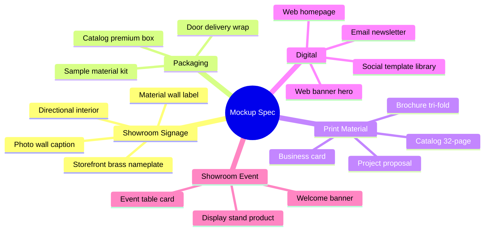
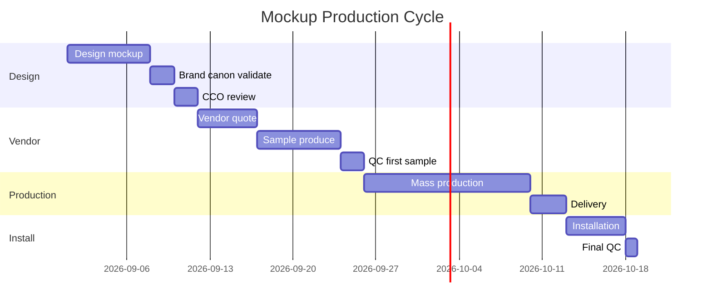

# Mockup Spec (Physical & Digital)

Spec mockup design Gerai 1000 Pintu: showroom signage, packaging, business card, brochure, web mockup, social template. Production-ready spec untuk vendor.

## Triggers

Primary:
- "mockup spec"
- "production spec"
- "mockup design"

Secondary:
- "signage mockup"
- "packaging spec"

## Input Required

| Field | Type | Required | Default |
|---|---|---|---|
| mockup_type | enum | yes | (signage / packaging / print / digital / showroom) |
| context | string | yes | - |
| quantity | number | no | - |

## Output Template

```markdown
# Mockup Spec: {TYPE} — {PROJECT}

**Project:** {Name}
**Mockup type:** {Category}
**Quantity:** {N}
**Production vendor:** {Assigned / TBD}
**Timeline:** {Date}
**Budget:** Rp {amount}

## Mockup Categories

### Category 1: Showroom Signage

#### Storefront Signage
- **Primary:** Brass nameplate engraved
- **Typography:** Playfair Display "Gerai 1000 Pintu"
- **Material:** Solid brass 3mm thick, polished satin
- **Size:** 800x200mm
- **Installation:** Wall-mounted standoff 15mm depth
- **Lighting:** Subtle warm LED ambient backlight (3000K)
- **Brand canon:** Charcoal architectural background + brass focal

#### Directional Signage Interior
- **Material:** Brass plate engraved OR powder-coated steel
- **Typography:** Playfair Display section name + Inter caption
- **Size:** 200x100mm typical
- **Mounting:** Subtle stand-off
- **Location:** Section transitions (Japan, Europe, America, China zones)

#### Material Wall Label
- **Material:** Brass tag small 60x30mm
- **Typography:** Inter SemiBold material name + small caption
- **Mounting:** Subtle adhesive backing
- **Color:** Charcoal text engraved on brass

#### Photo Wall Caption
- **Material:** Paper card matte uncoated
- **Typography:** Playfair Display project name + Inter description
- **Size:** 100x150mm portrait
- **Mounting:** Subtle clip or magnet

### Category 2: Packaging (Phase 2+)

#### Catalog Premium Box
- **Material:** Rigid box debossed cover
- **Cover:** Charcoal cloth wrap + brass-foil debossed logo
- **Insert:** Custom-fit foam Ivory
- **Size:** Slightly larger than catalog A4
- **Use:** Premium project gift / VIP send

#### Wrapping for Door Delivery
- **Outer:** Kraft paper Charcoal-dyed
- **Inner:** Soft fabric protective (cotton or linen)
- **Logo:** Brass-foil stamp subtle
- **Note card:** Personal thank-you Inter Medium

#### Sample Material Kit (Mitra Dagang send)
- **Box:** Compact rigid (200x300mm)
- **Content:** Wood swatch + brass swatch + finish samples
- **Labeling:** Brass tag per item engraved
- **Card:** Brand intro Playfair + Inter
- **Use:** Mitra Dagang outreach + Arsitek collaboration

### Category 3: Print Material

#### Business Card
- **Material:** Heavy matte uncoated card 350gsm
- **Front:** Logo + name + role Playfair + Inter
- **Back:** Subtle brass pattern OR philosophy quote
- **Size:** 90x55mm standard
- **Finish:** Letterpress OR debossed brass-foil
- **Color:** Charcoal text on Ivory + brass accent

#### Catalog Print (32-page typical)
- **Format:** A4 portrait (210x297mm)
- **Pages:** 32 page typical (8-page sections)
- **Cover:** Cloth-wrap Charcoal + brass-foil debossed logo
- **Interior:** Matte uncoated paper 150gsm
- **Binding:** Saddle-stitch OR perfect-bound
- **Print:** 4-color CMYK + brass-foil accent
- **Quantity:** 500 first batch (Wave 1 Mitra + Arsitek distribute)

#### Brochure Konsultasi
- **Format:** Tri-fold OR Z-fold A4
- **Material:** Matte 200gsm
- **Content:** Filosofi 4-Dunia intro + service + booking instruction
- **Color:** Charcoal + Ivory + Brass accent
- **Quantity:** 1000 (showroom take-away)

#### Project Proposal Document
- **Format:** A4 portrait
- **Pages:** 8-16 page typical
- **Cover:** Customized per project (customer name)
- **Interior:** Photography heavy + spec table
- **Print:** Customer-specific, low quantity (1-5 copy)

### Category 4: Digital Mockup

#### Web Homepage
- **Layout:** Full-bleed hero photo + Playfair H1 + Inter sub + Brass CTA
- **Sections:** Hero, 4-Dunia intro, Service explanation, Featured project, Testimony, Booking CTA, Footer
- **Responsive:** Desktop 1440px + Tablet 768px + Mobile 375px
- **Brand canon:** 60/30/10 palette ratio strict
- **Photography:** Category A + B dominant

#### Email Newsletter Template
- **Layout:** Single column 600px
- **Header:** Logo Playfair + subtle border
- **Body:** Editorial layout (image + headline + paragraph)
- **CTA:** Brass button
- **Footer:** Address + unsubscribe Inter caption

#### Social Template Library
- **Instagram feed (1:1):** Hero photo + Playfair caption overlay (sparingly)
- **Instagram Story (9:16):** Layered template per content type
- **Instagram Reel (9:16):** Title card + lower-third caption template
- **TikTok cover:** Photo + Playfair title small
- **Variants per pillar (5):** Philosophy, Door Expert, Product, Showroom, Community

#### Web Banner / Hero
- **Resolution:** 2400x1200 desktop hero
- **Layout:** Hero photo + Playfair H1 + Inter sub + Brass CTA
- **Brand canon:** Generous white space, focal Brass

### Category 5: Showroom Decor / Event

#### Welcome Banner Grand Opening
- **Material:** Fabric or paper rigid
- **Size:** 60x90cm vertical
- **Typography:** Playfair Display "Selamat Datang di Gerai 1000 Pintu"
- **Color:** Charcoal text on Ivory background + Brass detail
- **Mounting:** Standee or wall-hang

#### Event Table Card
- **Material:** Matte uncoated card
- **Size:** 100x150mm tent-fold
- **Content:** Project name OR section info
- **Color:** Charcoal + Ivory + Brass accent

#### Display Stand for Product
- **Material:** Brass + wood combination
- **Size:** Custom per product
- **Lighting:** Spot LED 3000K
- **Style:** Refined minimal (Aesop-inspired)

## Production Specification Detail

### Print Production
- **Color space:** CMYK
- **Resolution:** 300 DPI at print size
- **Bleed:** 3mm all sides
- **Color profile:** Coated FOGRA39 or appropriate
- **Proof:** Hard-copy proof before mass production

### Signage Production
- **Material spec:** Documented per item
- **Finishing:** Engraving depth, polish level
- **Hardware:** Stand-off detail, mounting depth
- **Installation guide:** Per vendor

### Digital Production
- **Source file:** Figma master + variant exports
- **Format:** PNG @1x @2x @3x, SVG kalau vector
- **Color space:** sRGB digital
- **Optimization:** Web-optimized (WebP / compressed PNG)

## Vendor Coordination

### Print Vendor (Balikpapan + Jakarta)
- Local: Balikpapan capability assess
- Premium: Jakarta vendor untuk catalog premium (brass-foil capability)
- Lead time: 2-3 week typical
- QC: 100% sample approval before mass

### Signage Vendor (Balikpapan)
- Brass fabricator (engraving + cutting)
- Material supplier (brass plate solid)
- Installer experienced (showroom installation)
- Lead time: 4-6 week for custom

### Packaging Vendor (Jakarta typically)
- Premium rigid box maker
- Foil stamping capability
- Custom insert (foam / fabric)
- Lead time: 6-8 week

### Digital Production
- In-house designer (CCO + freelance)
- Source file: Figma master
- Export workflow: automated kalau possible

## Brand Canon Compliance Checklist

### Visual canon (per mockup)
- [ ] Palette Brass + Charcoal + Ivory (no off-canon color)
- [ ] Ratio 60/30/10 maintained
- [ ] Typography Playfair + Inter (no decorative font)
- [ ] Layout generous white space
- [ ] Hierarchy clear focal
- [ ] No drop shadow / 3D / gradient flashy
- [ ] Anchor Aesop + DWR style visible

### Material canon
- [ ] Premium natural material preferred (cloth, wood, brass)
- [ ] No commercial cheap plastic / vinyl
- [ ] Finish quality high (matte, satin, hand-rubbed)
- [ ] Sustainability consideration

### Typography canon
- [ ] Playfair Display for headline / hero
- [ ] Inter for body / caption
- [ ] Hierarchy clear
- [ ] No all-caps body
- [ ] Letter spacing standard

### Copy canon (kalau text)
- [ ] No em-dash
- [ ] "tempat" not "rumah"
- [ ] "Gerai 1000 Pintu" lengkap
- [ ] Premium hangat tone
- [ ] Anchor vocabulary reflected

## Approval Workflow

### Step 1: Design Mockup
- Designer produce mockup per spec
- Brand canon validate (auto + manual)
- CCO review

### Step 2: Vendor Quote
- Production cost + lead time
- Material sample request
- QC commitment

### Step 3: Approval
- CCO approve creative
- CFO approve budget
- Matthew final (kalau hero / master)

### Step 4: Production
- Vendor confirm + sample produce
- QC pass first sample
- Mass production go

### Step 5: Delivery + Install
- Quality check on arrival
- Installation supervised
- Final QC

## Sample Mockup Spec Templates

### Template A: Storefront Signage Balikpapan
- Material: Solid brass 3mm
- Size: 800x200mm
- Typography: "Gerai 1000 Pintu" Playfair Display 96pt
- Engraving: Deep 2mm fill ivory paint
- Mounting: Stand-off 15mm
- Lighting: Backlight subtle 3000K
- Vendor: Brass fabricator Balikpapan
- Lead time: 4 week
- Budget: Rp 10-15jt

### Template B: Catalog 2027 Print
- Pages: 32
- Cover: Cloth-wrap Charcoal + brass-foil debossed
- Interior: Matte uncoated 150gsm CMYK + brass-foil accent page
- Binding: Saddle-stitch
- Quantity: 500
- Vendor: Premium printer Jakarta
- Lead time: 6 week
- Budget: Rp 35jt (Rp 70k per copy)

### Template C: Instagram Story Template Library
- Pillar count: 5 (Philosophy, Door Expert, Product, Showroom, Community)
- Variants per pillar: 3-5 layout
- Total: 25-50 master template Figma
- Adaptation guide: per content team
- In-house production
- Lead time: 2 week
- Budget: Rp 10jt designer
```

## Visual Output

Mockup category hierarchy:



Production workflow Gantt:



## Knowledge Dependency

- visual-identity-system (canon source)
- design-brief-generator
- brand-canon-enforcer
- editorial-style-guide (kalau copy)
- iconography-system
- COO vendor-onboarding (production vendor)

## Mode

Default: EXECUTION (generate spec)
Switch: NEED_CLARIFICATION jika quantity/material ambigu

## Tools Required

- file-search
- artifacts (mockup preview + spec table)

## Validation Criteria

- 5 mockup category (signage, packaging, print, digital, event)
- Production spec per type (material, size, finish, color)
- Vendor coordination per category
- Brand canon compliance checklist (visual, material, typography, copy)
- Approval workflow 5-step
- Sample template per category
- Lead time + budget estimate
- Anti-pattern avoided

## Sample I/O

**Input:** "Mockup spec untuk Wave 1 launch — storefront signage Balikpapan + business card Door Expert + catalog brochure tri-fold + social template library Instagram"

**Output summary:**
- Storefront signage: Brass 3mm × 800x200mm engraved Playfair "Gerai 1000 Pintu" + backlight 3000K + Rp 12jt Balikpapan vendor
- Business card: Matte 350gsm 90x55mm letterpress + brass-foil accent + Rp 5jt 500pcs
- Brochure tri-fold: Matte 200gsm A4 + 4-color + brass accent + Rp 3jt 1000pcs
- Social template library: Figma master 25 template × 5 pillar + 2-week designer Rp 10jt
- Total budget: Rp 30jt mockup spec Wave 1
- Lead time: 6 week parallel production
- Brand canon: 60/30/10 palette + Playfair+Inter + Aesop reference + no em-dash + premium hangat
- Workflow Gantt + category mindmap embedded

## Handoff

- design-brief-generator (paired)
- visual-identity-system (canon source)
- COO vendor-onboarding (production vendor)
- CFO Gerai (budget approval)
