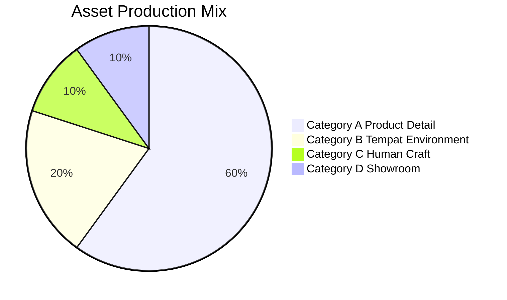
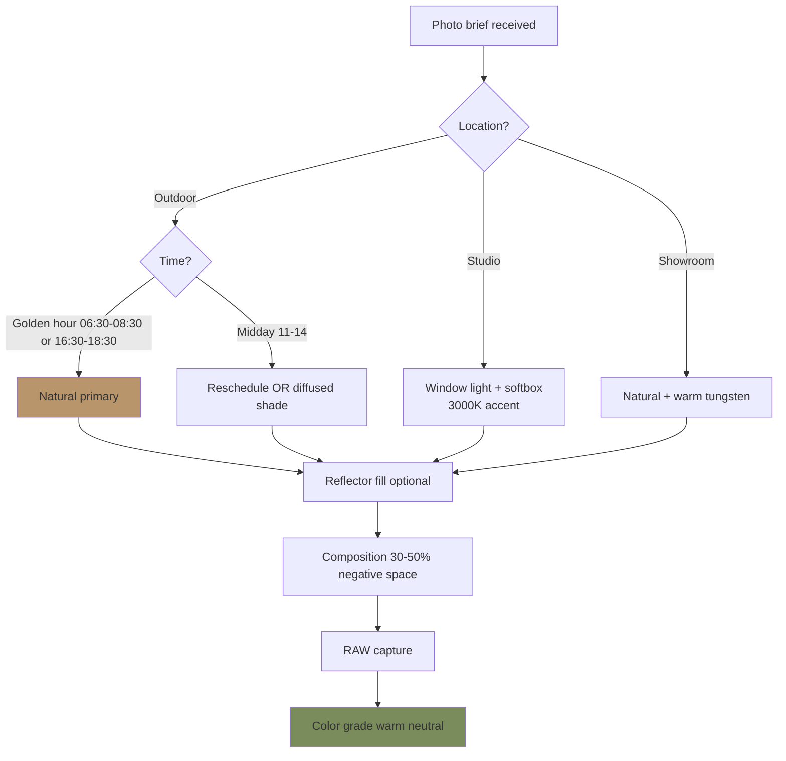

# Photography Direction

Direct photography production Gerai 1000 Pintu: subject, mood, composition, lighting, post-processing. Anchor Aesop + DWR + Kinfolk editorial style. Locked brand canon visual.

## Triggers

Primary:
- "photography direction"
- "photo brief"
- "shoot brief"

Secondary:
- "art direction photo"
- "image style guide"

## Input Required

| Field | Type | Required | Default |
|---|---|---|---|
| project | string | yes | (e.g., "Catalog Wave 1", "Instagram weekly") |
| subject_category | enum | yes | (A product / B tempat / C human / D showroom) |
| asset_count | number | yes | - |
| use_case | string | no | (where + how used) |

## Output Template

```markdown
# Photography Direction: {PROJECT}

**Project:** {Name}
**Photographer:** {Assigned / TBD}
**Shoot date:** {Date}
**Location:** {Studio / showroom / location}
**Asset count:** {N final asset}
**Use case:** {Distribution channel}

## Style Anchor (LOCKED)

### Reference North Star
- **Aesop:** Tight detail, natural daylight, minimal styling, editorial precision
- **Design Within Reach:** Environmental context, intentional composition, modern timeless
- **Kinfolk magazine:** Editorial warmth, sensory richness, slow living
- **Nendo studio:** Minimal craftsmanship attention
- **Wabi-sabi photography:** Imperfect beauty, natural patina

### Avoid (anti-reference)
- ❌ Generic stock photography
- ❌ Commercial e-commerce flat-lay rigid
- ❌ Fashion trendy seasonal
- ❌ Filter Instagram overdone (vintage VSCO, oversaturated)
- ❌ Studio lighting harsh artificial

## Subject Categories (4 categories)

### Category A: Product Detail (60% of shoot)
**Subject focus:** Pintu detail close-up
- Brass handle macro
- Wood grain texture
- Joinery (mortise + tenon)
- Finish surface (matte, satin, hand-rubbed)
- Material edge / corner detail
- Hardware specific (hinge, lock, pull)

**Mood:** Reverent, attention-paid, craftsmanship-respect

### Category B: Tempat Environment (20% of shoot)
**Subject focus:** Pintu installed di context
- Hero installed shot (wide environmental)
- Pintu + furniture context (modern Indonesian premium)
- Light-and-shadow play (morning / evening)
- Threshold moment (kissing point doorway)
- Foyer / entryway styled

**Mood:** Intentional living, refined home, peace

### Category C: Human Craft (10% of shoot)
**Subject focus:** Process + human (anonymized)
- Tukang hand at work (close, hand-focused)
- Door Expert konsultasi gesture (hand + papers + screen)
- Customer reaction (back of head, ambient)
- Craftsmanship process detail
- NO frontal customer face (privacy + premium)

**Mood:** Skill respected, process honored, human warmth

### Category D: Showroom Atmosphere (10% of shoot)
**Subject focus:** Cabang Balikpapan environment
- Storefront subtle (Aesop reference)
- Material wall touch
- Curated display vignette
- Konsultasi pod setup
- Detail signage brass

**Mood:** Intimate retail, refined invitation

## Lighting Direction

### Primary: Natural Daylight
- **Golden hour ideal:** 06:30-08:30 + 16:30-18:30 (Balikpapan WIB)
- **Diffused window light:** soft side-light, low-contrast
- **Avoid harsh midday:** 11:00-14:00 (kalau outdoor)

### Supplementary: Warm Tungsten / 3000K
- Add accent warm (brass enhance)
- Studio LED with CTO gel kalau perlu
- NO commercial cool 5000K (sterile feel)

### Anti-pattern
- ❌ Flat ring light (no dimension)
- ❌ Direct flash (harsh)
- ❌ Multiple competing color temperature
- ❌ Underlit shadow (depressing)

## Composition Principles

### Rule of thirds OR Center symmetry (intentional)
- Detail shot: center-weighted OK (reverent)
- Environmental: rule of thirds preferred
- Editorial wide: golden ratio approach

### Depth of field
- Macro detail: shallow DOF (f/2.8-4) acceptable
- Editorial mid: f/5.6-8 most preferred
- Environmental: f/8-11 sharp throughout

### Negative space
- Generous 30-50% area negative space
- Allow subject breathing room
- White / Ivory dominant background OK

### Angle perspectives
- Front-on 0°: Reverent product
- 3/4 angle 45°: Most editorial preferred
- Top-down 90°: Flat-lay sparingly
- Low angle 15°: Heroic but rare
- Avoid Dutch angle / tilted

## Color Grading Post-Production

### Tonality
- Warm neutral base (slight ochre / amber warmth)
- Slight lift in shadow (no crushed black)
- Highlights protect (no clipping)
- Brass enhance: slight saturation +5% on brass tones

### Color treatment
- Saturation -10% from RAW (subtle muted)
- Vibrance -5% (refined feel)
- Contrast medium (no clarity boost extreme)
- Skin tone (kalau ada): natural warm, NOT orange-saturated

### Avoid
- ❌ Heavy filter (VSCO trendy, Lightroom preset trendy)
- ❌ Cool blue tint (clinical)
- ❌ Crushed black + blown highlight
- ❌ Vignette heavy
- ❌ Grain artificial added

## Wardrobe & Styling (kalau human shot)

### Wardrobe Direction
- Neutral natural color (ivory, beige, charcoal, soft brown)
- Avoid logo branded clothing
- Texture: linen, cotton, wool (natural fiber)
- Minimal accessory (premium subtle)
- No trendy seasonal fashion

### Styling for Tempat shot
- Minimal furniture (modern Indonesian premium)
- Material harmony: wood + brass + linen + plant
- Plant subtle (no overdone botanical)
- Books, magazines: Kinfolk-style intentional
- NO clutter, no commercial branded product visible

## Technical Specifications

### Camera & Lens
- Full-frame DSLR / mirrorless preferred
- Resolution: 24MP+ for catalog print
- Lens: 50mm prime (standard), 35mm (environment), 85-100mm (detail), macro lens (close-up)

### File Format
- Capture RAW (always)
- Deliverable: TIFF 16-bit + JPEG high quality
- Color space: Adobe RGB (print) / sRGB (web)

### Resolution Requirement
- Print catalog: 300 DPI at print size
- Web hero: 2400x1600 minimum
- Social IG: 1080x1080 (square), 1080x1350 (portrait)
- Story / Reel: 1080x1920 vertical

## Shoot Day Workflow

### Pre-shoot (1-3 day before)
- Location scout kalau outdoor
- Sample / product preparation (clean, polish, position)
- Reference mood board printed
- Equipment checklist
- Schedule confirm

### Shoot day
- 09:00 — Setup + lighting test
- 10:00 — Category A product detail (golden morning soft)
- 12:00 — Lunch + asset review
- 13:00 — Category B environmental
- 15:00 — Category C human (kalau ada)
- 16:30 — Category D showroom golden hour
- 18:00 — Wrap + backup

### Post-shoot (3-7 day delivery)
- Day 1: RAW backup + selection (cull to top 3x deliverable target)
- Day 2-3: Color grading + minor retouching
- Day 4: First-pass deliverable submitted
- Day 5-6: Revision + final
- Day 7: Final asset + source file delivered

## Asset Naming Convention

```
gerai_photo_{category}_{subject}_{variant}_{resolution}.{ext}

Examples:
gerai_photo_a_brasshandle_macro_4k.jpg
gerai_photo_b_foyer_morninglight_4k.tif
gerai_photo_c_doorexpert_gesture_2k.jpg
gerai_photo_d_showroom_storefront_4k.jpg
```

## Asset Library Tagging

### Metadata required
- Category: A / B / C / D
- Subject: detail description
- Mood: morning / evening / studio
- Use: catalog / social / web / press
- License: in-house / stock-purchased / Creative Commons
- Consent: kalau human (signed waiver attached)

## Photographer Vetting Criteria

### Portfolio fit assessment
- Aesop / DWR / Kinfolk style demonstrated?
- Editorial sensitivity (not commercial sales)?
- Detail attention (macro craftsmanship)?
- Lighting natural mastery?
- Indonesian context familiar?

### Reference check
- Previous client list (brand premium)
- Reliability + responsiveness
- Brand canon adaptation capability

### Budget tier
- Senior editorial photographer Indonesia: Rp 5-15jt/day
- Mid-tier photographer: Rp 3-5jt/day
- Junior + assistant: Rp 1-3jt/day
- Stock photo license premium (Getty curated): Rp 500k-2jt/asset

## Stock Photo Usage (kalau perlu)

### When acceptable
- Background context (sky, generic foliage)
- Texture overlay (wood, paper)
- Mood reference fill (kalau brand-aligned)

### When NOT acceptable
- Hero shot product
- Customer story / testimonial
- Door Expert / staff representation
- Showroom representation

### Preferred stock source
- Getty Images Premium (curated)
- Unsplash (selectively, brand-aligned only)
- Pexels (selectively)
- AVOID: generic stock (Shutterstock typical, low-tier)

## Brand Canon Visual Compliance Checklist

- [ ] Palette aligned (Brass + Charcoal + Ivory + Warm tan)
- [ ] Lighting natural daylight + warm 3000K accent
- [ ] Color grade warm neutral (no cool tint)
- [ ] Composition generous negative space
- [ ] Subject category appropriate (A/B/C/D)
- [ ] Mood premium hangat
- [ ] Anti-pattern avoided (no stock cliche, no trendy filter)
- [ ] Aesop / DWR / Kinfolk reference visible

## Sample Brief per Category

### Brief A: Brass Handle Detail (Catalog Wave 1)
- Subject: AMK Premium brass handle close-up macro
- Lens: 100mm macro
- Lighting: Morning window light + reflector
- Composition: Center-weighted reverent
- Depth: f/4 shallow showing edge detail
- Mood: Craftsmanship respect
- Asset: 5 angle (front, 3/4 left, 3/4 right, top, edge)
- Deliverable: 4K TIFF + JPEG export per asset

### Brief B: Foyer Tempat Environment (Web Hero)
- Subject: Installed pintu Jepang section di context modern Indonesian premium
- Lens: 35mm wide
- Lighting: Late afternoon natural with subtle fill
- Composition: 3/4 angle showing pintu + foyer detail
- Depth: f/8 sharp throughout
- Mood: Intentional living calm
- Asset: 3 angle (front entry, 3/4 sideways, detail interior)
- Deliverable: 4K TIFF + multiple aspect ratio export

### Brief C: Door Expert Konsultasi Moment (Instagram Story)
- Subject: Hand on tablet + papers spread + Zoom screen visible
- Lens: 50mm
- Lighting: Studio diffused
- Composition: Top-down OR over-shoulder editorial
- Depth: f/4 selective focus
- Mood: Engaged warmth
- Asset: 3 frame (overall, hand close-up, screen detail)
- Anonymized: NO face visible
- Deliverable: 1080x1920 vertical + 1080x1080 square crop
```

## Visual Output

Photography category prioritization:



Lighting decision tree:



Shoot day Gantt:

```mermaid
gantt
    title Shoot Day Workflow
    dateFormat HH:mm
    axisFormat %H:%M
    section Setup
    Setup + lighting test :09:00, 60m
    section Category A Detail
    Brass detail macro :10:00, 60m
    Wood grain texture :11:00, 60m
    section Break
    Lunch + review :12:00, 60m
    section Category B Environmental
    Foyer wide :13:00, 60m
    Tempat context :14:00, 60m
    section Category C Human
    Konsultasi gesture :15:00, 60m
    section Category D Showroom
    Storefront golden :16:30, 90m
    section Wrap
    Wrap + backup :18:00, 60m
```



## Knowledge Dependency

- visual-identity-system (palette + style)
- brand-canon-enforcer (validation)
- editorial-style-guide
- Anchor Aesop + DWR + Kinfolk reference
- design-brief-generator (paired skill)

## Mode

Default: EXECUTION (generate photo brief)
Switch: NEED_CLARIFICATION jika subject ambigu

## Tools Required

- file-search (reference library)
- artifacts (mood board + workflow)
- web-search (Aesop/DWR reference update)

## Validation Criteria

- Style anchor (Aesop + DWR + Kinfolk) explicit
- 4 subject categories (A product / B tempat / C human / D showroom)
- Lighting direction (natural + warm tungsten)
- Composition principles
- Color grading post-production spec
- Wardrobe + styling (kalau human)
- Technical spec (camera, lens, format, resolution)
- Shoot day workflow
- Asset naming convention
- Brand canon visual compliance checklist
- Sample brief per category
- Anti-pattern explicit

## Sample I/O

**Input:** "Photography direction untuk Catalog Wave 1 launch, 50 asset across 4 category"

**Output summary:**
- Anchor: Aesop + DWR + Kinfolk editorial style
- Asset mix: 30 Category A (product detail), 10 B (tempat environment), 5 C (human craft), 5 D (showroom)
- Lighting: Natural daylight golden hour + warm 3000K accent
- Composition: 30-50% negative space, 3/4 angle preferred editorial
- Color grading: Warm neutral, saturation -10%, brass +5% enhanced
- Lens: 100mm macro detail + 50mm standard + 35mm environmental
- Photographer: Senior editorial Indonesia Rp 10jt/day × 5 day = Rp 50jt
- Studio + post: Rp 30jt total
- Timeline: Scout week 1, shoot week 2 (5 day), post week 3-4
- Deliverable: 50 final asset (TIFF + JPEG) + RAW backup + Adobe RGB color space
- Workflow Gantt + lighting decision + category pie embedded

## Handoff

- design-brief-generator (paired)
- visual-identity-system (canon source)
- brand-canon-enforcer (validation post)
- COO vendor-onboarding (photographer vendor)
