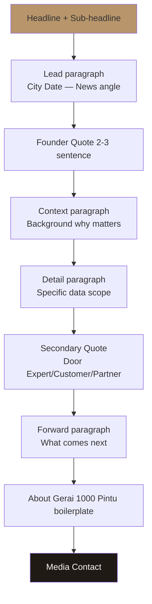
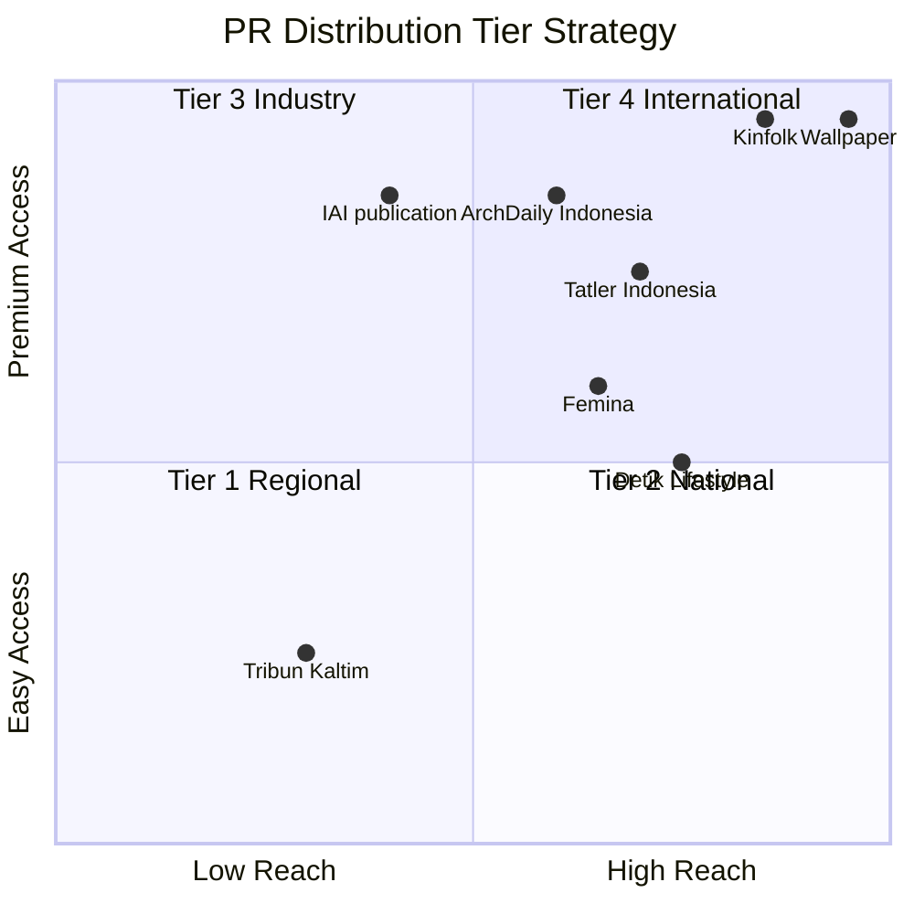
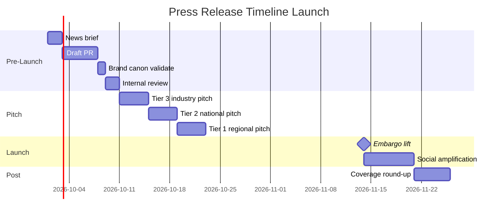

# Press Release Writer

Write press release Gerai 1000 Pintu: launch announcement, milestone, project showcase, executive feature. Premium hangat tone, anchor Aesop + DWR vocabulary, ready untuk Indonesia + Kaltim press.

## Triggers

Primary:
- "press release"
- "press kit"
- "siaran pers"

Secondary:
- "media announcement"
- "PR pitch"

## Input Required

| Field | Type | Required | Default |
|---|---|---|---|
| announcement | string | yes | (specific news) |
| pr_type | enum | yes | (launch / milestone / partnership / feature / executive) |
| target_outlet | enum | no | (lifestyle / business / regional / international) |
| embargo | date | no | - |

## Output Template

```markdown
# PRESS RELEASE

**For Immediate Release** | OR **Embargoed until {Date}**

## {HEADLINE}
### {Sub-headline if applicable}

**Balikpapan, {Date}** — Gerai 1000 Pintu, {1-sentence company description}, 
{news angle in 1 sentence}.

[Quote Matthew Wijaya, Founder Gerai 1000 Pintu, 2-3 sentence]

{Context paragraph — background of news, why this matters}

{Detail paragraph — specific information, data, scope}

[Quote secondary source, 1-2 sentence — Door Expert OR customer OR partner kalau ada]

{Forward-looking paragraph — what comes next, broader implication}

---

**About Gerai 1000 Pintu**

Gerai 1000 Pintu adalah tempat curated premium pintu di Balikpapan yang menyajikan 
filosofi 4-Dunia (Jepang jiwa, Eropa seni, Amerika pernyataan, China legacy). 
Dengan model Lean Store dan layanan konsultasi Door Expert via Zoom, Gerai 1000 
Pintu menghadirkan pengalaman premium curated retail anchored pada referensi Aesop 
dan Design Within Reach.

Lokasi: Balikpapan, Kalimantan Timur, Indonesia
Web: gerai.mahewwork.com
Kontak: {email + phone + WhatsApp}

**Media Contact:**
{Name}
{Title}
{Email}
{Phone}

###
```

## Press Release Type Templates

### Type 1: Launch Announcement (Wave 1)

**Sample headline:** 
"Gerai 1000 Pintu Hadir di Balikpapan: Tempat Curated Premium Pintu dengan Filosofi 4-Dunia"

**Sub-headline:** 
"Launch resmi 14 November 2026 menyajikan model Lean Store + konsultasi Door Expert remote pertama di Indonesia"

**Structure:**
1. Lead announcement (who, what, when, where)
2. Founder quote (vision)
3. Brand positioning context (filosofi 4-Dunia)
4. Operational innovation (Lean Store + Door Expert)
5. Anchor reference (Aesop + DWR)
6. Wave 1 detail (launch event, opening hours)
7. Forward (Phase 2 hint)

**Word count:** 500-700 word

### Type 2: Milestone Announcement (Year 1, Phase 2)

**Sample headline:**
"Setelah Setahun Beroperasi, Gerai 1000 Pintu Menghadirkan Cabang Kedua di Samarinda"

**Structure:**
1. Milestone announcement
2. Year 1 result highlight (data + customer story)
3. Phase 2 expansion detail
4. Founder reflection quote
5. Forward outlook

**Word count:** 400-600 word

### Type 3: Partnership / Project Showcase

**Sample headline:**
"Gerai 1000 Pintu Berkolaborasi dengan Studio Arsitek X untuk Project Premium Residential"

**Structure:**
1. Partnership announcement
2. Partner background (mutual quality)
3. Project detail (scope, vision)
4. Filosofi 4-Dunia application
5. Quote both parties
6. Implication for industry

**Word count:** 400-500 word

### Type 4: Editorial Feature / Cultural

**Sample headline:**
"Aesop, Design Within Reach, dan Tempat Curated Premium di Indonesia: Cerita Gerai 1000 Pintu"

**Structure:**
1. Cultural angle (premium curated retail Indonesia context)
2. Brand origin Matthew Wijaya
3. Filosofi 4-Dunia explanation
4. Anchor reference Aesop + DWR
5. Why this matters for Indonesia design
6. Vision

**Word count:** 800-1200 word (editorial depth)

### Type 5: Executive Feature

**Sample headline:**
"Matthew Wijaya: Founder Gerai 1000 Pintu Bicara tentang Premium Curated Retail Indonesia"

**Structure:**
1. Profile intro
2. Background Matthew
3. Why Gerai 1000 Pintu
4. Vision Indonesia retail
5. Quote substantial
6. Forward agenda

**Word count:** 700-1000 word

## Voice + Tone for Press

### Required attributes
- **Premium hangat** maintained (calm + warm + refined)
- **Confident factual** (data + claim grounded)
- **Anchor reference visible** (Aesop + DWR + Kinfolk where appropriate)
- **Indonesian first** (English selective for industry terms)
- **Indonesia premium** (no Western elitist tone)

### Quote style
- 2-3 sentence per quote
- Capture genuine voice (Matthew thoughtful, Door Expert warm, customer authentic)
- Avoid corporate jargon ("synergize", "leverage")
- Avoid empty superlative ("the best", "world-class") unless backed with claim

### Vocabulary aligned brand canon
- "tempat" not "rumah"
- "Gerai 1000 Pintu" lengkap (always in press)
- "Door Expert" preserved
- "Filosofi 4-Dunia" introduced + brief explain
- Anchor reference contextual

## Quote Bank

### Matthew Wijaya (Founder) Quote Library

**On vision:**
> "Saya tidak ingin membangun toko pintu. Saya ingin membangun tempat. Tempat 
> dimana customer datang untuk memahami karakter pintu yang menemani tempat 
> mereka."

**On Aesop reference:**
> "Aesop dan Design Within Reach mengajarkan kami bahwa retail premium adalah 
> soal ritual yang refined. Itu yang kami bawa ke Balikpapan, dengan adaptasi 
> Indonesia yang authentic."

**On Door Expert model:**
> "Door Expert bukan sales. Mereka konsultan dengan lima kompetensi yang menemani 
> customer dalam memilih karakter tempat mereka. Ini bukan transaksi. Ini 
> kurasi."

**On filosofi 4-Dunia:**
> "Empat dunia, empat karakter. Jepang membawa jiwa, Eropa membawa seni, 
> Amerika membawa pernyataan, China membawa legacy. Customer kami memilih 
> yang menemani perjalanan mereka."

**On Lean Store concept:**
> "Lean Store dua staf bukan tentang menekan biaya. Ini tentang fokus pada 
> kualitas konsultasi. Door Expert centralized dari pusat menjaga konsistensi 
> standar di setiap cabang."

### Door Expert Quote (anonymized OR named with consent)

**On konsultasi philosophy:**
> "Setiap konsultasi 60 menit adalah kesempatan untuk memahami tempat customer 
> kami. Saya tidak datang dengan pintu yang ingin saya jual. Saya datang dengan 
> framework untuk menemani mereka berpikir."

### Customer Testimonial (with consent)

**On experience:**
> "Saya tidak datang untuk membeli pintu. Saya datang untuk memahami. Di Gerai 
> 1000 Pintu, Door Expert mendengarkan dulu sebelum bicara."
> 
> — Bapak Anton, Customer Wave 1

## Distribution Strategy

### Tier 1: Regional Lifestyle Press (Kaltim)
- Outlet examples: Tribun Kaltim, Kaltim Post, KaltimToday
- Pitch angle: Local launch + business
- Lead time: 2-week embargo
- Follow-up: Personal email + WhatsApp Editor

### Tier 2: National Lifestyle (Indonesia)
- Outlet examples: Femina, Indonesia Tatler, Kompas Properti, Detik Lifestyle
- Pitch angle: Cultural premium curated retail
- Lead time: 3-week embargo
- Pitch document: PR + Photography kit + Brand factsheet

### Tier 3: Design + Architecture (Industry)
- Outlet examples: IAI publication, HDII, ArchDaily Indonesia
- Pitch angle: Design philosophy + retail innovation
- Lead time: 4-week embargo
- Pitch: Editorial feature angle

### Tier 4: International (Phase 2+)
- Outlet examples: Kinfolk, Wallpaper, Dezeen, Surface
- Pitch angle: Indonesia premium curated retail story
- Lead time: 8-week embargo
- Pitch: Long-form editorial feature

## Press Kit Components

### Mandatory components
1. **Press Release** (single page, key info)
2. **Brand Factsheet** (1-page: who, what, when, where, key data)
3. **Founder Bio** (Matthew Wijaya, 200 word)
4. **Photography Kit** (8-12 high-res photo: storefront, product detail, founder, showroom, customer moment)
5. **Logo Pack** (SVG + PNG + EPS)
6. **Brand Canon Quick Sheet** (palette + typography reference)
7. **Media Contact Card**

### Optional components
- B-roll video (showroom walk-through, konsultasi snippet)
- Founder interview FAQ (10 anticipated question + answer)
- Project case study (1-2 representative)
- Customer testimonial (3-5 quote)

## Workflow

### Step 1: News brief
- What we announce
- Why now
- Target audience + outlet

### Step 2: Draft PR
- Headline + sub
- Lead paragraph
- Body structure
- Quote selection

### Step 3: Brand canon validate
- 7 rules compliance
- Vocabulary check
- Tone target zone

### Step 4: Internal review
- Matthew approve quote
- CCO approve framing
- Legal review (kalau partnership / financial claim)

### Step 5: Press kit assemble
- Photography curated
- Factsheet finalized
- Contact list

### Step 6: Pitch + distribute
- Personal email to top editor
- Press wire (Antara / regional)
- Direct outreach Tier 1-3

### Step 7: Monitor + follow-up
- Outlet pickup tracking
- Interview request triage
- Sentiment monitoring

## Embargo + Coordination

### Embargo discipline
- Honor embargo strictly
- Coordinate cross-channel (PR + social + website launch same time)
- Communicate embargo clearly in pitch

### Coordination timing
- T-4 week: pitch lifestyle press
- T-3 week: pitch industry + national
- T-2 week: regional confirmation
- T-0: launch day live
- T+1 day: social amplification
- T+7 day: coverage round-up + thank-you

## Anti-Pattern

### Avoid
- ❌ Buzzword overload ("disruptive", "revolutionary", "synergy")
- ❌ Exaggeration ("the best", "the only", "the first" unless verified)
- ❌ All-caps headline (look spammy)
- ❌ Em-dash usage
- ❌ Multiple competing news angle (focus 1 news per release)
- ❌ Sending blind cold to editor (relationship-first)
- ❌ Late embargo break (lose trust)

### Embrace
- ✅ Specific data + claim grounded
- ✅ Authentic quote
- ✅ Cultural context Indonesia
- ✅ Editorial-quality writing (anchor)
- ✅ Relationship-based pitch
- ✅ Photo + multimedia ready
- ✅ Embargo respected

## Brand Canon Compliance Checklist

- [ ] Headline + sub: premium hangat tone
- [ ] Lead paragraph: clear news + brand positioning
- [ ] "Gerai 1000 Pintu" lengkap di mention
- [ ] "tempat" not "rumah"
- [ ] No em-dash
- [ ] Quote authentic + 2-3 sentence
- [ ] About section: filosofi 4-Dunia + anchor reference
- [ ] Media contact clear
- [ ] Photography kit attached
- [ ] Word count appropriate
- [ ] Embargo clear (kalau ada)
```

## Visual Output

Press release structure:



Distribution tier strategy:



PR timeline Gantt:



## Knowledge Dependency

- brand-canon-enforcer
- brand-positioning
- editorial-style-guide
- Matthew bio + history
- Door Expert operating model
- Filosofi 4-Dunia content
- Anchor Aesop + DWR + Kinfolk reference

## Mode

Default: EXECUTION (draft PR)
Switch: NEED_CLARIFICATION jika announcement detail ambigu

## Tools Required

- file-search
- artifacts (PR document + structure)
- web-search (outlet research)

## Validation Criteria

- 5 PR type templates (launch/milestone/partnership/feature/executive)
- Voice + tone press standard
- Quote bank (Matthew + Door Expert + Customer)
- Distribution strategy 4-tier
- Press kit components mandatory + optional
- Workflow 7-step
- Embargo discipline
- Anti-pattern + embrace pattern
- Brand canon compliance checklist
- Structure flowchart + distribution quadrant + timeline

## Sample I/O

**Input:** "Press release Wave 1 launch Cabang Balikpapan 14 November 2026 grand opening"

**Output summary:**
- Headline: "Gerai 1000 Pintu Hadir di Balikpapan: Tempat Curated Premium Pintu dengan Filosofi 4-Dunia"
- Sub: "Launch resmi 14 November 2026 menyajikan model Lean Store + konsultasi Door Expert remote pertama di Indonesia"
- Type: Launch announcement
- Length: 600 word
- Quote Matthew: vision + Aesop reference + Door Expert model + filosofi 4-Dunia (3 quote)
- Quote Door Expert: konsultasi philosophy
- Quote Customer: Bapak Anton testimonial
- About: filosofi 4-Dunia + Lean Store + anchor Aesop & DWR
- Photography kit: 12 photo (storefront, product detail, Matthew, showroom, customer)
- Distribution: Tier 1 Kaltim (Tribun, Kaltim Post) T-4w + Tier 2 National (Femina, Tatler, Kompas Properti) T-3w + Tier 3 Industry (IAI, HDII, ArchDaily Indo) T-4w
- Embargo: 14 Nov 2026 09:00 WIB
- Brand canon: 100% compliance
- Structure + distribution + timeline embedded

## Handoff

- brand-canon-enforcer (validation)
- crisis-communication (kalau negative coverage)
- influencer-creative-brief (paired amplification)
- visual-summary (photo direction)
- CMO Gerai (distribution coordination)
