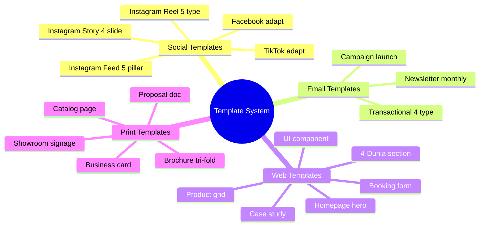
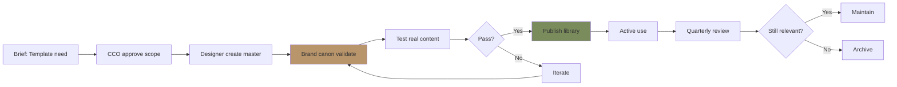

# Template System (Reusable Canon-Compliant)

Maintain reusable template library Gerai 1000 Pintu: Figma master + adaptations. Social, email, web, print. Brand canon baked-in.

## Triggers

Primary:
- "template system"
- "design template"
- "template library"

Secondary:
- "Figma master"
- "canon template"

## Input Required

| Field | Type | Required | Default |
|---|---|---|---|
| template_type | enum | yes | (social / email / web / print) |
| pillar | enum | no | (philosophy / door-expert / product / showroom / community) |
| variant_count | number | no | - |

## Output Template

```markdown
# Template System: {TYPE}

**Type:** {Social / Email / Web / Print}
**Master platform:** Figma
**Variants:** {Count}
**Canon compliance:** ✅ Built-in

## Template Categories

### Category 1: Social Templates

#### Instagram Feed Templates (1:1 square)
**5 pillar variant × 3-5 layout each = 15-25 master template**

**Pillar 1: Philosophy (5 layout)**
- Layout A: Hero photo + Playfair quote overlay top
- Layout B: Hero photo + caption bottom
- Layout C: Split (50% photo + 50% editorial text)
- Layout D: Full text editorial (Ivory background + Playfair)
- Layout E: Sensory detail close-up + minimal caption

**Pillar 2: Door Expert (4 layout)**
- Layout A: Door Expert konsultasi hand + caption
- Layout B: Quote from Door Expert (text-driven)
- Layout C: Customer + Door Expert interaction (anonymized)
- Layout D: 5 kompetensi infographic minimal

**Pillar 3: Product (5 layout)**
- Layout A: Brass detail macro + minimal caption
- Layout B: Wood grain texture + section caption
- Layout C: Product 3/4 angle + spec sidebar
- Layout D: Material wall touch invitation
- Layout E: Pintu installed environment + soft caption

**Pillar 4: Showroom (3 layout)**
- Layout A: Storefront subtle + welcome caption
- Layout B: Section archetype (per 4-Dunia)
- Layout C: Konsultasi pod atmosphere

**Pillar 5: Community (3 layout)**
- Layout A: Customer reaction (with consent)
- Layout B: Cultural editorial piece
- Layout C: Anchor reference homage (Aesop/DWR/Kinfolk)

#### Instagram Story Templates (9:16)
**5 pillar × 4 slide template = 20 master**

Each pillar:
- Opening slide (hook)
- Content slide (insight)
- Quote slide (philosophy)
- CTA slide (action invitation)

#### Instagram Reel Templates (9:16 video)
**3 type × 5 variant = 15 master**

- Title card opening
- Lower-third caption
- Pull-quote insert
- Brand mark closer
- CTA end card

#### TikTok Templates (9:16)
**Similar to Reel, adapted for TikTok aesthetic**

#### Facebook Templates (16:9 + 1:1)
**Adapted from Instagram, Facebook-specific dimension**

### Category 2: Email Templates

#### Newsletter Template (600px width)
- Header: Logo + nav
- Hero: Featured content
- Body: 2-3 section editorial
- Footer: Subscription + contact

#### Transactional Template
- Konsultasi confirmation
- Order confirmation
- Aftersales check-in
- Anniversary thank-you

#### Campaign Template
- Wave 1 launch announcement
- 4-Dunia series introduction
- Project showcase feature
- Quarterly recap

### Category 3: Web Templates

#### Page Templates (Web Component)
- Homepage hero
- 4-Dunia section
- Product catalog grid
- Project case study
- Door Expert konsultasi booking
- About brand
- Contact + showroom

#### UI Component Templates
- Navigation primary
- Footer
- CTA button (3 variant: primary brass, secondary outline, text link)
- Card (project + product + article)
- Form (booking + contact + newsletter)
- Modal (announcement + image gallery)

### Category 4: Print Templates

#### Print Document
- Business card (front + back)
- Catalog page (editorial + spec)
- Brochure tri-fold
- Project proposal cover + interior
- Letter head + envelope

#### Showroom Print
- Wayfinding directional
- Section signage
- Material wall label
- Photo wall caption
- Event poster

## Template Design Principles

### Canon-baked-in
Every template includes:
- Palette: 60% Charcoal + 30% Ivory + 10% Brass ratio
- Typography: Playfair Display + Inter (no other font)
- Layout: Generous white space (50%+ negative)
- Hierarchy: Clear focal (1 hero element)
- Brand mark: Subtle but present

### Modular component
- Header / Hero / Body / Footer as separable component
- Easy swap photography
- Easy swap caption
- Easy swap CTA
- Color override locked (canon protected)

### Adaptation friendly
- Multi-aspect-ratio export (web + social + print)
- Responsive breakpoint built-in (web)
- Light + dark variant (kalau perlu)
- Multi-language (Indonesia + English future)

## Template Naming Convention

```
gerai_template_{channel}_{pillar}_{layout}_{version}.fig

Examples:
gerai_template_ig-feed_philosophy_layout-a_v2.fig
gerai_template_ig-story_door-expert_4slide_v1.fig
gerai_template_email_newsletter_monthly_v3.fig
gerai_template_web_homepage-hero_v2.fig
gerai_template_print_catalog-spread_v1.fig
```

## Master File Organization (Figma)

### Page structure per master
```
[Master Template Name]
├── Cover (preview + spec)
├── Style Guide (palette + typo + spec)
├── Components (modular pieces)
├── Variants (3-5 variation)
├── Examples (real content filled)
└── Notes (usage guideline)
```

### Variable system
- Color variables: `--brass`, `--charcoal`, `--ivory`, `--warm-tan`
- Text variable: `--font-display` (Playfair), `--font-body` (Inter)
- Spacing variables: `--space-xs / sm / md / lg / xl`
- Lock to brand canon (cannot override accidentally)

## Adaptation Guidelines

### For Tim Pusat (designer in-house)
1. Open master template Figma
2. Duplicate (NOT edit master)
3. Replace content (photo + caption)
4. Verify canon variables intact
5. Export per spec
6. Submit for review

### For Freelance / Vendor
1. Receive master export (read-only)
2. Adapt per brief (cannot change canon)
3. Submit for CCO review
4. Iterate

### Restriction
- ❌ Cannot change palette
- ❌ Cannot change typography
- ❌ Cannot change layout grid
- ❌ Cannot add custom font
- ✅ Can swap photo (per spec)
- ✅ Can adapt caption
- ✅ Can adjust CTA copy

## Template Lifecycle

### Creation
1. Brief gather (what template needed)
2. CCO approve scope
3. Designer create master
4. Brand canon validate
5. Test with real content
6. Publish to library

### Maintenance
- Quarterly review (does template still work?)
- Update kalau new pillar / campaign
- Deprecate kalau obsolete
- Version increment kalau major change

### Retirement
- Archive (preserve for reference)
- Deprecate tag (don't use)
- Replace with new master if applicable

## Quality Standards

### Per template
- [ ] Brand canon palette correct (Brass + Charcoal + Ivory ratio)
- [ ] Typography Playfair + Inter applied
- [ ] Layout breathing space generous
- [ ] Component modular (reusable)
- [ ] Variable system (canon-protected)
- [ ] Export-ready per spec
- [ ] Naming convention applied
- [ ] Documentation included (usage notes)

### Library consistency
- [ ] All template aligned brand canon
- [ ] Naming convention applied 100%
- [ ] Variable system standardized
- [ ] Documentation per template
- [ ] Version controlled

## Production Capacity

### Per template estimation
- Social feed template: 2-4 hour designer
- Social story template: 1-2 hour
- Reel template: 2-3 hour
- Email template: 4-6 hour
- Web page template: 8-12 hour
- Print document template: 6-10 hour

### Maintenance load
- New template: 4-8 hour per
- Update existing: 1-2 hour
- Quarterly audit: 4-6 hour total

### Tim Pusat allocation
- 1 designer dedicated 50% to template + variant
- 1 designer 50% to active campaign asset
- Freelance for specialized (print + complex web)

## Template Usage Tracking

### Analytics per template
- Times used (per quarter)
- Performance correlation (engagement, CTR)
- Adaptation count (how often variant created)
- Issue log (what didn't work)

### Insight from usage
- Top-performing template → invest in variant
- Low-usage template → review need
- Pattern emerge → new template idea

## Brand Canon Compliance

### Built-in protection
- Color picker locked to brand palette
- Font selector locked to Playfair + Inter
- Off-canon style auto-flagged
- Save block kalau canon violated

### Manual check (per export)
- Brand canon enforcer validate
- CCO sample review monthly
- User feedback (what feels off)
```

## Visual Output

Template library structure:



Template lifecycle:



## Knowledge Dependency

- visual-identity-system (canon source)
- brand-canon-enforcer
- asset-library-organization (paired)
- design-brief-generator
- 5 pillar content (from content-calendar-strategy)

## Mode

Default: EXECUTION (build template / variant)
Switch: NEED_CLARIFICATION jika pillar / channel ambigu

## Tools Required

- file-search
- artifacts (template preview)
- Figma access (master file)

## Validation Criteria

- 4 template category (social / email / web / print)
- Per category sub-category dengan variant count
- Template design principles (canon-baked, modular, adaptation-friendly)
- Naming convention LOCKED
- Master file organization (Figma)
- Variable system (canon-protected)
- Adaptation guidelines per role
- Restriction explicit
- Lifecycle (creation / maintenance / retirement)
- Quality standards per template + library
- Production capacity estimation
- Usage tracking + insight loop
- Brand canon compliance built-in + manual

## Sample I/O

**Input:** "Template system build untuk Wave 1 launch — social Instagram + email newsletter"

**Output summary:**
- Social Instagram: 25 master template (5 pillar × 3-5 layout) + Story 20 template + Reel 15 template
- Email newsletter: 1 monthly + 4 transactional + 3 campaign = 8 template
- Total: 68 master template ready Wave 1 launch
- Platform: Figma master (visual + component) + variable system canon-protected
- Naming convention: `gerai_template_{channel}_{pillar}_{layout}_v{N}.fig`
- Brand canon: Built-in (palette locked + typo locked + layout breathing)
- Production timeline: 4 week (2 designer × 50% allocation)
- Budget: Rp 25jt (design fee in-house + freelance support)
- Adaptation: Tim Pusat duplicate + content swap, freelance read-only
- Quality check: Brand canon validate + sample real content test
- Lifecycle: Quarterly review, version increment, archive obsolete
- Template structure mindmap + lifecycle flow embedded

## Handoff

- asset-library-organization (paired)
- visual-identity-system (canon source)
- design-brief-generator (project brief)
- caption-generator (content insertion)
- brand-canon-enforcer (validation)
