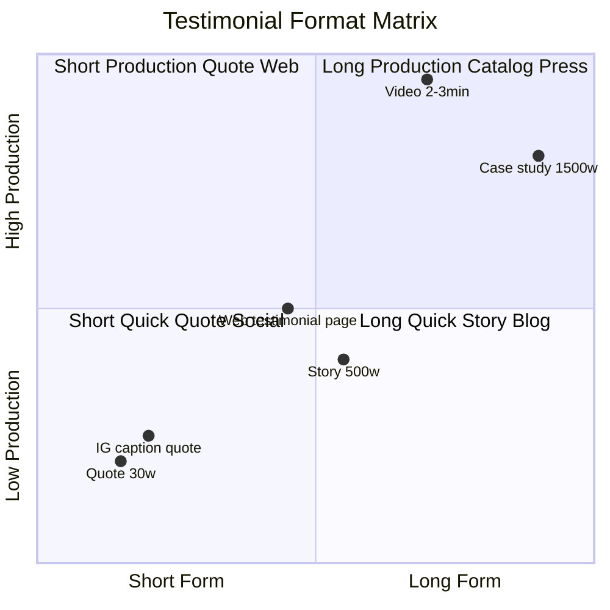
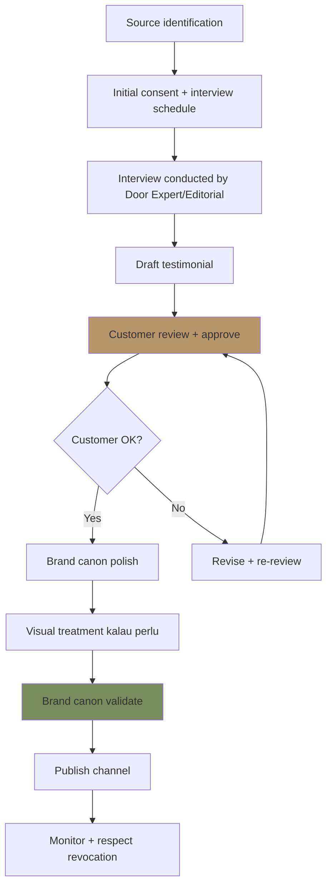

# Testimonial Curation

Curate customer testimonial Gerai 1000 Pintu: anonymized OR consented, brand canon-compliant, premium hangat tone. Story format + quote format + project case study. Consent + ethics-first.

## Triggers

Primary:
- "testimonial curation"
- "customer story"
- "testimoni format"

Secondary:
- "review showcase"
- "case study customer"

## Input Required

| Field | Type | Required | Default |
|---|---|---|---|
| testimonial_source | string | yes | (Door Expert session note, customer write-up, review) |
| format | enum | yes | (quote / story / video / case-study) |
| consent_status | enum | yes | (signed / anonymous / pending) |
| channel | enum | no | (website / social / catalog / press) |

## Output Template

```markdown
# Testimonial: {CUSTOMER REFERENCE}

**Format:** {Quote / Story / Video / Case Study}
**Source:** {Door Expert session / Customer write-up / Review}
**Consent status:** {Signed / Anonymous / Pending}
**Channel:** {Where published}
**Brand canon:** ✅ Validated

## Consent & Ethics Framework

### Consent Required (mandatory)
- **Signed consent form** dengan customer:
  - Permission to share story
  - Name usage (full / initials / anonymous)
  - Photo usage (face / hand-only / none)
  - Channel scope (web / social / print / press)
  - Duration (1 year / perpetual / specific period)
  - Revocation right

### Anonymization Levels
| Level | Name Display | Photo | Detail |
|---|---|---|---|
| Full | "Bapak Anton Wijaya" | Face + portrait | Specific project + location |
| Partial | "Bapak A.W." | Hand only / silhouette | Project type general |
| Anonymous | "Customer Senior" or "Project di Balikpapan" | No customer photo | Project only |
| Composite | "Cerita Pelanggan Kami" | Stock + brand-aligned | Synthesized common stories |

### Ethics Rule
- ❌ NEVER fake testimonial
- ❌ NEVER alter customer words (only typo correction with notation)
- ❌ NEVER use customer photo without explicit photo consent
- ✅ ALWAYS honor consent revocation immediately
- ✅ ALWAYS preserve customer dignity + voice

## Format Templates

### Format 1: Quote (Short, Social, Web)

**Structure:**
```
"[Quote 1-2 sentence, customer voice authentic]"

— {Name}, {Project context}
```

**Length:** 15-40 word quote
**Use case:** Website hero, Instagram post, catalog accent
**Brand canon:** Tone customer authentic (premium hangat align kalau organic)

**Example:**
> "Door Expert tidak mendorong kami untuk pilih yang termahal. Mereka mendengarkan, 
> dan memberi pilihan yang sesuai dengan tempat kami."
> 
> — Bapak Anton, Project Cluster Borneo 2026

### Format 2: Story (Medium-form, Website, Blog)

**Structure:**
- Opening (customer + context)
- Journey (konsultasi + decision)
- Outcome (delivery + reaction)
- Reflection (insight customer)

**Length:** 300-500 word
**Use case:** Website testimonial page, blog feature, newsletter

**Example:**
> Bapak Anton datang ke showroom Gerai 1000 Pintu pada awal 2026. Tempat baru 
> yang sedang dia bangun untuk keluarga membutuhkan kurasi yang tepat. "Saya 
> sudah lihat beberapa toko pintu," ujarnya. "Kebanyakan langsung tanya budget. 
> Di Gerai, Door Expert pertama tanya: apa cerita tempat saya."
> 
> Setelah konsultasi 90 menit yang dia sebut "mendalam tapi tidak melelahkan," 
> Bapak Anton memilih pintu archetype Jepang untuk ruang keluarga dan archetype 
> Eropa untuk foyer.
> 
> "Setelah dipasang, saya berdiri di depan foyer selama beberapa menit. Brass 
> yang ditempa tangan itu... saya tahu pintu ini akan menemani keluarga kami 
> selama tahun-tahun ke depan."

### Format 3: Video Testimonial Script (Long-form Video 2-3 min)

**Structure:**
1. Opening shot: customer in tempat (40 sec)
2. Background: why pintu matters (30 sec)
3. Gerai experience: konsultasi moment (60 sec)
4. Decision + Outcome (40 sec)
5. Reflection + recommend (20 sec)

**Production direction:**
- Natural setting (customer's tempat)
- Lighting: golden hour preferred
- Cinematography: editorial BP Latest reference
- Audio: clean, no overdub music heavy
- Editing: pacing calm, no jump-cut aggressive

### Format 4: Case Study (Long-form, Catalog, Manuscript)

**Structure:**
1. Project intro (customer + tempat context + vision)
2. Starting point (what they had, what they wanted)
3. Discovery process (konsultasi)
4. Decision narrative (4-negara cultural application)
5. Selection detail (specific pintu + reason)
6. Delivery + installation
7. Live with it (post-install reflection)
8. Insight for similar reader

**Length:** 1500-2500 word
**Use case:** Catalog feature, manuscript chapter, press portfolio

## Curation Workflow

### Step 1: Source identification
- Door Expert konsultasi note review
- Customer follow-up reach-out
- Review platform mention scan
- Customer initiated reach-out

### Step 2: Initial consent + interview
- Reach customer via Door Expert OR Matthew
- Explain testimonial purpose
- Schedule 30-60 min interview
- Consent form draft

### Step 3: Interview
- Conducted by Door Expert OR Editorial
- Open-ended question (not leading)
- Customer voice authentic capture
- Record (with consent) for accuracy

### Step 4: Draft + customer review
- Curate quote / story / case
- Send draft to customer for review
- Customer approve / edit
- Sign-off official

### Step 5: Brand canon polish
- Tone consistency (preserve customer voice, polish typos only)
- Em-dash removed (if customer used, replace gently)
- Brand name lengkap kalau formal context
- Visual identity for display

### Step 6: Publish + monitor
- Channel-appropriate format
- Schedule publish
- Monitor customer response
- Honor revocation if requested

## Interview Question Library

### Discovery questions (open-ended)
- "Apa yang membuat Anda mempertimbangkan Gerai 1000 Pintu?"
- "Sebelum datang ke kami, bagaimana proses Anda mencari pintu?"
- "Apa yang berbeda saat Anda di showroom kami?"

### Konsultasi experience
- "Bisa cerita pengalaman konsultasi dengan Door Expert kami?"
- "Apa yang paling melekat dari sesi tersebut?"
- "Filosofi Dunia Pintu (4-negara cultural context) membantu Anda berpikir tentang tempat Anda?"

### Decision moment
- "Bagaimana Anda mencapai keputusan akhir?"
- "Apa pintu archetype yang Anda pilih dan kenapa?"
- "Ada momen tertentu yang membuat Anda yakin?"

### Outcome + reflection
- "Setelah dipasang, bagaimana perasaan Anda?"
- "Apa yang sering Anda ceritakan ke tamu tentang pintu ini?"
- "Kalau ada teman yang sedang renovasi, apa yang akan Anda katakan?"

### Avoid leading questions
- ❌ "Apakah Anda puas dengan service kami?" (yes/no biased)
- ❌ "Door Expert kami terbaik kan?" (manipulative)
- ❌ "Anda recommend kami ke teman pasti?" (pressure)

## Quality Standards

### Customer voice preservation
- Maintain authentic vocabulary (kalau customer pakai "rumah", paraphrase contextually OR honor verbatim with note)
- Customer informal OK in quote (more authentic than over-polished)
- Editor's note for clarity kalau perlu

### Brand canon compliance
- Em-dash remove (customer probably tidak intentional)
- "Gerai 1000 Pintu" lengkap kalau formal context
- "Door Expert" capitalization preserved
- Premium hangat tone surrounding context (intro + outro by us)

### Story integrity
- No fabrication
- No exaggeration
- No composite trickery (kalau composite, label as such)
- Customer reviewed + approved final

### Visual treatment
- Photography per consent (face / hand / none)
- Brand canon visual (BP Latest reference)
- Layout editorial (premium feel)
- Caption sourced + credited

## Distribution Strategy

### Wave 1 launch (Q4 2026)
- Target: 3-5 testimonial ready by launch
- Source: Beta customer + pilot project
- Format: Mix quote + story (2 video at least)
- Channel: Website testimonial section + IG launch series

### Steady ops (Year 1)
- Frequency: 1 new testimonial / month
- Quality > quantity
- Variety: persona representation
- Compounding: stories become catalog feature + press pitch

### Press portfolio (Year 2+)
- Curated case study top-tier
- Architect/Designer collab case
- Cultural press pitch (Editorial Indonesian style)

## Brand Canon Compliance Checklist

### Per testimonial
- [ ] Consent signed + documented
- [ ] Customer voice authentic preserved
- [ ] Em-dash removed
- [ ] "Gerai 1000 Pintu" lengkap kalau formal
- [ ] "Door Expert" preserved
- [ ] Brand canon visual (palette, photography, layout)
- [ ] Premium hangat tone (intro + outro)
- [ ] No exaggeration / fabrication
- [ ] Channel-appropriate format

### Cross-testimonial library
- [ ] 6 persona representation balanced
- [ ] 4-negara cultural reference coverage
- [ ] Project scale variety
- [ ] Geographic + demographic diversity
- [ ] Aspirational + practical balance

## Anti-Pattern

### Avoid
- ❌ Fake / fabricated testimonial
- ❌ Excessive editing (loses authenticity)
- ❌ Stock photo testimonial (unethical)
- ❌ Pressure for positive review
- ❌ Hidden consent (transparent always)
- ❌ Composite without label
- ❌ Selective quote (out of context misleading)
- ❌ Customer photo without explicit photo consent

### Embrace
- ✅ Authentic voice (warts + all)
- ✅ Customer-reviewed draft
- ✅ Diverse representation
- ✅ Long-term relationship cultivation
- ✅ Transparent disclosure

## Sample Testimonial Library

### Sample 1: Quote (Retail persona)
> "Saya tidak datang untuk membeli pintu. Saya datang untuk memahami. Di Gerai 1000 
> Pintu, Door Expert mendengarkan dulu sebelum bicara."
> 
> — Bapak Anton, Project Cluster Borneo Balikpapan, 2026

### Sample 2: Quote (Arsitek persona)
> "Filosofi Dunia Pintu (4-negara cultural context) memberi saya framework untuk berbicara dengan klien. Bukan jualan 
> pintu, tapi membantu mereka memilih karakter tempat."
> 
> — Ibu Sari, Arsitek Senior Kaltim, 2026

### Sample 3: Short Story
> Bapak Hadi adalah developer cluster premium di Balikpapan. Tahun 2026 dia membutuhkan 
> 25 unit pintu spec premium untuk hunian high-end yang sedang dibangun. "Saya butuh 
> supplier yang bukan hanya kasih harga," kata Hadi. "Saya butuh yang paham brand kami."
> 
> Setelah konsultasi mendalam dengan Door Expert, Hadi memilih kombinasi archetype 
> Jepang untuk hunian compact dan Amerika untuk hunian statement. "Filosofi Dunia Pintu (4-negara cultural context) 
> bukan gimmick. Ini benar-benar membantu kami curate untuk customer kami."

## Testimonial Inventory Tracking

| ID | Customer | Persona | Format | Channel | Consent | Status |
|---|---|---|---|---|---|---|
| T-001 | Bapak Anton | Retail | Quote + Story | Web + IG | Signed | ✅ Live |
| T-002 | Ibu Sari | Arsitek | Quote | Web + IG | Signed | ✅ Live |
| T-003 | Bapak Hadi | Developer | Story | Web | Signed | Pending review |
| T-004 | Mitra Toko Y | Mitra Dagang | Quote | Catalog | Pending | Draft |
| T-005 | Project Studio Z | Arsitek | Case study | Catalog | Signed | Production |
```

## Visual Output

Testimonial format matrix:



Curation workflow:



## Knowledge Dependency

- 6 Persona spec
- brand-storytelling (narrative format)
- editorial-style-guide
- brand-canon-enforcer
- audience-emotional-mapping
- Legal consent form template
- Door Expert konsultasi documentation (CRM)

## Mode

Default: EXECUTION (curate testimonial)
Switch: NEED_CLARIFICATION jika consent ambigu

## Tools Required

- file-search (CRM session note)
- artifacts (testimonial display + workflow)

## Validation Criteria

- Consent + ethics framework explicit
- Anonymization levels 4-tier
- 4 format templates (quote/story/video/case study)
- Curation workflow 6-step
- Interview question library (open-ended + avoid leading)
- Quality standards (voice preserve + canon + integrity + visual)
- Distribution strategy per phase
- Brand canon compliance checklist
- Anti-pattern + embrace pattern
- Sample library (3+ format examples)
- Inventory tracking system

## Sample I/O

**Input:** "Testimonial curation Bapak Anton Project Cluster Borneo Wave 1, format quote + short story untuk website launch"

**Output summary:**
- Customer: Bapak Anton, Project Cluster Borneo Balikpapan 2026
- Persona: Retail (rumah-pribadi premium tetapi inklusif)
- Consent: Signed (name OK + hand-only photo)
- Format A — Quote (30 word):
  "Saya tidak datang untuk membeli pintu. Saya datang untuk memahami. Di Gerai 1000 Pintu, Door Expert mendengarkan dulu sebelum bicara."
  — Bapak Anton, Project Cluster Borneo Balikpapan, 2026
- Format B — Short story (500w):
  Narrative dari konsultasi → 4-negara cultural decision (Jepang + Eropa) → delivery moment → reflection
- Tone: Authentic Bapak Anton voice preserved + premium hangat surrounding
- Brand canon: ✅ No em-dash + Gerai 1000 Pintu lengkap + Door Expert preserved
- Photography: Hand on brass handle close-up + foyer environmental
- Channel: Website testimonial page (story) + Instagram launch series (quote)
- Schedule: Quote IG launch week 1 + Story website launch day + future catalog feature
- Format matrix + workflow embedded

## Handoff

- brand-storytelling (narrative format)
- long-form-writer (case study extension)
- caption-generator (social adaptation)
- photography-direction (visual production)
- brand-canon-enforcer (validation)
