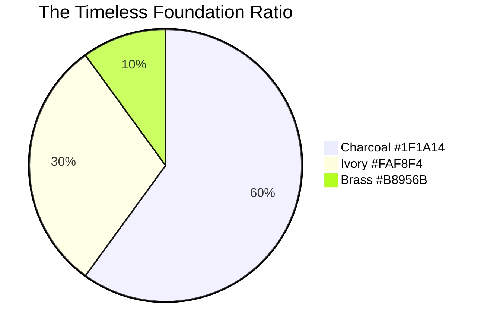
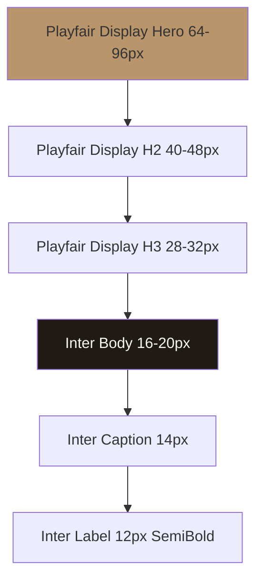
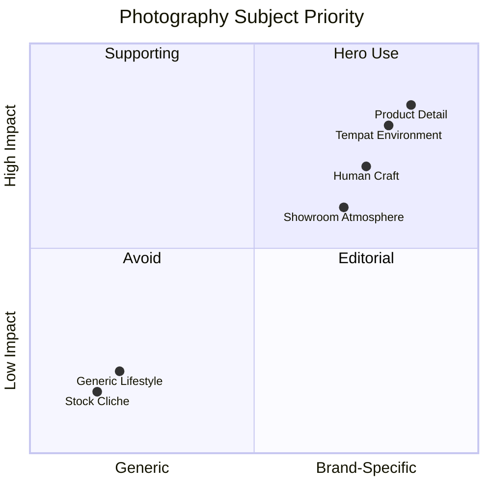

# Visual Identity System

Locked visual identity Gerai 1000 Pintu: "The Timeless Foundation" palette, typography pairing, photography direction, iconography, layout principles. Reference Aesop + Design Within Reach.

## Triggers

Primary:
- "visual identity"
- "brand visual system"
- "palette typography"

Secondary:
- "visual canon"
- "design system"

## Input Required

| Field | Type | Required | Default |
|---|---|---|---|
| application | string | yes | (e.g., "social post", "showroom signage", "website hero") |
| context | string | no | (specific use case detail) |

## Output Template

```markdown
# Visual Identity Spec: {APPLICATION}

**System name:** The Timeless Foundation
**Anchor:** Aesop + Design Within Reach
**Status:** 🔒 LOCKED (no deviation)

## Color Palette (LOCKED)

### Primary
| Color | Hex | RGB | Usage |
|---|---|---|---|
| **Brass** | `#B8956B` | 184, 149, 107 | Focal accent (10% area max) |
| **Charcoal** | `#1F1A14` | 31, 26, 20 | Text dominant (60% area) |
| **Ivory** | `#FAF8F4` | 250, 248, 244 | Background breathing (30% area) |

### Secondary
| Color | Hex | RGB | Usage |
|---|---|---|---|
| **Warm Tan** | `#D4B895` | 212, 184, 149 | Soft accent, fabric |
| **Deep Brown** | `#3D2F22` | 61, 47, 34 | Wood reference, depth |
| **Sage** | `#7A8B5C` | 122, 139, 92 | Positive signal, plant |
| **Rust** | `#A0522D` | 160, 82, 45 | Warning, attention rare |

### Ratio Discipline (mandatory)
- **60% Charcoal:** dominant text + structural element
- **30% Ivory:** background + breathing space
- **10% Brass:** focal point ONLY (logo, hero detail, CTA accent)

### Anti-pattern
- ❌ Rainbow palette (>4 color)
- ❌ Neon / saturated (electric blue, hot pink)
- ❌ Gradient flashy (rainbow gradient)
- ❌ High contrast harsh (pure black + pure white)
- ❌ Trendy season color (millennial pink, very peri, etc.)

## Typography System (LOCKED)

### Primary
**Display: Playfair Display** (serif)
- Use: Headline, hero text, brand name "Gerai 1000 Pintu"
- Weight: Regular (400) + Bold (700) + Italic accent
- Pairing: Inter sans body

**Body: Inter** (sans-serif)
- Use: Paragraph, caption, UI label
- Weight: Regular (400) + Medium (500) + SemiBold (600)
- Letter spacing: -0.01em (slightly tight)

### Hierarchy Specification
| Element | Font | Size | Weight | Style |
|---|---|---|---|---|
| H1 Hero | Playfair | 64-96px | Regular | - |
| H2 Section | Playfair | 40-48px | Regular | Italic accent OK |
| H3 Sub | Playfair | 28-32px | Regular | - |
| Body Large | Inter | 18-20px | Regular | - |
| Body Default | Inter | 16px | Regular | - |
| Caption | Inter | 14px | Medium | - |
| Label | Inter | 12px | SemiBold | Uppercase 0.05em |

### Pairing Examples
- ✅ Playfair "Tempat impian Anda" + Inter "Konsultasi premium 60 menit"
- ❌ Playfair display only (no body grounding)
- ❌ Sans-serif display (loses anchor refinement)

### Anti-pattern
- ❌ Sans-serif headline (decoration only)
- ❌ Decorative font (script, handwriting, novelty)
- ❌ All-caps body text
- ❌ Italic dominant (italic = accent ONLY)
- ❌ Multiple font family (max 2 family)

## Photography Direction (LOCKED)

### Style Anchor
- **Aesop reference:** Tight detail, natural daylight, minimal styling
- **Design Within Reach reference:** Editorial composition, environmental context

### Composition
| Aspect | Direction |
|---|---|
| Lighting | Natural daylight + warm tungsten accent (golden hour) |
| Color grading | Warm neutral, low saturation, brass tone enhanced |
| Background | Plain or contextual (no busy backdrop) |
| Subject | Pintu detail OR tempat environment OR human craft |
| Angle | Front-facing 0° OR 3/4 (45°) most preferred |
| Depth | Shallow DOF acceptable, full sharp also OK |

### Subject Categories

#### Category A: Product Detail
- Pintu brass handle close-up
- Wood grain texture
- Joinery detail (mortise + tenon)
- Material swatch arrangement

#### Category B: Tempat Environment
- Pintu installed di context (foyer, mahal-mahal modern)
- Wide environmental shot
- Mood-driven (morning light, evening warmth)

#### Category C: Human Craft
- Tukang aplikator hand at work (anonymized)
- Door Expert konsultasi gesture (close, hands + papers)
- Customer reaction (back of head, ambient)

#### Category D: Showroom Atmosphere
- Storefront subtle signage
- Curated display arrangement
- Material wall texture

### Anti-pattern
- ❌ Stock photo cliche (handshake, "thumbs up")
- ❌ Overlit harsh shadow
- ❌ Filter Instagram trendy (vintage VSCO, oversaturated)
- ❌ Crowd / customer face (privacy + dilution)
- ❌ Lifestyle aspirational generic (yacht, watch, etc.)
- ❌ Person posed unnatural smiling at camera

## Iconography System (LOCKED)

### Style
- Line weight: 1.5-2px (medium)
- Style: Linear minimal (Aesop-inspired)
- Corner: Slightly rounded 2-3px radius
- Color: Charcoal #1F1A14 default, Brass #B8956B accent

### Icon Library (curated)
| Icon | Use |
|---|---|
| Pintu (door outline) | Brand mark variant |
| Brass handle | Premium signal |
| Wood grain | Material |
| Tempat / house outline | Customer context |
| Konsultasi (chat bubble) | Service |
| Calendar | Schedule |
| Map pin | Location |
| Whatsapp | Channel |

### Anti-pattern
- ❌ Emoji-style colorful icon
- ❌ Material Design rounded heavy
- ❌ 3D / isometric icon
- ❌ Animated icon (kecuali subtle loading)

## Layout Principles

### Composition
1. **Generous white space** — 50%+ visual area breathing
2. **Hero focal** — 1 main element per composition
3. **Hierarchy clear** — eye flow obvious (top → bottom OR left → right)
4. **Alignment grid** — 12-column grid web, 4-column mobile
5. **Margin consistent** — 48px desktop, 24px mobile minimum

### Anti-pattern
- ❌ Crowded layout (>5 element competing)
- ❌ Center-everything (rigid, no asymmetry)
- ❌ Random alignment (no grid)
- ❌ Tight margin (suffocating)

## Brand Mark Specification

### Logo Variants
1. **Primary mark:** "Gerai 1000 Pintu" wordmark Playfair Display
2. **Stacked mark:** "Gerai" / "1000 Pintu" 2-line
3. **Monogram:** "G1P" tight kerning (rare use)
4. **Icon-only:** Pintu outline (favicon, watermark)

### Clear Space (mandatory)
- Minimum: 1× brand mark height clear space all sides
- Preferred: 2× clear space for premium feel

### Color Versions
- Primary: Charcoal on Ivory background
- Inverse: Ivory on Charcoal background
- Mono brass: Brass on Ivory (special use)
- 1-color: Charcoal solid (print)

### Size
- Minimum print: 25mm width
- Minimum digital: 80px width
- Maximum hero: no maximum (scales freely)

## Application Spec per Channel

### Instagram Post (1:1 square)
- Hero detail product OR environment
- Single typography focal
- Generous Ivory negative space
- Brass accent ONLY 10%

### Instagram Story (9:16)
- Vertical hierarchy
- Caption Inter regular
- 2-3 element max

### Website Hero
- Full-bleed photography
- H1 Playfair Display 80px+ 
- Subtitle Inter 20px
- CTA brass button (single)

### Showroom Signage
- Brass nameplate engraved
- Playfair Display name
- Inter caption directional
- No commercial heavy print

### Press Release Header
- Logo top-left
- Playfair headline 40px
- Inter body 16px
- Color: Charcoal on Ivory

### Email Signature
- Logo small (60px)
- Name Inter Medium
- Role Inter Regular
- Charcoal text only

## Asset Naming Convention

```
gerai_{category}_{subject}_{variant}_{size}.{ext}

Examples:
gerai_logo_primary_charcoal_2000px.svg
gerai_photo_product_brasshandle_4k.jpg
gerai_pattern_woodgrain_seamless.png
gerai_icon_pintu_outline_charcoal.svg
```

## Brand Mood Board Reference

### Inspiration sources
- Aesop store interior + product shot
- Design Within Reach catalog
- Kinfolk magazine editorial
- Nendo design studio
- Modern Japan minimalism (Tadao Ando, Kengo Kuma)
- Mid-century craftsman (American)
- Art Nouveau detail (European)

### NOT references
- Generic stock photography
- Commercial retail (mass-market)
- Loud branding (fashion fast-trend)
- Tech minimalism (sterile)
```

## Visual Output

Palette swatch + ratio:



Typography hierarchy:



Photography composition grid:



## Knowledge Dependency

- Brand Canon document LOCKED
- Anchor Aesop + DWR visual reference
- BP Chapter 7 (Brand Identity Visual)
- 4-Dunia palette extension (per archetype subtle variant)

## Mode

Default: EXECUTION (provide spec per application)
Switch: DISCUSSION jika new application novel

## Tools Required

- file-search (asset library)
- artifacts (palette + typography demo)
- web-search (Aesop/DWR reference update)

## Validation Criteria

- Palette 3 primary + 4 secondary defined
- Ratio 60/30/10 disciplined
- Typography 2 family max (Playfair + Inter)
- Hierarchy 6+ level scaled
- Photography 4 subject category
- Iconography style locked
- Layout principle 5 mandatory
- Brand mark 4 variant
- Application spec 6+ channel
- Anti-pattern explicit per element
- Asset naming convention

## Sample I/O

**Input:** "Visual identity spec untuk Instagram Story 9:16 product highlight"

**Output summary:**
- Background Ivory #FAF8F4 dominant (70% area)
- Hero photo product brass handle close-up (Category A) 50% area top
- Playfair Display caption "Sentuhan brass yang menemani tempat impian Anda" Charcoal
- Inter Medium 14px tagline "Konsultasi gratis via Zoom"
- Brass #B8956B accent dot 2 corner
- White space generous 50%+
- Hashtag tidak ada di visual (caption only)
- Logo subtle bottom 5% area Charcoal monogram
- Composition asymmetric (hero kiri, caption kanan)
- Brand mood: calm refined (Aesop reference)

## Handoff

- brand-canon-enforcer (validate output)
- design-brief-generator (vendor brief)
- photography-direction (asset production)
- All marketing skill (consistent visual)
