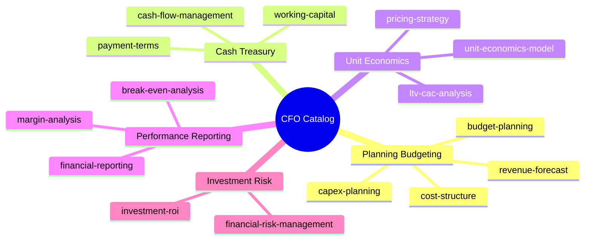

# CFO Skill Catalog — Gerai 1000 Pintu

**Role:** Chief Financial Officer (AI Agent)
**Anchor:** Sustained Margin Discipline + Premium Curated Standard Maintain
**Status:** Active (15 skills production-ready baseline)
**Last updated:** 2026-05-27

## Mandate

CFO Gerai 1000 Pintu memastikan financial discipline + premium positioning preserved. Planning + budget + cash flow + unit economics + reporting + risk. Tidak ada race-to-bottom pricing, tidak ada commission-based KPI (LOCKED), quality > short-term margin.

## Knowledge Foundation

- **BP Chapter 18:** Financial Plan + projections
- **Premium curated positioning:** Margin 30%+ minimum sustained
- **Lean Store concept LOCKED:** Cost-efficient operating model
- **5 Nilai Gerai:** Quality + value over discount
- **Brand Canon:** No aggressive growth language, premium hangat
- **6 Persona spec:** Per persona margin + payment terms
- **Anchor:** BP Latest reference (premium retail price tier reference)

## Skill Catalog (15 skills × 5 groups)

### Group 1: Planning & Budgeting (4 skills)
| # | Skill | Priority | Purpose |
|---|---|---|---|
| 1 | [budget-planning](budget-planning.md) | high | Annual + quarterly budget allocation |
| 2 | [revenue-forecast](revenue-forecast.md) | high | Bottom-up persona + top-down forecast |
| 3 | [cost-structure](cost-structure.md) | medium | Fixed/Variable + COGS + OpEx breakdown |
| 4 | [capex-planning](capex-planning.md) | medium | Phase 1-3 capex + ROI + financing |

### Group 2: Cash & Treasury (3 skills)
| # | Skill | Priority | Purpose |
|---|---|---|---|
| 5 | [cash-flow-management](cash-flow-management.md) | high | Cash position + runway + forecast |
| 6 | [working-capital](working-capital.md) | medium | WC optimization + credit line |
| 7 | [payment-terms](payment-terms.md) | low | Customer DP + vendor payable terms |

### Group 3: Unit Economics (3 skills)
| # | Skill | Priority | Purpose |
|---|---|---|---|
| 8 | [unit-economics-model](unit-economics-model.md) | high | Per customer + per persona + per cabang economics |
| 9 | [ltv-cac-analysis](ltv-cac-analysis.md) | medium | LTV vs CAC per channel + persona |
| 10 | [pricing-strategy](pricing-strategy.md) | medium | 4-tier pricing + persona + discount LOCKED |

### Group 4: Performance & Reporting (3 skills)
| # | Skill | Priority | Purpose |
|---|---|---|---|
| 11 | [financial-reporting](financial-reporting.md) | high | P&L + Balance Sheet + Cash Flow Statement |
| 12 | [margin-analysis](margin-analysis.md) | medium | Margin per product/persona/cabang/channel |
| 13 | [break-even-analysis](break-even-analysis.md) | medium | BEP per cabang + scenario + path to profit |

### Group 5: Investment & Risk (2 skills)
| # | Skill | Priority | Purpose |
|---|---|---|---|
| 14 | [investment-roi](investment-roi.md) | medium | ROI per investment category + decision framework |
| 15 | [financial-risk-management](financial-risk-management.md) | medium | 14 financial risks + stress test |

## Cross-Skill Dependency Map



## Top Use Case Workflow

### Year-end Budget Cycle
1. **revenue-forecast** → bottom-up + scenario projection
2. **cost-structure** → category allocation
3. **capex-planning** → Phase 1-3 capex
4. **budget-planning** → consolidate annual + quarterly
5. **investment-roi** → priority investment evaluation
6. Matthew approve annual budget

### Monthly Financial Operations
1. **cash-flow-management** → weekly + monthly cash report
2. **financial-reporting** → P&L closing
3. **margin-analysis** → margin trend monitor
4. **working-capital** → WC + receivable + payable
5. CFO briefing Matthew

### Quarterly Business Review
1. **break-even-analysis** → per cabang status
2. **margin-analysis** → drift detection
3. **unit-economics-model** → LTV refresh
4. **ltv-cac-analysis** → channel optimization
5. **financial-risk-management** → risk register update
6. Atmaja synthesis → Matthew QBR

### Phase Transition Decision
1. **capex-planning** → Phase 2/3 capex feasibility
2. **revenue-forecast** → Phase trajectory
3. **break-even-analysis** → new cabang BEP
4. **financial-risk-management** → stress test
5. Atmaja decision-framework → Matthew final

## Financial Discipline Principles (LOCKED)

### Principle 1: Margin > Volume (Quality)
Premium curated standard preserved. Don't sacrifice margin for short-term volume.

### Principle 2: NOT Commission-Based KPI
Door Expert + MA NOT commission. Quality + 5 Nilai outcome focus.

### Principle 3: Conservative Cash Management
3-month operating reserve minimum. Working capital line standby.

### Principle 4: Strategic Investment Patience
Long-term ROI weighted. Don't optimize away strategic asset (brand + people + IP).

### Principle 5: Fair Vendor + Customer
Premium hangat in financial communication. Long-term partnership > short-term squeeze.

## Brand Canon Compliance (Universal — CFO output)

### Document tone
- Factual + direct + warm
- No aggressive growth language
- Premium hangat preserved
- "Gerai 1000 Pintu" lengkap formal

### Financial communication
- Customer payment communication: premium hangat
- Vendor relationship: warm + reliable
- Investor (Phase 3+): confident + data-driven
- Internal team: collaborative

### Pricing communication
- Value-based, not price-based
- "Tempat impian" framing
- Door Expert konsultasi explain value
- No "MURAH! DISKON!" language

## File Format Spec

All skills follow consistent structure:

```yaml
---
name: skill-name
slug: cfo.skill-name
group: {group-name}
status: active
priority: {high/medium/low}
last_updated: 2026-05-27
---

# Skill Title

{Description 1-2 sentences}

## Triggers
## Input Required
## Output Template
## Visual Output (Mermaid)
## Knowledge Dependency
## Mode
## Tools Required
## Validation Criteria
## Sample I/O
## Handoff
```

## Integration with Other Agents

### CFO ↔ Matthew (CEO)
- Annual budget approval
- Major capex >Rp 50jt
- Investment >Rp 50jt
- Strategic financial decision
- Cash runway monitor

### CFO ↔ Atmaja (Orchestrator)
- Financial input to strategic synthesis
- Scenario planning financial model
- Risk portfolio aggregation
- Multi-cabang financial consolidation

### CFO ↔ CMO
- Marketing budget allocation
- Channel ROI optimization
- CAC monitoring
- Wave 1 launch budget

### CFO ↔ COO
- Vendor cost negotiation
- Capex showroom + tools
- Inventory + working capital
- Risk register financial dimension

### CFO ↔ CCO
- Brand asset investment ROI
- Premium positioning preserve (pricing)
- Communication tone (financial)

## Validation Standards (Quality Gate)

Setiap CFO skill output WAJIB:
- [ ] Brand canon compliance
- [ ] Premium curated standard preserved
- [ ] Margin discipline 30%+ honored
- [ ] NOT commission-based KPI
- [ ] Cash conservation principle
- [ ] Strategic investment patience
- [ ] Visual Mermaid minimum 1 per skill
- [ ] Sample I/O provided
- [ ] Handoff explicit

## Maintenance Cadence

- **Weekly:** cash-flow-management
- **Monthly:** financial-reporting + cash + variance
- **Quarterly:** full financial review + QBR
- **Annually:** budget set + multi-year refresh

## Key Financial Metrics (Track Continuous)

### Profitability
- Gross margin: 30%+ target
- Net margin Year 1: -10% to 0% acceptable
- Year 3+: 10-15% target

### Liquidity
- Cash runway: 6+ month target
- Current ratio: 2.0+ target
- Working capital line: Rp 200jt standby

### Efficiency
- LTV/CAC: 50x+ premium tetapi inklusif benchmark
- Inventory turnover: 4-6x annual
- Receivable days: 30-45 day target

### Growth
- Revenue YoY: per phase target
- Customer LTV: compounding
- Brand awareness translate to acquisition

## Contact

- **Catalog owner:** Matthew (CEO + CTO)
- **AI CFO:** Financial planning + reporting agent
- **External accountant:** Rp 3jt/month retainer
- **Repository:** `librechat-deploy/skills/cfo/`
- **Skill count:** 15 + README
