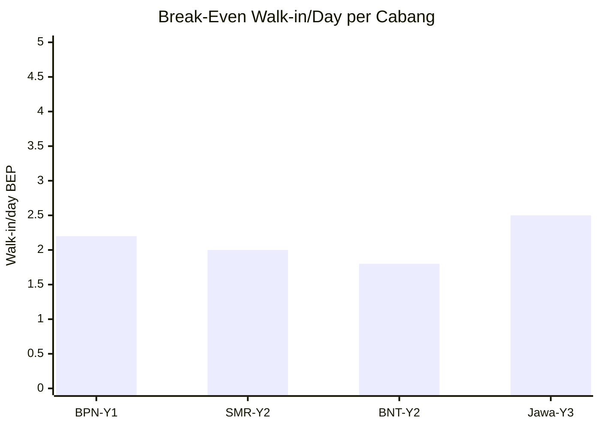
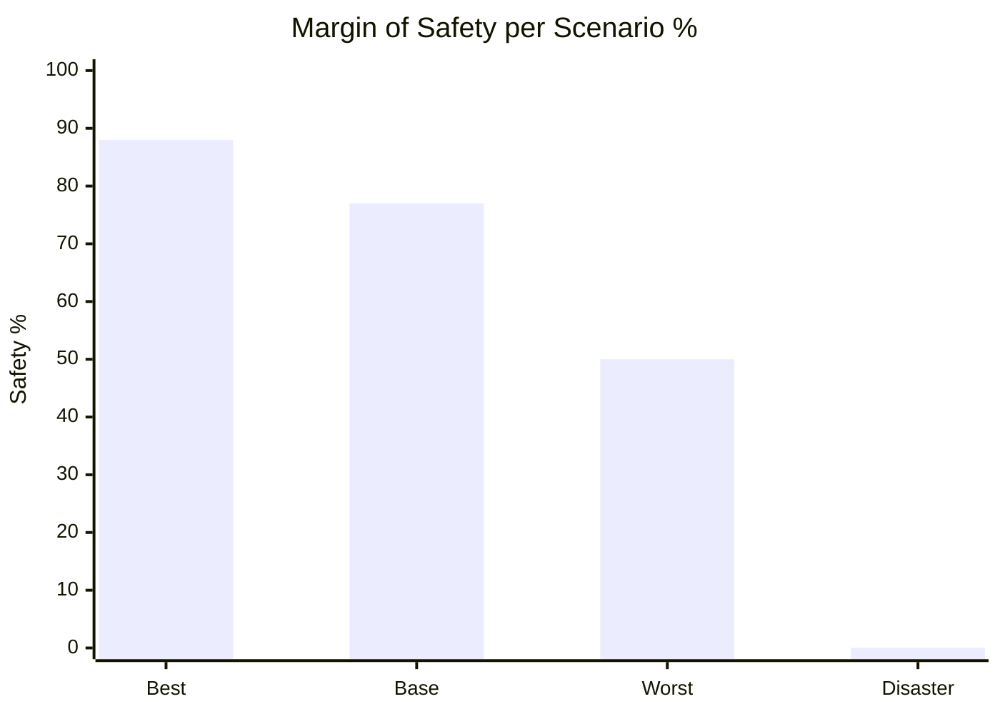
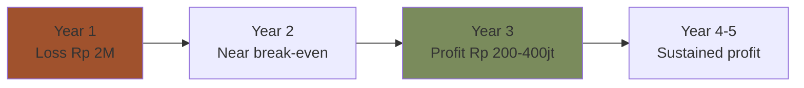

# Break-Even Analysis

Break-even analysis Gerai 1000 Pintu: per cabang, per phase, per scenario. Identify minimum threshold + path to profitability.

## Triggers

Primary:
- "break even analysis"
- "BEP"
- "break-even point"

Secondary:
- "minimum revenue"
- "profitability threshold"

## Output Template

```markdown
# Break-Even Analysis: {SCOPE}

**Scope:** {Per cabang / Per phase / Per scenario}
**Period:** {Date}

## Break-Even Formula

### Standard formula
BEP (revenue) = Fixed Cost / Contribution Margin %

### Components
- **Fixed Cost:** rent + salary + tools + insurance + Pusat allocation
- **Contribution Margin = (Revenue - Variable Cost) / Revenue**
- Variable Cost = COGS + variable marketing + logistics per order

## Cabang Balikpapan Break-Even

### Fixed Cost Monthly
| Category | Amount Rp/Month |
|---|---|
| Showroom rent | 25jt |
| MA × 2 salary | 9.5jt |
| Door Expert allocation | 10jt |
| Tim Pusat allocation | 12jt |
| Tools subscription | 5jt |
| Utility + maintenance | 5jt |
| Insurance | 2jt |
| Misc | 1.5jt |
| **Total Fixed** | **Rp 70jt/month** |

### Contribution Margin
- Revenue avg per order: Rp 30jt
- Variable cost per order: Rp 20jt (COGS Rp 20jt) + Rp 500k (marketing) + Rp 200k (logistics) = Rp 20.7jt
- Contribution per order: Rp 9.3jt
- Contribution margin: 31%

### Break-Even Revenue
- BEP Revenue: Rp 70jt / 31% = **Rp 226jt/month**

### Break-Even in Units
- Per order Rp 30jt avg
- BEP orders: 226 / 30 = **~8 order/month**

### Translation to Activity
- Order/month: 8
- Conversion rate konsultasi → order: 50%
- Konsultasi/month: 8 / 50% = **16 konsultasi/month**
- Walk-in/konsultasi conversion: 30%
- Walk-in/month: 16 / 30% = **~54 walk-in/month**
- Walk-in/day (25 day): 54 / 25 = **~2.2/day** to break-even

### Reality Check
- Wave 1 target walk-in: 8-12/day
- Way above break-even (BEP only 2.2/day)
- Margin of safety: 75-85% above BEP
- ✅ Strong margin of safety

## Per Scenario Break-Even

### Base Case
- Walk-in 8-12/day
- Konsultasi 60-90/month
- Order 30-45/month
- Revenue Rp 900jt-1.35M/month
- **Above BEP by 4-6x**

### Worst Case (50% target)
- Walk-in 4-6/day
- Konsultasi 30-45/month
- Order 15-22/month
- Revenue Rp 450jt-660jt/month
- **Above BEP by 2-3x**
- Status: Profitable but below plan

### Disaster Case (25% target)
- Walk-in 2-3/day
- Konsultasi 15-22/month
- Order 7-11/month
- Revenue Rp 210jt-330jt/month
- **At or below BEP**
- Status: Loss-making, mitigation required

## Multi-Cabang Break-Even

### Cabang Samarinda Year 2 (launch)
| Metric | Value |
|---|---|
| Fixed cost monthly | Rp 60jt (lower rent, shared Pusat) |
| Contribution margin | 31% |
| BEP revenue | Rp 194jt/month |
| BEP orders | ~7/month |
| BEP konsultasi | ~14/month |
| BEP walk-in/day | ~2/day |

### Cabang Bontang Year 2 (launch)
| Metric | Value |
|---|---|
| Fixed cost monthly | Rp 55jt (smaller scope) |
| Contribution margin | 31% |
| BEP revenue | Rp 177jt/month |
| BEP orders | ~6/month |
| BEP konsultasi | ~12/month |
| BEP walk-in/day | ~1.8/day |

### Cabang Jawa Year 3 (premium location)
| Metric | Value |
|---|---|
| Fixed cost monthly | Rp 90jt (premium rent + cost) |
| Contribution margin | 33% (premium tier mix) |
| BEP revenue | Rp 273jt/month |
| BEP orders | ~9/month |
| BEP konsultasi | ~18/month |
| BEP walk-in/day | ~2.5/day |

## Path to Profitability

### Year 1 (Foundation)
- Revenue ramping
- Marketing front-loaded
- Net result: loss expected (Rp 2M projected)
- BEP achievement: by Month 6 onwards monthly basis

### Year 2 (Validation)
- Cabang #1 sustained above BEP
- Cabang #2-3 ramping (loss expected initial 6 month)
- Consolidated: near break-even

### Year 3 (Profit)
- All Cabang above BEP
- Consolidated profit: Rp 200-400jt
- Net margin 10-15%

## Sensitivity Analysis

### Driver 1: Walk-in Volume
- +10% walk-in → +10% revenue → +30% contribution after fixed cost
- -10% walk-in → -10% revenue → -30% contribution
- Critical leverage point

### Driver 2: Conversion Rate
- +5% conversion → +10% revenue (volume + same fixed)
- -5% conversion → -10% revenue
- Material driver

### Driver 3: Average Order Value
- +Rp 5jt AOV → +17% revenue (same volume)
- -Rp 5jt AOV → -17% revenue
- Strong leverage

### Driver 4: Margin
- +1% gross margin → +3% contribution
- Sensitive but lower amplitude

### Sensitivity table
| Scenario | Walk-in | Conv | AOV | Revenue/month | BEP gap |
|---|---|---|---|---|---|
| Base | 10/day | 50% | Rp 30jt | Rp 1.1M | 4x BEP |
| Best | 14/day | 60% | Rp 35jt | Rp 2.2M | 8x BEP |
| Worst | 6/day | 40% | Rp 25jt | Rp 450jt | 2x BEP |
| Disaster | 3/day | 30% | Rp 22jt | Rp 200jt | At BEP |

## Margin of Safety

### Definition
Margin of safety = (Actual revenue - BEP revenue) / Actual revenue

### Healthy benchmark
- 50%+ = Strong
- 25-50% = Healthy
- 10-25% = Tight
- <10% = Risky

### Cabang BPN Year 1 projection
- Actual Rp 1M/month: Margin of safety 77% (Strong)
- Worst case Rp 450jt/month: Margin of safety 50% (Strong-Healthy)
- Disaster case Rp 200jt/month: Margin of safety 0% (At BEP)

## Decision Triggers

### When margin of safety drops <25%
- Activate cost cut menu
- Marketing accelerate
- Conversion rate optimize

### When at/below BEP 2+ month
- Critical mitigation
- Working capital line ready
- Strategic review

### When margin of safety sustained 50%+
- Healthy operations
- Phase 2 prep confident
- Reserve build

## Break-Even Communication

### Internal team
- Daily walk-in tracking
- Weekly konsultasi count
- Monthly margin of safety report

### Matthew briefing
- Weekly: walk-in + konsultasi snapshot
- Monthly: BEP status + margin of safety
- Quarterly: full trajectory review

## Brand Canon Compliance

- BEP analysis: factual + clear
- No panic language even at risk scenario
- Premium hangat tone preserved
- Action-oriented decisions
```

## Visual Output

Break-even by cabang:



Margin of safety scenarios:



Path to profitability:



## Knowledge Dependency

- budget-planning (input)
- revenue-forecast (input)
- cost-structure (input)
- unit-economics-model
- All cabang operational data

## Mode

Default: EXECUTION
Switch: DISCUSSION jika sensitivity scenario debate

## Tools Required

- file-search
- artifacts (chart + flow)

## Validation Criteria

- BEP formula + components
- Per cabang BEP calculation
- Activity-level translation (walk-in/day)
- Per scenario BEP comparison
- Multi-year path to profitability
- Sensitivity analysis 4 drivers
- Margin of safety per scenario
- Decision triggers
- Brand canon preserved

## Sample I/O

**Input:** "Break-even analysis Cabang Balikpapan Year 1 + sensitivity"

**Output summary:**
- Fixed cost monthly: Rp 70jt (rent + people + tools + Pusat allocation)
- Contribution margin: 31%
- BEP revenue: Rp 226jt/month
- BEP orders: 8/month
- BEP konsultasi: 16/month
- BEP walk-in: 2.2/day
- Wave 1 target walk-in: 8-12/day → 4-6x above BEP
- Margin of safety: 77% (Strong)
- Per scenario: Base 4x BEP, Worst 2x BEP, Disaster at BEP
- Sensitivity drivers: walk-in volume (1:3 lever), conversion (1:2 lever), AOV (strong lever)
- Path: Year 1 loss → Year 2 break-even → Year 3 profit Rp 200-400jt
- Decision triggers: <25% margin of safety = action, <0 = critical mitigation
- Bar chart + flow embedded

## Handoff

- budget-planning (paired)
- revenue-forecast (paired)
- cost-structure (paired)
- COO weekly-ops-report (operational tracking)
- Matthew (review trigger)
