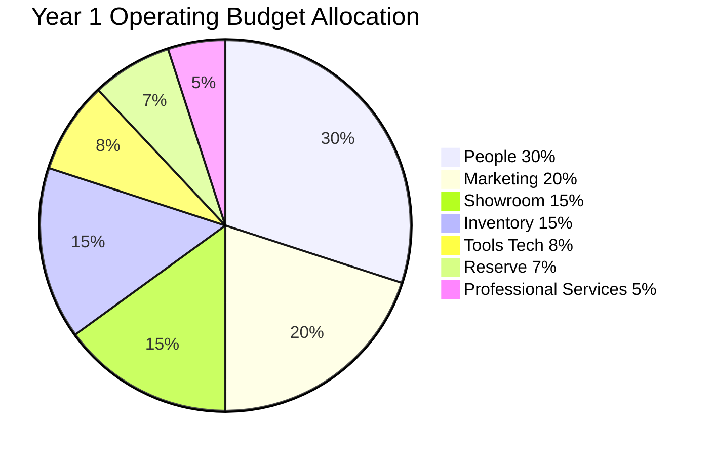
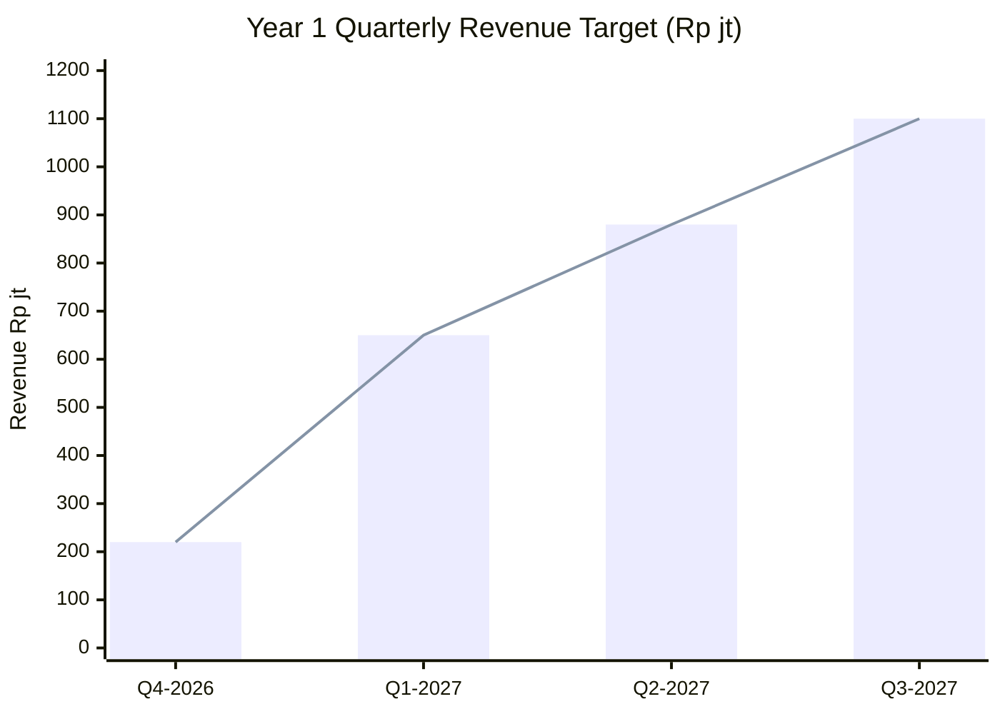
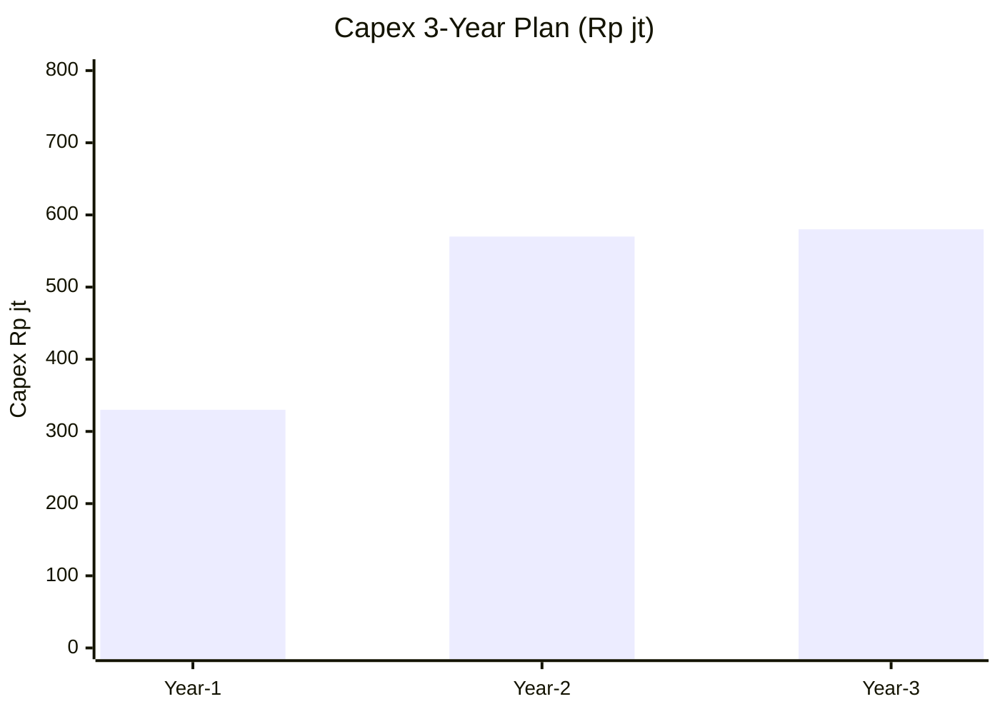

# Budget Planning

Annual + quarterly budget planning Gerai 1000 Pintu: revenue target, cost allocation, capex, reserve. Per phase aligned dengan vision-roadmap.

## Triggers

Primary:
- "budget planning"
- "annual budget"
- "quarterly budget"

Secondary:
- "anggaran"
- "budget allocation"

## Input Required

| Field | Type | Required | Default |
|---|---|---|---|
| period | enum | yes | (annual / quarterly) |
| phase | enum | yes | (Phase 1 / Phase 2 / Phase 3) |
| context | string | no | - |

## Output Template

```markdown
# Budget Plan: {PERIOD}

**Period:** {Annual Year 1 / Q1-Q4}
**Phase:** {Phase 1 Foundation / Phase 2 Kaltim Scale / Phase 3 Jawa}
**Owner:** CFO + Matthew approve

## Budget Overview

### Total Budget: Rp {N}M
- Revenue target: Rp {N}M
- Operating cost: Rp {N}M
- Capex: Rp {N}M
- Reserve: Rp {N}M (15-20% standard)

### Margin Target
- Gross margin: 30%+ (premium curated)
- Net margin Year 1: -10% to 0% (foundation)
- Net margin Year 2: 5-10%
- Net margin Year 3: 10-15%

## Revenue Budget

### Year 1 Foundation (2026-2027) — Cabang Balikpapan
| Source | Q4 2026 | Q1 2027 | Q2 2027 | Q3 2027 | Year Total |
|---|---|---|---|---|---|
| AMK Premium product | Rp 200jt | Rp 600jt | Rp 800jt | Rp 1M | Rp 2.6M |
| Service / Aftersales | Rp 20jt | Rp 50jt | Rp 80jt | Rp 100jt | Rp 250jt |
| **Total Revenue** | **Rp 220jt** | **Rp 650jt** | **Rp 880jt** | **Rp 1.1M** | **Rp 2.85M** |

### Conservative scenario (-25%)
Total Year 1: Rp 2.1M

### Optimistic scenario (+25%)
Total Year 1: Rp 3.5M

## Operating Cost Budget

### Per Category Allocation Year 1

| Category | % | Rp Amount | Note |
|---|---|---|---|
| **People** | 30% | Rp 850jt | MA × 2 + Door Expert + Tim Pusat partial |
| **Marketing** | 20% | Rp 570jt | Wave 1 launch + steady ops |
| **Showroom + Facility** | 15% | Rp 425jt | Rent + utility + maintenance |
| **Inventory + COGS** | 15% | Rp 425jt | Product + sample + display |
| **Tools + Technology** | 8% | Rp 230jt | CRM + Vercel + n8n + tools |
| **Professional Services** | 5% | Rp 140jt | Accountant + legal + advisor |
| **Reserve operating** | 7% | Rp 200jt | Buffer + unexpected |
| **Total Operating** | 100% | Rp 2.85M | - |

### People Cost Detail Year 1
| Role | Count | Salary/Month | Annual |
|---|---|---|---|
| Matthew (founder) | 1 | self (kalau salary) | - |
| Door Expert | 1 | Rp 10jt | Rp 120jt |
| MA Senior | 1 | Rp 5jt | Rp 60jt |
| MA Junior | 1 | Rp 4.5jt | Rp 54jt |
| Marketing Lead Pusat | 1 | Rp 8jt (partial) | Rp 96jt |
| Operations Pusat | 1 | Rp 6jt (partial) | Rp 72jt |
| Tools + benefit | - | - | Rp 200jt |
| Reserve hiring buffer | - | - | Rp 250jt |
| **Total People** | - | - | **Rp 850jt** |

### Marketing Cost Detail Year 1
| Category | Amount | Note |
|---|---|---|
| Wave 1 launch concentrated | Rp 200jt | Q4 2026 |
| Steady ops marketing | Rp 250jt | Q1-Q3 2027 |
| Influencer + KOL | Rp 60jt | Selective |
| Content production | Rp 40jt | Photography + video |
| Tools + ads | Rp 20jt | Meta + Google |
| **Total Marketing** | Rp 570jt | - |

## Capex Budget

### Year 1 Capex
| Item | Amount | Status |
|---|---|---|
| Showroom Cabang #1 buildout | Rp 250jt | One-time launch |
| Furniture + display | Rp 50jt | One-time |
| Tools + tech infrastructure | Rp 30jt | One-time |
| **Total Capex Year 1** | Rp 330jt | - |

### Year 2 Capex (Phase 2)
| Item | Amount |
|---|---|
| Cabang #2 Samarinda | Rp 280jt |
| Cabang #3 Bontang | Rp 250jt |
| Door Expert tools + workstation | Rp 40jt |
| **Total Capex Year 2** | Rp 570jt |

### Year 3 Capex (Phase 3 first Jawa)
| Item | Amount |
|---|---|
| Cabang Jawa first | Rp 500jt |
| Tech scale infrastructure | Rp 80jt |
| **Total Capex Year 3** | Rp 580jt |

## Reserve Strategy

### Cash Reserve
- Target: 3-month operating expense minimum
- Year 1: Rp 700jt minimum
- Year 2: Rp 850jt minimum
- Year 3: Rp 1M minimum

### Working Capital Line
- Standby: Rp 200jt (bank credit line)
- Activation trigger: cash <2-month operating

### Investment Reserve
- 5-10% of revenue allocated for opportunistic
- Use: testing new channel, vendor expansion, talent

## Quarterly Allocation Pattern

### Year 1 Quarterly Distribution

| Quarter | Revenue Target | Operating | Capex | Reserve Movement |
|---|---|---|---|---|
| Q4 2026 | Rp 220jt | Rp 650jt | Rp 330jt | -Rp 760jt |
| Q1 2027 | Rp 650jt | Rp 700jt | Rp 20jt | -Rp 70jt |
| Q2 2027 | Rp 880jt | Rp 750jt | Rp 30jt | +Rp 100jt |
| Q3 2027 | Rp 1.1M | Rp 800jt | Rp 280jt (Phase 2 prep) | +Rp 20jt |

## Budget Review Cadence

### Monthly
- Actual vs budget variance check
- Forecast update kalau material deviation
- Cash position review

### Quarterly
- Full quarterly review (QBR)
- Reallocation kalau perlu
- Next quarter detailed plan

### Annually
- Year-end actual reconcile
- Year+1 budget set
- Multi-year plan refresh

## Approval Workflow

### Budget approval
- Annual: Matthew approve (full)
- Quarterly: Matthew approve (with CFO recommendation)
- Reallocation >Rp 25jt: Matthew approve
- Reallocation <Rp 25jt: CFO + functional C-Level

### Capex approval
- >Rp 50jt: Matthew direct
- Rp 25-50jt: CFO + Matthew note
- <Rp 25jt: CFO + functional C-Level

## Variance Management

### Tolerance level
- ±5% routine
- ±10% notable + explain
- ±15% review needed
- ±25% intervention required

### Common variance reason
- Revenue: market timing, conversion variance
- Marketing: campaign performance, channel shift
- People: hire timing, retention impact
- Inventory: demand variance, vendor pricing

## Brand Canon Compliance

- Budget document language: direct + warm
- No em-dash di document
- "Gerai 1000 Pintu" lengkap di formal
- Premium hangat tone preserved
```

## Visual Output

Year 1 budget pie:



Revenue forecast trajectory:



Multi-year capex:



## Knowledge Dependency

- BP Chapter 18 (Financial Plan)
- vision-roadmap (Atmaja)
- All C-Level cost input
- Matthew financial priorities

## Mode

Default: EXECUTION
Switch: DISCUSSION jika budget allocation debate

## Tools Required

- file-search
- artifacts (pie + chart + table)

## Validation Criteria

- Total budget breakdown
- Revenue target conservative + base + optimistic
- Operating cost per category with detail
- Capex per year Phase 1-3
- Reserve strategy
- Quarterly allocation
- Review cadence + approval workflow
- Variance management

## Sample I/O

**Input:** "Budget plan Year 1 Foundation 2026-2027 Cabang Balikpapan"

**Output summary:**
- Total budget: Rp 2.85M revenue target + Rp 2.85M operating + Rp 330jt capex
- Operating allocation: People 30% + Marketing 20% + Showroom 15% + Inventory 15% + Tools 8% + Pro Svc 5% + Reserve 7%
- People detail: MA × 2 + Door Expert + Tim Pusat partial = Rp 850jt
- Marketing detail: Wave 1 launch Rp 200jt concentrated + steady Rp 250jt + influencer Rp 60jt
- Capex: Rp 250jt showroom + Rp 50jt furniture + Rp 30jt tools
- Cash reserve target: Rp 700jt minimum (3-month operating)
- Working capital line: Rp 200jt standby
- Quarterly distribution: Q4 launch (negative net) → Q3 positive net
- Variance tolerance: ±5-15% review tier
- Pie + chart embedded

## Handoff

- cash-flow-management (paired)
- revenue-forecast (input)
- All C-Level (function budget detail)
- Matthew (approval)
