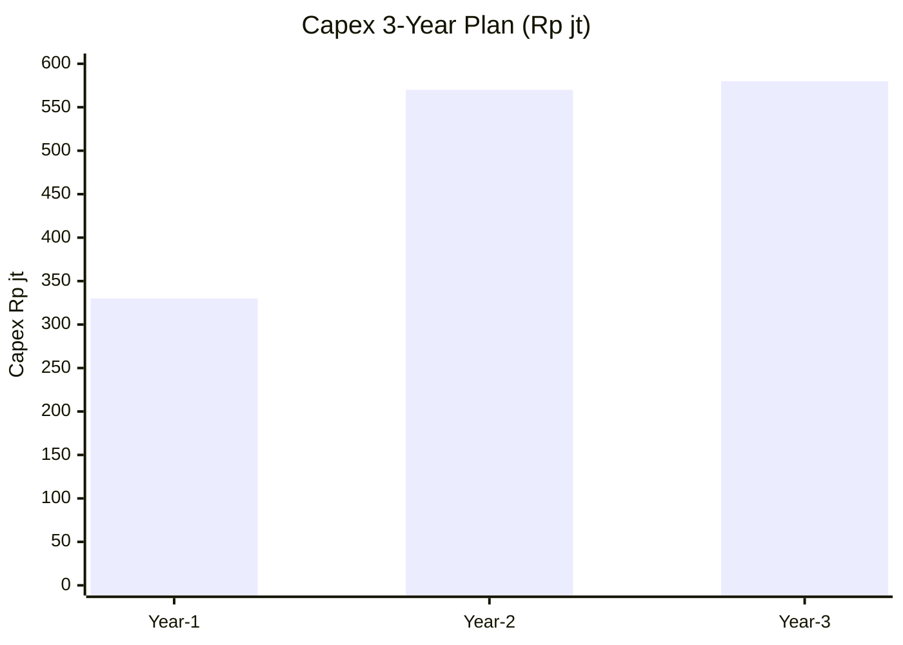
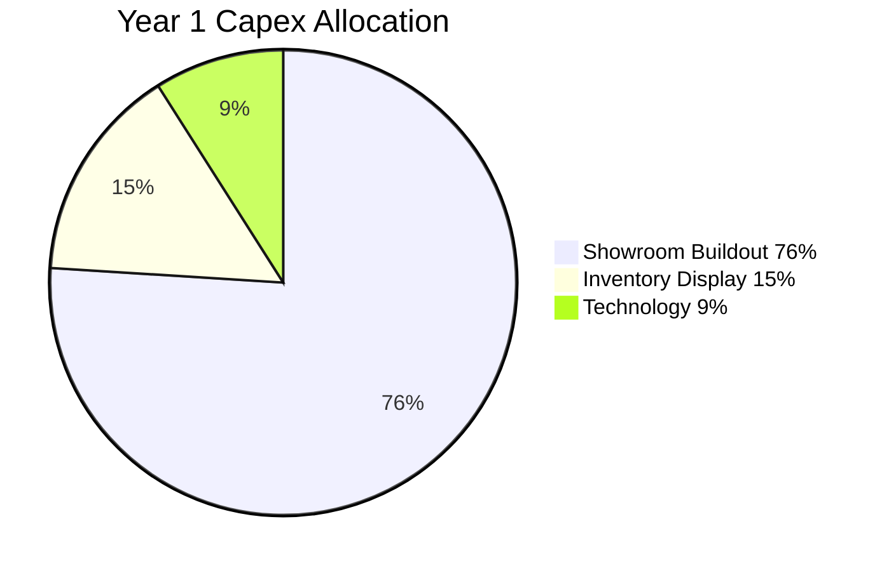
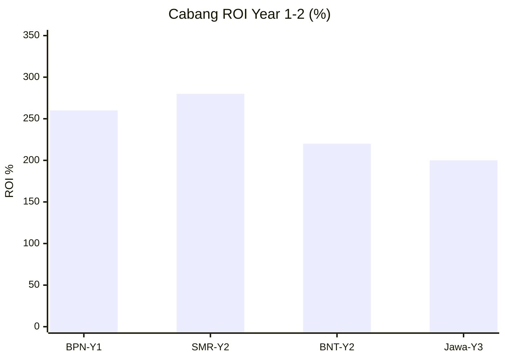

# Capex Planning

Capital expenditure planning Gerai 1000 Pintu: Phase 1-3 capex, ROI analysis, payback period, financing strategy.

## Triggers

Primary:
- "capex planning"
- "capital expenditure"
- "investment plan"

Secondary:
- "capex budget"
- "major investment"

## Output Template

```markdown
# Capex Plan: {PERIOD / Phase}

**Period:** {Phase 1 / Phase 2 / Phase 3 / Multi-year}
**Total Capex:** Rp {N}M
**Owner:** CFO + Matthew approve

## Capex Categories

### Category 1: Showroom & Facility
- Cabang buildout (per location)
- Renovation + refresh
- Display fixture
- Konsultasi pod equipment

### Category 2: Technology
- Tools + tech infrastructure
- Workstation (laptop, monitor)
- AI Department infrastructure
- POS + CRM hardware

### Category 3: Inventory & Display
- Initial inventory (display + sample)
- Material wall sample
- Photography asset
- Display rotation refresh

### Category 4: Brand Asset
- Brand canon documentation + design
- Photography production (professional)
- Catalog print
- Press kit

### Category 5: Furniture & Equipment
- Furniture office Pusat
- Furniture showroom
- Equipment specialized

## Phase 1 Capex Detail (Year 1: 2026-2027)

### Cabang Balikpapan Buildout
| Item | Amount Rp |
|---|---|
| Interior design + arsitek fee | 15jt |
| Construction + finishing | 100jt |
| Lighting custom warm 3000K | 25jt |
| Display fixture custom | 40jt |
| Konsultasi pod fitout (tech + furniture) | 25jt |
| Material wall + sample | 15jt |
| Signage brass + typography | 10jt |
| Soft furnishing (seating, accessories) | 20jt |
| **Subtotal Showroom** | Rp 250jt |

### Technology Year 1
| Item | Amount Rp |
|---|---|
| Door Expert workstation (laptop + monitor) | 15jt |
| MA workstation × 2 | 10jt |
| POS terminal | 5jt |
| AI Department initial setup | (built) |
| **Subtotal Tech** | Rp 30jt |

### Initial Inventory + Display Year 1
| Item | Amount Rp |
|---|---|
| Display product (per archetype × 4) | 30jt |
| Material wall sample | 10jt |
| Photography asset library | 10jt |
| **Subtotal Inventory** | Rp 50jt |

### **Total Year 1 Capex: Rp 330jt**

## Phase 2 Capex Detail (Year 2: 2027-2028)

### Cabang #2 Samarinda
| Item | Amount Rp |
|---|---|
| Buildout (similar BPN) | 250jt |
| Display + inventory | 50jt |
| Tech setup | 30jt (lighter, infrastructure shared) |
| Marketing soft-launch capex | 30jt |
| **Subtotal Samarinda** | Rp 280jt |

### Cabang #3 Bontang
| Item | Amount Rp |
|---|---|
| Buildout (smaller scope) | 200jt |
| Display + inventory | 40jt |
| Tech setup | 25jt |
| Marketing soft-launch | 25jt |
| **Subtotal Bontang** | Rp 250jt |

### Door Expert Pool Tech
| Item | Amount Rp |
|---|---|
| Door Expert #2 workstation | 15jt |
| Additional MA workstation × 2 | 10jt |
| Tech infrastructure shared | 15jt |
| **Subtotal Tech** | Rp 40jt |

### **Total Year 2 Capex: Rp 570jt**

## Phase 3 Capex Detail (Year 3: 2028-2029)

### First Jawa Cabang
| Item | Amount Rp |
|---|---|
| Buildout Jakarta or Surabaya (premium location) | 400jt |
| Display + inventory | 70jt |
| Tech + signage | 30jt |
| **Subtotal Jawa #1** | Rp 500jt |

### National Tech Infrastructure
| Item | Amount Rp |
|---|---|
| AI Department scale | 50jt |
| Tools + integration | 30jt |
| **Subtotal Tech Scale** | Rp 80jt |

### **Total Year 3 Capex: Rp 580jt**

## ROI Analysis per Capex

### Cabang Balikpapan Year 1
- Capex: Rp 250jt
- Year 1 contribution: Rp 2.85M revenue × 32% margin = Rp 900jt
- Payback period: 3-4 month break-even contribution
- ROI Year 1: ~260%

### Cabang Samarinda Year 2
- Capex: Rp 280jt
- Year 2 contribution projected: Rp 1.5M × 32% = Rp 480jt
- Year 3 contribution projected: Rp 3M × 32% = Rp 960jt
- Payback period: ~6 month
- ROI Year 2-3: ~250-300%

### Cabang Bontang Year 2
- Capex: Rp 250jt
- Year 2 contribution: Rp 800jt × 32% = Rp 256jt (ramping)
- Year 3 contribution: Rp 2M × 32% = Rp 640jt
- Payback period: ~9 month
- ROI Year 2-3: ~200-250%

### Cabang Jawa #1 Year 3
- Capex: Rp 500jt (premium location)
- Year 3-4 contribution: Rp 3M × 32% = Rp 960jt initial
- Payback period: ~6-9 month
- ROI: ~200% Year 3-4 sustained

## Financing Strategy

### Year 1 Funding
- Bootstrap (Matthew + initial revenue): 100%
- No external capital needed

### Year 2 Funding (Phase 2)
- Bootstrap + working capital line: 80% bootstrap + 20% credit line
- Conservative scenario: delay 6 month kalau cash tight

### Year 3+ Funding (Phase 3 Jawa)
- Option A: Bootstrap + retained earnings (preferred kalau possible)
- Option B: Strategic capital (kalau growth pressure justifies)
- Option C: Bank financing (working capital + term loan mix)

### Decision criteria for external capital
- Growth opportunity > self-funding pace
- Strategic partner adds value (not just capital)
- Brand canon preserved (no compromise for capital)
- Founder control maintained

## Capex Decision Framework

### Per capex >Rp 50jt
1. ROI projection (3-year minimum)
2. Payback period (target <12 month for cabang)
3. Strategic alignment (Phase 1-3 roadmap)
4. Brand canon implication (CCO review kalau brand asset)
5. Operational feasibility (COO review kalau buildout)
6. Risk assessment (refer COO risk-register)
7. Matthew final approve

### Approval threshold
- Capex <Rp 25jt: CFO + functional C-Level
- Capex Rp 25-50jt: CFO + Matthew note
- Capex >Rp 50jt: Matthew direct approve

## Capex Performance Tracking

### Per capex investment
- ROI actual vs projected (quarterly review)
- Payback achievement
- Strategic outcome delivery
- Document learning

### Multi-year capex efficiency
- Total capex Year 1-3: Rp 1.48M
- Total revenue Year 1-3: Rp 26.4M (base case)
- Capex efficiency: 5.6% (capex as % of revenue)
- Industry benchmark: 5-15% typical retail

## Brand Canon Compliance

### Capex must align with brand
- Showroom: Brand canon strict (CCO oversight)
- Tech: Function but not over-spend on commodity
- Inventory: Curated quality (no commoditization)
- Brand asset: Premium production (anchor reference)

### Avoid
- ❌ Over-built showroom (premium hangat ≠ ostentatious luxury)
- ❌ Under-invested brand asset (compromises positioning)
- ❌ Trendy expensive tech (substance over flash)
```

## Visual Output

Capex 3-year plan:



Capex by category Year 1:



ROI per cabang:



## Knowledge Dependency

- budget-planning (paired)
- vision-roadmap (Atmaja phase alignment)
- COO lean-store-design + showroom-experience-design
- CCO visual-identity-system (brand asset)
- BP Chapter 18

## Mode

Default: EXECUTION
Switch: DISCUSSION jika investment timing debate

## Tools Required

- file-search
- artifacts (chart + pie)

## Validation Criteria

- 5 capex category
- Per phase detail (Year 1-3)
- ROI analysis per major capex
- Payback period calculation
- Financing strategy (bootstrap vs external)
- Decision framework + approval threshold
- Performance tracking
- Capex efficiency benchmark
- Brand canon alignment

## Sample I/O

**Input:** "Capex plan 3-year Phase 1-3 Gerai 1000 Pintu"

**Output summary:**
- Year 1: Rp 330jt (BPN buildout 250 + tech 30 + inventory 50)
- Year 2: Rp 570jt (SMR 280 + BNT 250 + tech 40)
- Year 3: Rp 580jt (Jawa 500 + tech scale 80)
- Total 3-year: Rp 1.48M
- ROI: BPN Year 1 260% + SMR Year 2 280% + BNT Year 2 220% + Jawa Year 3 200%
- Payback period: 3-9 month per cabang
- Financing: Year 1 bootstrap + Year 2 80% bootstrap + 20% WC line + Year 3 retained earnings preferred
- Decision threshold: >Rp 50jt Matthew direct + <Rp 25jt CFO functional
- Capex efficiency: 5.6% of revenue (within retail benchmark 5-15%)
- Brand canon: Showroom CCO strict + tech function + premium asset quality
- 3-year chart + pie + ROI bar embedded

## Handoff

- budget-planning (paired)
- cash-flow-management
- vision-roadmap (Atmaja alignment)
- COO showroom-experience-design (execution)
- Matthew (approval >Rp 50jt)
