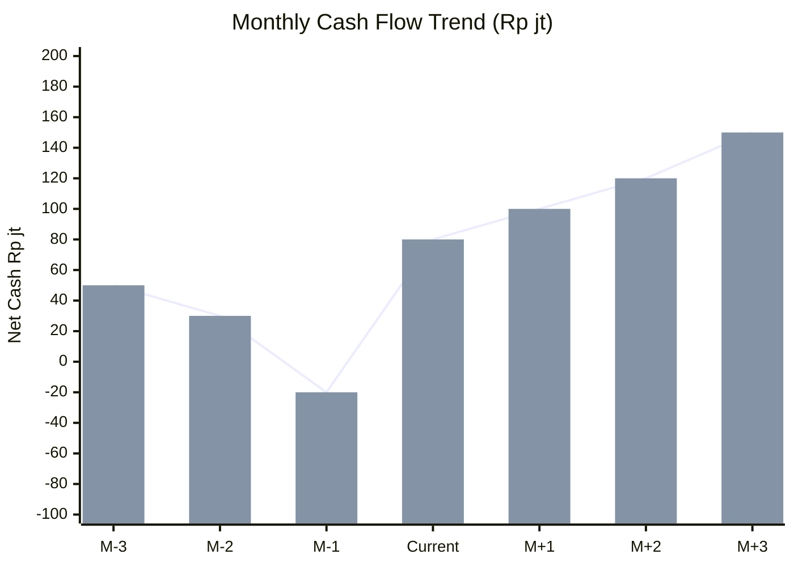
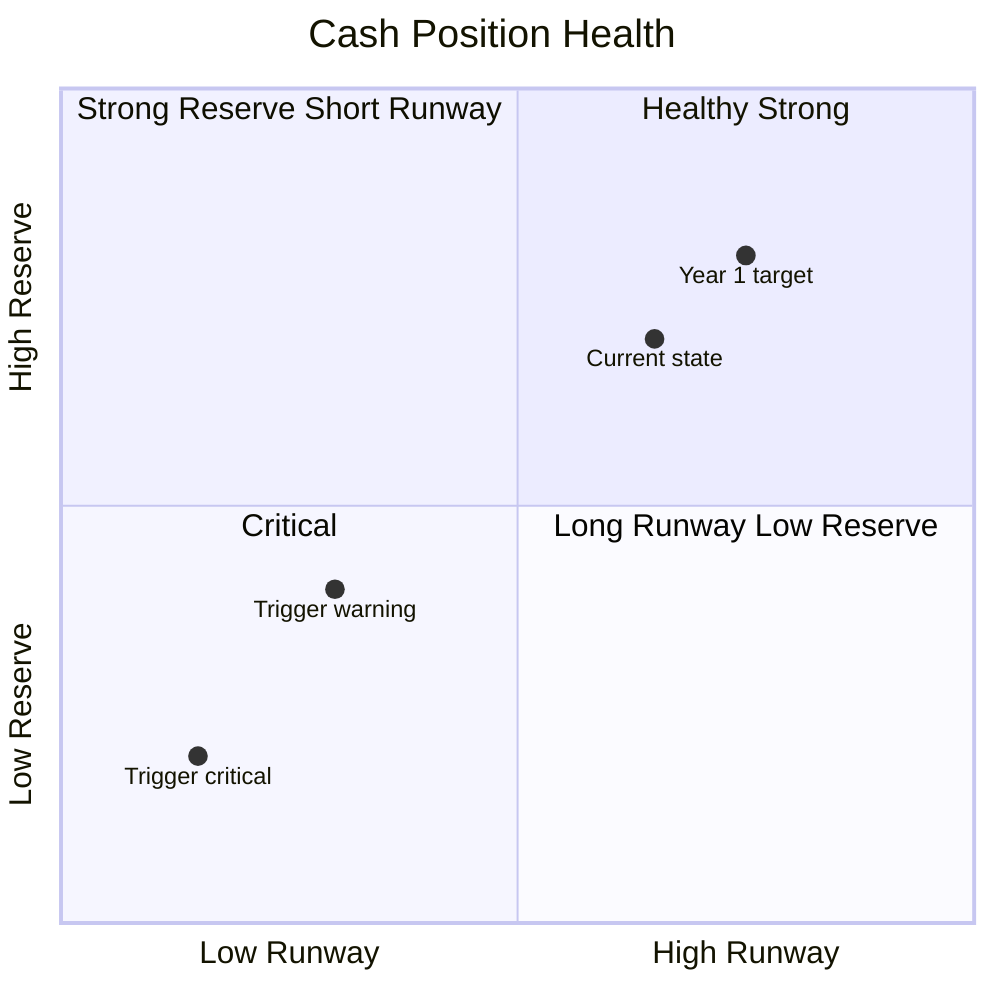
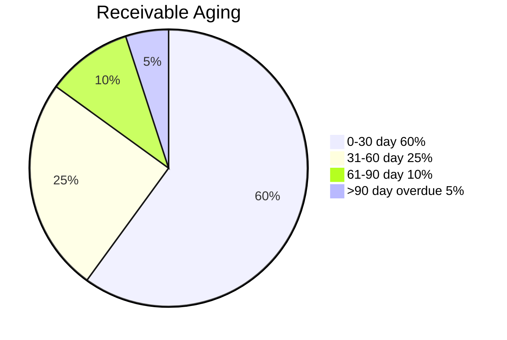

# Cash Flow Management

Manage cash flow Gerai 1000 Pintu: weekly + monthly + quarterly view, runway tracking, gap forecasting, scenario response.

## Triggers

Primary:
- "cash flow"
- "cash management"
- "runway"

Secondary:
- "kas perusahaan"
- "liquidity"

## Output Template

```markdown
# Cash Flow Report: {PERIOD}

**Period:** {Date range}
**Current cash:** Rp {N}jt
**Runway:** {N} month at current burn
**Status:** 🟢/🟡/🔴

## Cash Position Snapshot

### Current Balance
- Operating account: Rp {N}jt
- Reserve account: Rp {N}jt
- Working capital available: Rp {N}jt
- **Total liquid:** Rp {N}jt

### Burn Rate
- Monthly average: Rp {N}jt
- Trend: ↑/→/↓ vs previous quarter
- Status: 🟢/🟡/🔴

### Runway Calculation
- Current cash: Rp {N}jt
- Monthly burn: Rp {N}jt
- Runway: {N} month
- Target: 6+ month minimum
- Status: 🟢/🟡/🔴

## Cash Flow Movement (This Period)

### Inflow
| Source | Amount | Note |
|---|---|---|
| Revenue collection | Rp {N}jt | {customer detail} |
| DP customer | Rp {N}jt | {project} |
| Interest earned | Rp {N}jt | - |
| Other | Rp {N}jt | - |
| **Total Inflow** | Rp {N}jt | - |

### Outflow
| Category | Amount | Note |
|---|---|---|
| People salary | Rp {N}jt | - |
| Vendor payment | Rp {N}jt | {detail} |
| Marketing | Rp {N}jt | - |
| Showroom + utility | Rp {N}jt | - |
| Tools subscription | Rp {N}jt | - |
| Tax payment | Rp {N}jt | - |
| Other | Rp {N}jt | - |
| **Total Outflow** | Rp {N}jt | - |

### Net Cash Flow
- This period: Rp {N}jt (positive/negative)
- YTD: Rp {N}jt
- Trend: improving/stable/declining

## Cash Flow Forecast (Next 3 Month)

### Month +1
- Inflow projected: Rp {N}jt
- Outflow projected: Rp {N}jt
- Net: Rp {N}jt
- Ending cash: Rp {N}jt

### Month +2
{Same structure}

### Month +3
{Same structure}

### 90-day cash forecast confidence
- High: based on confirmed PO + receivable
- Medium: based on pipeline + projection
- Low: speculative

## Customer Receivable

### Outstanding receivable
| Customer | Amount | Days Outstanding | Status |
|---|---|---|---|
| {name} | Rp {N}jt | {N} day | {paid/pending/overdue} |

### Aging breakdown
| Aging | Amount | % of Total |
|---|---|---|
| 0-30 day | Rp {N}jt |  |
| 61-90 day | Rp {N}jt |  |

### Collection priority
1. Overdue >90 day (action urgent)
2. 61-90 day (active follow-up)
3. Standard cycle

## Vendor Payable

### Upcoming payment
| Vendor | Amount | Due Date | Status |
|---|---|---|---|
| {vendor} | Rp {N}jt | {date} | {confirmed/pending} |

### Payment terms
| Vendor | Term | Note |
|---|---|---|
| AMK Premium | 30-day | Standard |
| Logistics | 7-day | Operational |
| Tools (subscription) | Monthly | Auto-pay |
| Showroom rent | Monthly | Standing |
| People salary | 25th of month | Fixed |

## Cash Buffer Strategy

### Buffer Targets
| Tier | Amount | Purpose |
|---|---|---|
| Operating reserve | 3-month expense | Standard buffer |
| Strategic reserve | 1-month expense | Phase 2 prep |
| Emergency reserve | Rp 100jt minimum | Black swan |
| Working capital line | Rp 200jt standby | Bank credit unused |

### Total liquidity target
- Year 1: Rp 700jt minimum
- Year 2: Rp 850jt minimum
- Year 3: Rp 1M minimum

## Cash Gap Forecasting

### Trigger to monitor
- Cash <2-month burn: 🟡 WARNING
- Cash <1-month burn: 🔴 CRITICAL
- Working capital activated: tracked separately

### Gap closure options
1. Receivable acceleration (DP, factoring)
2. Vendor payment delay (negotiate)
3. Marketing cut (non-essential)
4. Working capital line activation
5. External capital (last resort)

## Scenario Response

### Best case (cash positive sustained)
- Increase reserve buffer
- Opportunistic investment
- Optional Phase 2 acceleration

### Base case (per plan)
- Maintain discipline
- Quarterly review
- No special action

### Worst case (cash tight)
- Activate cost cut menu
- Working capital line ready
- Defer non-essential capex
- Communicate to vendor (extend term)

### Black swan (cash critical)
- Refer COO contingency-plan
- Matthew direct decision
- Conservation mode all category

## Weekly Cash Discipline

### Monday
- Cash position update
- Receivable status check
- Payable schedule

### Wednesday
- Forecast adjust kalau material change

### Friday
- Weekly summary to Matthew
- Anomaly flag kalau ada

## Brand Canon Compliance

- Cash report: factual + direct + warm tone
- "Gerai 1000 Pintu" lengkap formal
- No em-dash
- Customer-related note: premium hangat preserved
```

## Visual Output

Cash flow waterfall:



Cash position tier:



Receivable aging:



## Knowledge Dependency

- budget-planning (paired)
- revenue-forecast (input)
- COO PO management
- All function spending pattern
- Banking relationship

## Mode

Default: EXECUTION (cash report)
Switch: NEED_CLARIFICATION jika anomaly emerge

## Tools Required

- file-search
- artifacts (waterfall + quadrant)

## Validation Criteria

- Cash position snapshot
- Burn rate + runway calculation
- Inflow + outflow detail
- 90-day forecast
- Receivable aging
- Vendor payable schedule
- Buffer strategy 4-tier
- Gap closure options
- Scenario response per scenario
- Weekly discipline cadence

## Sample I/O

**Input:** "Cash flow report monthly Q4 2026 post Wave 1 launch"

**Output summary:**
- Current cash: Rp 650jt operating + Rp 200jt working capital line standby
- Burn rate: Rp 240jt/month (people + marketing + ops)
- Runway: 2.7 month at current burn (🟡 below 6-month target)
- Trend: launch month negative net (-Rp 80jt) per plan
- 90-day forecast: Month +1 Rp 750jt (Wave 1 ramp), +2 Rp 850jt, +3 Rp 950jt (recovery)
- Receivable: 0 overdue (good — Wave 1 mostly DP-based)
- Payable upcoming: AMK Rp 80jt + logistics Rp 15jt + salaries Rp 30jt
- Buffer status: Operating reserve below target (build back Q1)
- Action: Maintain discipline + accelerate revenue collection + working capital ready
- Waterfall + quadrant + aging pie embedded

## Handoff

- budget-planning (paired)
- revenue-forecast (input)
- working-capital (line management)
- Matthew (cash runway monitor)
- COO contingency-plan (kalau crisis)
