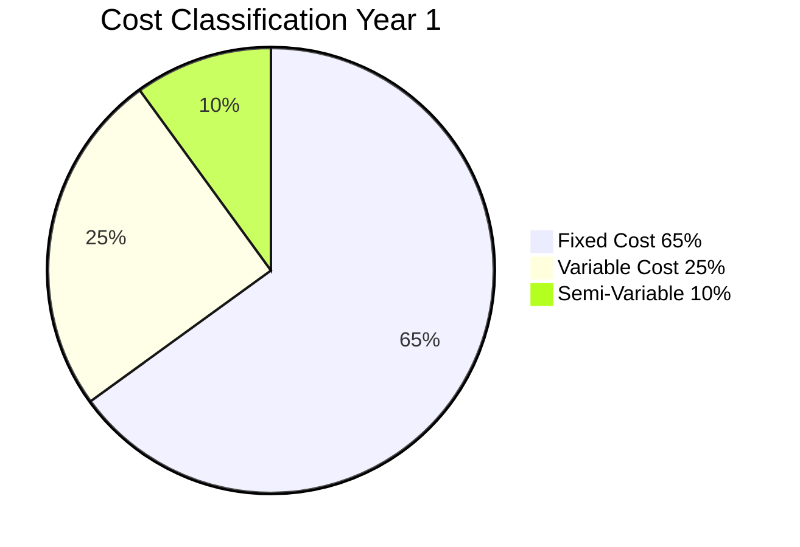
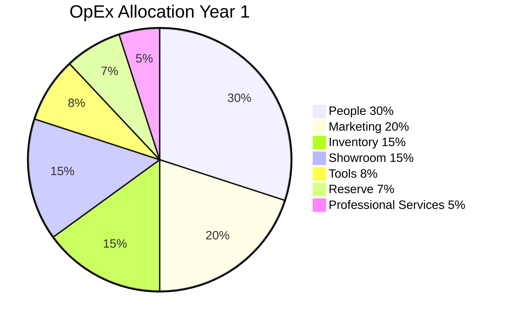
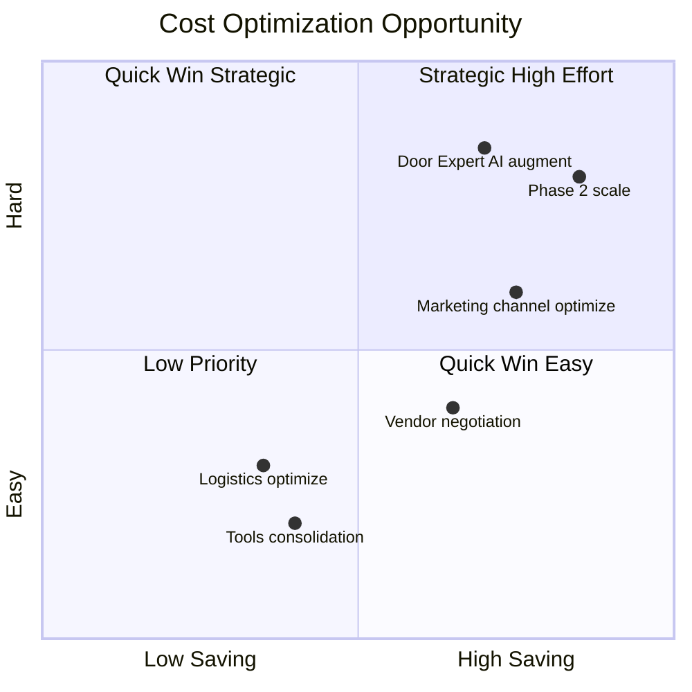

# Cost Structure Analysis

Analyze + optimize cost structure Gerai 1000 Pintu: fixed vs variable, COGS vs OpEx, per category breakdown, optimization opportunity.

## Triggers

Primary:
- "cost structure"
- "cost analysis"
- "biaya analisis"

Secondary:
- "cost optimization"
- "operating expense breakdown"

## Output Template

```markdown
# Cost Structure: {PERIOD}

**Period:** {Date range}
**Total Cost:** Rp {N}M
**Trend vs previous:**  of revenue
- **Marketing (campaign-driven):** Rp {N}
- **Logistics per order:** Rp {N}
- **Aftersales per customer:** Rp {N}
- **Total Variable:** Variable per volume

### Semi-Variable
- **Marketing baseline + amplification:** mix
- **Utility (electric, water):** mostly fixed slight variable
- **Door Expert capacity:** fixed but scales step

## COGS Breakdown

### AMK Premium Product Cost
- Vendor cost per unit avg: Rp {N}
- Logistics Jakarta-Balikpapan: Rp {N} per unit
- QC + handling: Rp {N} per unit
- **Total COGS per unit:** Rp {N}
- **Gross margin per unit:** {%}

### Margin per Product Category

| Category | Avg Sell Price | COGS | Margin % |
|---|---|---|---|
| Pintu archetype Jepang | Rp 25jt | Rp 17jt | 32% |
| Pintu archetype Eropa | Rp 35jt | Rp 24jt | 31% |
| Pintu archetype Amerika | Rp 40jt | Rp 28jt | 30% |
| Pintu archetype China | Rp 28jt | Rp 19jt | 32% |
| Hardware (brass) | Rp 5jt | Rp 3jt | 40% |
| **Blended margin** | - | - | **31-32%** |

### Target Margin
- Gross margin: 30%+ (premium curated standard)
- Net margin Year 1: -10% to 0% (foundation investment)
- Net margin Year 2: 5-10%
- Net margin Year 3: 10-15%

## Operating Expense (OpEx) Breakdown

### Year 1 OpEx Allocation

| Category | Annual | % of OpEx | Note |
|---|---|---|---|
| People | Rp 850jt | 30% | MA + Door Expert + Tim Pusat |
| Marketing | Rp 570jt | 20% | Wave 1 + steady |
| Showroom + Facility | Rp 425jt | 15% | Rent + utility |
| Tools + Tech | Rp 230jt | 8% | CRM + tools |
| Professional Service | Rp 140jt | 5% | Accountant + legal |
| Inventory + Display sample | Rp 425jt | 15% | Display + COGS |
| Reserve operating | Rp 200jt | 7% | Buffer |
| **Total OpEx Year 1** | Rp 2.84M | 100% | - |

## Cost per Customer

### Average customer journey cost
- Marketing lead cost (CAC): Rp 400-500k
- Konsultasi cost (Door Expert time): Rp 150k
- Aftersales cost (first year): Rp 200-300k
- **Total per customer:** Rp 750k-950k

### Customer Lifetime Value (LTV)
- Average order value: Rp 30jt
- Repeat / referral within 2 year: 20% → LTV Rp 36jt
- **LTV/CAC ratio: ~70-90x** (very healthy premium curated)

## Cost Optimization Opportunity

### Quick Win (3-6 month)
| Opportunity | Saving Potential | Action |
|---|---|---|
| Tools consolidation | Rp 30-50jt/year | Audit + cancel unused |
| Vendor negotiation | Rp 50-100jt/year | Volume discount + payment terms |
| Logistics optimization | Rp 30jt/year | Multi-route + carrier mix |
| Reserve sweep | Rp 50jt/year | Idle cash → working capital better |

### Strategic (6-18 month)
| Opportunity | Saving Potential | Action |
|---|---|---|
| Door Expert AI augmentation | Rp 100jt/year (capacity gain) | More konsultasi same cost |
| Marketing channel optimize | Rp 100-200jt/year | Reduce underperformer + double-down winner |
| Phase 2 economies of scale | Rp 200jt/year cross-cabang | Shared services |

### Anti-pattern (jangan)
- ❌ Cut Door Expert quality investment (compromise core)
- ❌ Cut brand canon enforcement (drift risk)
- ❌ Cut customer experience touchpoint (NPS impact)
- ❌ Cut training + development (long-term gap)
- ❌ Cut reserve buffer (cash risk)

## Cost Discipline Principles

### Principle 1: Quality > Cheapest
Premium curated standard maintain. Don't cut quality for short-term savings.

### Principle 2: Strategic vs Tactical Cost
- Strategic (long-term IP): brand canon, training, IP development — protect
- Tactical (per project): negotiate hard

### Principle 3: Activity-Based Justification
Each significant cost should map to outcome:
- Marketing cost → lead generation outcome
- Tools cost → productivity outcome
- People cost → customer value outcome

### Principle 4: Quarterly Review
- Variance analysis quarterly
- Optimization opportunity quarterly
- Adjust budget quarterly

## Vendor Cost Management

### Vendor relationship priority
1. **AMK Premium (anchor):** Long-term partnership, fair price
2. **Tools (CRM, n8n, Vercel):** Strategic vendor, predictable cost
3. **Logistics:** Diversified, competitive
4. **Marketing tools:** Performance-driven

### Negotiation cadence
- AMK Premium: Annual review
- Tools: Annual or per-renewal
- Logistics: Quarterly assessment
- Marketing: Per campaign optimize

## Brand Canon Compliance (Cost Doc)

- Direct + warm tone (no aggressive cost-cutting language)
- "Premium curated standard maintain" emphasis
- Quality over cheapest preserved
- 5 Nilai applied (especially Pelayanan Nyaman)
```

## Visual Output

Fixed vs Variable cost:



OpEx breakdown:



Optimization opportunity matrix:



## Knowledge Dependency

- budget-planning (paired)
- COO vendor-scorecard
- All function cost input
- BP Chapter 18

## Mode

Default: EXECUTION
Switch: DISCUSSION jika cost cut debate

## Tools Required

- file-search
- artifacts

## Validation Criteria

- Fixed + Variable + Semi-variable classification
- COGS detail per product category
- OpEx breakdown 7 category
- Margin per category
- Cost per customer (CAC) + LTV
- Quick win + Strategic opportunity
- Anti-pattern explicit
- Cost discipline principles
- Vendor cost management
- Brand canon compliance

## Sample I/O

**Input:** "Cost structure Year 1 Gerai 1000 Pintu Cabang Balikpapan"

**Output summary:**
- Total Cost Year 1: Rp 2.84M OpEx + Rp 330jt Capex
- Fixed 65% + Variable 25% + Semi 10%
- COGS: 30-32% per category (premium curated standard)
- OpEx top 3: People 30% (Rp 850jt) + Marketing 20% (Rp 570jt) + Inventory 15% (Rp 425jt)
- CAC: Rp 400-500k per customer + Konsultasi cost Rp 150k
- LTV: Rp 36jt + LTV/CAC ratio ~70-90x (very healthy)
- Quick win: Tools consolidation Rp 50jt + vendor negotiation Rp 100jt + logistics Rp 30jt
- Strategic: Door Expert AI augment Rp 100jt capacity + marketing channel optimize Rp 200jt
- Anti-pattern: NO cut Door Expert quality + NO cut canon + NO cut customer touchpoint
- Classification pie + OpEx pie + opportunity quadrant embedded

## Handoff

- budget-planning (paired)
- cash-flow-management
- COO vendor-scorecard
- All function (optimization implementation)
