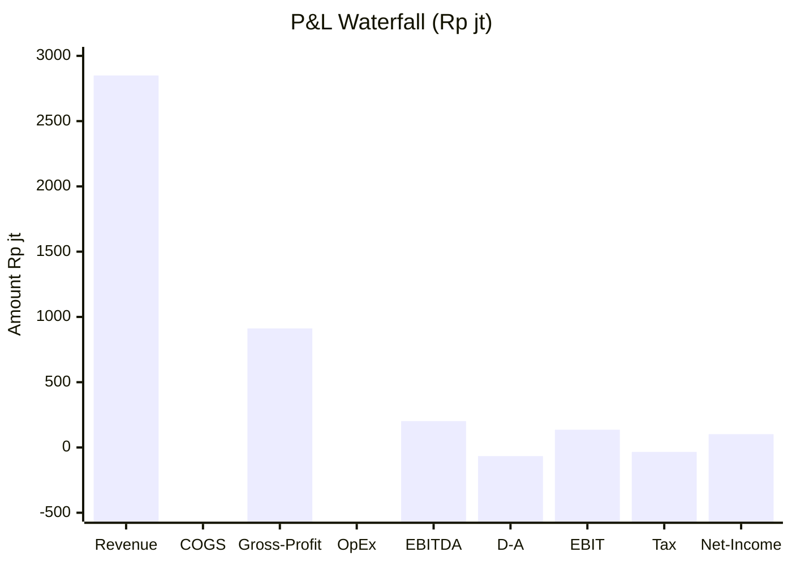
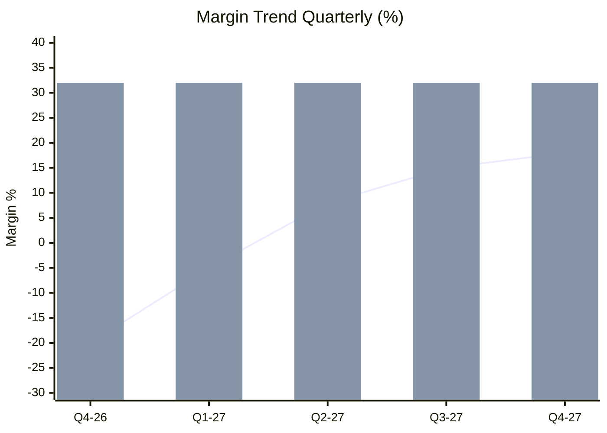
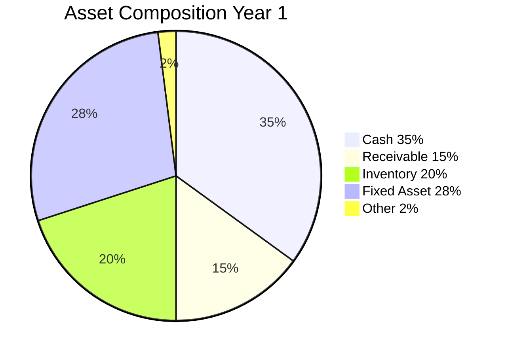

# Financial Reporting (P&L + Balance Sheet)

Generate financial report Gerai 1000 Pintu: P&L statement, balance sheet, cash flow statement. Monthly + quarterly + annual cadence.

## Triggers

Primary:
- "financial report"
- "P&L"
- "laporan keuangan"

Secondary:
- "income statement"
- "balance sheet"

## Output Template

```markdown
# Financial Report: {PERIOD}

**Period:** {Month / Quarter / Year}
**Reporting date:** {Date}
**Owner:** CFO + Matthew + external accountant

## Profit & Loss Statement

### Revenue
| Line | Amount Rp |
|---|---|
| Product sales (AMK Premium + selected) | {N}jt |
| Service (aftersales, premium aftersales) | {N}jt |
| Other (consulting, training) | {N}jt |
| **Total Revenue** | **Rp {N}jt** |

### COGS (Cost of Goods Sold)
| Line | Amount Rp |
|---|---|
| Product cost (vendor + freight) | {N}jt |
| Direct labor (Door Expert allocated) | {N}jt |
| Direct material | {N}jt |
| **Total COGS** | **Rp {N}jt** |

### Gross Margin
- Gross profit: Rp {N}jt
- Gross margin %: {32}%

### Operating Expense
| Category | Amount Rp |
|---|---|
| People (excluded Door Expert direct) | {N}jt |
| Marketing | {N}jt |
| Showroom + Facility | {N}jt |
| Tools + Tech | {N}jt |
| Professional Services | {N}jt |
| Insurance | {N}jt |
| Misc | {N}jt |
| **Total OpEx** | **Rp {N}jt** |

### EBITDA
- Earnings before Interest, Tax, Depreciation, Amortization
- EBITDA: Gross profit - OpEx = Rp {N}jt
- EBITDA margin: {%}

### Depreciation + Amortization
- Capex amortized (5-year straight line)
- D&A: Rp {N}jt

### Operating Profit (EBIT)
- EBIT: EBITDA - D&A = Rp {N}jt

### Interest + Tax
- Interest expense (kalau ada working capital draw): Rp {N}jt
- Tax provision (25% effective): Rp {N}jt

### Net Income
- Net profit / loss: Rp {N}jt
- Net margin:  |
| Gross margin |  | +/- pts |
| OpEx | Rp {N}jt | Rp {N}jt | + |

## Balance Sheet

### Assets
| Line | Amount Rp |
|---|---|
| **Current Assets** | |
| Cash + cash equivalent | {N}jt |
| Customer receivable | {N}jt |
| Inventory | {N}jt |
| Prepaid expense | {N}jt |
| **Total Current Assets** | Rp {N}jt |
| **Non-Current Assets** | |
| Fixed asset (showroom + furniture) | {N}jt |
| (Accumulated depreciation) | ({N}jt) |
| Intangible (brand, IP) | nominal |
| **Total Non-Current Assets** | Rp {N}jt |
| **Total Assets** | **Rp {N}jt** |

### Liabilities
| Line | Amount Rp |
|---|---|
| **Current Liabilities** | |
| Vendor payable | {N}jt |
| Customer deposit / DP unredeemed | {N}jt |
| Accrued expense | {N}jt |
| Short-term debt | {N}jt |
| Tax payable | {N}jt |
| **Total Current Liabilities** | Rp {N}jt |
| **Non-Current Liabilities** | |
| Long-term debt | {N}jt |
| **Total Liabilities** | **Rp {N}jt** |

### Equity
| Line | Amount Rp |
|---|---|
| Owner contribution (Matthew) | {N}jt |
| Retained earnings | {N}jt |
| **Total Equity** | **Rp {N}jt** |

### Balance Check
- Total Assets = Total Liabilities + Equity ✓

## Cash Flow Statement

### Operating Activities
| Line | Amount Rp |
|---|---|
| Net income | {N}jt |
| + Depreciation + amortization | {N}jt |
| - Increase in receivable | ({N})jt |
| - Increase in inventory | ({N})jt |
| + Increase in payable | {N}jt |
| **Net Cash from Operations** | Rp {N}jt |

### Investing Activities
| Line | Amount Rp |
|---|---|
| Capex showroom + tech | ({N})jt |
| Asset sale | {N}jt |
| **Net Cash from Investing** | (Rp {N})jt |

### Financing Activities
| Line | Amount Rp |
|---|---|
| Owner contribution | {N}jt |
| Debt drawn / (repaid) | {N}jt |
| Dividend paid | nil Year 1 |
| **Net Cash from Financing** | Rp {N}jt |

### Net Change in Cash
- Net change: Rp {N}jt
- Beginning cash: Rp {N}jt
- **Ending cash:** Rp {N}jt

## Key Financial Ratio

### Profitability
- Gross margin: {%} (target 30%+)
- EBITDA margin: 

### Liquidity
- Current ratio: {N}.x (target 2.0+)
- Quick ratio: {N}.x (target 1.5+)
- Cash ratio: {N}.x

### Efficiency
- Inventory turnover: {N}x annual
- Receivable turnover: {N}x annual
- Asset turnover: {N}x annual

### Leverage
- Debt/Equity ratio: {N}x (target <0.5x conservative)
- Interest coverage: {N}x

### Growth
- Revenue growth YoY: 
- AOV growth: 
- Reason: {explanation}

### COGS variance
- Actual vs budget: 
- Reason per category: {detail}

### Net Income variance
- Actual vs budget: 
- OpEx: Rp {N}jt
- Net result: Rp {N}jt expected

### Risk + Opportunity
- Upside: {scenario}
- Downside: {scenario}

## Reporting Cadence

### Monthly Internal
- P&L summary
- Cash position update
- Variance flag

### Quarterly External
- Full P&L + Balance + Cash flow
- External accountant review
- Tax filing prep

### Annual
- Audited (kalau Phase 3+ external)
- Tax return
- Forward year budget

## Tax Compliance

### PPN (VAT) Indonesia 11%
- Output PPN: collected from customer
- Input PPN: paid to vendor
- Net PPN: filed monthly

### PPh23 (withholding)
- Service payment to vendor
- Filed monthly

### PPh21 (employee)
- Salary withholding
- Filed monthly

### PPh4(2) final tax
- Rent + other
- Filed per occurrence

### Corporate income tax
- Annual filing (PPh badan)
- Quarterly installment

## External Accountant Coordination

- Monthly book closing review
- Quarterly statement review
- Tax filing prep + submit
- Annual audit (kalau perlu)
- Retainer Rp 3jt/month

## Brand Canon Compliance

- Financial document: factual + clear
- "Gerai 1000 Pintu" lengkap di header
- No em-dash
- Direct + warm tone (kalau executive summary)
```

## Visual Output

P&L waterfall:



Margin trend:



Balance sheet composition:



## Knowledge Dependency

- budget-planning + revenue-forecast + cost-structure
- cash-flow-management
- External accountant retainer
- Tax compliance Indonesia
- BP Chapter 18

## Mode

Default: EXECUTION (generate report)
Switch: NEED_CLARIFICATION jika data incomplete

## Tools Required

- file-search
- artifacts (waterfall + trend + pie)

## Validation Criteria

- P&L statement complete (Revenue → COGS → Gross → OpEx → EBITDA → D&A → EBIT → Tax → Net)
- Balance sheet (Asset = Liability + Equity)
- Cash flow statement (Operating + Investing + Financing)
- Key ratio (Profitability + Liquidity + Efficiency + Leverage + Growth)
- Variance analysis
- Forward outlook
- Tax compliance Indonesia
- Reporting cadence + external accountant coordination
- Brand canon compliance

## Sample I/O

**Input:** "Financial report monthly Q4 2026 + annual projection"

**Output summary:**
- Q4 2026 P&L: Revenue Rp 220jt + COGS Rp 150jt + Gross Rp 70jt (32%) + OpEx Rp 650jt + EBITDA (Rp 580jt) + Tax 0 + Net (Rp 580jt) — foundation investment expected
- Year 1 projection: Revenue Rp 2.85M + Gross Rp 910jt + OpEx Rp 2.84M + Net (Rp 2M) — foundation loss within plan
- Year 2 projection: Revenue Rp 3.5M + Gross Rp 1.12M + OpEx Rp 950jt + Net Rp 104jt profit
- Balance Year 1 end: Assets Rp 800jt (Cash 35% + Receivable 15% + Inventory 20% + Fixed 28%) = Liabilities Rp 200jt + Equity Rp 600jt
- Cash flow: Operating (Rp 1.5M) + Investing (Rp 330jt) + Financing Rp 2M (owner contribution) = Net Rp 170jt
- Ratio: Current 2.5x + Quick 1.8x + Debt/Equity 0.3x (conservative)
- Tax: PPN + PPh23 + PPh21 filed monthly + PPh badan annual
- Waterfall + trend + composition embedded

## Handoff

- budget-planning + revenue-forecast + cost-structure (input)
- cash-flow-management (paired)
- margin-analysis (deep dive)
- External accountant (coordination)
- Matthew (executive review)
