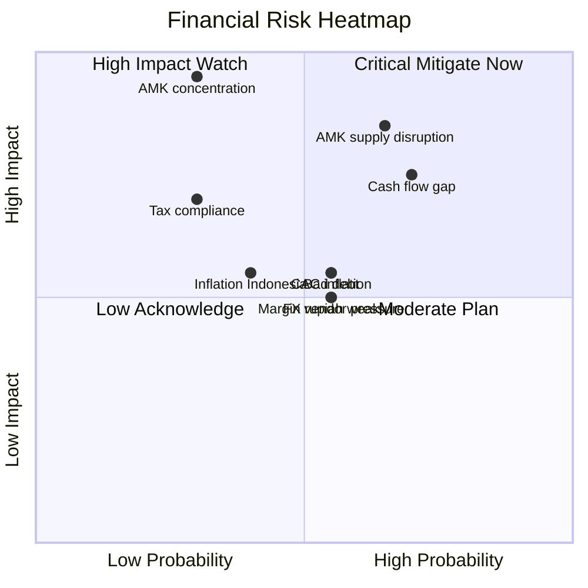
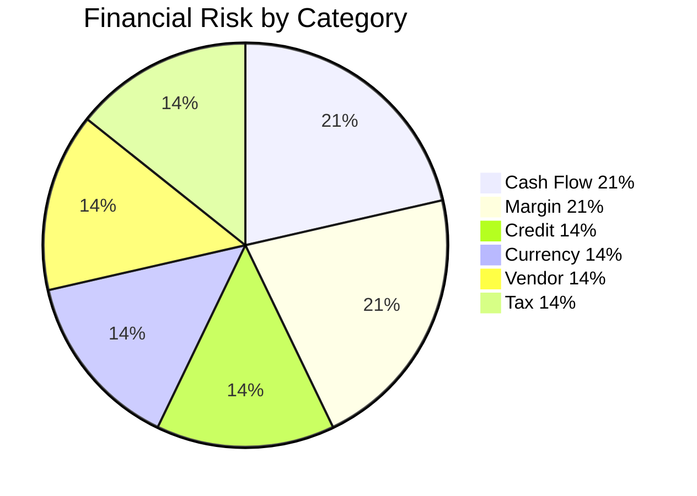
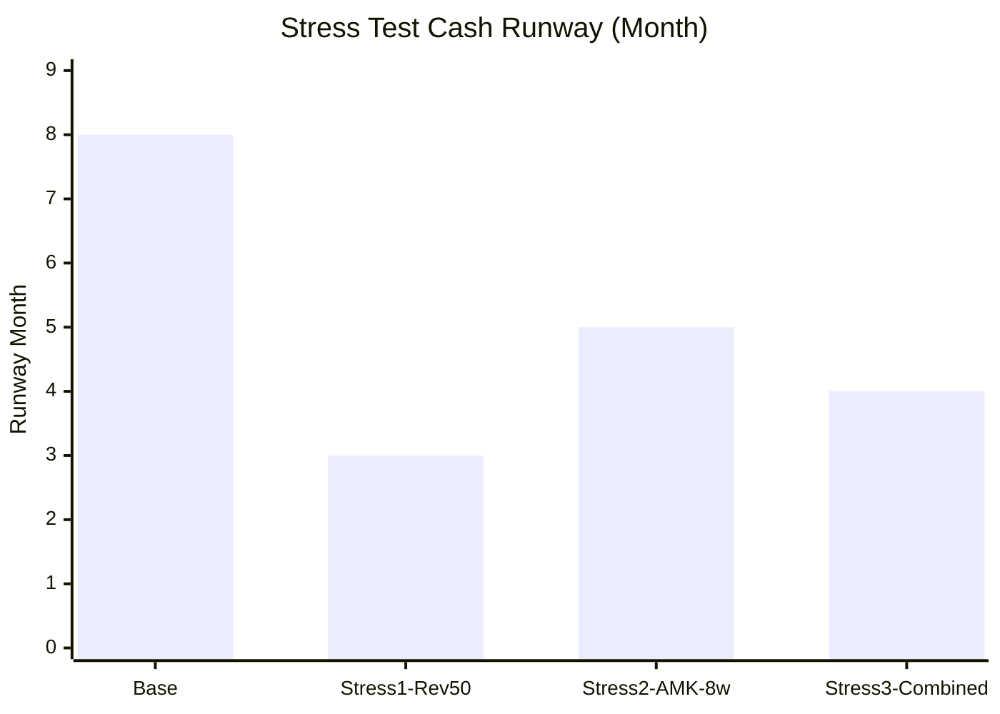

# Financial Risk Management

Financial risk register Gerai 1000 Pintu: cash flow risk, margin pressure, currency, inflation, credit, vendor concentration. Mitigation + monitoring.

## Triggers

Primary:
- "financial risk"
- "risiko keuangan"
- "treasury risk"

Secondary:
- "cash risk"
- "FX risk"

## Output Template

```markdown
# Financial Risk Management: {PERIOD}

**Period:** {Date}
**Owner:** CFO + Matthew
**Integration:** COO risk-register + Atmaja risk-portfolio-view

## Financial Risk Register

### Risk Category Overview

| Category | Risk Count | Critical 🔴 | High 🟡 | Moderate 🟢 |
|---|---|---|---|---|
| Cash flow | 3 | 1 | 2 | 0 |
| Margin | 3 | 0 | 2 | 1 |
| Credit | 2 | 0 | 1 | 1 |
| Currency / Inflation | 2 | 0 | 1 | 1 |
| Vendor concentration | 2 | 1 | 1 | 0 |
| Tax + Compliance | 2 | 0 | 0 | 2 |
| **Total** | **14** | **2** | **7** | **5** |

## Cash Flow Risk

### R-CF-001: Cash flow gap (delayed customer payment)
- **Description:** Customer enterprise project bayar lambat 60-90 hari
- **Probability:** High (4) × Impact: High (3) = Score 12 🔴
- **Mitigation:**
  - DP 50% upfront mandatory enterprise project
  - Cash reserve 3-month operating minimum
  - Working capital line Rp 200jt standby
  - Invoice factoring option (kalau perlu)
- **Owner:** CFO + Matthew
- **Review:** Monthly

### R-CF-002: Wave 1 launch revenue below target
- **Description:** Wave 1 actual <60% target Rp 800jt
- **Probability:** Medium (3) × Impact: High (3) = Score 9 🟡
- **Mitigation:**
  - Conservative revenue target (vs bottom-up Rp 3.4M base)
  - Marketing budget buffer Rp 50jt
  - Pipeline tracking weekly
  - Pivot plan: extended soft-opening
- **Owner:** CMO + Matthew + CFO
- **Review:** Weekly during Wave 1

### R-CF-003: Burn rate higher than projected
- **Description:** Operating cost overrun 15%+
- **Probability:** Medium (3) × Impact: Medium (2) = Score 6 🟡
- **Mitigation:**
  - Monthly variance check
  - Quarterly cost review
  - Pre-approved cost cut menu (10%/20%/30% scenario)
  - Working capital line ready
- **Owner:** CFO
- **Review:** Monthly

## Margin Risk

### R-MG-001: Vendor harga naik (AMK + others)
- **Description:** Supplier kayu/brass naik 15-20% impacting margin
- **Probability:** Medium (3) × Impact: Medium (2) = Score 6 🟡
- **Mitigation:**
  - Multi-vendor sourcing (min 2 alternative per category)
  - Price lock contract 6-12 month dengan vendor utama
  - Margin buffer 5% di pricing
  - Pass-through clause kalau material >10% naik
- **Owner:** CFO + COO + Procurement
- **Review:** Quarterly

### R-MG-002: Marketing CAC inflation
- **Description:** Customer acquisition cost rising 20%+ over time
- **Probability:** Medium (3) × Impact: Medium (2) = Score 6 🟡
- **Mitigation:**
  - Brand awareness organic build (reduce paid dependency)
  - Channel diversification
  - Referral incentive program
  - Architect channel scale (lower CAC)
- **Owner:** CMO + CFO
- **Review:** Quarterly

### R-MG-003: Discount erosion (per-customer pressure)
- **Description:** Customer + Mitra discount escalation
- **Probability:** Low (2) × Impact: Medium (2) = Score 4 🟢
- **Mitigation:**
  - Discount authority LOCKED structure
  - Manager training (premium hangat decline)
  - Volume tier transparent (structured discount)
  - Value communication (Door Expert konsultasi)
- **Owner:** CFO + COO + All
- **Review:** Quarterly

## Credit Risk

### R-CR-001: Customer bad debt
- **Description:** Customer fail to pay outstanding receivable
- **Probability:** Medium (3) × Impact: Medium (2) = Score 6 🟡
- **Mitigation:**
  - DP 50% upfront (limit exposure)
  - Customer credit assessment major project
  - Bad debt provision 1% of receivable
  - Collection cadence disciplined
- **Owner:** CFO
- **Review:** Monthly

### R-CR-002: Vendor receivable (kalau ada Mitra Dagang owe)
- **Description:** Mitra Dagang outstanding payment
- **Probability:** Low (2) × Impact: Low (1) = Score 2 🟢
- **Mitigation:**
  - Mitra agreement strict terms
  - Volume threshold for credit extension
- **Owner:** CFO + COO
- **Review:** Quarterly

## Currency / Inflation Risk

### R-FX-001: Rupiah weakness vs major currency
- **Description:** Currency depreciation impact import cost
- **Probability:** Medium (3) × Impact: Medium (2) = Score 6 🟡
- **Mitigation:**
  - Domestic-first sourcing strategy
  - Hedge selective kalau perlu (forward kontrak)
  - Price adjustment pass-through kalau >5% impact
  - Diversification supply geography
- **Owner:** CFO + COO Procurement
- **Review:** Quarterly

### R-FX-002: Indonesia inflation rate elevated
- **Description:** Indonesia inflation >5% impacting cost + customer purchasing
- **Probability:** Low (2) × Impact: Medium (2) = Score 4 🟢
- **Mitigation:**
  - Inflation pass-through pricing review annual
  - Cost discipline maintain
  - Premium curated positioning resilient (less price-sensitive customer)
- **Owner:** CFO + Matthew
- **Review:** Quarterly

## Vendor Concentration Risk

### R-VC-001: AMK Premium single anchor vendor
- **Description:** AMK Premium dependency (70%+ product line)
- **Probability:** Low (2) × Impact: Critical (4) = Score 8 🟡 (close to 🔴)
- **Mitigation:**
  - Long-term contract + relationship invest
  - Backup vendor shortlist (3 alternative)
  - Diversification Phase 2 (selected expansion brand)
  - Inventory buffer + lead time visibility
- **Owner:** COO + CFO + Matthew
- **Review:** Monthly during peak supply

### R-VC-002: AMK supply chain disruption critical sprint
- **Description:** AMK delay >2 minggu sprint S6-S8
- **Probability:** Medium (3) × Impact: Critical (4) = Score 12 🔴
- **Mitigation:**
  - PO lock S4 untuk delivery S7 (3-month buffer)
  - Alternative vendor short-list (3 backup)
  - Weekly sync AMK status update
  - Sprint flex plan kalau delay
- **Owner:** COO + CFO
- **Review:** Weekly during S6-S8

## Tax + Compliance Risk

### R-TX-001: Tax compliance gap
- **Description:** Late filing OR salah perhitungan PPN/PPh
- **Probability:** Low (2) × Impact: High (3) = Score 6 🟡
- **Mitigation:**
  - Accountant external Rp 3jt/bulan retainer
  - Automated bookkeeping system
  - Quarterly tax planning review
  - Reserve 25-30% revenue untuk tax obligation
- **Owner:** CFO + External accountant
- **Review:** Monthly

### R-TX-002: Audit / inspection from tax authority
- **Description:** Tax authority audit OR inspection
- **Probability:** Low (2) × Impact: Medium (2) = Score 4 🟢
- **Mitigation:**
  - Documentation lengkap + organized
  - Accountant ready
  - Compliance proactive
- **Owner:** CFO + External accountant + Legal
- **Review:** Annually

## Top 3 Critical Financial Risks (Score 12+)

1. **R-CF-001 Cash flow gap** (Score 12) → DP 50% + cash reserve + WC line
2. **R-VC-002 AMK supply chain disruption** (Score 12) → PO lock S4 + backup vendor
3. **R-VC-001 AMK concentration** (Score 8 close to 🔴) → diversification Phase 2

## Mitigation Active Status

### Cash flow mitigation
- ✅ DP 50% policy locked
- ✅ Cash reserve target Rp 700jt Year 1
- ✅ Working capital line Rp 200jt standby
- 🟡 Invoice factoring not yet (option for Year 2)

### Vendor mitigation
- ✅ Backup vendor short-list maintained
- ✅ PO lock S4 cadence
- 🟡 Phase 2 selected expansion brand (in progress)
- ❌ Geographic diversification (Phase 2 mature)

### Margin mitigation
- ✅ Multi-vendor sourcing started
- ✅ Discount authority structure locked
- ✅ Margin buffer 5% pricing
- 🟡 Brand awareness organic build (Phase 1 ongoing)

## Financial Risk Heatmap

(Refer to Atmaja risk-portfolio-view for aggregate)

## Financial Scenario Stress Test

### Stress Test 1: Revenue 50% target
- Cash burn: 6-month runway shortened to 3-month
- Action: Activate working capital + cost cut menu
- Probability: 15-20%

### Stress Test 2: AMK supply 8-week delay
- Sprint S7-S9 impact: order delivery slip Q1 2027
- Action: Backup vendor activation + customer communication
- Probability: 10-15%

### Stress Test 3: Combined revenue + AMK
- Worst case: revenue 60% + AMK 4-week delay
- Cash runway: ~4-month
- Action: Working capital + cost cut + alternative vendor
- Probability: 5-10%

### Stress Test Pass Criteria
- Survival: Yes for all 3 scenario (with working capital)
- Comfort: Tight for #3 scenario

## Financial Risk Communication

### Internal team
- Risk awareness without panic
- Action-oriented framing
- Brand canon preserved

### Matthew briefing
- Top 3 critical monthly
- New risk emerge alert
- Mitigation status update

### External (rare)
- Vendor: communicate scenario kalau perlu
- Bank: working capital relationship maintain

## Review Cadence

### Monthly
- Cash flow risk
- Bad debt status
- Burn rate variance

### Quarterly
- Full financial risk register
- Margin pressure assessment
- Mitigation effectiveness

### Annual
- Strategic risk recalibrate
- Phase transition risk
- Compliance audit

## Brand Canon Compliance

- Risk communication: calm + accountable + specific
- No panic language even at critical
- Premium hangat tone in customer-facing
```

## Visual Output

Financial risk heatmap:



Risk by category:



Stress test outcome:



## Knowledge Dependency

- COO risk-register (integration)
- Atmaja risk-portfolio-view (aggregate)
- cash-flow-management + working-capital
- COO contingency-plan
- All function risk

## Mode

Default: EXECUTION (risk register update)
Switch: DISCUSSION jika new risk emerge

## Tools Required

- file-search
- artifacts (heatmap + pie + chart)

## Validation Criteria

- 6 risk category (Cash + Margin + Credit + Currency + Vendor + Tax)
- Min 14 financial risks
- Top 3 critical highlighted
- Mitigation per risk
- Active mitigation status
- Stress test 3 scenarios
- Communication framework
- Review cadence
- Brand canon compliance

## Sample I/O

**Input:** "Financial risk register Year 1 Wave 1 + Phase 2 prep"

**Output summary:**
- 14 financial risks identified: 6 category (Cash 3 + Margin 3 + Credit 2 + Currency 2 + Vendor 2 + Tax 2)
- 2 Critical 🔴: Cash flow gap (12) + AMK supply disruption sprint (12)
- 7 High 🟡: AMK concentration (8) + Wave 1 revenue (9) + vendor + margin + CAC + others
- 5 Moderate 🟢: discount erosion + bad debt vendor + inflation + tax + receivable Mitra
- Mitigation active: DP 50% + cash reserve Rp 700jt + WC line Rp 200jt + backup vendor + PO lock S4
- Stress test: Base 8-month runway, Revenue 50% 3-month, AMK 8-week 5-month, Combined 4-month (with WC) — survival yes all scenarios
- Top 3 critical: Cash flow + AMK disruption + AMK concentration
- Review: Monthly cash + Quarterly full
- Heatmap quadrant + category pie + stress test bar embedded

## Handoff

- COO risk-register (integration)
- Atmaja risk-portfolio-view (aggregate)
- cash-flow-management (paired)
- COO contingency-plan (response)
- Matthew (critical risk review)
