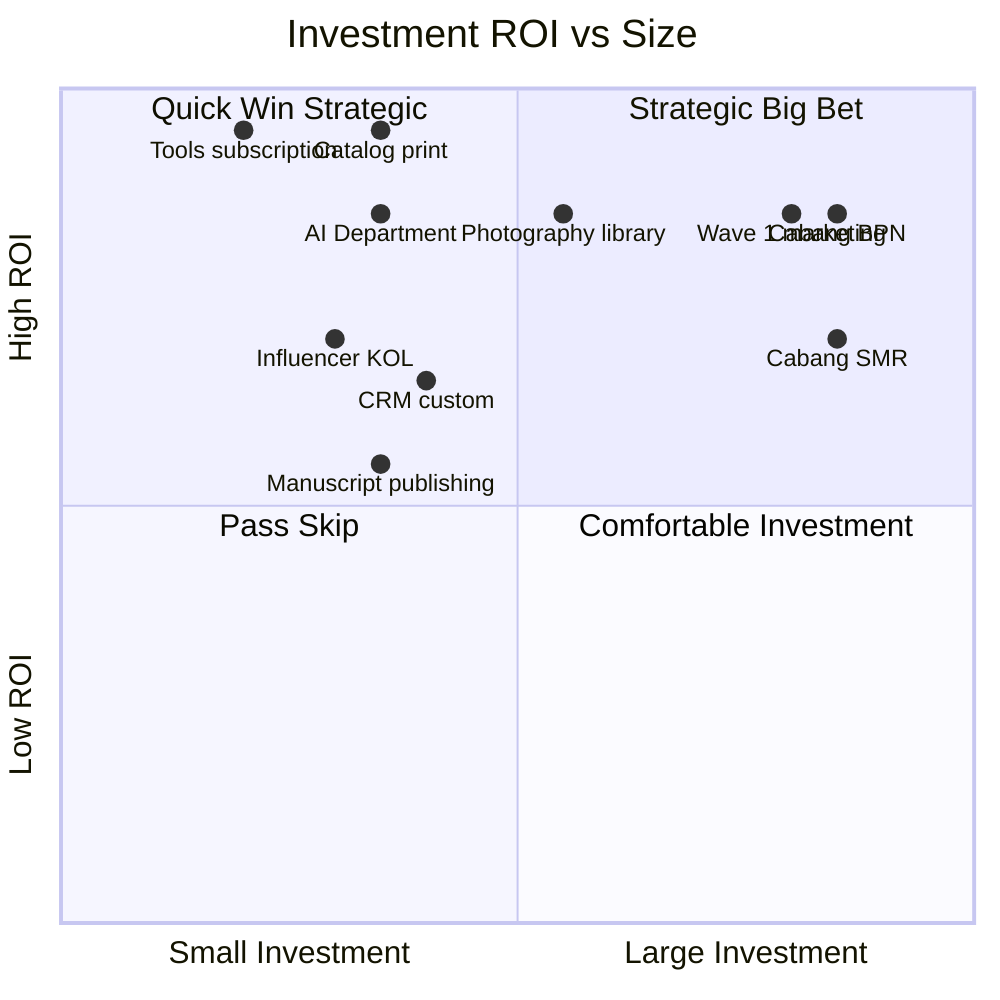
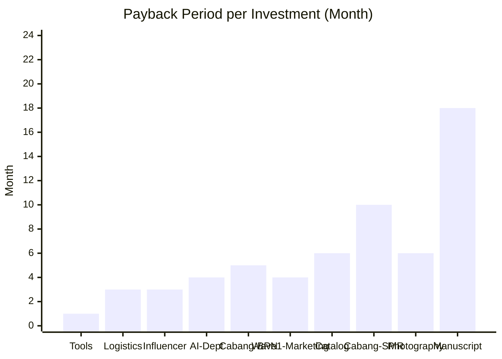
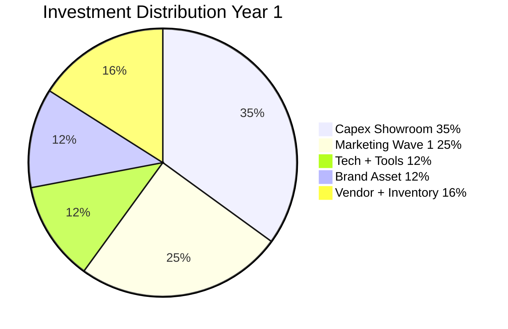

# Investment ROI Analysis

ROI analysis per investment Gerai 1000 Pintu: marketing campaign, cabang buildout, tech tools, vendor relationship, brand asset. Decision support untuk capital allocation.

## Triggers

Primary:
- "investment ROI"
- "return on investment"
- "ROI analysis"

Secondary:
- "investment evaluation"
- "payback period"

## Output Template

```markdown
# Investment ROI: {INVESTMENT NAME}

**Investment:** {Specific}
**Amount:** Rp {N}jt
**Category:** {Marketing / Capex / Tech / Brand / Vendor}
**Time horizon:** {Short 3-6 month / Medium 6-18 month / Long 18+ month}

## Investment Detail

### What we're investing in
{Specific description}

### Why this investment now
{Strategic rationale}

### Expected outcome
{Specific outcome measurable}

## ROI Calculation

### Investment cost
- Direct cost: Rp {N}jt
- Indirect cost (time + opportunity): Rp {N}jt
- Total investment: Rp {N}jt

### Expected return
- Revenue impact: Rp {N}jt over {period}
- Cost saving: Rp {N}jt over {period}
- Indirect benefit (brand, IP): qualitative

### ROI formula
ROI = (Total Return - Total Investment) / Total Investment × 100%

### Payback period
Payback = Total Investment / Average monthly return

### Calculation example
Investment Rp 50jt + Expected return Rp 200jt over 12 month
- Net return: Rp 150jt
- ROI: 300% over 12 month
- Payback: ~3 month

## Category-Specific ROI

### Category 1: Marketing Campaign

#### Wave 1 Launch Campaign
- Investment: Rp 200jt
- Expected: 30% awareness Balikpapan + 80+ konsultasi Q1
- Revenue impact: Rp 1M+ in Wave 1 + steady ops
- ROI: 400%+ over 12 month
- Payback: 3-4 month

#### 4-Dunia Educational Series Q1 2027
- Investment: Rp 60jt
- Expected: 50+ konsultasi addressable + brand authority
- Revenue: Rp 1.5M+ attributable Year 1-2
- ROI: 2400% (educational content compounds)
- Payback: 6 month

#### Architect Partnership Outreach
- Investment: Rp 30jt
- Expected: 3-5 architect MoU + 10+ project Year 1
- Revenue: Rp 500jt+
- ROI: 1500%+ Year 1
- Payback: 2-3 month

### Category 2: Capex / Showroom

#### Cabang Balikpapan Buildout
- Investment: Rp 250jt
- Expected: Cabang operational generating Rp 2.85M Year 1
- Margin contribution: Rp 910jt
- ROI Year 1: 260%
- Payback: 4-5 month

#### Cabang Samarinda Phase 2
- Investment: Rp 280jt
- Expected: Rp 1.5M Year 1 ramping
- Margin Year 1-2: Rp 480jt-960jt
- ROI: 170-250% Year 1-2
- Payback: 8-12 month

### Category 3: Tech + Tools

#### CRM Custom Build (Gerai Modul Retail)
- Investment: Rp 50jt
- Expected: Operational efficiency + customer data + lead tracking
- Quantifiable: -10% admin time = Rp 5jt/month saved
- Indirect: Better customer experience + decision data
- ROI: 100%+ Year 1 quantifiable, much more qualitative
- Payback: 10 month direct

#### AI Department Infrastructure
- Investment: Rp 30jt initial + Rp 5jt/month ongoing
- Expected: Door Expert capacity augmentation + decision support
- Quantifiable: Year 1 enable Door Expert +20 konsultasi capacity = Rp 100jt
- Indirect: Strategic decision quality + scalability
- ROI: 200%+ Year 1 quantifiable
- Payback: 4 month

#### Tools Subscription (Notion + Figma + Vercel + n8n)
- Investment: Rp 5jt/month
- Expected: Team productivity + customer experience + content production
- Quantifiable: Team productivity +20% = Rp 50jt/month value
- ROI: 900%+ ongoing
- Payback: <1 month

### Category 4: Brand Asset

#### Catalog Print 2027
- Investment: Rp 35jt (design + print 500 copy)
- Expected: Premium retail asset + Mitra + Arsitek + Press distribute
- Revenue attributable: 20-30 project Year 1-2 = Rp 600jt
- Indirect: Brand IP + positioning
- ROI: 1700%+ over 2 year
- Payback: 6 month

#### Photography Production Premium
- Investment: Rp 80jt (5-day shoot + post)
- Expected: Brand canon visual asset library (50+ photo)
- Asset reuse: catalog + social + web + press 2-3 year
- ROI: 500%+ multi-year asset reuse
- Payback: 6 month

#### Manuscript "Pintu Berbicara" Publishing
- Investment: Rp 40jt (editing + print + distribution)
- Expected: Press + thought leadership + IP
- Revenue attributable: hard to quantify direct
- Indirect: Brand authority + speaker fee + reference
- ROI: long-term IP value (Phase 3+ realize)

### Category 5: Vendor Investment

#### AMK Premium Contract Year 1
- Investment: Rp 500jt initial purchase + relationship cultivation
- Expected: Anchor product line + brand differentiation
- Revenue: Rp 2M+ direct sale
- ROI: 300%+ via product margin
- Payback: 6 month

#### Logistics Partnership Setup
- Investment: Rp 20jt vendor onboarding
- Expected: Reliable Jakarta-Balikpapan + 24-48h delivery
- Saving: Rp 100jt/year via efficient logistics
- ROI: 500% Year 1
- Payback: 3 month

## ROI Decision Framework

### Quick ROI Filter
| Investment Size | Min ROI Required | Decision Speed |
|---|---|---|
| <Rp 5jt | 50% | Functional manager |
| Rp 5-25jt | 100% | CFO + functional |
| Rp 25-50jt | 150% | CFO + Matthew |
| >Rp 50jt | 200%+ | Matthew direct |

### Investment Priority Matrix

| Priority | Criteria |
|---|---|
| **Critical** | Phase transition (Cabang, hire Door Expert) |
| **High** | Strategic (anchor vendor, brand asset) |
| **Medium** | Operational (tools, efficiency) |
| **Low** | Opportunistic (experiment, optional) |

### Anti-pattern
- ❌ Pure ROI maximize (sacrifice quality/canon)
- ❌ ROI hardcode for soft value (brand IP, culture)
- ❌ Short-term ROI only (sacrifice long-term)
- ❌ Skip ROI for "we feel like it"

### Embrace
- ✅ Quantitative + qualitative balance
- ✅ Multi-year horizon (some investment 18+ month)
- ✅ Strategic value weighted
- ✅ Premium curated standard maintained

## ROI Tracking Cadence

### Per investment
- Pre-investment: ROI projection documented
- Quarterly: Actual vs projected
- Annual: Full ROI review

### Portfolio
- Quarterly: Top-down portfolio review
- Reallocate underperforming
- Double-down on outperforming

### Anti-portfolio (decision criteria for stop)
- ROI sustained below target 2 quarter
- Strategic relevance fading
- Better alternative emerged
- Quality / canon impact

## Sample Investment Decisions

### Decision A: Influencer KOL Major Q1 2027
- Investment: Rp 25jt influencer
- Expected: 20+ konsultasi inquiry + brand mention
- ROI projected: 150-300%
- Decision: APPROVE (CFO + CMO + Matthew)
- Track: Weekly performance per influencer-vetting

### Decision B: Photography Library Refresh Q2 2027
- Investment: Rp 80jt new shoot
- Expected: Asset library for 2-year use
- ROI projected: 400-600% multi-year
- Decision: APPROVE (CFO + CCO)
- Track: Asset usage per quarter

### Decision C: Custom POS Software
- Investment: Rp 100jt custom build vs Rp 30jt Moka/Olsera SaaS
- Expected: Custom flexibility vs proven SaaS
- ROI custom: 150% over 3 year
- ROI SaaS: 300% over 3 year
- Decision: SaaS chosen (better ROI + lower risk)

## Investment Communication

### Internal
- ROI documented every >Rp 25jt
- Quarterly review + adjustment

### Stakeholder (Matthew + senior)
- Investment proposal: 1-page brief
- ROI + Risk + Strategic fit
- Recommendation clear

### Vendor / Partner
- Mutual benefit articulated
- Long-term relationship signal

## Brand Canon Compliance

- Investment proposal: factual + clear
- ROI analysis: transparent + honest
- No aggressive growth language
- Premium curated standard preserved
```

## Visual Output

ROI vs investment size:



Payback period:



Category investment distribution Year 1:



## Knowledge Dependency

- budget-planning + capex-planning + cost-structure
- All function investment input
- Matthew priorities
- vision-roadmap (Phase alignment)

## Mode

Default: EXECUTION (ROI analysis)
Switch: DISCUSSION jika strategic investment debate

## Tools Required

- file-search
- artifacts (quadrant + chart + pie)

## Validation Criteria

- ROI formula + payback period
- Per category breakdown (5 category)
- Decision framework + size threshold
- Investment priority matrix
- Sample decision case
- Tracking cadence
- Anti-pattern + embrace
- Communication standard

## Sample I/O

**Input:** "Investment ROI analysis Year 1 portfolio + Wave 1 launch decision"

**Output summary:**
- Year 1 total investment: ~Rp 1.5M (Capex Rp 330jt + Marketing Rp 570jt + Tech Rp 80jt + Brand Rp 120jt + Vendor+Inventory Rp 400jt)
- Top ROI: Tools subscription 900% + Logistics 500% + Influencer 150-300% + AI Department 200%+
- Strategic: Cabang BPN 260% Year 1 + Wave 1 Marketing 400%+ + Catalog Print 1700% multi-year
- Photography library: 500%+ multi-year reuse asset
- Manuscript: Long-term IP (hard quantify, strategic high)
- Decision threshold: <Rp 25jt CFO+functional, Rp 25-50jt CFO+Matthew note, >Rp 50jt Matthew direct
- Min ROI: 50% small, 100% medium, 150% large, 200%+ major
- All Year 1 investment ROI-positive ✓
- Quadrant + payback bar + distribution pie embedded

## Handoff

- budget-planning + capex-planning (paired)
- cost-structure (input)
- All function (investment context)
- Matthew (approval >Rp 50jt)
