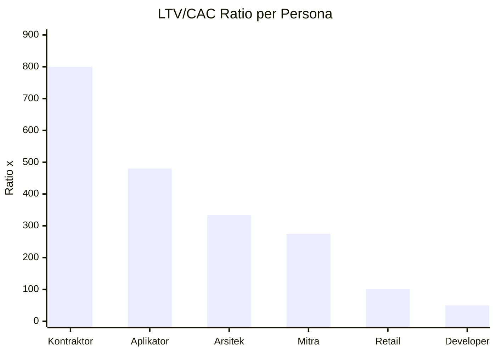
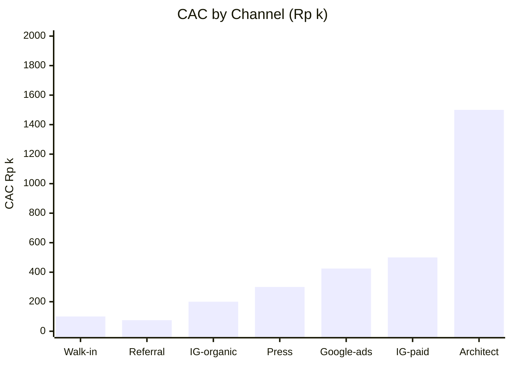
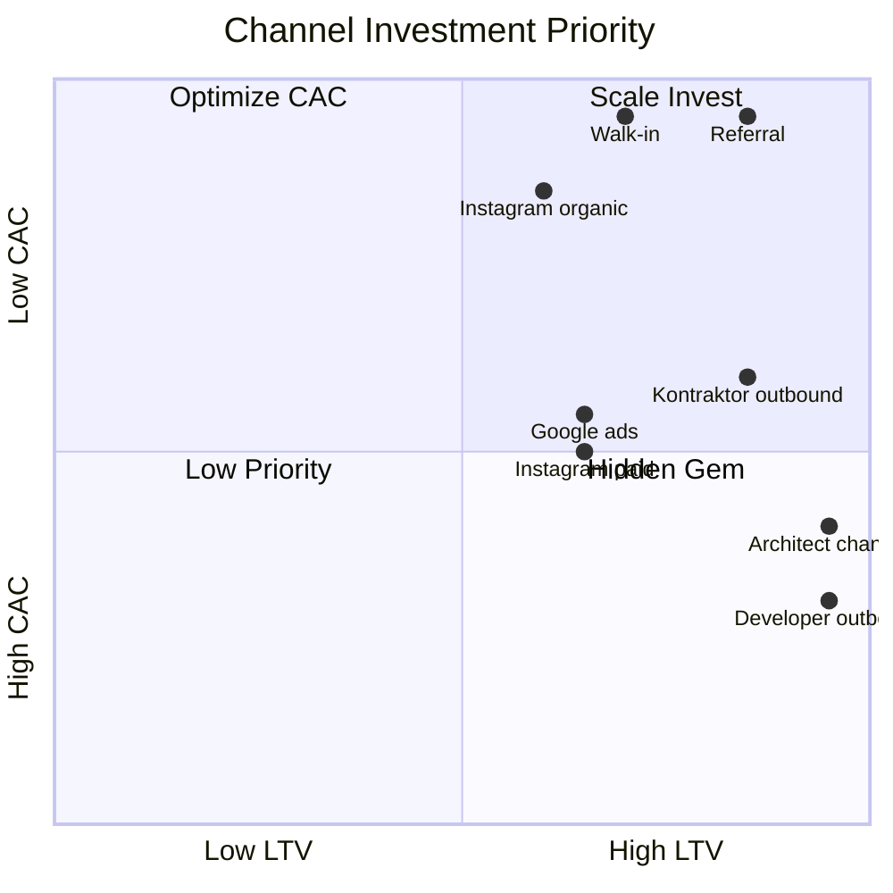

# LTV CAC Analysis

Deep dive Customer Lifetime Value (LTV) vs Customer Acquisition Cost (CAC) Gerai 1000 Pintu. Per persona, per channel, optimization.

## Triggers

Primary:
- "LTV CAC"
- "customer lifetime value"
- "acquisition cost"

Secondary:
- "CLV analysis"
- "customer profitability"

## Output Template

```markdown
# LTV CAC Analysis: {SCOPE}

**Scope:** {Per persona / Per channel / Overall}
**Period:** {Year 1 / Year 2 / Steady-state}

## Customer Lifetime Value (LTV) Calculation

### LTV Components
1. **Initial transaction value:** First order AOV
2. **Repeat transaction:** Multi-order within lifetime
3. **Referral contribution:** Revenue from referred customers
4. **Aftersales revenue:** Maintenance, additional purchase

### LTV Formula
LTV = (AOV × Repeat factor) + (Referral factor × AOV referred) + (Aftersales annual × Years)

### LTV per Persona

#### Retail Persona LTV
- AOV: Rp 30jt
- Repeat probability within 2 year: 20%
- Repeat value: Rp 30jt × 20% = Rp 6jt expected
- Referral probability: 30% → 1 referral on average per 3 customer
- Referral value: Rp 30jt × 30% = Rp 9jt expected
- Aftersales: Rp 2jt/year × 3 year = Rp 6jt
- **Total LTV: Rp 51jt**

#### Mitra Dagang LTV
- AOV per transaction: Rp 40jt
- Frequency: 4-6x per year sustained
- Multi-year relationship: 5 year average
- Total transactions over lifetime: 25
- **Total LTV: Rp 250-300jt**

#### Developer LTV
- Project AOV: Rp 150jt
- Multi-project relationship: 2-3 project over lifetime
- Aftersales: Rp 10jt total
- **Total LTV: Rp 350-450jt per developer**

#### Arsitek LTV
- Per project AOV: Rp 50jt (multi-project)
- Architect refers 5-10 client/year over relationship
- Lifetime project count: 20+ over 5 year
- **Total LTV: Rp 1M+ per architect (network effect)**

#### Kontraktor LTV
- Per project AOV: Rp 80jt
- Sustained relationship: 5+ project/year × 3 year
- **Total LTV: Rp 1.2M+ per kontraktor**

#### Aplikator LTV
- Per transaction: Rp 5jt
- Frequency: 6-10x per year (small order + referral)
- Multi-year: 3 year average
- **Total LTV: Rp 90-150jt per aplikator**

## Customer Acquisition Cost (CAC) Calculation

### CAC Components
1. Marketing cost direct (campaign + ads)
2. Marketing tools + people
3. Sales effort (MA time + Door Expert)
4. Channel-specific cost

### CAC per Channel

#### Instagram organic
- CAC: Rp 150-250k
- Quality: High (engaged audience)
- Volume: Limited (organic reach)

#### Instagram paid + Meta ads
- CAC: Rp 400-600k
- Quality: Medium-high
- Volume: Scalable

#### Google search ads
- CAC: Rp 350-500k
- Quality: High intent
- Volume: Limited by search volume

#### Word-of-mouth referral
- CAC: Rp 50-100k (referral incentive)
- Quality: Highest
- Volume: Network-driven (compounds)

#### Architect / Designer referral
- CAC: Rp 500k-1jt (commission + relationship cultivation)
- Quality: Highest (warm intro)
- Volume: Compounding

#### Press / Editorial
- CAC: Rp 200-400k (averaged over coverage)
- Quality: Brand-aware customer
- Volume: Periodic

#### Walk-in organic (showroom)
- CAC: Rp 50-150k (showroom cost amortized)
- Quality: High intent (proximity)
- Volume: Limited geography

### CAC per Persona

#### Retail
- Channel mix: Instagram + Google + walk-in + referral
- Blended CAC: Rp 500k

#### Mitra Dagang
- Channel: Direct outreach + relationship cultivation
- CAC: Rp 1jt per acquisition (high-touch)

#### Developer
- Channel: Outbound + relationship + showcase
- CAC: Rp 5-10jt per acquisition (long sales cycle)

#### Arsitek
- Channel: Relationship + collateral + presentation
- CAC: Rp 2-3jt per architect (compounds via projects)

#### Kontraktor
- Channel: Industry network + direct outreach
- CAC: Rp 1-2jt

#### Aplikator
- Channel: Existing network referral
- CAC: Rp 200-300k

## LTV / CAC Ratio

### Persona Ranking
| Persona | LTV | CAC | Ratio |
|---|---|---|---|
| Arsitek | Rp 1M+ | Rp 3jt | 333x |
| Kontraktor | Rp 1.2M | Rp 1.5jt | 800x |
| Developer | Rp 400jt | Rp 8jt | 50x |
| Mitra Dagang | Rp 275jt | Rp 1jt | 275x |
| Retail | Rp 51jt | Rp 500k | 102x |
| Aplikator | Rp 120jt | Rp 250k | 480x |

### Industry benchmark
- Healthy: 3x+
- Excellent: 10x+
- Premium curated retail: 50-100x typical

### Gerai 1000 Pintu: Significantly above benchmark all persona ✓

## Payback Period

### Time to recoup CAC
| Persona | Payback (month) |
|---|---|
| Retail (single order Rp 30jt × 32% margin = Rp 9.6jt vs Rp 500k CAC) | Immediate |
| Mitra (Rp 40jt × 28% = Rp 11.2jt vs Rp 1jt CAC) | First transaction |
| Developer | First project |
| Arsitek | First project (after 6 month relationship build) |
| Kontraktor | First project (1-2 month) |
| Aplikator | First transaction |

### All persona payback within first transaction = Very healthy

## Optimization Opportunity

### Increase LTV
- **Aftersales subscription program** (Phase 2+): +Rp 5-10jt LTV per Retail
- **Referral incentive program** (Phase 1): +30% referral rate
- **Mitra Dagang sustained partnership** (Phase 2): +Rp 100jt per Mitra
- **Architect MoU formal** (Phase 2): +5-10 projects per architect

### Reduce CAC
- **Brand awareness organic** (Phase 2): reduces paid acquisition need
- **Referral incentive** (Phase 1+): low-cost high-quality acquisition
- **Architect channel scale** (Phase 2): warm intro reduces sales cycle
- **Showroom efficiency** (continuous): walk-in conversion higher

### Anti-pattern (jangan)
- ❌ Cut Door Expert quality to reduce CAC (compromises LTV)
- ❌ Mass-market discount (dilutes premium curated positioning)
- ❌ Aggressive remarketing ads (brand canon violation)

## LTV CAC Tracking Cadence

### Monthly
- Per channel CAC update
- Conversion rate by channel

### Quarterly
- Per persona LTV refresh
- Channel mix optimization

### Annually
- Full LTV CAC recalculation
- Strategic channel investment

## Cohort Analysis

### Customer Cohort by Quarter
| Cohort | Initial Customer | 6-Month LTV | 12-Month LTV | Repeat Rate |
|---|---|---|---|---|
| Q4 2026 | 25 | Rp 32jt | Rp 35jt | 12% |
| Q1 2027 | 35 | Rp 33jt | TBD | TBD |
| Q2 2027 | 50 | Rp 34jt | TBD | TBD |

### Cohort insight
- Each cohort improves LTV (network effect + brand maturity)
- Repeat rate growing
- Referral compounding

## Strategic Implication

### Investment priority
- **Architect channel:** Highest LTV/CAC ratio + compounding = scale invest
- **Kontraktor:** Operational scale + relationship invest
- **Retail:** Volume + brand foundation = sustain marketing
- **Mitra Dagang:** Phase 2 program formal

### Strategic decision
- LTV CAC strongly support Phase 2 expansion (numbers work)
- Phase 3 Jawa: confidence high (model validated)
- Aftersales program: invest Phase 2+ (LTV uplift)

## Brand Canon Compliance

- Analysis: factual + clear
- Customer dignity preserved (not just numbers)
- Premium hangat tone in communication
```

## Visual Output

LTV/CAC ratio per persona:



CAC by channel:



Investment priority matrix:



## Knowledge Dependency

- unit-economics-model (paired)
- CMO channel-strategy
- CMO funnel-analysis
- 6 Persona spec
- All customer cohort data

## Mode

Default: EXECUTION
Switch: DISCUSSION jika investment priority debate

## Tools Required

- file-search
- artifacts (chart + quadrant)

## Validation Criteria

- LTV formula + components
- LTV per persona detail
- CAC per channel
- CAC per persona blended
- LTV/CAC ratio + benchmark
- Payback period per persona
- Optimization opportunity (LTV + CAC)
- Cohort analysis
- Strategic implication
- Brand canon compliance

## Sample I/O

**Input:** "LTV CAC analysis full Year 1 + strategic implication"

**Output summary:**
- LTV: Retail Rp 51jt + Mitra Rp 275jt + Developer Rp 400jt + Arsitek Rp 1M+ + Kontraktor Rp 1.2M + Aplikator Rp 120jt
- CAC: Walk-in Rp 100k + Referral Rp 75k + IG paid Rp 500k + Architect Rp 1.5jt
- Ratio: Kontraktor 800x + Aplikator 480x + Arsitek 333x + Mitra 275x + Retail 102x + Developer 50x
- Payback: All persona < first transaction (extremely healthy)
- Industry benchmark exceeded: 50-100x+ premium curated retail standard
- Optimization: Aftersales subscription (+LTV) + Referral program (+conversion) + Architect MoU (+channel)
- Strategic priority: Architect channel (compounds) + Kontraktor (scale) + Retail (volume foundation)
- Phase 2 confidence: HIGH (LTV CAC model validates expansion)
- Bar chart + investment matrix embedded

## Handoff

- unit-economics-model (paired)
- CMO channel-strategy (channel optimization)
- pricing-strategy (input for pricing)
- vision-roadmap (Phase strategy)
- Matthew (strategic decision)
