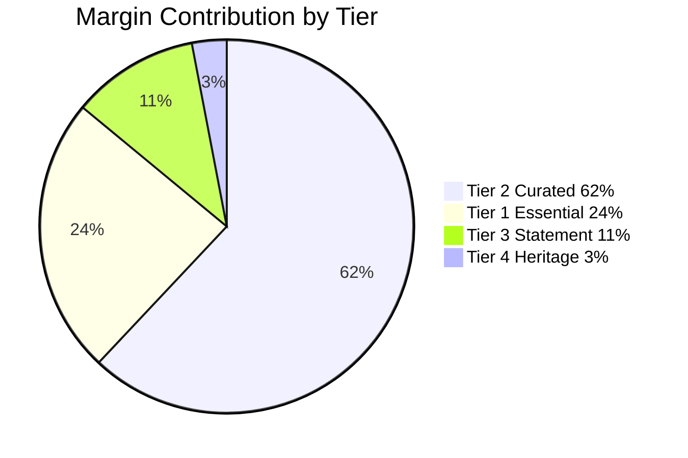
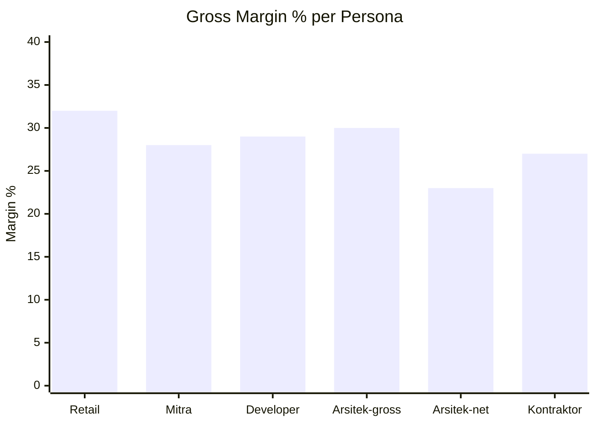
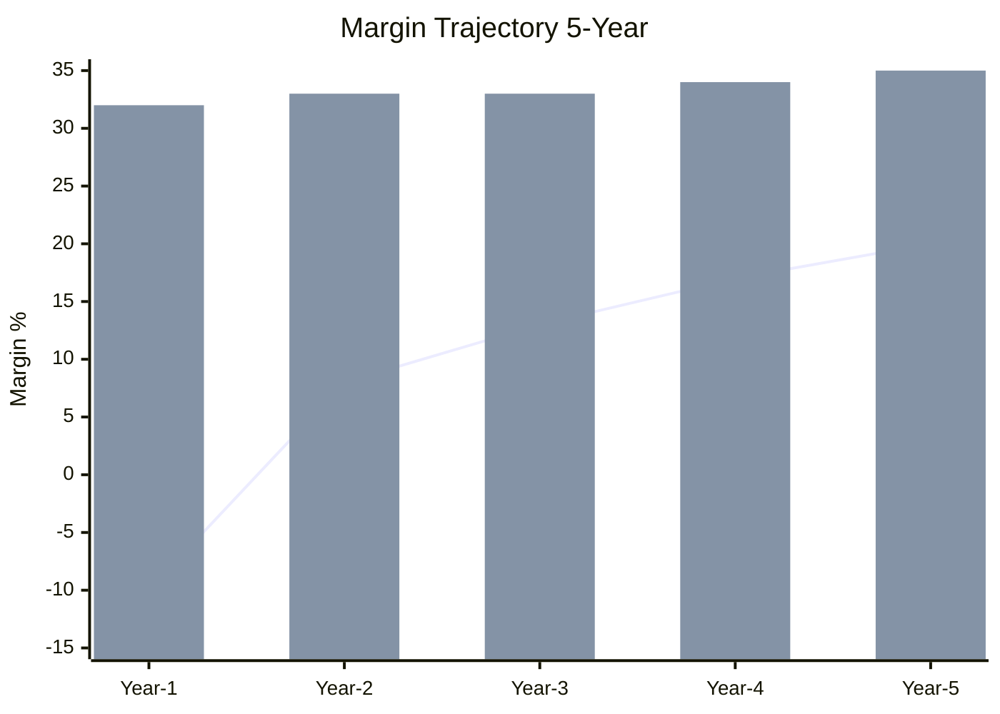

# Margin Analysis

Margin analysis Gerai 1000 Pintu: per product, per persona, per cabang, per channel. Identify margin pressure + opportunity, protect premium curated standard.

## Triggers

Primary:
- "margin analysis"
- "margin breakdown"
- "profit margin"

Secondary:
- "margin per category"
- "margin trend"

## Output Template

```markdown
# Margin Analysis: {SCOPE}

**Period:** {Date range}
**Scope:** {Per product / persona / cabang / channel / overall}

## Overall Margin Summary

### Year 1 Margin Snapshot
| Metric | Actual | Target | Status |
|---|---|---|---|
| Gross margin | {%} | 30%+ | 🟢/🟡/🔴 |
| Contribution margin | {%} | 25%+ | - |
| EBITDA margin |  | -10 to 0 Year 1 | - |

### Trend
- Quarter-over-quarter: {direction}
- Year-over-year: {projected}
- Vs industry: {assessment}

## Margin per Product Tier

### Tier 1: Essential Premium
- Price: Rp 10-20jt avg
- COGS: Rp 7-14jt
- Gross margin: 30-32%
- Volume contribution: 25% revenue
- Margin contribution: 25% × 31% = 7.75 pts to blended margin

### Tier 2: Curated Premium (Primary)
- Price: Rp 20-40jt avg (Rp 30jt midpoint)
- COGS: Rp 20jt
- Gross margin: 33%
- Volume contribution: 60% revenue
- Margin contribution: 60% × 33% = 19.8 pts

### Tier 3: Statement Premium
- Price: Rp 40-80jt
- COGS: Rp 28-56jt
- Gross margin: 30%
- Volume contribution: 12% revenue
- Margin contribution: 12% × 30% = 3.6 pts

### Tier 4: Heritage Bespoke
- Price: Rp 80jt+
- COGS: variable
- Gross margin: 35%+
- Volume contribution: 3% revenue
- Margin contribution: 3% × 35% = 1.05 pts

### Blended Gross Margin
Tier 1 + Tier 2 + Tier 3 + Tier 4 = 7.75 + 19.8 + 3.6 + 1.05 = **~32% blended** ✓

## Margin per Filosofi Archetype

### Jepang Archetype
- Avg price: Rp 25jt
- COGS: Rp 17jt
- Margin: 32%
- Most popular tier (Year 1 customer choice)

### Eropa Archetype
- Avg price: Rp 35jt
- COGS: Rp 24jt
- Margin: 31%
- Higher craftsmanship cost

### Amerika Archetype
- Avg price: Rp 40jt
- COGS: Rp 28jt
- Margin: 30%
- Statement scale cost

### China Archetype
- Avg price: Rp 28jt
- COGS: Rp 19jt
- Margin: 32%

## Margin per Persona

### Retail
- AOV: Rp 30jt
- Margin: 32%
- Margin amount: Rp 9.6jt per order
- Volume: 50% revenue

### Mitra Dagang
- AOV: Rp 40jt (with volume discount)
- Margin: 28% (after wholesale discount)
- Margin amount: Rp 11.2jt
- Volume: 20% revenue

### Developer
- AOV per project: Rp 150jt
- Margin: 28-30% (bulk + project discount)
- Margin amount: Rp 45jt per project
- Volume: 15% revenue (3-5 project/year)

### Arsitek
- AOV: Rp 50jt
- Margin: 30% before architect commission
- Net to Gerai after commission: 22-25%
- Volume: 10% revenue

### Kontraktor
- AOV: Rp 80jt
- Margin: 27% (bulk discount)
- Margin amount: Rp 21.6jt
- Volume: 5% revenue

## Margin per Channel

### Walk-in (Showroom)
- Margin: Full retail (32%)
- Cost to acquire: low (showroom amortized)
- Best margin channel ✓

### Konsultasi (booking via web/WA)
- Margin: Full retail (32%)
- Cost: marketing + booking system
- High margin

### Architect referral
- Margin: 32% gross → 22-25% net (after commission 5-10%)
- Quality customer (high LTV)

### Mitra Dagang
- Margin: 28% (wholesale tier)
- Volume compensates lower margin

### Direct outbound
- Margin: 30% (small discount for sustained)
- Higher CAC

## Margin Pressure Points

### Vendor Cost Pressure
- AMK Premium price increase risk
- Mitigation: Annual contract + volume commitment + multi-vendor

### Logistics Cost Pressure
- Fuel + freight inflation
- Mitigation: Multi-carrier + volume buffer

### Currency Pressure (kalau impor)
- Rupiah weakness vs major currency
- Mitigation: Domestic-first sourcing + currency hedge kalau perlu

### Marketing Cost Pressure
- Customer acquisition cost rising trend
- Mitigation: Brand awareness organic (channel mix shift)

### Discount Pressure
- Customer + Mitra discount requests
- Mitigation: Volume tier structured + value communication

## Margin Optimization Opportunity

### Quick Win (3-6 month)
| Opportunity | Impact | Action |
|---|---|---|
| Mix shift Tier 2 prioritize | +2% blended | Marketing emphasis Tier 2 |
| Volume discount discipline | +1-2% | Manager training |
| Vendor negotiation | +1% | Annual review |

### Strategic (6-18 month)
| Opportunity | Impact | Action |
|---|---|---|
| Aftersales subscription | +3-5% LTV | Phase 2 program |
| Premium service tier | +2-3% | Phase 2 launch |
| Operational efficiency | +1-2% | Process audit |
| Phase 2 scale benefit | +2-3% | Multi-cabang shared services |

### Anti-pattern (jangan)
- ❌ Cut COGS via lower quality (compromises curation)
- ❌ Aggressive discount (race to bottom)
- ❌ Squeeze vendor unfairly (long-term relationship)
- ❌ Cut service quality (NPS impact)

## Margin Protection Principles

### Principle 1: Premium Curated First
Margin discipline supports premium positioning. Don't compromise quality for margin.

### Principle 2: Value, Not Discount
Communicate value (Door Expert + Filosofi 4-Dunia). Don't discount as default.

### Principle 3: Sustainable Vendor Relationship
Negotiate fair, but maintain long-term partnership. AMK Premium especially.

### Principle 4: Volume + Mix Optimization
Drive volume to highest-margin tier (Tier 2). Don't over-rely on discount-driven volume.

## Year-over-Year Margin Trajectory

### Year 1 (Foundation)
- Gross margin: 32% (target)
- OpEx high relative to revenue (foundation investment)
- Net margin: -10% to 0%

### Year 2 (Validation)
- Gross margin: 32-33% (stable)
- OpEx ratio improving (revenue scale)
- Net margin: 5-10%

### Year 3 (Profit)
- Gross margin: 33% (premium tier mix improve)
- OpEx ratio efficient
- Net margin: 10-15%

### Year 5 (Mature)
- Gross margin: 33-35% (Tier 4 contribution grows)
- OpEx ratio steady-state
- Net margin: 15-20%

## Brand Canon Compliance

- Margin analysis: factual + clear
- "Premium curated standard" emphasis
- Quality > short-term margin (preserve)
- 5 Nilai applied (especially Inovasi + Pelayanan Nyaman)
```

## Visual Output

Blended margin breakdown:



Margin per persona:



Margin trajectory 5-year:



## Knowledge Dependency

- cost-structure (paired)
- pricing-strategy (paired)
- unit-economics-model
- revenue-forecast
- COO vendor cost

## Mode

Default: EXECUTION
Switch: DISCUSSION jika margin pressure debate

## Tools Required

- file-search
- artifacts (pie + chart)

## Validation Criteria

- Overall margin summary vs target
- Per product tier margin
- Per Filosofi archetype margin
- Per persona margin
- Per channel margin
- Pressure point identification
- Optimization opportunity
- Anti-pattern + protection principles
- Multi-year trajectory

## Sample I/O

**Input:** "Margin analysis Year 1 full + optimization opportunity"

**Output summary:**
- Year 1 blended gross margin: 32% (target 30%+ achieved)
- Tier contribution: Tier 2 Curated 62% (driver) + Tier 1 24% + Tier 3 11% + Tier 4 3%
- Archetype: Jepang + China 32% (highest) + Eropa 31% + Amerika 30%
- Persona: Mitra Rp 11.2jt absolute (highest per transaction) + Retail Rp 9.6jt (most volume)
- Channel: Walk-in + Konsultasi 32% (best) + Mitra 28% (volume) + Arsitek 23% net (commission deducted)
- Pressure points: AMK price + logistics + discount + currency (kalau impor)
- Quick win: Mix shift Tier 2 (+2%) + volume discipline (+1-2%) + vendor negotiation (+1%)
- Strategic: Aftersales subscription (+3-5% LTV) + Premium service (+2-3%) + Phase 2 scale (+2-3%)
- Anti-pattern: No cut COGS quality + No aggressive discount + No squeeze vendor
- 5-year trajectory: Year 1 -10% net → Year 5 +20% net
- Tier pie + persona bar + trajectory embedded

## Handoff

- cost-structure (paired)
- pricing-strategy (paired)
- unit-economics-model (input)
- All function (optimization)
- Matthew (review)
