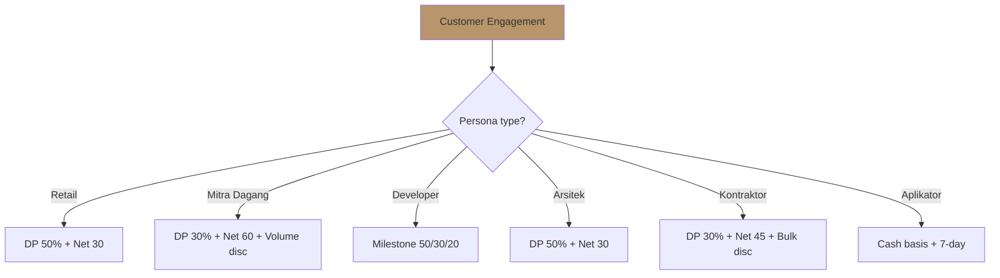
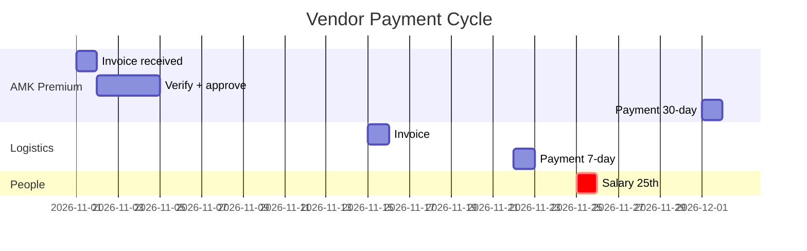

# Payment Terms Management

Manage payment terms Gerai 1000 Pintu: customer DP + invoice + collection, vendor payment cycle, balance cash flow + relationship.

## Triggers

Primary:
- "payment terms"
- "syarat pembayaran"
- "invoice payment"

Secondary:
- "DP customer"
- "vendor payment"

## Output Template

```markdown
# Payment Terms: {PROJECT / VENDOR / OVERVIEW}

**Type:** {Customer / Vendor / Standard policy}
**Counterparty:** {Name}
**Amount:** Rp {N}

## Customer Payment Terms

### Standard Terms (LOCKED)

#### Retail Persona
- DP 50% upon signed agreement
- 50% upon delivery + installation
- Term: 30-day final from delivery
- Penalty late payment: 1% per month

#### Mitra Dagang
- DP 30% upon PO
- 70% upon delivery
- Term: 60-day final
- Volume discount: 5-10% for sustained order

#### Developer / Project Bulk
- DP 50% upon contract signing
- 30% upon material arrival
- 20% upon final completion + handover
- Term: Net-30 each milestone

#### Arsitek Collaboration
- DP 50% upon agreement
- 50% upon delivery to client
- Term: Net-30
- Architect commission: separate arrangement

#### Kontraktor
- DP 30% upon PO
- 70% upon delivery batch
- Term: Net-45
- Bulk discount: 5-15% volume tier

#### Aplikator (Mitra Teknis)
- Cash basis (small transaction)
- Term: 7-day
- No DP requirement (low value)

### Payment Method
- Bank transfer (primary)
- Cash (small transactions, receipt)
- Credit card (kalau ada gateway)
- Check / giro (kalau corporate procurement standard)

### Invoice Standard
- Issued upon agreement signed
- Number format: GERAI-INV-{YYYY}-{NNNN}
- Includes: Item detail + tax + DP + term + bank info
- Brand canon compliance (premium hangat tone)

## Vendor Payment Terms

### Standard Terms

#### AMK Premium (Anchor Vendor)
- Term: 30-day from invoice
- Year 1 target negotiate: 45-day
- Long-term: 60-day kalau possible
- Reason: Long-term partnership, fair to anchor

#### Logistics
- Term: 7-day from delivery
- Reason: Working capital small, vendor relationship cycle

#### Tools / SaaS Subscription
- Term: Monthly auto-pay
- Annual prepay kalau discount 10%+ (kalau cash allows)

#### Showroom Rent
- Term: Monthly standing order
- Quarterly OK kalau landlord allow

#### Marketing Vendor
- Term: Net-30 standard
- Project-based: 50% upfront + 50% completion

#### People Salary
- Term: 25th of each month
- Bonus: Per QBR quarterly

#### Professional Service (Accountant, Legal)
- Term: Monthly retainer atau Net-15 per invoice

### Payment Workflow

#### Step 1: Invoice received
- Verify per PO + delivery confirmation
- COO + CFO approve

#### Step 2: Payment scheduled
- Per term schedule
- Cash flow planning

#### Step 3: Payment execute
- Bank transfer
- Confirm receipt

#### Step 4: Reconciliation
- Match payment with invoice
- Update accounting

## Discount Strategy

### Customer Early Payment Discount
- 2% discount for payment within 15-day from invoice
- Trade-off: cash acceleration vs 2% margin loss
- Decision: Apply if cash priority OR customer relationship benefit

### Vendor Early Payment Discount
- Take 2/10 net-30 kalau favorable (cost of capital <2% / 20 day → ~36% annualized return)
- Skip kalau cash tight

### Volume Discount (Customer)
- 5% for >Rp 100jt order
- 10% for >Rp 250jt order
- 15% for Mitra Dagang sustained
- Manager approval required

### Volume Discount (Vendor)
- Negotiate for bulk PO
- Trade-off: inventory carrying cost vs unit price
- Decision: per scenario

## Late Payment Policy

### Customer Late Payment
- Day 1-7 overdue: friendly reminder WhatsApp (premium hangat)
- Day 8-14: phone call follow-up
- Day 15-30: formal letter
- Day 31+: collection action (mediation first)
- Penalty: 1% per month overdue

### Bad debt write-off
- After 180-day overdue + collection action failed
- Document for tax deduction
- Customer relationship review

### Customer-side flexibility
- Hardship case: extend term (case-by-case)
- Premium hangat tone (relationship preserve)
- Repayment plan negotiable

## Documentation Standard

### Per customer contract
- Payment terms explicit
- Penalty clause
- Dispute resolution
- Cancellation policy
- Refund policy

### Per vendor contract
- Payment terms explicit
- QC + acceptance clause
- Penalty clause (delay)
- Termination clause
- Confidentiality

## Anti-Pattern

### Avoid
- ❌ Unclear payment terms (ambiguity → dispute)
- ❌ No DP for major project (cash risk)
- ❌ Aggressive collection (premium hangat brand damage)
- ❌ Hidden fee or charge
- ❌ Inconsistent terms per customer (fairness)

### Embrace
- ✅ Crystal clear terms documented
- ✅ DP discipline for major project
- ✅ Premium hangat collection tone
- ✅ Transparent fee structure
- ✅ Consistent + fair policy

## Brand Canon Compliance

- Invoice copy: factual + warm + brand canon
- Late payment communication: premium hangat (not aggressive)
- "Gerai 1000 Pintu" lengkap formal documents
- No em-dash
- Customer dignity preserved at all times
```

## Visual Output

Payment terms by persona:



Vendor payment cycle:



## Knowledge Dependency

- cash-flow-management (paired)
- working-capital (paired)
- CRM customer terms
- COO vendor-onboarding
- Legal contract template

## Mode

Default: EXECUTION
Switch: NEED_CLARIFICATION jika dispute

## Tools Required

- file-search
- artifacts (flow + Gantt)

## Validation Criteria

- Customer terms per 6 persona
- Vendor terms per category
- Payment workflow
- Discount strategy (customer + vendor)
- Late payment policy
- Documentation standard
- Anti-pattern explicit
- Brand canon compliance

## Sample I/O

**Input:** "Payment terms standard policy Year 1 Gerai 1000 Pintu"

**Output summary:**
- Customer: Retail DP 50% Net-30, Mitra DP 30% Net-60, Developer milestone 50/30/20, Aplikator cash 7-day
- Vendor: AMK 30-day (target 45-day Year 2), Logistics 7-day, People 25th, Tools monthly auto
- Discount: 2% early payment customer + 5-15% volume + AMK take 2/10 net-30 if favorable
- Late payment: 1% per month penalty + premium hangat collection tone
- Bad debt: 1% provision Year 1
- Payment method: Bank transfer primary + cash small
- Invoice format: GERAI-INV-{YYYY}-{NNNN}
- Brand canon: Premium hangat tone all communication
- Persona flow + vendor Gantt embedded

## Handoff

- cash-flow-management (paired)
- working-capital (paired)
- COO vendor-onboarding (vendor side)
- CRM (customer side)
- Legal counsel (contract review)
