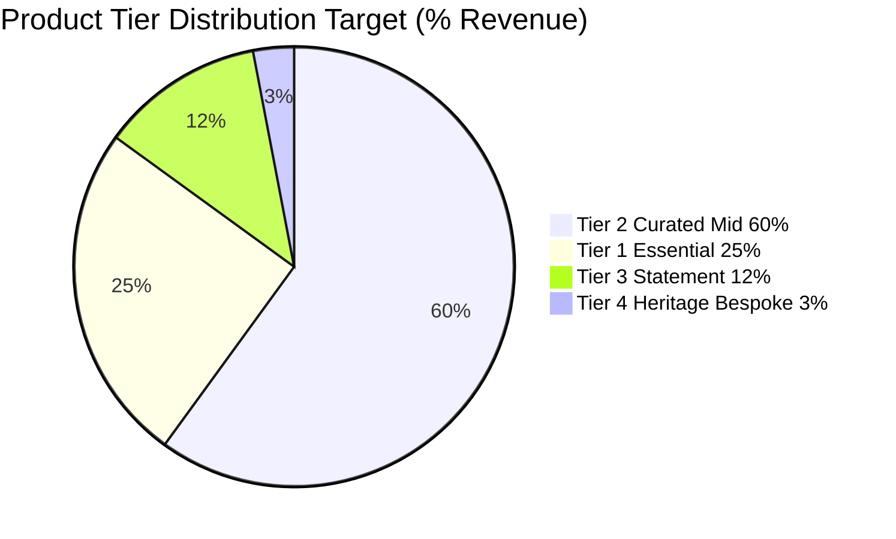
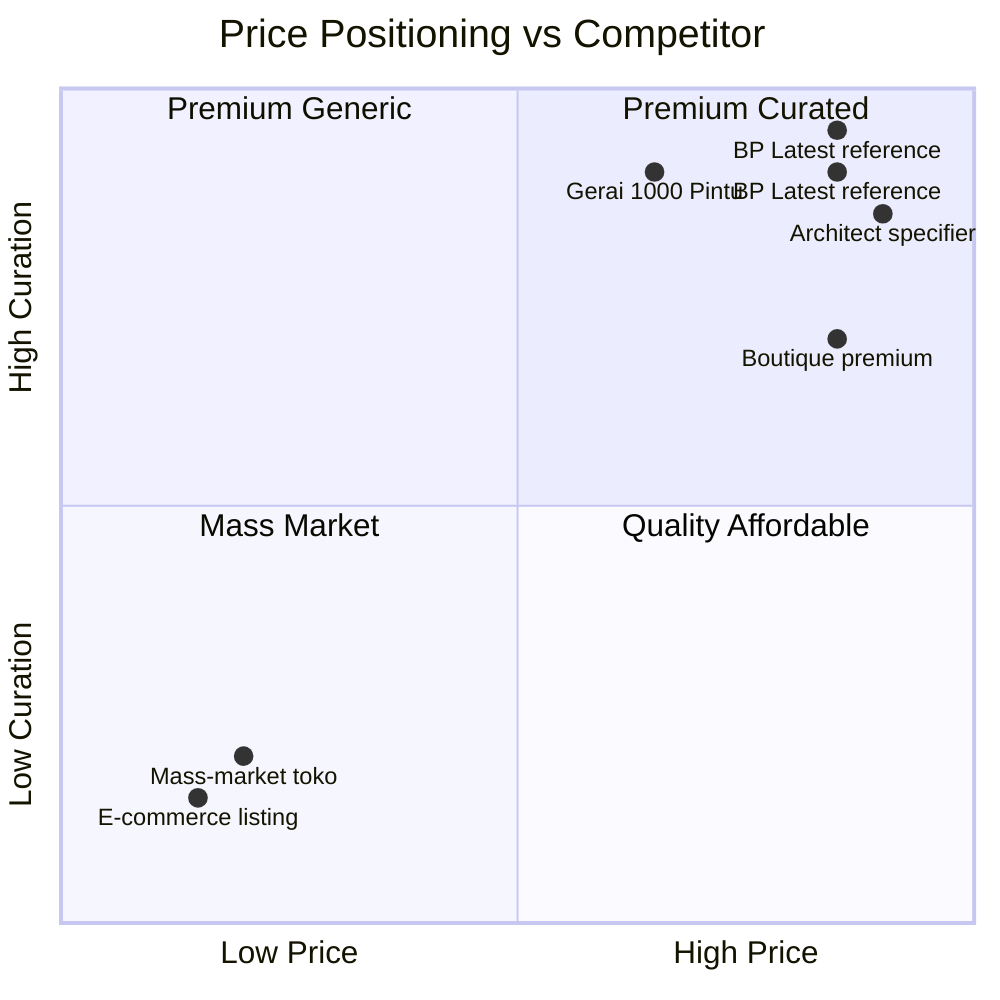
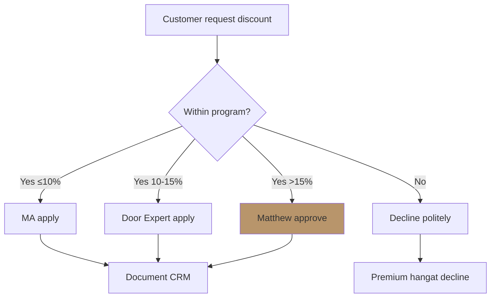

# Pricing Strategy

Pricing strategy Gerai 1000 Pintu: tier per product, persona-specific, premium tetapi inklusif positioning, dynamic adjustment.

## Triggers

Primary:
- "pricing strategy"
- "harga produk"
- "pricing tier"

Secondary:
- "price positioning"
- "discount structure"

## Output Template

```markdown
# Pricing Strategy: {PRODUCT / SEGMENT}

**Category:** {Product line / Persona / Cabang}
**Period:** {Year 1 / Year 2 / Steady-state}
**Anchor:** BP Latest reference premium tetapi inklusif positioning

## Pricing Principles (LOCKED)

### Principle 1: Premium Curated Position
- Price reflect quality + curation + service
- NOT cheapest in market (race-to-bottom rejected)
- NOT most expensive (accessible premium, not luxury exclusive)
- Target: Top 25-35% market price tier

### Principle 2: Transparent + Fair
- Price published (no hidden fee)
- Same price across persona kalau possible
- Discount structured (volume, partnership) — not negotiable per customer
- No price surprise customer

### Principle 3: Value-Based, Not Cost-Plus
- Anchor: customer outcome + experience value
- Not just markup over cost
- Premium hangat service included
- Filosofi Dunia Pintu framework value

### Principle 4: Sustained Margin
- Gross margin 30%+ minimum
- Premium tier 35%+ target
- No undercut for short-term volume

## Product Tier Structure

### Tier 1: Essential Premium (Entry)
- **Range:** Rp 10-20jt per pintu
- **Description:** Quality entry-level untuk Retail persona
- **Margin:** 32-35%
- **Volume:** High (foundation customer base)
- **Examples:** AMK Premium standard archetype

### Tier 2: Curated Premium (Mid)
- **Range:** Rp 20-40jt per pintu
- **Description:** Filosofi Dunia Pintu (4-negara cultural context) primary range
- **Margin:** 30-32%
- **Volume:** Highest revenue contribution
- **Examples:** Hand-finished detail + brass hardware premium

### Tier 3: Statement Premium (High)
- **Range:** Rp 40-80jt per pintu
- **Description:** Custom + heritage piece + dramatic scale
- **Margin:** 28-30%
- **Volume:** Lower volume, higher value
- **Examples:** Custom Eropa craftsmanship + Amerika dramatic

### Tier 4: Heritage Bespoke (Phase 2+)
- **Range:** Rp 80jt+ per pintu
- **Description:** Fully custom + multi-month craft
- **Margin:** 35%+
- **Volume:** Very limited (prestige)
- **Examples:** Multi-archetype hybrid + family heritage

## Persona-Based Pricing Approach

### Retail (Individual customer)
- Standard published price
- DP 50% upfront
- Volume discount: 5% for >Rp 100jt order
- No persona-specific markup

### Mitra Dagang
- Wholesale tier: 15-20% off retail
- Sustained order discount: +5% beyond 6 month
- Year-end bonus: 2% rebate

### Developer
- Project bulk discount: 8-15% based on volume
- Milestone-based payment
- Long-term partnership rate

### Arsitek Collaboration
- Standard retail price kept (architect commission separate)
- Commission to architect: 5-10% (paid by Gerai)
- Project specifier rate transparent

### Kontraktor
- Bulk discount: 10-15% volume tier
- Sustained relationship: +5%
- Net-45 payment terms

### Aplikator
- Mitra teknis rate: cost + handling fee
- Small parts at retail or referral arrangement

## Pricing per Filosofi Archetype

### Jepang Archetype
- Tier 1: Rp 12-18jt
- Tier 2: Rp 20-30jt (Tier 2 sweet spot)
- Tier 3: Rp 35-50jt (custom shoji-inspired)
- Why pricing: Minimalist craftsmanship value high

### Eropa Archetype
- Tier 1: Rp 15-25jt
- Tier 2: Rp 25-40jt (Tier 2 sweet spot)
- Tier 3: Rp 45-80jt (Art Nouveau detail)
- Why pricing: Hand-craft detail premium

### Amerika Archetype
- Tier 1: Rp 18-28jt
- Tier 2: Rp 30-45jt (Tier 2 sweet spot)
- Tier 3: Rp 50-100jt (statement scale)
- Why pricing: Material scale + dramatic presence

### China Archetype
- Tier 1: Rp 15-22jt
- Tier 2: Rp 25-38jt (Tier 2 sweet spot)
- Tier 3: Rp 40-70jt (heritage detail)
- Why pricing: Symbolic + lasting value

## Discount Structure (LOCKED)

### Customer Discount Authority
- MA level: ≤10% (within program)
- Door Expert level: ≤15% (within program)
- Matthew level: >15% (rare, strategic)
- All discount documented + tracked

### Volume Discount (Customer)
- Rp 50-100jt order: 5%
- Rp 100-250jt: 10%
- Rp 250-500jt: 12%
- Rp 500jt+: 15%

### Mitra Dagang Tier
- Bronze (Rp 100-500jt/year): 15% off retail
- Silver (Rp 500jt-1M/year): 18%
- Gold (Rp 1M+/year): 20%

### Anti-pattern (jangan)
- ❌ Discount aggressive (premium tetapi inklusif dilution)
- ❌ Per-customer negotiation (fairness violation)
- ❌ Discount as default (margin pressure)
- ❌ Loss-leader pricing (race to bottom)

## Price Positioning vs Competitor

### Mass-Market Toko Pintu
- They: Rp 3-15jt range, mass-market
- Gerai: Rp 15jt+ minimum
- Gap: 2-5x price for curated + Door Expert experience

### Premium Independent (Boutique)
- They: Rp 25-100jt+ custom
- Gerai: Comparable but more curated + scalable
- Gap: Similar tier but better experience

### Architect Specifier
- They: Premium project pricing per specifier
- Gerai: Standardized + accessible (no architect required minimum)
- Gap: More accessible same quality

### International (BP Latest reference (premium retail experience, not pintu specific))
- Anchor reference for retail experience
- Gerai aspirational positioning

## Price Communication

### To customer
- Published price (catalog + web)
- Door Expert explain value during konsultasi
- DP + payment terms transparent
- No hidden fee

### To partner
- Mitra rate clear
- Volume tier transparent
- Architect commission documented

### Brand canon in pricing communication
- Premium hangat tone
- NO aggressive "MURAH! DISKON!" language
- Value emphasis (not price)
- Confidence (price is what it is)

## Pricing Review Cadence

### Quarterly Review
- Volume + margin actual vs projected
- Discount usage tracking
- Competitor monitoring

### Annual Review
- Full pricing structure refresh
- Tier adjustment kalau perlu
- Inflation pass-through

### Triggered Review
- Vendor cost change >10%
- Currency major shift
- Strategic positioning shift

## Anti-Pattern Pricing

### Avoid
- ❌ Race to bottom price war
- ❌ Per-customer negotiate (unfair)
- ❌ Hidden fee surprise
- ❌ Bait-switch tactic
- ❌ Cross-subsidization unclear
- ❌ Discount as marketing crutch

### Embrace
- ✅ Premium curated discipline
- ✅ Transparent + fair
- ✅ Value-based pricing
- ✅ Sustained margin protected
- ✅ Discount structured + documented

## Brand Canon Compliance

- Pricing copy: factual + confident
- "Tempat impian" framing (value, not price)
- Door Expert konsultasi explain value
- No em-dash + Gerai 1000 Pintu lengkap
- Premium hangat tone all communication
```

## Visual Output

Price tier structure:



Price positioning map:



Discount authority hierarchy:



## Knowledge Dependency

- unit-economics-model (paired)
- cost-structure (input)
- ltv-cac-analysis (paired)
- CMO + CCO positioning
- COO vendor cost
- 6 Persona spec

## Mode

Default: EXECUTION
Switch: DISCUSSION jika pricing repositioning debate

## Tools Required

- file-search
- artifacts (pie + quadrant + flow)

## Validation Criteria

- 4 pricing principles LOCKED
- 4 product tier
- Persona-based pricing approach 6 persona
- Per Filosofi archetype pricing
- Discount structure + authority
- Price positioning vs competitor
- Communication standard
- Review cadence
- Anti-pattern + embrace
- Brand canon compliance

## Sample I/O

**Input:** "Pricing strategy Year 1 Gerai 1000 Pintu full structure"

**Output summary:**
- Principles LOCKED: Premium curated position + Transparent + Value-based + Sustained margin 30%+
- 4 tiers: Essential Rp 10-20jt + Curated Rp 20-40jt (60% revenue) + Statement Rp 40-80jt + Heritage Bespoke Rp 80jt+
- Persona approach: Retail standard + Mitra 15-20% off + Developer bulk 8-15% + Arsitek commission separate + Kontraktor 10-15% + Aplikator mitra rate
- Filosofi pricing: All archetype Tier 2 (Rp 25-40jt) sweet spot, Eropa + Amerika premium higher
- Discount: 5-15% volume tier, MA ≤10% + Door Expert ≤15% + Matthew >15%
- Positioning: 2-5x mass-market price for curated + Door Expert + experience
- Anti-pattern: No race to bottom + No per-customer negotiate + No hidden fee
- Tier pie + positioning map + discount flow embedded

## Handoff

- unit-economics-model (paired)
- ltv-cac-analysis (paired)
- cost-structure (margin protect)
- CCO copywriting-framework (pricing communication)
- COO Door Expert (konsultasi value explain)
