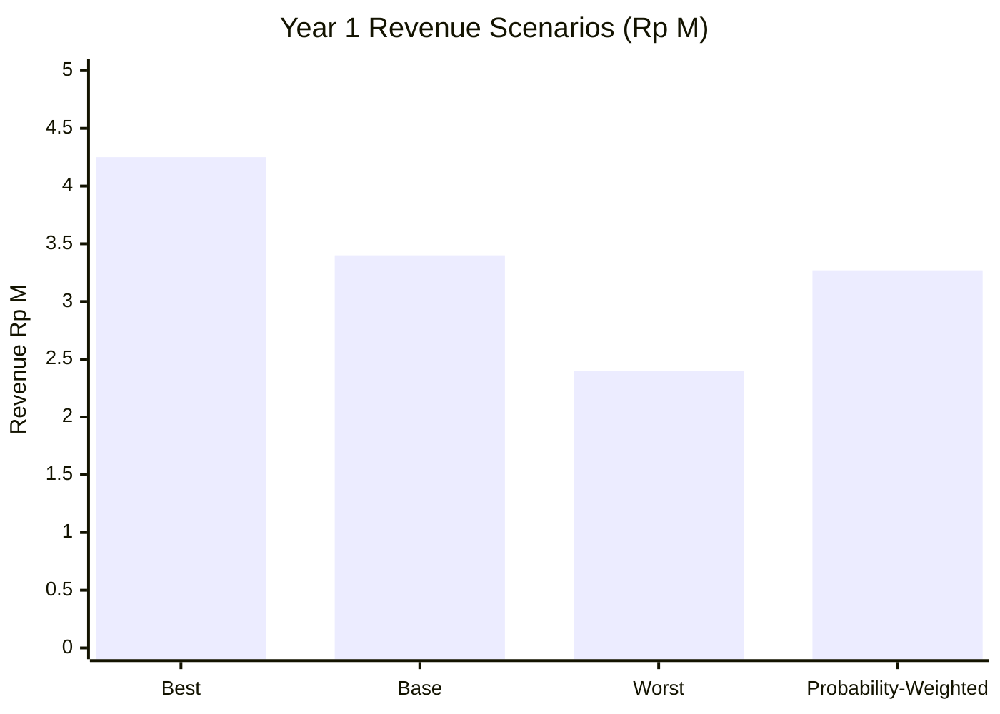
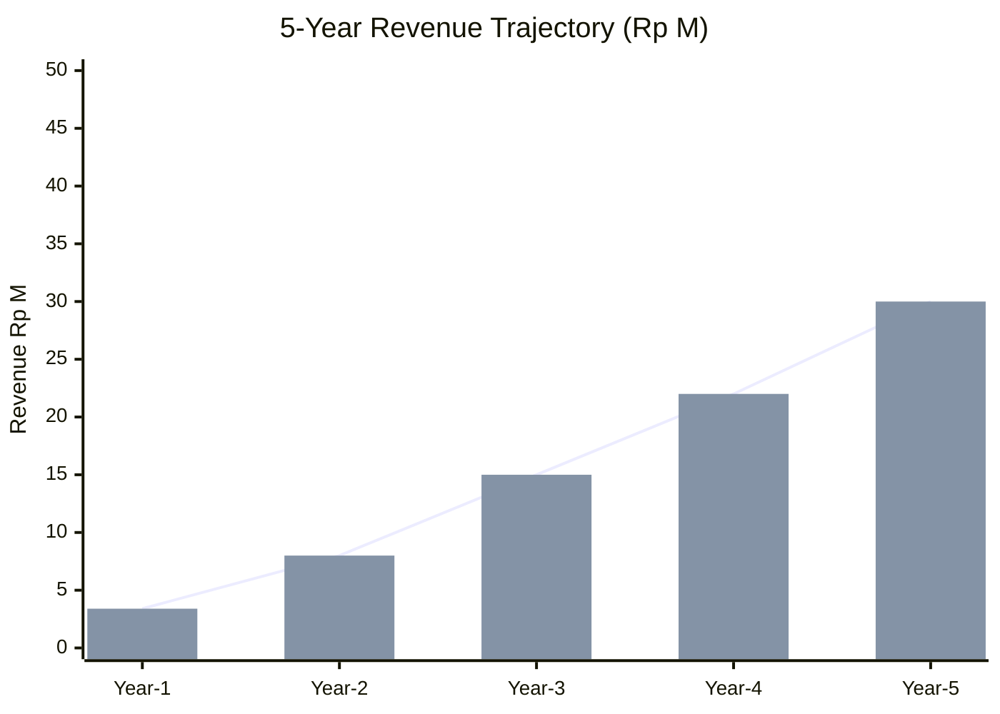
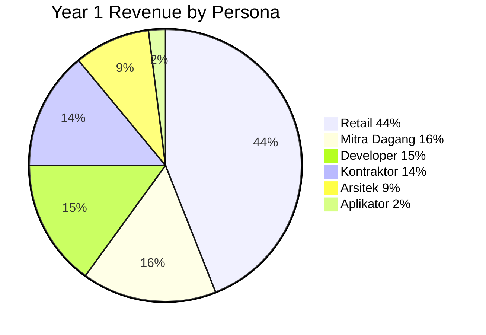

# Revenue Forecast

Forecast revenue Gerai 1000 Pintu: bottom-up per persona + top-down market sizing, scenario-based (best/base/worst), per phase trajectory.

## Triggers

Primary:
- "revenue forecast"
- "forecast pendapatan"
- "revenue projection"

Secondary:
- "sales projection"
- "income forecast"

## Input Required

| Field | Type | Required | Default |
|---|---|---|---|
| period | enum | yes | (quarterly / annual / 3-year / 5-year) |
| scenario | enum | no | (best / base / worst / all) |

## Output Template

```markdown
# Revenue Forecast: {PERIOD}

**Period:** {Date range}
**Methodology:** Bottom-up persona + top-down market
**Scenarios:** Best + Base + Worst

## Methodology

### Bottom-Up (Per Persona)
Forecast based on:
- Konsultasi count per persona
- Conversion rate per persona
- Average order value per persona
- Aftersales revenue per customer

### Top-Down (Market Size)
- TAM Indonesia premium tetapi inklusif
- SAM Kaltim premium pintu
- SOM Year 1-3 capture estimate

### Triangulation
Reconcile bottom-up + top-down → confident forecast

## Per Persona Forecast Year 1

### Retail Persona
- Konsultasi Year 1: 100 (per Door Expert capacity)
- Conversion to order: 50%
- Order count: 50
- Average order value: Rp 30jt (1-3 pintu typical)
- Revenue: Rp 1.5M

### Mitra Dagang Persona
- Konsultasi: 20 over Year 1
- Conversion to order: 70%
- Order count: 14
- Average order: Rp 40jt
- Revenue: Rp 560jt

### Developer Persona
- Project Year 1: 3-5
- Average project value: Rp 100-200jt
- Revenue: Rp 400-800jt (use Rp 500jt midpoint)

### Arsitek Collaboration
- Project Year 1: 5-8
- Average project per architect referral: Rp 50jt
- Revenue: Rp 250-400jt (use Rp 300jt midpoint)

### Kontraktor Persona
- Konsultasi: 10
- Conversion: 60%
- Order: 6
- Average: Rp 80jt (bulk)
- Revenue: Rp 480jt

### Aplikator Persona
- Mitra fitting partnership: 10 active
- Revenue contribution: Rp 50jt (referral + small order)

### Total Bottom-Up Year 1
- Retail Rp 1.5M + Mitra Rp 560jt + Developer Rp 500jt + Arsitek Rp 300jt + Kontraktor Rp 480jt + Aplikator Rp 50jt
- = **Rp 3.4M (Base Case)**

## Scenario Forecast

### Best Case (+25%)
- All persona above target
- Konsultasi conversion higher
- Total: **Rp 4.25M**

### Base Case
- Per persona forecast
- Total: **Rp 3.4M**

### Worst Case (-30%)
- Lower conversion + smaller orders
- Some persona delayed (Aplikator)
- Total: **Rp 2.4M**

### Probability Weight
- Best 20% × Rp 4.25M = Rp 850jt
- Base 50% × Rp 3.4M = Rp 1.7M
- Worst 30% × Rp 2.4M = Rp 720jt
- **Expected revenue: Rp 3.27M**

## Quarterly Distribution Year 1

| Quarter | Phase | Revenue Target |
|---|---|---|
| Q4 2026 | Wave 1 Launch (ramping) | Rp 220jt (10%) |
| Q1 2027 | Educate + build | Rp 650jt (20%) |
| Q2 2027 | Optimize + validate | Rp 880jt (27%) |
| Q3 2027 | Pre Phase 2 | Rp 1.1M (33%) |
| Year 1 Total | - | Rp 2.85M conservative |

(Note: Bottom-up Rp 3.4M Base reflects assumed pace acceleration. Quarterly Rp 2.85M conservative for budget planning safety.)

## Multi-Year Forecast

### 5-Year Revenue Trajectory

| Year | Cabang | Revenue Base | Best | Worst |
|---|---|---|---|---|
| Year 1 (2026-27) | 1 BPN | Rp 3.4M | Rp 4.25M | Rp 2.4M |
| Year 2 (2027-28) | 3 (BPN+SMR+BNT) | Rp 8M | Rp 11M | Rp 5.5M |
| Year 3 (2028-29) | 4-5 (+1 Jawa) | Rp 15M | Rp 20M | Rp 9M |
| Year 4 (2029-30) | 5-6 (+1 Jawa more) | Rp 22M | Rp 30M | Rp 14M |
| Year 5 (2030-31) | 6-7 nationwide | Rp 30M | Rp 40M | Rp 18M |

## Revenue Driver Sensitivity

### Driver 1: Konsultasi Count
- Each +10% konsultasi → +8% revenue (some leakage)
- Range: 80-150/quarter

### Driver 2: Conversion Rate
- Each +5% conversion → +10% revenue
- Range: 40-60%

### Driver 3: Average Order Value
- Each +Rp 5jt avg → +15% revenue
- Range: Rp 25-50jt average

### Driver 4: Aftersales Revenue
- Premium aftersales: 8-12% of product revenue
- Subscription / maintenance plan: Year 2+

## Leading Indicators (Monitor Weekly)

| Indicator | Target | Note |
|---|---|---|
| Walk-in weekly | 8-12 | Top-of-funnel |
| Konsultasi weekly | 2-3 | Pipeline |
| Quote sent weekly | 1-2 | Closing pipeline |
| Order weekly | 0.5-1 | Conversion |

## Forecast Update Cadence

### Weekly
- Pipeline tracking
- Forecast confidence update

### Monthly
- Actual vs forecast variance
- Adjust per signal

### Quarterly
- Full forecast refresh
- Multi-quarter update
- Scenario reweight

### Annually
- Multi-year forecast refresh
- Phase transition planning

## Variance Analysis

### When variance significant
- ±10% in single quarter: notable
- ±20% in single quarter: review pipeline + assumption
- Sustained ±10%: re-forecast required

### Root cause analysis
- Volume vs price
- Persona mix shift
- Channel performance
- External factor

## Brand Canon Compliance (Forecast Document)

- Premium hangat tone (not aggressive growth language)
- "Gerai 1000 Pintu" lengkap
- No em-dash
- Realistic + confident
```

## Visual Output

Revenue scenario forecast:



5-year trajectory:



Persona revenue mix Year 1:



## Knowledge Dependency

- 6 Persona spec
- Door Expert capacity
- CMO funnel-analysis
- vision-roadmap
- Market size research

## Mode

Default: EXECUTION
Switch: DISCUSSION jika scenario assumption debate

## Tools Required

- file-search
- artifacts (chart + pie)

## Validation Criteria

- Bottom-up per persona detail
- Scenario best/base/worst
- Probability weight
- Quarterly distribution
- Multi-year trajectory
- Driver sensitivity 4 factor
- Leading indicator monitor
- Update cadence
- Variance analysis

## Sample I/O

**Input:** "Revenue forecast Year 1 2026-2027 base + scenario"

**Output summary:**
- Methodology: Bottom-up per persona + top-down triangulation
- Year 1 Base: Rp 3.4M
- Best (+25%): Rp 4.25M
- Worst (-30%): Rp 2.4M
- Probability-weighted: Rp 3.27M
- Top persona Retail Rp 1.5M (44%) + Mitra Rp 560jt + Developer Rp 500jt
- Quarterly: Q4 ramping (10%) → Q3 peak (33%)
- 5-Year trajectory: Year 1 Rp 3.4M → Year 5 Rp 30M base
- Driver sensitivity: Konsultasi count + Conversion + Order value + Aftersales
- Leading indicator: Walk-in 8-12/week + Konsultasi 2-3 + Order 0.5-1
- Scenario chart + trajectory + persona pie embedded

## Handoff

- budget-planning (paired)
- cash-flow-management (downstream)
- All C-Level (function input)
- Matthew (forecast approve)
