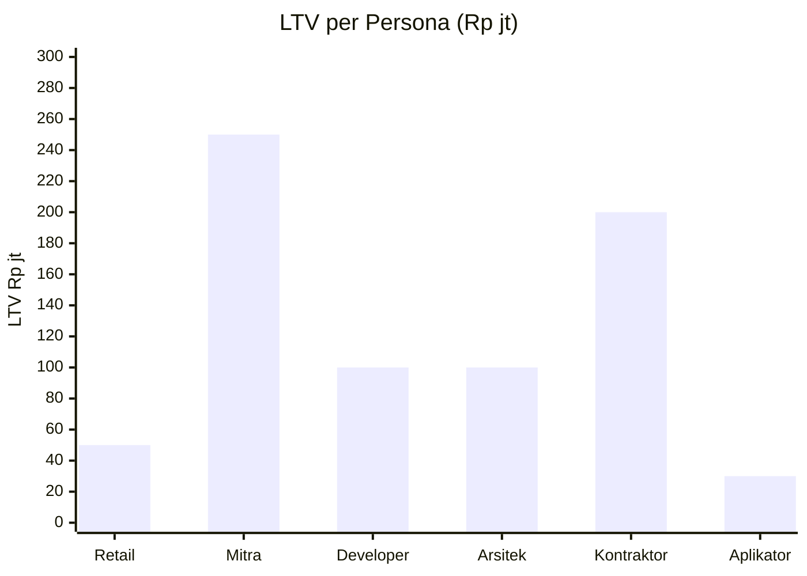
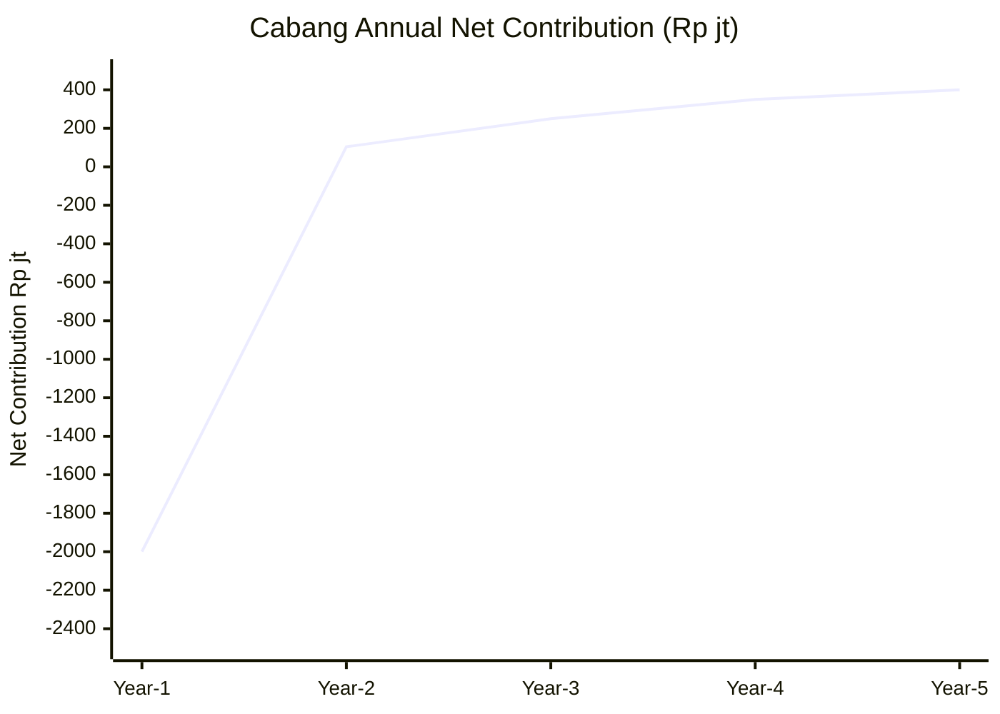
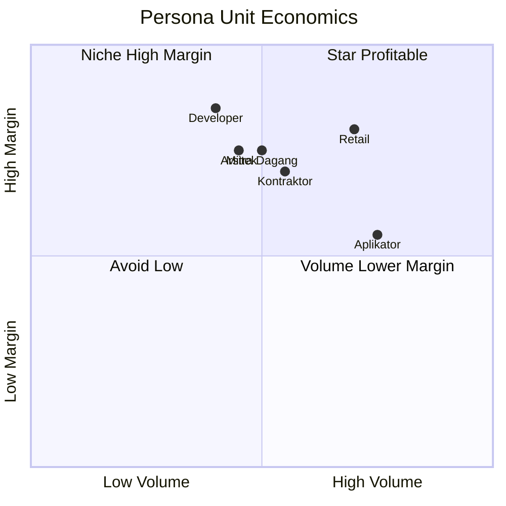

# Unit Economics Model

Model unit economics Gerai 1000 Pintu: per customer profitability, per konsultasi, per cabang, per persona. Validate business model viability.

## Triggers

Primary:
- "unit economics"
- "economic per unit"
- "per customer profitability"

Secondary:
- "unit metric"
- "per cabang economic"

## Output Template

```markdown
# Unit Economics: {LEVEL}

**Level:** {Per customer / Per konsultasi / Per cabang / Per persona}
**Period:** {Year 1 / Year 2 / Steady-state}

## Per Customer Unit Economics

### Average customer
- Average order value (AOV): Rp 30jt
- Gross margin: 32% → Rp 9.6jt
- Marketing cost (CAC): Rp 400-500k
- Konsultasi cost (Door Expert): Rp 150k
- Aftersales cost (Year 1): Rp 200-300k
- **Net contribution per customer (Year 1):** Rp 8.5jt

### Customer Lifetime Value (LTV)
- Average single transaction: Rp 30jt
- Repeat probability within 2 year: 20%
- Referral probability within 2 year: 30% (premium hangat hospitality)
- Aftersales recurring (maintenance, upgrade): Rp 2jt/year × 3 year
- **LTV total: Rp 30jt + repeat Rp 6jt + referral revenue contribution Rp 9jt + aftersales Rp 6jt = Rp 51jt**

### LTV / CAC Ratio
- LTV: Rp 51jt
- CAC: Rp 500k (high-end)
- **Ratio: 100x** (premium tetapi inklusif extreme healthy)

### Industry benchmark
- SaaS healthy: 3x+
- E-commerce healthy: 5x+
- Premium retail: 10-30x
- Gerai 1000 Pintu: 100x (very healthy)

## Per Persona Unit Economics

### Retail Persona
- AOV: Rp 30jt
- Margin: 32% → Rp 9.6jt
- CAC: Rp 500k (Instagram + web + walk-in)
- Konsultasi cost: Rp 150k
- Net per: Rp 8.95jt
- LTV: Rp 50jt+ (referral strong)
- **Most profitable persona ✓**

### Mitra Dagang Persona
- AOV: Rp 40jt
- Margin: 28% (volume discount) → Rp 11.2jt
- CAC: Rp 1jt (partner cultivation high-touch)
- Konsultasi cost: Rp 200k
- Net per: Rp 10jt
- LTV: Rp 250jt (sustained partnership)
- **High LTV ✓**

### Developer Persona
- AOV per project: Rp 150jt
- Margin: 28-30% → Rp 43-45jt
- CAC per project: Rp 5-10jt (long-cycle sales)
- Project cost (extended konsultasi + coordination): Rp 5jt
- Net per project: Rp 30-35jt
- LTV (3-5 project relationship): Rp 100jt+
- **High value project ✓**

### Arsitek Collaboration
- AOV per project: Rp 50jt
- Margin: 30% → Rp 15jt
- CAC: Rp 2jt (relationship + collateral)
- Architect commission: 5-10% (sharing)
- Net to Gerai: Rp 10jt
- LTV per architect: Rp 100jt+ (multi-project)
- **Compounding value ✓**

### Kontraktor Persona
- AOV: Rp 80jt
- Margin: 27% (bulk discount) → Rp 21.6jt
- CAC: Rp 1.5jt
- Net per: Rp 19jt
- LTV: Rp 200jt+ (sustained orders)
- **Operational scale ✓**

### Aplikator Persona
- AOV: Rp 5jt (small + referral)
- Margin: 40% (small high-margin items) → Rp 2jt
- CAC: Rp 200k (existing network)
- Net per: Rp 1.5jt
- LTV: Rp 30jt (multi-touch over years)
- **Network effect ✓**

## Per Konsultasi Unit Economics

### Konsultasi 60-min session
- Door Expert time cost: Rp 150k (Rp 10jt/month / 200 hour × 60 min)
- Tools cost (Zoom, CRM): Rp 10k per session
- Total cost per konsultasi: Rp 160k

### Konsultasi conversion to order
- Conversion rate: 50% average
- Revenue per konsultasi: Rp 30jt × 50% = Rp 15jt
- Margin contribution per konsultasi: Rp 15jt × 32% = Rp 4.8jt

### ROI per konsultasi
- Cost: Rp 160k
- Contribution: Rp 4.8jt
- **ROI: 30x per konsultasi**

### Capacity-based economics
- Door Expert capacity: 100/month maximum
- Konsultasi monthly contribution: 100 × Rp 4.8jt = Rp 480jt
- Door Expert cost monthly: Rp 10jt
- **Door Expert ROI: 48x**

## Per Cabang Unit Economics

### Cabang Balikpapan Year 1
| Metric | Value |
|---|---|
| Revenue Year 1 | Rp 2.85M |
| COGS (68%) | Rp 1.94M |
| Gross margin | Rp 910jt |
| OpEx Year 1 | Rp 2.84M |
| Capex Year 1 (amortized 5-year) | Rp 66jt/year |
| **Net contribution Year 1** | **(Rp 2M) loss — foundation investment** |

### Cabang Balikpapan Year 2 (mature)
| Metric | Value |
|---|---|
| Revenue Year 2 | Rp 3.5M |
| COGS (68%) | Rp 2.38M |
| Gross margin | Rp 1.12M |
| OpEx Year 2 (steady) | Rp 950jt |
| Capex amortized | Rp 66jt |
| **Net contribution Year 2** | **Rp 104jt profit** |

### Cabang Samarinda Year 2 (launch)
| Metric | Value |
|---|---|
| Revenue Year 2 | Rp 1.5M |
| COGS (68%) | Rp 1.02M |
| Gross margin | Rp 480jt |
| OpEx Year 2 (lower, shared) | Rp 600jt |
| Capex amortized | Rp 56jt |
| **Net contribution Year 2** | **(Rp 176jt) loss — ramping** |

### Multi-cabang economics
- Shared services (Door Expert, Pusat) lower per-cabang OpEx
- Year 2 total: BPN profit + SMR loss + BNT loss = mostly breakeven
- Year 3 sustained: All cabang profitable

## Break-Even Analysis Per Cabang

### Cabang break-even
- Fixed cost monthly: Rp 70jt (rent + people + tools + Pusat share)
- Variable margin: 32% of revenue
- Break-even revenue: Rp 70jt / 32% = Rp 220jt/month
- Konsultasi to break-even: Rp 220jt / (Rp 30jt avg AOV × 50% conversion × 32% margin) = 46 konsultasi/month
- Walk-in to konsultasi: 46 / 30% conversion = 154 walk-in/month
- Daily walk-in: 154 / 25 day = 6/day

### Wave 1 target alignment
- Walk-in target: 8-12/day → 200-300/month
- Konsultasi conversion 30% → 60-90/month
- Order conversion 50% → 30-45/month order
- Average order Rp 30jt → Rp 900jt-1.35M revenue/month
- **Above break-even from Day 60+ projected** ✓

## Multi-Year Per Cabang Maturity

### Year 1: Foundation (loss expected)
- Revenue ramping
- Marketing front-loaded
- People at full cost (utilization low)

### Year 2: Validation (break-even path)
- Revenue scaling
- People utilization improved
- Marketing efficient

### Year 3: Profit (sustained)
- Revenue mature
- Cost optimized
- Customer LTV compounding

### Year 4-5: Compounding
- Per-cabang profit Rp 200-400jt/year
- Phase 2-3 expansion subsidized

## Brand Canon Compliance

- Unit economics analysis: factual + clear
- Premium curated standard preserved (NOT optimize away)
- Door Expert quality maintained (no commission shift)
- Customer experience prioritized over short-term margin
```

## Visual Output

LTV vs CAC by persona:



Cabang maturity trajectory:



Persona profitability quadrant:



## Knowledge Dependency

- revenue-forecast (input)
- cost-structure (input)
- 6 Persona spec
- Door Expert capacity
- All function operational data

## Mode

Default: EXECUTION
Switch: DISCUSSION jika model assumption debate

## Tools Required

- file-search
- artifacts (chart + quadrant)

## Validation Criteria

- Per customer economics detail
- LTV / CAC calculation
- Per persona 6 personas
- Per konsultasi economics
- Per cabang economics multi-year
- Break-even analysis per cabang
- Multi-year maturity trajectory
- Industry benchmark
- Brand canon compliance

## Sample I/O

**Input:** "Unit economics model Year 1 Year 2 Gerai 1000 Pintu"

**Output summary:**
- Per customer: Rp 30jt AOV × 32% margin = Rp 9.6jt minus Rp 500k CAC + Rp 150k Konsultasi + Rp 250k aftersales = Rp 8.7jt net
- LTV: Rp 51jt (single + repeat + referral + aftersales)
- LTV/CAC ratio: 100x (extreme healthy premium retail)
- Per persona LTV: Mitra Rp 250jt (top) + Kontraktor Rp 200jt + Developer Rp 100jt + Arsitek Rp 100jt + Retail Rp 50jt + Aplikator Rp 30jt
- Per konsultasi: Rp 160k cost vs Rp 4.8jt contribution = 30x ROI
- Per cabang Year 1: Rp 2M loss (foundation investment)
- Per cabang Year 2: Rp 104jt profit (BPN), Rp 176jt loss (SMR ramping)
- Break-even: 154 walk-in/month at 6/day (above Wave 1 target 8-12/day) ✓
- Persona quadrant + LTV bar + cabang trajectory embedded

## Handoff

- revenue-forecast (paired)
- cost-structure (paired)
- ltv-cac-analysis (deep dive)
- pricing-strategy (input)
- All C-Level (function alignment)
