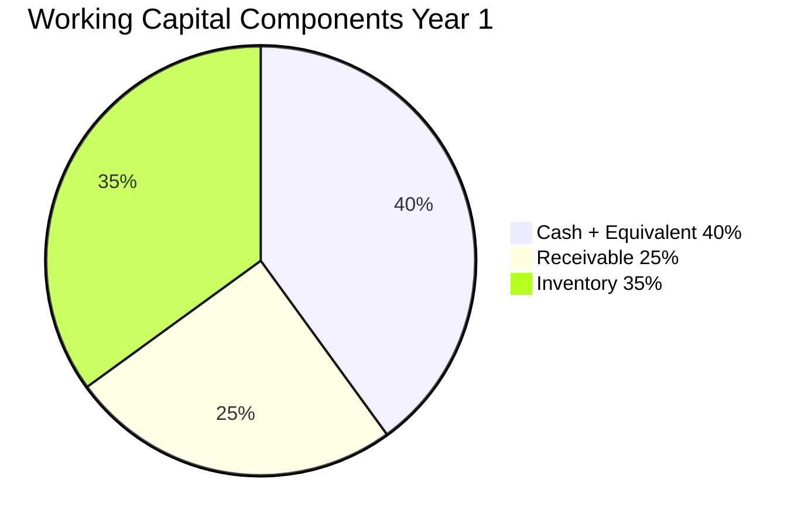
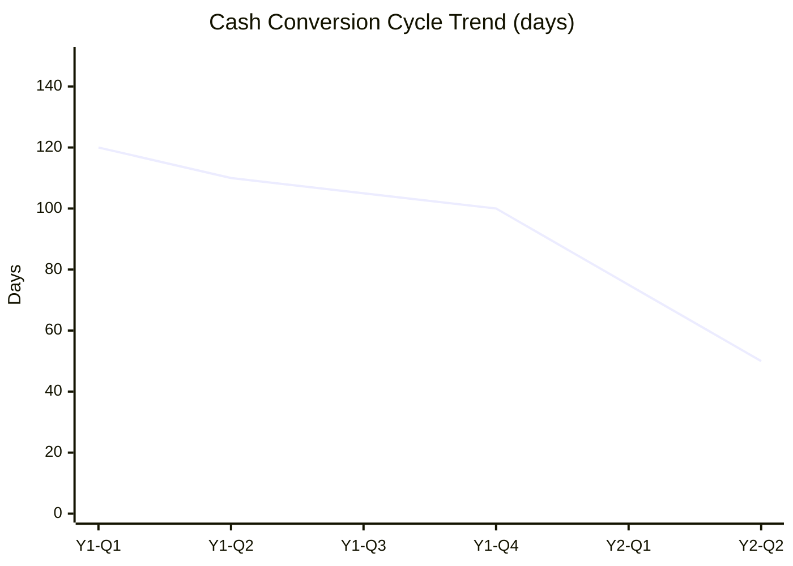
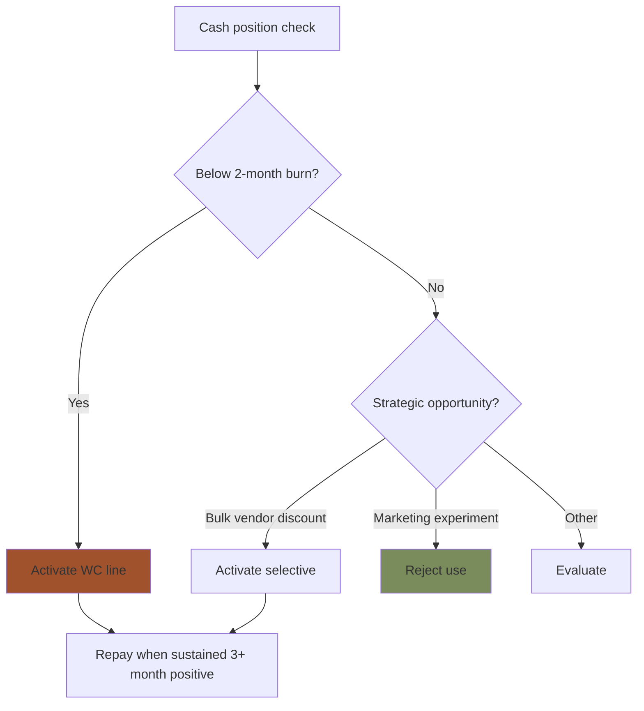

# Working Capital Management

Working capital management Gerai 1000 Pintu: inventory + receivable + payable optimization, credit line negotiation, cash conversion cycle.

## Triggers

Primary:
- "working capital"
- "modal kerja"
- "WC management"

Secondary:
- "credit line"
- "cash conversion"

## Output Template

```markdown
# Working Capital: {PERIOD}

**Period:** {Date}
**Owner:** CFO + Matthew approve credit line

## Working Capital Components

### Components
- **Current Assets:** Cash + Receivable + Inventory
- **Current Liabilities:** Payable + Short-term debt
- **Working Capital = Current Assets - Current Liabilities**

### Snapshot This Period

| Component | Amount Rp |
|---|---|
| Cash + cash equivalent | {N}jt |
| Customer receivable | {N}jt |
| Inventory (product + display) | {N}jt |
| **Total Current Assets** | {N}jt |
| Vendor payable | ({N})jt |
| Short-term debt | ({N})jt |
| **Total Current Liabilities** | ({N})jt |
| **Working Capital** | Rp {N}jt |

## Cash Conversion Cycle (CCC)

### Components
- **DSO (Days Sales Outstanding):** {N} day
  - How long customer takes to pay
- **DIO (Days Inventory Outstanding):** {N} day
  - How long inventory sits before sold
- **DPO (Days Payable Outstanding):** {N} day
  - How long we take to pay vendor

### Formula
CCC = DSO + DIO - DPO

### Current vs Target
| Metric | Current | Target Year 1 | Target Year 2 |
|---|---|---|---|
| DSO | {N} day | 45 day | 30 day |
| DIO | {N} day | 90 day | 60 day |
| DPO | {N} day | 30 day | 45 day |
| **CCC** | {N} day | **105 day** | **45 day** |

### Why CCC matters
- Lower CCC = less working capital needed
- Negative CCC = optimal (collect from customer before paying vendor)
- Gerai 1000 Pintu structure: mid-range CCC normal (custom premium)

## Receivable Optimization

### Customer Payment Terms
| Persona | DP Required | Term | Note |
|---|---|---|---|
| Retail | 50% upfront | 30-day final | Standard |
| Mitra Dagang | 30% upfront | 60-day final | Volume relationship |
| Developer | 50% upfront | Net-30 milestone | Project-based |
| Arsitek collaboration | 50% upfront | Net-30 | Per project |
| Kontraktor | 30% upfront | Net-45 | Bulk |
| Aplikator | Cash basis | 7-day | Small transactions |

### Improvement Action
- DP increase 50% → 70% major project (improves cash position)
- Early payment discount 2% net-15 (cash acceleration)
- Aging monitoring weekly
- Collection priority over 60-day

### Bad debt provision
- 1% of receivable Year 1 (conservative)
- Adjust based on actual collection

## Inventory Optimization

### Current Inventory Structure
- Display inventory (showroom): Rp {N}jt
- Sample + material wall: Rp {N}jt
- Stock for delivery: Rp {N}jt
- **Total inventory:** Rp {N}jt

### Inventory Turn Target
- Display: 6-month rotation
- Sample: long-term (semi-permanent display)
- Stock: per PO cycle (just-in-time approach)

### Carrying Cost
- Storage cost
- Capital tied-up cost (~10-12% annual)
- Obsolescence risk
- Total: ~15-18% of inventory value annually

### Optimization Strategy
- Just-in-time PO untuk most order (custom config)
- Display inventory disciplined (quality over quantity)
- Pre-order Wave 2 launches (avoid stockpile)
- Vendor consignment kalau possible (lower carrying cost)

## Payable Optimization

### Vendor Payment Strategy
- Pay vendor on time (build trust + relationship)
- Take early payment discount kalau favorable (>2% > cost of capital)
- Negotiate longer term (60-90 day for major vendor like AMK)
- Stagger payment schedule (smooth cash flow)

### AMK Premium relationship
- Standard term: 30-day
- Negotiation goal: 45-day kalau possible
- Reason: longer term = better working capital
- Trust factor: AMK is anchor, relationship long-term

## Credit Line Strategy

### Working Capital Line (Bank Credit)
- Amount: Rp 200jt standby
- Bank: TBD (Mandiri / BCA / others — relationship)
- Interest rate: ~10-12% annual (typical)
- Activation criteria:
  - Cash <2-month burn
  - Receivable delay >Rp 50jt outstanding
  - Strategic opportunity (no time to wait)

### Decision: When to activate
- ✅ Smooth cash flow gap (1-3 month)
- ✅ Strategic opportunity (e.g., bulk vendor discount)
- ❌ Operating burn (sustainable issue, fix root cause)
- ❌ Marketing experiment (no proven return)

### Decision: When to pay down
- Cash flow positive sustained 3+ month
- Working capital line cost > opportunity cost
- Quarterly review

### Cost
- Drawn amount: 10-12% annual interest
- Standby fee: 0.5-1% annual
- Use Rp 50jt for 3 month: Rp 1.5jt cost (vs cash strain)

## Year-over-Year Improvement

### Year 1 → Year 2
- DSO: 45 → 30 (faster collection via DP discipline)
- DIO: 90 → 60 (better demand prediction)
- DPO: 30 → 45 (longer vendor term)
- CCC: 105 → 45 day improvement

### Impact
- Working capital required: less Year 2 vs Year 1
- Cash freed up: ~Rp 200-300jt
- Reinvest: Phase 2 capex OR reserve increase

## Working Capital KPI

### Monthly Track
- Current ratio (CA/CL): target 2.0+
- Quick ratio ((Cash+AR)/CL): target 1.5+
- Inventory turnover (annual): 4-6x
- Receivable turnover: 8-12x

### Quarterly Track
- Cash conversion cycle
- Working capital change
- Credit line utilization
- Carrying cost analysis

## Brand Canon Compliance

- Customer payment communication: premium hangat
- Vendor relationship: warm + professional
- Internal communication: direct + clear
- No em-dash di all documentation
```

## Visual Output

Working capital components:



Cash conversion cycle trend:



Credit line utilization decision:



## Knowledge Dependency

- cash-flow-management (paired)
- COO PO management (vendor payable)
- CRM customer receivable
- Banking relationship

## Mode

Default: EXECUTION
Switch: DISCUSSION jika credit line decision

## Tools Required

- file-search
- artifacts (pie + trend)

## Validation Criteria

- Working capital components definition
- Cash conversion cycle calculation
- Receivable optimization per persona
- Inventory optimization strategy
- Payable optimization
- Credit line strategy
- Year-over-year improvement target
- Working capital KPI track
- Brand canon compliance

## Sample I/O

**Input:** "Working capital plan Year 1 Gerai 1000 Pintu"

**Output summary:**
- Components: Cash 40% + Receivable 25% + Inventory 35%
- CCC Year 1: 105 day (DSO 45 + DIO 90 - DPO 30)
- CCC Year 2 target: 45 day improvement (DSO 30 + DIO 60 - DPO 45)
- Customer payment: 50% DP Retail/Developer + 30% Mitra/Kontraktor
- Inventory turn: 6-month display rotation + JIT for orders
- Vendor: AMK 30-day → negotiate 45-day Year 2
- Credit line: Rp 200jt standby, activate <2-month burn OR strategic
- Year 2 cash freed: Rp 200-300jt via CCC improvement
- Components pie + CCC trend + credit decision flow embedded

## Handoff

- cash-flow-management (paired)
- budget-planning (input)
- COO PO management
- CRM (customer payment)
- Banking relationship
