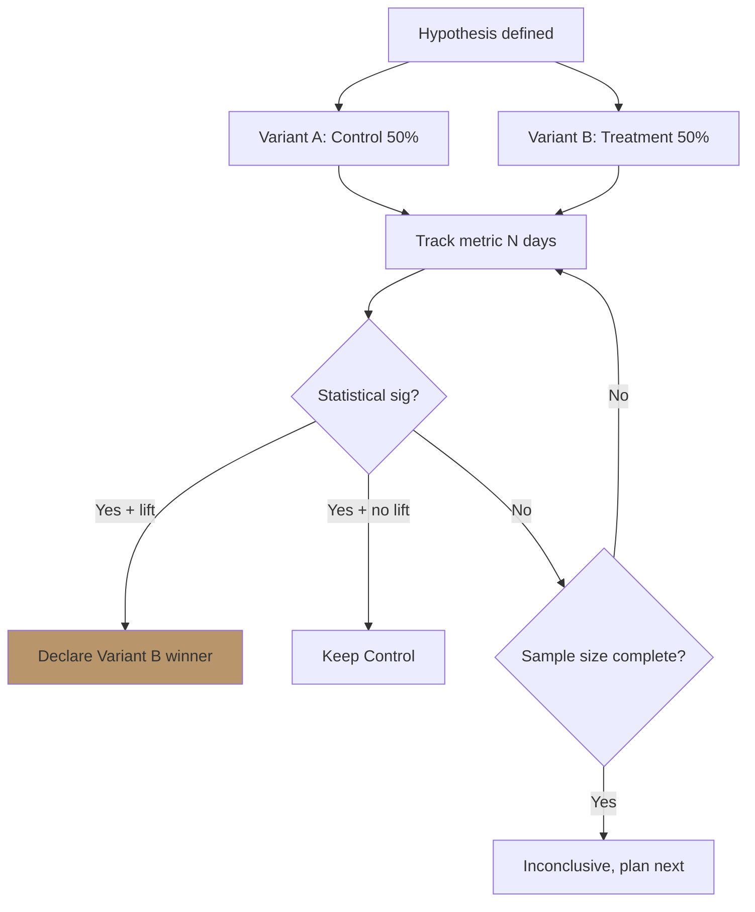

# A/B Test Design

Design experiment: hypothesis + variants + primary/secondary/guardrail metrics + sample size + duration + success criteria.

## Triggers

Primary:
- "A/B test design"
- "test hypothesis [X vs Y]"
- "experiment setup"

Secondary:
- "split test"
- "validate change"

## Input Required

| Field | Type | Required | Default |
|---|---|---|---|
| change_proposed | string | yes | - |
| current_metric | object | yes | (baseline rate) |
| minimum_detectable_effect | % | no | 10% |
| traffic_volume | number | no | (estimate from current) |

## Output Template

```markdown
# A/B Test Design: {TEST NAME}

## Hypothesis
**Statement (formal):**
"Kalau {change}, maka {primary metric} akan {direction} sebesar {magnitude} karena {reasoning}."

**Why this matters:**
{1 paragraf konteks: kenapa test ini penting, lift expected lead ke apa}

## Variants
| Variant | Description | Visual reference |
|---|---|---|
| **Control (A)** | Current version: {detail} | {link/screenshot} |
| **Treatment (B)** | Proposed: {detail} | {link/mockup} |
| (Optional Treatment C) | Alt approach: {detail} | {link/mockup} |

## Metrics

### Primary Metric
**Name:** {single most important metric}
**Definition:** {how measured}
**Direction:** Increase / Decrease
**Magnitude target:** {MDE %}
**Current baseline:** {N}

### Secondary Metrics (2-3)
| Metric | Definition | Expected direction |
|---|---|---|

### Guardrail Metrics (what NOT to harm)
| Metric | Threshold | Action if breached |
|---|---|---|
| Revenue per visitor | -5% max | Stop test |
| Bounce rate | +10% max | Stop test |
| Page load time | +500ms max | Stop test |

## Sample Size Calculation
- Baseline conversion: 
- Statistical power (1-β): 80% (standard)
- Significance level (α): 5% (standard)
- Required N per variant: {N}
- **Calculation:**
  - n = {formula breakdown}
  - Source: {tool used, e.g., Optimizely calculator}

## Duration Estimate
- Daily traffic to test page: {N}
- Days to reach sample size: {N}
- **Recommended duration:** {N} days (always test at least 1 full business cycle)

## Traffic Allocation
- Variant A (control): 50%
- Variant B (treatment): 50%
- (Optional 33/33/33 untuk 3 variant)

## Success Criteria
**Declare winner if:**
1. Statistical significance reached (p < 0.05)
2. Practical significance: lift ≥ MDE
3. Guardrail metrics not breached
4. Sample size complete OR confidence interval narrow enough

**Fall back to control if:**
- Lift below MDE meskipun significant
- Guardrail breached
- Inconclusive after extended duration

## Failure Plan
- Treatment underperforms: rollback to control, document learning
- No significant difference: keep current, plan next iteration
- Mixed signal: extend duration or run follow-up test

## Risk Register
| Risk | Likelihood | Mitigation |
|---|---|---|
| Novelty effect | Med | Run min 2 weeks |
| Seasonal bias | Low | Note period in analysis |
| Multiple comparison | High | Use Bonferroni correction kalau >2 variant |

## Implementation Checklist
- [ ] Variant developed + QC pass
- [ ] Tracking event setup (GA4 / Meta pixel)
- [ ] Audience split mechanism (Optimizely / Google Optimize / Custom)
- [ ] Statistical significance calculator ready
- [ ] Stakeholder briefing complete
- [ ] Pre-registration documented (avoid HARKing)

## Brand Canon Check
- No em-dash di kedua variant
- Tone premium hangat consistent
- Brand voice tidak shift drastik
- "Gerai 1000 Pintu" lengkap kedua variant
```

## Visual Output



## Knowledge Dependency

- funnel-audit skill output (untuk identify what to test)
- product-marketing skill
- 6 Persona spec

## Mode

Default: EXECUTION
Switch: NEED_CLARIFICATION jika hypothesis ambigu atau traffic terlalu kecil

## Tools Required

- code-interpreter (sample size calculation)
- file-search
- artifacts (flowchart)

## Validation Criteria

- Hypothesis SMART format (kalau X, maka Y sebesar Z)
- Sample size calculation explicit
- Duration min 2 minggu (avoid novelty)
- Primary + secondary + guardrail all defined
- Success criteria specific
- Failure plan explicit
- Brand canon check pass

## Sample I/O

**Input:** "A/B test design CTA button copy: 'Browse Catalog' vs 'Book Konsultasi Gratis' di landing page wave 1"

**Output summary:**
- Hypothesis: "Kalau CTA diganti dari 'Browse Catalog' ke 'Book Konsultasi Gratis', maka click-through-rate akan naik 30% karena CTA spesifik value-oriented (gratis + actionable) lebih trigger Retail persona."
- Variants: A "Browse Catalog" (control), B "Book Konsultasi Gratis" (treatment)
- Primary: CTR; Secondary: Form submission, Walk-in book; Guardrail: Bounce rate +10% max
- Baseline CTR 5%, MDE 30%, power 80%, alpha 5% → Sample N=1500 per variant
- Daily traffic 200 → 15 days reach sample
- Recommended duration: 21 days (3 weeks)
- Success: lift ≥30% + p<0.05 + bounce not breached
- Flowchart decision tree embedded

## Handoff

- cro (kalau perlu broader CRO program)
- copywriting (kalau test copy variants)
- funnel-audit (verifikasi hypothesis dari data funnel)
