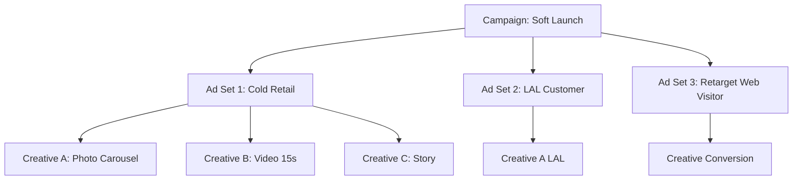

# Paid Ads Campaign Setup

Setup full ad campaign Meta (FB+IG), Google, atau LinkedIn dengan structure lengkap: objective, audience, creative, bid, budget, ad copy, landing.

## Triggers

Primary:
- "Meta Ads setup"
- "Google Ads campaign"
- "ad campaign untuk [X]"

Secondary:
- "paid campaign"
- "iklan untuk launch"

## Input Required

| Field | Type | Required | Default |
|---|---|---|---|
| platform | enum | yes | (Meta/Google/LinkedIn/TikTok Ads) |
| objective | enum | yes | (awareness/traffic/conversion/lead) |
| budget | number Rp | yes | - |
| duration | days | yes | - |
| persona_target | array | yes | - |

## Output Template

```markdown
# Ad Campaign: {NAME}

**Platform:** {Meta/Google/etc}
**Objective:** {SMART}
**Budget total:** Rp {amount}
**Duration:** {days}
**CPM/CPC target:** Rp {amount}

## Campaign Structure
```
Campaign: {Objective}
├── Ad Set 1: {Audience cluster 1}
│   ├── Ad creative variant A
│   ├── Ad creative variant B
│   └── Ad creative variant C
├── Ad Set 2: {Audience cluster 2}
│   └── ...
└── Ad Set 3: {Retargeting}
    └── ...
```

## Audience Targeting

### Ad Set 1: Cold Audience (Persona Primary)
- Demographic: {age, location, income proxy}
- Interest: {3-5 interest}
- Behavior: {if applicable}
- Custom audience: (none, cold)
- Estimated reach: {N}

### Ad Set 2: Lookalike
- LAL 1% from website visitor / customer list
- Estimated reach: {N}

### Ad Set 3: Retargeting
- Website visitor 30 days
- Engaged with content 30 days
- Estimated reach: {N}

## Ad Creative
| Variant | Hook | Body | CTA | Format | Persona angle |
|---|---|---|---|---|---|
| A | "{hook}" | "{body 80 char}" | "{CTA 4 word}" | Image carousel | Retail emotional |
| B | "{...}" | "{...}" | "{...}" | Video 15s | Aplikator practical |
| C | "{...}" | "{...}" | "{...}" | Story full screen | Arsitek visual |

## Bid Strategy
- Bidding type: {Cost cap / Lowest cost / Manual CPM}
- Daily budget per ad set: Rp {X}
- Optimization event: {Purchase / Lead / Landing Page View}

## Landing Page
- URL: {gerai.mahewwork.com/X}
- Match dengan ad creative
- UX: load <3 detik, mobile-first, single CTA

## KPI Target
- Reach: {N}
- CTR: 
- ROAS target: {ratio}

## Refresh Schedule
- Creative refresh: every 7 days
- Audience expansion: week 3
- Pause low performer: weekly review

## Brand Canon Check
- No em-dash
- "tempat" not "rumah"
- Gerai 1000 Pintu lengkap
- Premium hangat tone
```

## Visual Output



## Knowledge Dependency

- 6 Persona spec
- Brand Canon (creative tone)
- product-marketing skill
- channel-mix-calc output (budget allocation)
- Meta Ads / Google Ads policy Indonesia 2026

## Mode

Default: EXECUTION
Switch: NEED_CLARIFICATION jika budget terlalu kecil (<Rp 5jt = tidak feasible Meta)

## Tools Required

- file-search
- web-search (Meta Ads benchmark Indonesia, policy update)
- artifacts (campaign tree diagram)

## Validation Criteria

- 3 ad set minimum (cold + LAL + retarget)
- 3 creative variant per ad set
- Bid strategy explicit
- Budget per ad set sum = total
- KPI realistic vs benchmark
- Brand canon compliance per ad creative
- Landing page match dengan ad

## Sample I/O

**Input:** "Setup Meta Ads campaign Rp 20jt untuk wave 1 walk-in showroom, durasi 4 minggu"

**Output summary:**
- Campaign objective: Conversion (Optimize Store Visit + Lead)
- 3 ad set: Cold Retail Balikpapan-Samarinda (Rp 10jt), LAL 1% Customer (Rp 5jt), Retarget web 30d (Rp 5jt)
- 9 creative variants (3 per ad set, 3 format)
- CPM target Rp 35K, CTR 1.2%, CPC Rp 2.9K
- 100 walk-in target, ROAS 4:1
- Tree diagram embedded

## Handoff

- ad-creative (untuk produce 9 variant detail)
- copywriting (per ad copy)
- landing page brief (kalau page belum ada)
- CFO Gerai (validate ROAS realism)
