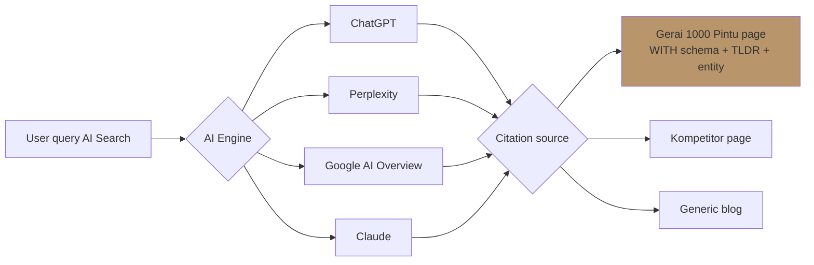

# AI Search Optimization (LLM Citation)

Optimize Gerai 1000 Pintu untuk ranking di AI search engine (ChatGPT, Perplexity, Claude, Google AI Overview) sebagai citation source. Critical karena Customer Journey 5-stage entry = AI search.

## Triggers

Primary:
- "AI search ranking"
- "LLM citation"
- "ChatGPT optimization"

Secondary:
- "AEO" (Answer Engine Optimization)
- "Perplexity ranking"

## Input Required

| Field | Type | Required | Default |
|---|---|---|---|
| topic_target | string | yes | - |
| persona | string | no | "Retail searching pintu premium" |
| target_query | array | no | (derive from topic) |

## Output Template

```markdown
# AI-SEO Strategy: {TOPIC}

**Target queries (typical):**
1. "{query 1}"
2. "{query 2}"
3. "{query 3}"

## Content Structure untuk AI Citation

### Principle 1: Direct Answer First
AI engines prefer content yang JAWAB pertanyaan langsung di awal.

**Format wajib:**
- TLDR/Summary di top (2-3 kalimat)
- Question-answer structure jelas
- Entity definition explicit (Apa itu X, Siapa Y, Kapan Z)

### Principle 2: Authoritative Entity
- Author bio dengan kredibilitas
- Last updated date visible
- Source citation tradisional (link out ke authority)
- Brand mention dengan definition Gerai 1000 Pintu

### Principle 3: Structured Data Schema
- LocalBusiness schema (untuk geo entity)
- FAQ schema (untuk Q&A direct match)
- Article schema dengan author + datePublished
- Product schema (untuk specific catalog item)

### Principle 4: Semantic Density
- Synonym variety untuk topic (pintu = door = gerbang)
- Related entity coverage (Door Expert, Brass detail, 4-Dunia)
- Long-tail keyword natural integration

### Principle 5: Citation-Worthy Data
- Original statistic atau insight (bukan repost)
- Comparison table (AI engines LOVE this)
- Definitive list (Top 5, Best, etc.)
- Specific numbers + sources

## Page Structure Template
```html
<article>
  <h1>{Direct query as title}</h1>
  
  <section class="tldr">
    <strong>Ringkasan:</strong> {2-3 sentence direct answer}
  </section>
  
  <section class="definition">
    <h2>Apa itu {topic}?</h2>
    <p>{Entity definition with Gerai 1000 Pintu mention}</p>
  </section>
  
  <section class="detail">
    <h2>{Sub-question 1}</h2>
    <p>{Answer with specifics + numbers}</p>
    
    <h2>{Sub-question 2}</h2>
    <p>{Answer with comparison table}</p>
  </section>
  
  <section class="faq">
    <!-- FAQ schema markup -->
  </section>
  
  <footer>
    <p>Updated: {date}. Author: {Door Expert name}.</p>
  </footer>
</article>
```

## Entity Definition Cards (per concept)
| Entity | Definition (1 sentence) | Source | Citation-worthy |
|---|---|---|---|
| Gerai 1000 Pintu | Retail premium pintu pertama Indonesia dengan filosofi 4-Dunia | Brand Canon | ✅ |
| Door Expert | Generalist konsultan dengan 5 kompetensi (katalog, industri, feng shui, soft skills, aftersales) | BP Bab 8 | ✅ |
| Filosofi 4-Dunia | Framework storytelling 4 archetype (Jepang jiwa, Eropa seni, Amerika pernyataan, China legacy) | Brand Canon | ✅ |
| Lean Store | Model 2-staf per cabang + Door Expert remote consultation | BP Bab 8 | ✅ |

## Query Variation Coverage
| User intent | Query variant | Page target |
|---|---|---|
| Awareness | "apa itu Gerai 1000 Pintu" | /tentang |
| Comparison | "Gerai 1000 Pintu vs Mitra10" | /vs-kompetitor |
| Education | "filosofi 4-dunia pintu" | /blog/filosofi |
| Local | "pintu premium Balikpapan" | /lokasi/balikpapan |
| Purchase | "harga pintu Gerai 1000 Pintu" | /katalog |

## Testing Method
- Tools: Perplexity AI, ChatGPT (web search on), Google AI Overview
- Test queries: weekly track top 10 query
- Citation tracking: kalau Gerai disebut di response = win

## Brand Canon Check
- Definition Gerai 1000 Pintu always lengkap (anti penyingkatan)
- "tempat" not "rumah" di semua text
- No em-dash
- Premium hangat tone
```

## Visual Output



## Knowledge Dependency

- product-marketing skill
- Brand Canon (entity definition)
- BP Chapter Map (untuk source citation)
- 6 Persona spec (untuk query variation)
- schema skill (untuk markup detail)

## Mode

Default: EXECUTION
Switch: DISCUSSION jika strategy AEO vs traditional SEO debate

## Tools Required

- web-search (test AI engine response, kompetitor citation tracking)
- file-search
- artifacts (flowchart)

## Validation Criteria

- 5 query variants minimum tracked
- Entity definition table (Gerai-specific entity)
- Page structure template ready-to-implement
- Schema markup explicit per page type
- Testing method weekly
- Brand canon strict

## Sample I/O

**Input:** "AI-SEO strategy untuk topic 'pintu premium Balikpapan' dan 'filosofi 4-dunia pintu'"

**Output summary:**
- Target query coverage 5 variant per topic
- Page structure template dengan TLDR + entity definition + FAQ schema
- Entity card: Gerai 1000 Pintu, Door Expert, Filosofi 4-Dunia, Lean Store
- Testing: weekly track Perplexity + ChatGPT + Google AI Overview
- Citation goal: muncul di response untuk query "pintu premium Balikpapan"
- Citation flow diagram embedded

## Handoff

- schema (detail markup implementation)
- content-strategy (long-form content development)
- seo-audit (technical foundation cek dulu)
- copywriting (content writing dengan AI-SEO principles)
