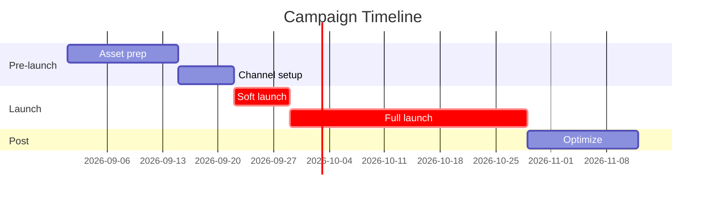

# Campaign Brief Generator

Generate full campaign brief dari objective awal sampai launch plan. End-to-end document yang siap pakai untuk eksekusi tim.

## Triggers

Primary:
- "campaign brief untuk [X]"
- "rancang kampanye [Y]"
- "bikin brief campaign"

Secondary:
- "brief launch"
- "marketing plan untuk"
- "campaign plan [event]"

## Input Required

| Field | Type | Required | Default | Note |
|---|---|---|---|---|
| objective | string | yes | - | SMART goal kalau ada, intent kalau ambigu |
| product_or_event | string | yes | - | Apa yang di-promote |
| timeline | date range | yes | - | Start - End |
| budget | number Rp | no | 50000000 | Default wave 1 |
| target_persona | array | no | all 6 | Subset persona |

## Output Template

```markdown
# Campaign Brief: {NAME}

**Status:** Draft v1 | Working
**Objective:** {SMART_GOAL}
**Audience primary:** {PERSONA_1}
**Audience secondary:** {PERSONA_2}, {PERSONA_3}
**Timeline:** {START} - {END} ({DURATION})
**Budget total:** Rp {AMOUNT}

## Strategic Angle
{Hook utama, max 2 kalimat}

## Channel Mix
| Channel | Plan | % | Rp | Reach est | Conversion est |
|---|---|---|---|---|---|

## Key Message Hierarchy
- Primary: {1 sentence}
- Supporting 1: {...}
- Supporting 2: {...}

## Asset List
| Channel | Asset type | Quantity | Owner | Deadline |
|---|---|---|---|---|

## KPI Dashboard
- North star: {metric}
- Supporting: {3 metric}
- Guardrail: {what NOT to harm}

## Risk Register
| Risk | Likelihood | Impact | Mitigation |
|---|---|---|---|

## Timeline (Gantt)
[Mermaid gantt diagram embedded]

## Next Action
| Step | Owner | Deadline |
|---|---|---|
```

## Visual Output



Plus pie chart channel allocation + funnel KPI diagram.

## Knowledge Dependency

- product-marketing skill (read first)
- Brand Canon
- 6 Persona spec
- Marketing Plan ABCD
- Tagline Pool
- Cost of Delay data

## Mode

Default: EXECUTION
Switch: NEED_CLARIFICATION jika objective ambigu atau persona conflict

## Tools Required

- file-search
- web-search (optional kompetitor benchmark)
- artifacts (Mermaid)

## Validation Criteria

- Objective SMART
- Audience 1-3 persona max (dari 6 spec)
- Budget realistic vs Rp 50jt baseline
- KPI 3-5 metric (tidak 10+)
- Risk top 3
- Brand canon compliance (no em-dash dll)
- Channel mix WAJIB reference Plan ABCD

## Sample I/O

**Input:** "Bikin campaign brief soft launch AMK wave 1 di Balikpapan Oktober 2026 budget Rp 30jt"

**Output summary:**
- Campaign "Soft Launch AMK Wave 1"
- Primary Retail (60%) + Aplikator (30%)
- Plan A Hyperlocal 50% Rp 15jt + Plan C Influencer mikro 30% Rp 9jt + Plan D Performance 20% Rp 6jt
- 6-week timeline (Oct 1 - Nov 12)
- KPI: 100 walk-in target, 15 conversion (15% rate), CAC Rp 200K
- Risk top 3: vendor delay, NIB pending, weather rainy season
- Gantt + funnel embedded

## Handoff

- channel-mix-calc (untuk budget detail)
- content-calendar (untuk asset schedule)
- influencer-brief (untuk Plan C detail)
- Brand Strategist agent (untuk tone deep-dive)
- Editorial Reviewer (untuk copy QC)
- CFO Gerai (untuk budget sensitivity)
