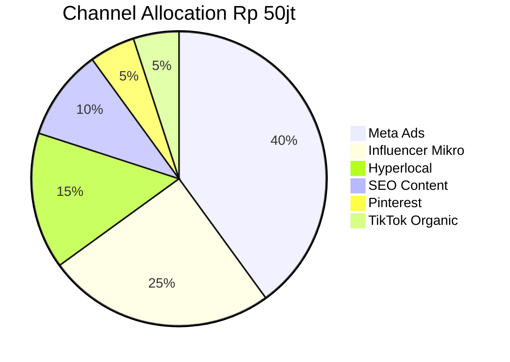

# Channel Mix Calculator

Given budget + goal + persona, kasih distribusi % per channel + Rp + expected reach/conversion + sequence (kapan deploy mana).

## Triggers

Primary:
- "split budget Rp [X]"
- "channel mix optimal"
- "allocation Plan A/B/C/D"

Secondary:
- "berapa Meta Ads"
- "influencer budget berapa"

## Input Required

| Field | Type | Required | Default |
|---|---|---|---|
| total_budget | number Rp | yes | - |
| goal | enum | yes | (awareness/consideration/conversion/retention) |
| persona_target | array | yes | - |
| timeline | days | yes | - |

## Output Template

```markdown
# Channel Mix: Rp {TOTAL} untuk {GOAL}

**Persona target:** {primary + secondary}
**Timeline:** {days}
**Goal:** {SMART specific}

## Allocation Matrix
| Channel | Plan | % | Rp | Reach est | CPM/CPC est | Conversion est | Confidence |
|---|---|---|---|---|---|---|---|
| Meta Ads (FB+IG) | D | 40% | Rp {X} | {N} | Rp {Y} | {Z} | High |
| IG Influencer mikro Kaltim | C | 25% | Rp {X} | {N} | - | {Z} | Medium |
| Hyperlocal community | A | 15% | Rp {X} | {N} | - | {Z} | Medium |
| Web SEO + content | B | 10% | Rp {X} | {N} | - | {Z} | High (long-term) |
| Pinterest visual | A | 5% | Rp {X} | {N} | - | {Z} | Low |
| TikTok organic | A | 5% | Rp {X} | {N} | - | {Z} | Medium |

## Sequence (Kapan Deploy Mana)
### Week 1-2: Pre-launch warm-up
- Plan B SEO content seeding (long-term play)
- Plan A Hyperlocal Pinterest visual establishment
- Plan C Influencer brief + outreach

### Week 3-4: Soft launch
- Plan C Influencer post live
- Plan D Meta Ads warm audience (custom audience website visitor)
- Plan A Community engagement push

### Week 5+: Scale
- Plan D Meta Ads cold audience expansion
- Plan A TikTok organic + boost
- Plan C Influencer continuation Phase 2

## Risk + Mitigation per Channel
| Channel | Risk | Mitigation |
|---|---|---|
| Meta Ads | Audience saturation | Refresh creative every 7 days |
| Influencer | Reputational risk | Vet pre-collab + brief strict |
| Hyperlocal | Slow ramp | Combine dengan event activation |

## KPI Dashboard
- Cost per persona reach: Rp {avg}
- Blended CAC target: Rp {amount}
- Conversion target: {N walk-in + N online inquiry}
```

## Visual Output



Plus Gantt sequence + funnel diagram per channel.

## Knowledge Dependency

- 4 Marketing Plan ABCD
- 6 Persona spec (untuk channel preference)
- Cost of Delay data
- Historical CPM benchmark (Meta Ads Indonesia premium retail)

## Mode

Default: EXECUTION (calculation heavy)
Switch: NEED_CLARIFICATION jika goal ambigu (awareness vs conversion = beda mix)

## Tools Required

- file-search
- web-search (Meta Ads CPM benchmark Indonesia terkini)
- code-interpreter (untuk calculation)
- artifacts (pie chart + Gantt)

## Validation Criteria

- % sum = 100%
- Setiap channel ada Rp + reach est + conversion est
- Sequence logical (warm-up → soft launch → scale)
- Risk + mitigation per channel
- KPI realistic (CAC target reasonable Rp 100-500K untuk Retail premium)
- Brand canon compliance

## Sample I/O

**Input:** "Split Rp 50jt budget wave 1 untuk persona Retail (60%) + Aplikator (40%) goal walk-in showroom"

**Output summary:**
- Allocation: Meta Ads 40% Rp 20jt (Retail audience), Influencer mikro 25% Rp 12.5jt (Aplikator hit), Hyperlocal 15% Rp 7.5jt, SEO 10% Rp 5jt, Pinterest 5% Rp 2.5jt, TikTok organic 5% Rp 2.5jt
- Sequence 8-week
- Expected outcome: 100 walk-in, blended CAC Rp 500K
- Risk: Meta saturation (refresh creative weekly), TikTok organic uncertain (treat as test)
- Pie chart + Gantt embedded

## Handoff

- ads (untuk Meta Ads detail setup)
- influencer-brief (untuk Plan C detail)
- campaign-brief (consolidate ke full brief)
- CFO Gerai (validate budget realism)
