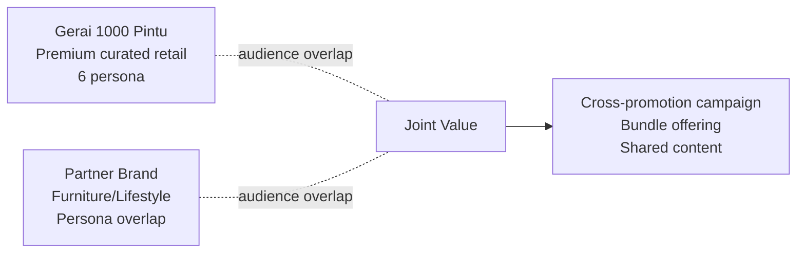

# Co-Marketing Partner Campaign

Design partnership campaign: identify partner candidate + value exchange + collab format + risk + budget.

## Triggers

Primary:
- "partner campaign"
- "collab brand"
- "co-marketing"

Secondary:
- "joint campaign"
- "cross-promotion"

## Input Required

| Field | Type | Required | Default |
|---|---|---|---|
| objective | string | yes | - |
| target_audience | string | yes | - |
| budget_share | string | no | "50/50" |
| timeline | days | yes | - |

## Output Template

```markdown
# Co-Marketing Brief: {CAMPAIGN}

**Objective:** {SMART}
**Audience target:** {persona overlap}
**Budget share:** {50/50 atau split per contribution}

## Partner Shortlist
| Partner | Brand category | Audience overlap % | Brand fit (1-10) | Status |
|---|---|---|---|---|

## Value Exchange Matrix
| What Gerai brings | What Partner brings | Joint value |
|---|---|---|
| Showroom + Door Expert konsultasi | Furniture catalog + customer base | Complete tempat experience |
| 4-Dunia narrative | Lifestyle content + audience | Cross-category storytelling |
| Premium positioning | Affordable adjacency | Customer journey upsell path |

## Collab Format Options
1. **Co-event:** Joint workshop/showcase
2. **Bundle offering:** Door + furniture package
3. **Content swap:** Cross-post + tag
4. **Loyalty integration:** Reward exchange
5. **Joint campaign:** Shared budget for ads/influencer

## Recommended Format: {Option}
**Reasoning:** {Why this format for this partnership}

## Brand Canon Compatibility Check
- Partner brand tone aligned dengan premium hangat? ✅/⚠️/❌
- Audience persona overlap? {%}
- No conflicting positioning? ✅/⚠️/❌
- Co-branding visual rule: Brass 10% + Charcoal 60% + Ivory 30% maintained

## Risk Register
| Risk | Likelihood | Impact | Mitigation |
|---|---|---|---|
| Partner brand misstep | Med | High | Pre-agree messaging + escape clause |
| Audience confusion | Low | Med | Clear "powered by" co-branding |
| Margin dilution | Med | Med | Bundle pricing clear value |

## Legal & Operational
- Co-branding agreement template
- Asset ownership clause
- Termination clause
- KPI commitment mutual

## KPI Joint
- Cross-audience reach: {N}
- Lead exchange: {N each direction}
- Joint sales (kalau bundle): Rp {amount}
- Brand sentiment lift: {%}
```

## Visual Output

Partnership Venn diagram:



## Knowledge Dependency

- 6 Persona spec
- Brand Canon (positioning)
- product-marketing skill
- positioning-map skill output

## Mode

Default: EXECUTION
Switch: NEED_CLARIFICATION jika partner candidate tidak jelas

## Tools Required

- web-search (partner candidate research)
- file-search
- artifacts (Venn diagram)

## Validation Criteria

- Partner shortlist 3-5 candidate (bukan 1 saja)
- Brand fit score justified
- Value exchange mutual (bukan Gerai keluar value lebih banyak)
- Risk register min 3 risk
- Legal clause noted
- Brand canon compatibility WAJIB check

## Sample I/O

**Input:** "Co-marketing brief untuk partnership dengan brand furniture premium Kaltim, audience overlap Arsitek"

**Output summary:**
- Shortlist 3 partner: brand furniture lokal Kaltim
- Value exchange: Gerai → showroom + Door Expert, Partner → furniture catalog + Arsitek network
- Recommended format: Co-event Arsitek roundtable + bundle "Tempat Lengkap" (door + furniture set)
- Brand canon: aligned (kedua brand premium hangat)
- Risk: margin dilution mitigated dengan bundle pricing transparent
- Venn diagram embedded

## Handoff

- campaign-brief (consolidate jadi full brief)
- CFO Gerai (validate budget share + ROI)
- legal review (co-branding agreement)
