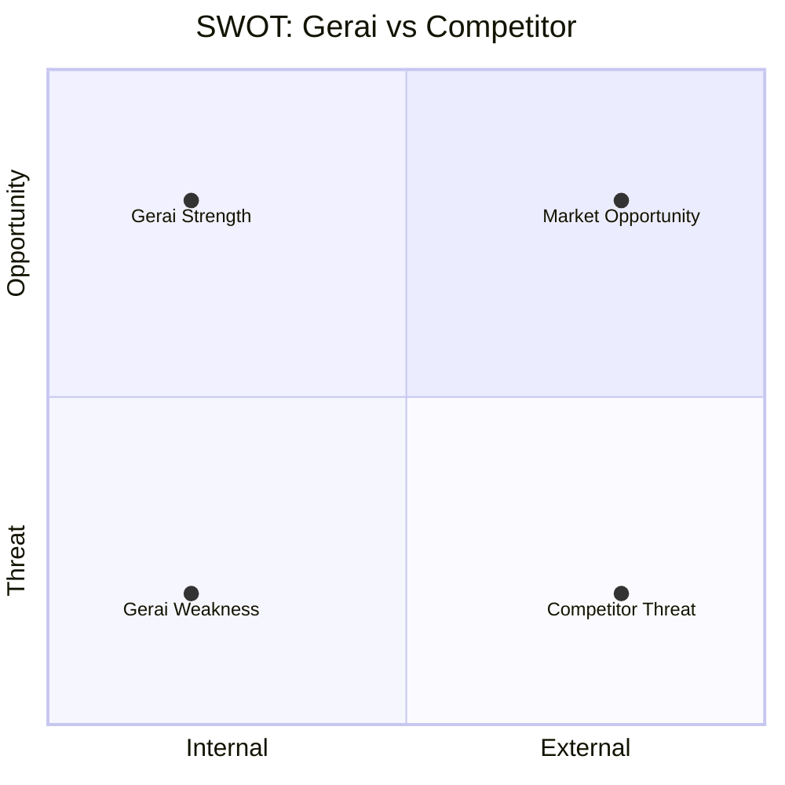

# Competitor Profiling

Deep-dive analisis 1 kompetitor: business model, positioning, strength, weakness, opportunity gap untuk Gerai 1000 Pintu.

## Triggers

Primary:
- "profile kompetitor [X]"
- "analisa [kompetitor]"
- "kompetitor deep-dive"

Secondary:
- "vs [kompetitor]"
- "benchmark dengan [X]"

## Input Required

| Field | Type | Required | Default |
|---|---|---|---|
| competitor_name | string | yes | - |
| competitor_url | string | no | (web-search if provided) |
| context | string | no | "general" |

## Output Template

```markdown
# Competitor Profile: {NAME}

**Tier classification:** Tier 1 Direct / Tier 2 Indirect / Tier 3 Substitute / Tier 4 Adjacent
**Threat level:** HIGH / MEDIUM / LOW
**Last data updated:** {DATE}

## Business Model
- Revenue stream: {primary}
- Customer segment: {who}
- Channel: {online/offline/hybrid}
- Pricing model: {fixed/dynamic/nego}
- USP claim: {what they say}

## Positioning
- Their tagline: {if any}
- Their narrative angle: {how they market}
- Target persona overlap dengan Gerai: {%}

## Strengths
1. {Strength + impact}
2. {...}
3. {...}

## Weaknesses
1. {Weakness + how Gerai bisa exploit}
2. {...}
3. {...}

## Opportunity Gap (untuk Gerai)
{1-2 paragraf: gap yang kompetitor tinggalkan, yang Gerai bisa fill}

## Strategic Implication
- Threat to watch: {what they might do next}
- Defensive move Gerai: {how to protect position}
- Offensive move Gerai: {how to attack their weakness}

## Differentiator Gerai vs Them (SWOT-style)
| Dimension | Them | Gerai | Edge |
|---|---|---|---|
```

## Visual Output

SWOT matrix 2x2:



Plus comparison table side-by-side.

## Knowledge Dependency

- Kompetisi 4-Tier mapping
- Positioning statement Gerai
- Brand Canon

## Mode

Default: EXECUTION (data-driven)
Switch: NEED_CLARIFICATION jika competitor name ambigu (e.g., "Mitra" - Mitra10 atau Mitra Bangunan)

## Tools Required

- web-search (research kompetitor terkini)
- file-search (knowledge base internal)
- artifacts (visualization)

## Validation Criteria

- Tier classification konsisten dengan 4-Tier mapping
- Threat level evidenced (bukan opini)
- Strength + Weakness 3-5 (tidak exhaustive)
- Opportunity gap specific + actionable
- Brand canon compliance

## Sample I/O

**Input:** "Profile kompetitor Mitra10 untuk threat assessment Q4"

**Output summary:**
- Tier 2 Indirect, Threat Medium
- Business model: omnichannel home improvement big-box (online + 400+ store)
- Strength: scale, brand recognition, supplier consolidation
- Weakness: low curation, generic positioning, no narrative
- Opportunity gap: premium tetapi inklusif segment yang Mitra10 abaikan
- Strategic: Gerai jangan compete on price/scale, double down on curation+narrative+Door Expert
- SWOT quadrant + comparison table

## Handoff

- positioning-map (kalau perlu update map)
- product-marketing (kalau perlu adjust positioning)
- channel-mix-calc (kalau kompetitor active di channel tertentu)
