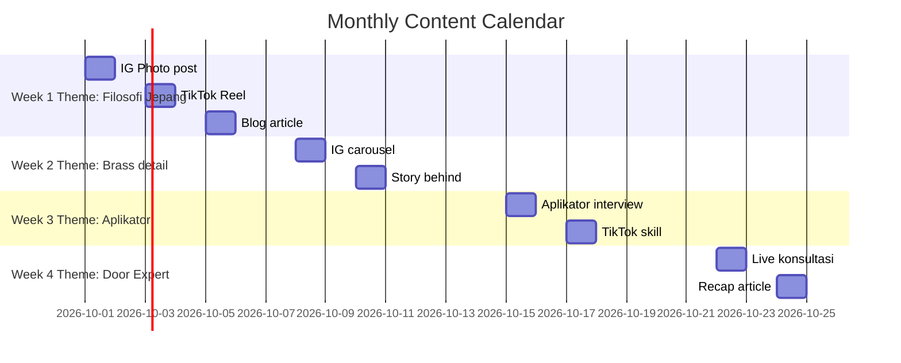

# Content Calendar Builder

Generate weekly/monthly editorial plan dengan theme rotation, channel mapping, asset prep deadline.

## Triggers

Primary:
- "content calendar [bulan]"
- "editorial plan [period]"
- "schedule content"

Secondary:
- "post calendar"
- "publishing schedule"

## Input Required

| Field | Type | Required | Default |
|---|---|---|---|
| period | enum | yes | "month" or "week" |
| channels | array | no | ["IG", "TikTok", "Web blog"] |
| persona_target | array | no | all 6 |
| theme_anchor | string | no | (derive from season + campaign) |

## Output Template

```markdown
# Content Calendar: {PERIOD}

**Theme anchor:** {monthly/weekly theme}
**Persona priority:** {primary persona}

## Weekly Theme Rotation
| Week | Theme | Pillar | Persona angle |
|---|---|---|---|
| Week 1 | "Filosofi pintu Jepang" | Education | Arsitek |
| Week 2 | "Hidden detail brass" | Visual storytelling | Retail |
| Week 3 | "Aplikator skill spotlight" | Community | Aplikator |
| Week 4 | "Door Expert konsultasi behind scene" | Authority | Mitra+Developer |

## Daily Calendar
| Date | Day | Channel | Theme | Asset type | Copy preview | Persona | Owner | Deadline | Status |
|---|---|---|---|---|---|---|---|---|---|
| 01 | Sen | IG feed | ... | photo carousel | "..." | Retail | designer | -2 days | draft |
| 02 | Sel | TikTok | ... | reel 15s | "..." | Aplikator | content | -1 day | filming |
| 03 | Rab | Web blog | ... | article 800 word | "..." | Arsitek | writer | -3 days | review |
| ... | ... | ... | ... | ... | ... | ... | ... | ... | ... |

## Asset Prep Deadline
| Asset | Channel | Production lead time | Owner | Buffer |
|---|---|---|---|---|

## Cross-Channel Sync Notes
- Hashtag consistency: #Gerai1000Pintu #DuniaPintu + theme tag
- Visual identity consistency: brass + ivory + charcoal palette
- Voice tone rotation: matched per persona angle

## KPI Target per Channel
| Channel | Reach target | Engagement % | Conversion goal |
|---|---|---|---|
```

## Visual Output

Calendar grid visual + theme rotation diagram:



## Knowledge Dependency

- product-marketing skill output
- Brand Canon + Tagline Pool
- 4 Marketing Plan ABCD
- 6 Persona spec

## Mode

Default: EXECUTION
Switch: DISCUSSION jika theme conflicting atau persona priority debate

## Tools Required

- file-search
- artifacts (Gantt + table)

## Validation Criteria

- Theme rotation logical (tidak random)
- Channel mix balance (tidak 80% IG saja)
- Asset prep deadline realistic (foto 3-5 hari, video 7-14 hari, article 2-3 hari)
- Persona coverage rotate (semua 6 tersentuh dalam bulan)
- Brand canon compliance
- Hashtag consistency

## Sample I/O

**Input:** "Content calendar Oktober 2026 untuk launch wave 1 di IG + TikTok + Web"

**Output summary:**
- Theme anchor: Soft Launch AMK Wave 1
- Week 1 Filosofi Jepang (Arsitek), Week 2 Brass detail (Retail), Week 3 Aplikator skill, Week 4 Door Expert
- 24 post planned (8 per week × 3 channels)
- Asset prep: 2 photoshoot, 4 reel, 4 article, 6 carousel
- KPI: 50K reach IG, 100K view TikTok, 5K web visit
- Gantt calendar embedded

## Handoff

- copywriting (per post copy)
- ad-creative (kalau ada paid amplification)
- social (scheduling)
- channel-mix-calc (kalau ada budget allocation)
