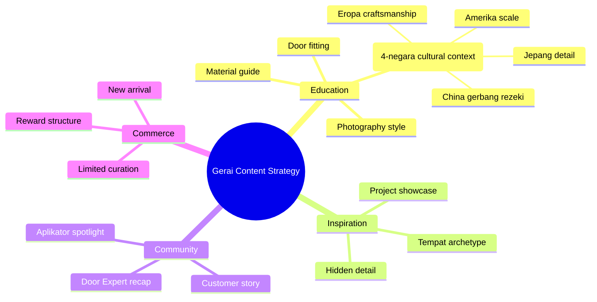

# Content Strategy (Annual/Quarterly)

Design pillar topic + sub-topic cluster + frequency + channel mapping untuk quarterly atau annual content plan. Output: pillar tree + cluster diagram.

## Triggers

Primary:
- "content strategi tahunan"
- "pillar topic"
- "content roadmap"

Secondary:
- "topic cluster"
- "editorial pillar"
- "content quarterly"

## Input Required

| Field | Type | Required | Default |
|---|---|---|---|
| time_horizon | enum | yes | "annual" or "quarterly" |
| business_phase | string | no | "pre-launch" or "post-launch" |
| budget_content | number | no | Rp 10jt/quarter |

## Output Template

```markdown
# Content Strategy: {PERIOD}

**Business phase:** {phase}
**Content budget:** Rp {amount}

## 4 Content Pillar
### Pillar 1: Education (Authority building)
- **Why this pillar:** Establish Gerai 1000 Pintu sebagai sumber knowledge
- **Sub-topic cluster:**
  - Filosofi Dunia Pintu (4-negara cultural context) (Jepang, Eropa, Amerika, China)
  - Material guide (kayu solid vs engineered)
  - Photography style premium retail
  - Door fitting standards
- **Asset type:** Long-form blog, YouTube long, IG carousel, Skill TikTok
- **Frequency:** 2 per week
- **Persona primary:** Arsitek, Aplikator, Developer

### Pillar 2: Inspiration (Visual storytelling)
- **Why:** Aesthetic anchor untuk premium positioning
- **Sub-topic:**
  - Project showcase (real customer install)
  - Hidden detail close-up (brass, kayu finish)
  - Tempat archetype (4-dunia mood)
- **Asset type:** IG feed, Reels, Pinterest
- **Frequency:** 3 per week
- **Persona:** Retail, Arsitek

### Pillar 3: Community (Engagement)
- **Why:** Build advocate base
- **Sub-topic:**
  - Aplikator spotlight
  - Door Expert konsultasi recap
  - Customer story
- **Asset type:** Live session, Reel, IG story
- **Frequency:** 1 per week
- **Persona:** All

### Pillar 4: Commerce (Conversion)
- **Why:** Direct to purchase action
- **Sub-topic:**
  - New arrival catalog
  - Limited curation seasonal
  - Promo "reward" structure
- **Asset type:** IG shop, web product page, ad campaign
- **Frequency:** 1 per week
- **Persona:** Retail, Mitra Dagang

## Topic Cluster Diagram
[Mermaid mindmap]

## Channel Mapping
| Pillar | IG Feed | IG Reel | TikTok | Blog | YouTube | Pinterest |
|---|---|---|---|---|---|---|

## Quarterly Roadmap
| Quarter | Theme | Pillar focus | Key asset |
|---|---|---|---|
| Q3 2026 | Pre-launch awareness | Education + Inspiration | Filosofi 4-dunia series |
| Q4 2026 | Soft launch + community | All 4 pillar | Project showcase |
| Q1 2027 | Scale + advocate | Community + Commerce | Aplikator certification |
| Q2 2027 | Brand-2 introduction | Education + Inspiration | Cross-brand narrative |

## KPI per Pillar
| Pillar | North star | Supporting metric |
|---|---|---|
| Education | Reach + time-on-page | Newsletter sign-up |
| Inspiration | Engagement rate | Save/share ratio |
| Community | UGC count | Member growth |
| Commerce | Conversion | Revenue from content |
```

## Visual Output



## Knowledge Dependency

- product-marketing skill
- Brand Canon (filosofi 4-dunia + tone)
- 6 Persona spec
- 4 Marketing Plan ABCD
- BP Chapter Map

## Mode

Default: EXECUTION
Switch: DISCUSSION jika pillar weighting ambigu

## Tools Required

- file-search
- artifacts (mindmap + Gantt)

## Validation Criteria

- 3-5 pillar (tidak 10+)
- Sub-topic cluster per pillar 3-5
- Frequency realistic untuk budget
- Persona coverage all 6 within quarter
- KPI per pillar specific
- Brand canon compliance

## Sample I/O

**Input:** "Content strategy Q3 2026 pre-launch Gerai 1000 Pintu Balikpapan"

**Output summary:**
- 4 pillar: Education (50%) + Inspiration (30%) + Community (15%) + Commerce (5%)
- Q3 focus pre-launch awareness, theme "Filosofi Dunia Pintu (4-negara cultural context)"
- 24 post total Q3 (8/month)
- Persona priority: Arsitek + Retail
- Budget Rp 10jt: Rp 5jt content production, Rp 3jt KOL, Rp 2jt boost
- Mindmap pillar diagram embedded

## Handoff

- content-calendar (translate strategy → daily plan)
- ad-creative (paid amplification)
- channel-mix-calc (budget per channel)
