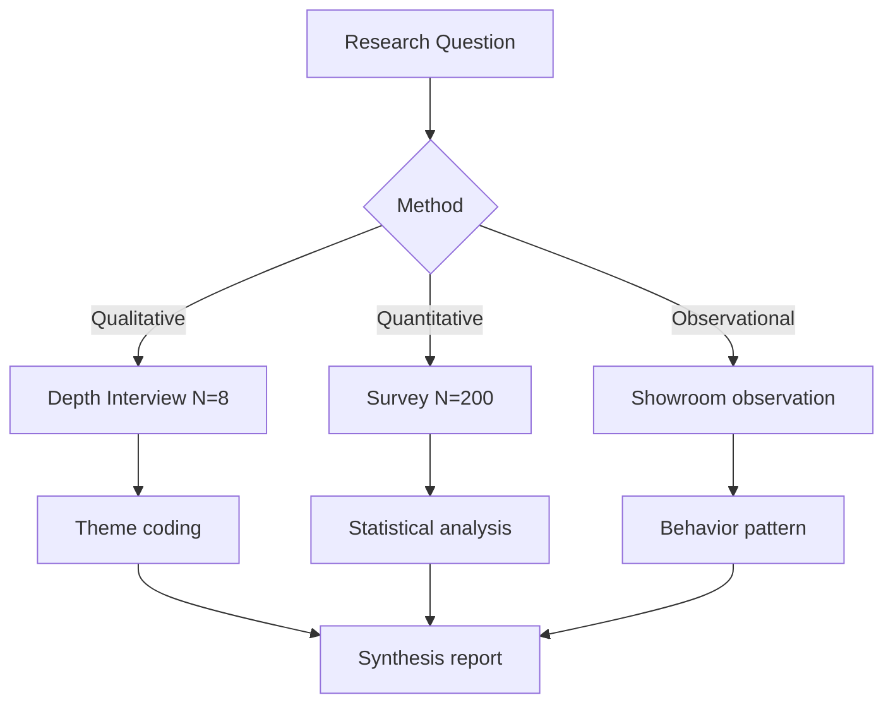

# Customer Research Framework

Rancang research plan untuk validate persona/hypothesis. Output: research design siap dieksekusi (qualitative + quantitative).

## Triggers

Primary:
- "research framework"
- "wawancara customer"
- "validate persona"

Secondary:
- "survey design"
- "user interview"

## Input Required

| Field | Type | Required | Default |
|---|---|---|---|
| research_question | string | yes | - |
| persona_target | array | yes | - |
| budget | number | no | Rp 5jt |
| timeline | days | no | 30 |

## Output Template

```markdown
# Research Plan: {TOPIC}

**Research question:** {Single primary}
**Hypotheses (3 max):**
1. {Hypothesis} — measurable how
2. ...
3. ...

## Method Mix
- Qualitative: {N} depth interview × {duration}
- Quantitative: {N} survey responses
- Observational: {if applicable}

## Sample Size & Recruitment
| Persona | Quant N | Qual N | Recruitment channel | Cost est |
|---|---|---|---|---|

## Question Bank
### Qualitative interview (60 min)
1. Opening rapport (5 min)
2. Pain discovery (15 min): {questions}
3. Behavior mapping (15 min): {questions}
4. Solution exploration (15 min): {questions}
5. Closing + referrals (10 min)

### Quantitative survey (10 min)
{15-20 questions, mix Likert + multiple choice + open}

## Analysis Framework
- Theme coding: {process}
- Pattern surfacing: {how to identify}
- Confidence threshold: {what counts as validated}

## Deliverable
- Research report (10-15 pages)
- Updated persona spec
- Action recommendation

## Timeline
| Week | Activity |
|---|---|
| 1 | Recruitment + pilot |
| 2-3 | Interview + survey |
| 4 | Analysis + report |

## Budget Breakdown
| Item | Cost |
|---|---|
| Incentive Rp 100K × {N} | Rp ... |
| Survey tool (Typeform/etc) | Rp ... |
| Transport | Rp ... |
| Total | Rp ... |
```

## Visual Output

Research flow diagram + question tree:



## Knowledge Dependency

- 6 Persona spec (baseline yang divalidate)
- Brand Canon

## Mode

Default: EXECUTION
Switch: DISCUSSION jika hypothesis lemah atau scope research terlalu besar

## Tools Required

- file-search
- artifacts (flowchart)

## Validation Criteria

- 1 research question primary (bukan 5)
- 3 hypothesis max (bukan 10)
- Sample size justified statistically
- Budget realistic
- Timeline 30-60 days
- Brand canon compliance (no em-dash, "tempat" bukan "rumah")

## Sample I/O

**Input:** "Research framework untuk validate persona Arsitek apakah willing pay premium 30% untuk curated catalog"

**Output summary:**
- Research question: Apakah Arsitek di Kaltim willing pay 30% premium untuk catalog yang dikurasi vs generic?
- 3 hypothesis: (1) Willing pay premium kalau client project >Rp 500jt, (2) Trust trigger dari Door Expert konsultasi, (3) Curated story lebih persuasive dari spec sheet
- Method: 8 depth interview + 100 survey
- Sample: Arsitek aktif Kaltim, sertifikasi IAI/HDII
- 4-week timeline, Rp 5jt budget
- Question bank lengkap
- Flow diagram embedded

## Handoff

- persona-deep-dive (update spec persona pasca-research)
- product-marketing (adjust positioning kalau finding signifikan)
- ab-test-design (kalau hypothesis butuh A/B)
