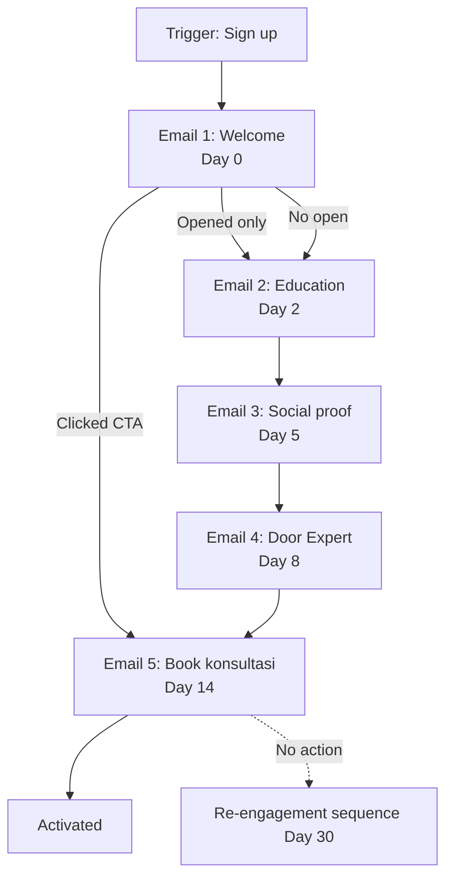

# Email Sequence Builder

Design email drip campaign atau lifecycle flow: trigger + delay + subject + body + CTA + branching logic.

## Triggers

Primary:
- "email sequence"
- "drip campaign"
- "email flow [X]"

Secondary:
- "nurture sequence"
- "abandoned cart email"
- "welcome series"

## Input Required

| Field | Type | Required | Default |
|---|---|---|---|
| sequence_type | enum | yes | (welcome/abandoned/post-purchase/winback/lead-nurture) |
| persona_target | string | yes | - |
| goal | string | yes | - |
| total_emails | number | no | 5 |

## Output Template

```markdown
# Email Sequence: {NAME}

**Type:** {welcome/abandoned/etc}
**Persona target:** {persona}
**Goal:** {SMART}
**Total emails:** {N} over {duration}

## Sequence Map

### Email 1 — Trigger: {event}
**Delay:** 0 (immediate)
**Subject:** "{subject 30-50 char}"
**Preheader:** "{preview text}"
**Body summary:** {1 paragraf}
**Primary CTA:** "{4 word CTA}" → {landing URL}
**Branching:**
- IF clicked CTA → skip to Email 3
- IF opened, no click → continue to Email 2
- IF no open → continue to Email 2 (different subject test)

### Email 2 — Trigger: {event}
**Delay:** {time after Email 1}
**Subject:** "{...}"
**Body summary:** {...}
**Primary CTA:** {...}
**Branching:** {...}

### Email 3-N
{same structure}

## Subject Line Variants per Email (A/B test)
| Email | Variant A | Variant B | Test hypothesis |
|---|---|---|---|

## Personalization Token
- {first_name}
- {persona_segment}
- {last_engagement_topic}
- {city}

## Content Theme per Email
- Email 1: Welcome + filosofi intro
- Email 2: Education (4-dunia deep)
- Email 3: Social proof (project showcase)
- Email 4: Authority (Door Expert intro)
- Email 5: Soft CTA (book konsultasi gratis)

## KPI per Email
| Email | Open rate target | Click rate target | Conversion target |
|---|---|---|---|

## Brand Canon Check (semua email)
- Em-dash: ✅ none
- "tempat" not "rumah": ✅
- Gerai 1000 Pintu lengkap: ✅
- Premium hangat tone: ✅
- Audience-first framing: ✅

## Asset List
- Email header banner (3 variant)
- CTA button design (brass + ivory + charcoal)
- Personalization data source (CRM field)
- Unsubscribe link + footer
```

## Visual Output

Email flow diagram:



## Knowledge Dependency

- 6 Persona spec
- Brand Canon
- Editorial Rules
- product-marketing skill
- onboarding skill (untuk welcome series)

## Mode

Default: EXECUTION
Switch: NEED_CLARIFICATION jika sequence type ambigu

## Tools Required

- file-search
- artifacts (flow diagram)

## Validation Criteria

- 3-7 email per sequence (tidak 15+ spam)
- Subject 30-50 char (kompatibel mobile preview)
- Preheader complement subject (bukan repeat)
- Branching logic explicit (open/click/no-action)
- Personalization token reasonable
- Brand canon strict per email
- Unsubscribe + footer mandatory

## Sample I/O

**Input:** "Email sequence welcome series Arsitek baru sign up community Gerai, 5 email goal book konsultasi"

**Output summary:**
- 5 email over 14 hari
- Email 1 Welcome Day 0 + filosofi 4-dunia intro
- Email 2 Education Day 2 + 4-dunia deep dive (Jepang archetype)
- Email 3 Social proof Day 5 + 3 Arsitek project showcase
- Email 4 Authority Day 8 + Door Expert intro + 5 kompetensi
- Email 5 Book konsultasi Day 14 + CTA gratis konsultasi 30 menit
- Branching: skip ke E3 kalau E1 click
- Re-engagement Day 30 kalau no action
- Flow diagram embedded

## Handoff

- copywriting (per email body)
- Editorial Reviewer (canon QC)
- onboarding (kalau welcome series)
- CRM integration (untuk personalization data)
