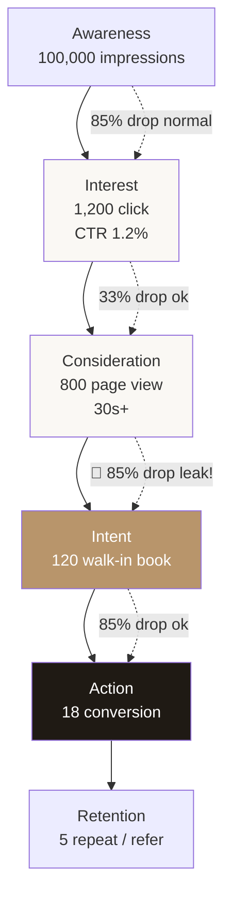

# Funnel Audit & Improvement Hypothesis

Analyze conversion funnel per channel/campaign, identify drop-off, generate 3 improvement hypothesis ranked by impact-effort.

## Triggers

Primary:
- "audit funnel"
- "konversi cek"
- "drop-off rate"

Secondary:
- "funnel optimization"
- "conversion drop"

## Input Required

| Field | Type | Required | Default |
|---|---|---|---|
| funnel_data | object | yes | (stage + metric pairs) |
| benchmark_source | string | no | "industry retail premium Indonesia" |
| persona | string | no | (inferred) |

## Output Template

```markdown
# Funnel Audit: {CHANNEL/CAMPAIGN}

**Period:** {date range}
**Total volume:** {N entries}

## Stage-by-Stage Analysis
| Stage | Metric | Current | Benchmark | Drop-off % | Severity |
|---|---|---|---|---|---|
| Awareness | Impressions | {N} | {N} | - | - |
| Interest | CTR |  |  | - |
| Intent | Add inquiry / Walk-in book | {N} | {N} |  | - |
| Retention | Repeat / Refer | {N} | {N} | - | - |

## Biggest Leak Identified
**Stage X → Y:** Drop 
**Effort:** Low (1-3 days implement)
**Confidence:** Med-High
**Test method:** A/B test atau direct deploy

### Hypothesis #2
{same structure}

### Hypothesis #3
{same structure}

## Recommended A/B Test
**Test priority:** Hypothesis #1
**Variants:**
- Control: current
- Treatment: {described change}
**Primary metric:** {stage Y metric}
**Sample size needed:** {N}
**Duration estimate:** {days}

## Quick Wins (deploy without testing)
1. {Low-risk change with high expected return}
2. {...}

## Long-term Funnel Health
- KPI dashboard recommendation
- Monthly review cadence
- Cohort analysis suggestion
```

## Visual Output

Funnel diagram dengan leak highlight:



## Knowledge Dependency

- Customer Journey 5-stage
- 6 Persona spec (untuk diagnostic per persona)
- Brand Canon
- Industry benchmark (retail premium Indonesia)

## Mode

Default: EXECUTION
Switch: NEED_CLARIFICATION jika funnel data tidak lengkap

## Tools Required

- file-search
- web-search (benchmark industry update)
- code-interpreter (kalkulasi sample size)
- artifacts (funnel diagram)

## Validation Criteria

- All 5-6 stage assessed
- Drop-off severity tagged (🔴 critical = >80% unexpected, 🟠 high, 🟢 normal)
- 3 hypothesis SPECIFIC + TESTABLE (bukan "improve UI")
- Impact-effort ranked
- Quick wins min 2 (deploy tanpa test risk rendah)
- Brand canon compliance

## Sample I/O

**Input:** "Audit funnel Meta Ads campaign Oktober 2026 wave 1"

**Output summary:**
- Awareness 100K impression → Interest 1.2K click (CTR 1.2% normal) → Consideration 800 PV (drop 33% ok) → Intent 120 walk-in book (drop 85% 🔴 LEAK!) → Action 18 conversion → Retention 5 repeat
- Biggest leak: PV → Walk-in book drop 85%
- Hypothesis #1: Page tidak ada CTA jelas "Book konsultasi gratis" (Quick win, deploy today)
- Hypothesis #2: Form panjang 8 field (Reduce to 3 field, test 1 minggu)
- Hypothesis #3: No social proof di landing (Add Door Expert testimonial, test 2 minggu)
- Recommended A/B: Hypothesis #1 priority (highest impact-effort)
- Funnel diagram dengan leak highlight embedded

## Handoff

- cro (untuk implementation fix)
- ab-test-design (untuk test setup)
- copywriting (kalau CTA/form copy issue)
- landing page brief (kalau UX overhaul)
