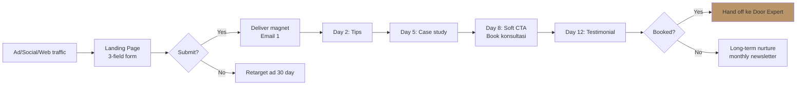

# Lead Magnet Creation

Design lead magnet (freebie offering untuk capture leads): magnet type + topic + format + landing page + nurture sequence.

## Triggers

Primary:
- "lead magnet"
- "freebie offer"
- "lead gen offer"

Secondary:
- "capture leads"
- "email list build"

## Input Required

| Field | Type | Required | Default |
|---|---|---|---|
| persona_target | string | yes | - |
| pain_point_addressed | string | yes | - |
| funnel_stage | enum | no | "awareness" or "consideration" |

## Output Template

```markdown
# Lead Magnet: {NAME}

**Persona target:** {persona}
**Pain addressed:** {specific pain}
**Funnel stage:** {awareness/consideration/decision}

## Magnet Concept
**Type:** {Guide PDF / Checklist / Template / Calculator / Mini course / Webinar / Quiz}
**Title:** "{Compelling title, 7-10 word}"
**Tagline:** "{1 sentence value prop}"

**Why this magnet:**
{1 paragraf: alasan format ini cocok persona ini, alignment ke pain}

## Content Outline

### Section 1: {Title}
- {Sub-point}
- {Sub-point}

### Section 2: {Title}
- {...}

### Section 3: {Title}
- {...}

### Bonus: {Title}
- {...}

**Estimated length:**
- Guide PDF: 10-20 page
- Checklist: 1-2 page
- Template: 1-3 page
- Calculator: 1 interactive page
- Mini course: 5-7 email
- Webinar: 30-45 min
- Quiz: 8-12 question

## Landing Page Spec

### Above the fold
- Headline: "{Direct value prop, 10 word max}"
- Subhead: "{Reinforcement + audience-specific benefit}"
- Visual: {Magnet preview mockup}
- Form: 3 field max (Name, Email, optional Persona)
- CTA: "{Get Magnet Now / Download Free}" (specific action)
- Trust signal: "{N+ Arsitek/Aplikator sudah download}" or "Disusun oleh Door Expert"

### Body sections
1. What you'll learn: 3-5 bullet specific outcome
2. Sample preview: 1 page sneak peek
3. About author: Door Expert bio + credentials
4. FAQ: top 3 objection

## Nurture Email Sequence (post-download)
| Email | Day | Subject | Content focus |
|---|---|---|---|
| 1 | 0 | "Sini magnet Anda" | Deliver + welcome |
| 2 | 2 | "Tips pakai magnet ini" | Implementation help |
| 3 | 5 | "Project case study" | Social proof |
| 4 | 8 | "Konsultasi gratis dengan Door Expert" | Soft CTA |
| 5 | 12 | "Customer story" | Testimonial |

## Distribution Channel
- Web: landing page + popup trigger
- Social: organic post link + boost
- Ads: Meta lead gen ad (in-platform form)
- Influencer: KOL share with custom link
- Email: existing list cross-promo

## KPI Tracking
| Metric | Target | Source |
|---|---|---|
| Landing page conversion rate |  | Email tool |
| Email-to-consult conversion | {%} | CRM |
| Lead-to-customer LTV | Rp {X} | Sales data |

## Production Effort
- Design: {hours} (PDF layout, mockup)
- Copy: {hours}
- Landing page build: {hours}
- Email sequence setup: {hours}
- Total launch effort: {days}

## Brand Canon Check
- Title tidak "luxurious mewah" framing
- Premium hangat tone
- "tempat" not "rumah"
- "Gerai 1000 Pintu" lengkap
- Filosofi Dunia Pintu (4-negara cultural context) integration kalau relevant
- Door Expert authority signal
```

## Visual Output

Lead capture flow:



## Knowledge Dependency

- 6 Persona spec
- Brand Canon
- product-marketing skill
- emails skill (untuk nurture sequence)

## Mode

Default: EXECUTION
Switch: NEED_CLARIFICATION jika persona/pain ambigu

## Tools Required

- file-search
- web-search (kompetitor magnet benchmark)
- artifacts (flow diagram + landing wireframe)

## Validation Criteria

- Magnet type match persona behavior (Arsitek = guide PDF, Aplikator = skill video, etc)
- Title benefit-oriented (bukan vague)
- Landing page 3-field max (avoid abandonment)
- Nurture 5 email max (anti spam)
- KPI realistic (CPL premium retail Rp 50-200K, conversion 20-30%)
- Brand canon compliance

## Sample I/O

**Input:** "Lead magnet untuk Arsitek di Kaltim, pain point 'kesulitan rekomendasi pintu yang aligned dengan filosofi rumah klien'"

**Output summary:**
- Magnet: "Pintu Klien Anda — Panduan Filosofi Dunia Pintu (4-negara cultural context) untuk Arsitek" (Guide PDF 15-page)
- Sections: Dunia Pintu framework (Jepang/Eropa/Amerika/China) + how to match per project + 10 case study + checklist client interview
- Landing: hero brass detail + "Disusun oleh Door Expert" trust signal + 3-field form
- Nurture: 5 email over 14 days, soft CTA Day 8 konsultasi Door Expert
- KPI: 200 download/month, CPL Rp 75K, 25% download-to-consult conversion
- Flow diagram embedded

## Handoff

- copywriting (magnet body content)
- emails (nurture sequence detail)
- ads (Meta lead gen campaign)
- onboarding (post-conversion experience)
