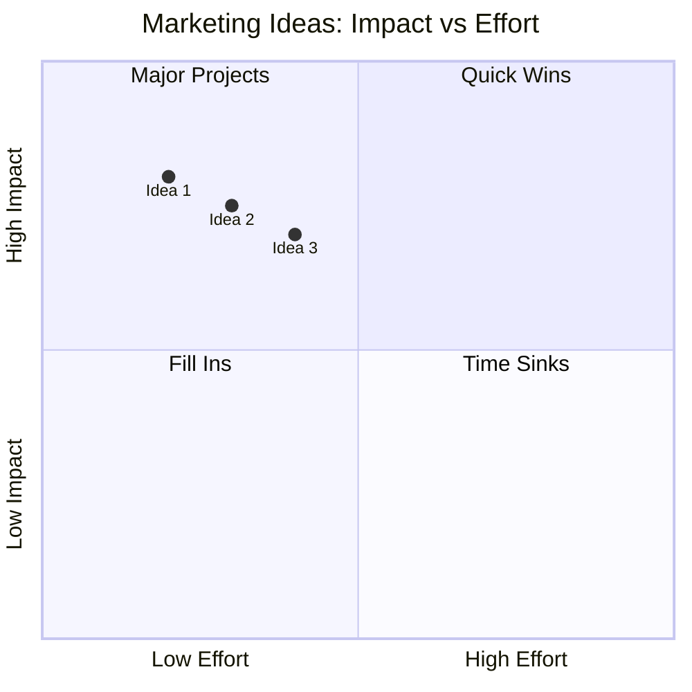

# Marketing Ideas Generator

Brainstorm 10 ide marketing untuk konteks brief, ranked by Impact-Effort matrix. Output: top 3 recommendation dengan reasoning.

## Triggers

Primary:
- "kasih 10 ide marketing"
- "brainstorm ide"
- "ide kampanye untuk [X]"

Secondary:
- "ide cretive"
- "marketing tactic baru"
- "growth hack ide"

## Input Required

| Field | Type | Required | Default |
|---|---|---|---|
| context | string | yes | - |
| constraint | string | no | "wave 1 budget Rp 50jt" |
| persona_target | array | no | all 6 |

## Output Template

```markdown
# 10 Marketing Ideas: {CONTEXT}

## Impact-Effort Matrix
| # | Idea | Impact | Effort | Persona fit | Score |
|---|---|---|---|---|---|
| 1 | {Idea name} | H/M/L | H/M/L | {persona} | {1-10} |
| ... | ... | ... | ... | ... | ... |
| 10 | {Idea name} | H/M/L | H/M/L | {persona} | {1-10} |

## Top 3 Recommended

### Idea #1: {Name}
**Impact-Effort:** High-Low (best ratio)
**Persona fit:** {persona}
**Concept:** {2 sentence}
**Why this works:** {1 paragraf}
**How to execute (quick):**
1. {Step}
2. {Step}
3. {Step}
**Estimated outcome:** {KPI projection}

### Idea #2: {Name}
[same structure]

### Idea #3: {Name}
[same structure]

## Bonus: Wildcard Idea
{1 unconventional ide yang risky tapi big upside}

## Filtered Out (with reasoning)
- Idea X: skip karena {reason}
- Idea Y: skip karena {reason}
```

## Visual Output



## Knowledge Dependency

- 4 Marketing Plan ABCD
- 6 Persona spec
- Brand Canon
- product-marketing skill output

## Mode

Default: EXECUTION (creative + structured)
Switch: DISCUSSION jika user mau debate 1 ide

## Tools Required

- web-search (trend marketing terkini, kompetitor benchmark)
- file-search (knowledge base)
- artifacts (quadrant chart)

## Validation Criteria

- 10 ide concrete (bukan generic "do more social")
- Impact-Effort scoring konsisten
- Top 3 berbeda nature (bukan 3 variant 1 ide sama)
- Wildcard 1 (unconventional)
- Brand canon compliance
- Hindari "luxurious mewah" framing (Gerai = premium hangat)

## Sample I/O

**Input:** "Kasih 10 ide marketing untuk Q3 attract persona Arsitek + Designer"

**Output summary:**
- 10 ide ranked
- Top 3: (1) AI search content series "Filosofi 4-Dunia per Gaya Rumah" (high-low quadrant), (2) Arsitek roundtable monthly Door Expert (high-medium), (3) Co-branded showcase project + photo content (high-high)
- Wildcard: AR "try door at your home" app
- Impact-Effort quadrant chart embedded
- Filtered out: paid Google Ads (low-medium), generic IG posting (low-low)

## Handoff

- campaign-brief (kalau ide terpilih mau di-execute)
- content-strategy (kalau ide content-focused)
- influencer-brief (kalau ide influencer-focused)
- visual-summary (untuk render ide jadi mockup visual)
