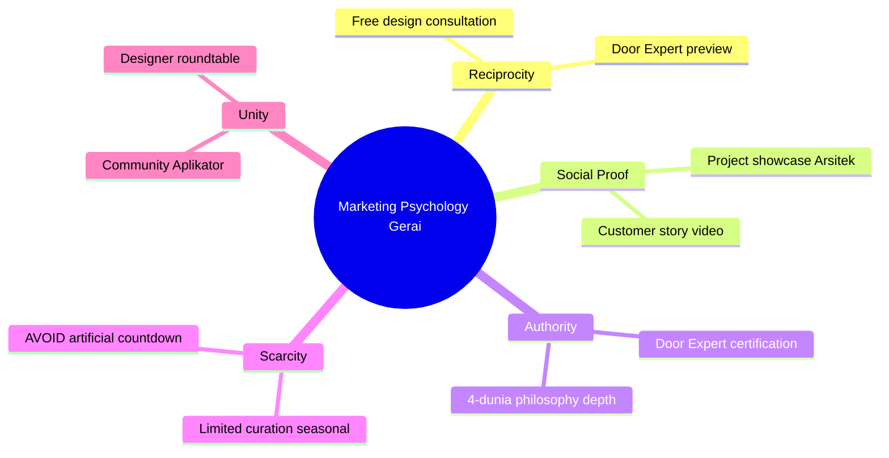

# Marketing Psychology Application

Apply 7 behavioral science principle ke konteks campaign Gerai. Output: trigger lever yang konkret + ethical risk check.

## Triggers

Primary:
- "psychology trigger"
- "behavioral lever"
- "kenapa orang beli"

Secondary:
- "scarcity", "social proof", "anchoring"
- "behavior change campaign"

## Input Required

| Field | Type | Required | Default |
|---|---|---|---|
| context | string | yes | - |
| persona_target | array | no | all 6 |
| campaign_stage | enum | no | "consideration" |

## Output Template

```markdown
# Marketing Psychology: {CONTEXT}

## 7 Principles Application

### 1. Reciprocity
{Bagaimana apply: kasih dulu, baru minta. Example untuk Gerai.}
**Ethical risk:** {Low/Med/High + reasoning}

### 2. Commitment & Consistency
{...}
**Ethical risk:** ...

### 3. Social Proof
{...}
**Ethical risk:** ...

### 4. Authority
{...}
**Ethical risk:** ...

### 5. Liking
{...}
**Ethical risk:** ...

### 6. Scarcity
{...}
**Ethical risk:** ...

### 7. Unity (in-group identity)
{...}
**Ethical risk:** ...

## Recommended Top 3 Levers untuk Context

### Lever 1: {Principle}
**Application konkret:** {detailed how}
**Example messaging:** "{actual copy example}"
**Persona resonance:** {which persona this hits}
**Ethical check:** ✅ aligned dengan brand canon hangat (bukan manipulative)

### Lever 2: {...}
### Lever 3: {...}

## Anti-pattern Warning
{Lever yang JANGAN dipakai untuk Gerai + why}

## Brand Canon Compatibility Check
- Premium hangat (bukan mewah dingin) — OK / FLAG
- Tone calm refined — OK / FLAG
- Audience-first framing — OK / FLAG
```

## Visual Output

Principle hierarchy diagram + applicability matrix:



## Knowledge Dependency

- Brand Canon (tone calm refined premium hangat)
- 6 Persona spec
- Editorial Rules (anti-manipulative copy)

## Mode

Default: EXECUTION
Switch: DISCUSSION jika user minta debate ethical implication

## Tools Required

- file-search
- artifacts (mindmap)

## Validation Criteria

- 7 principles all assessed
- Top 3 recommended specific + actionable
- Anti-pattern warning explicit
- Brand canon compatibility check WAJIB
- No manipulative tactics (Gerai = premium hangat, bukan hard-sell)

## Sample I/O

**Input:** "Psychology lever untuk push first-time visit ke showroom Balikpapan"

**Output summary:**
- 7 principles assessed
- Top 3: (1) Authority via Door Expert certification + "konsultasi gratis", (2) Social Proof via project showcase + customer photo wall, (3) Reciprocity via "ambil design draft Anda di sini"
- Anti-pattern: Scarcity artificial countdown ("hanya 5 tempat hari ini!") = jangan
- Brand canon: aligned (premium hangat, audience-first)
- Mindmap visual embedded

## Handoff

- copywriting (apply principle ke copy actual)
- campaign-brief (embed principle ke message hierarchy)
- ab-test-design (kalau mau validate lever via A/B)
