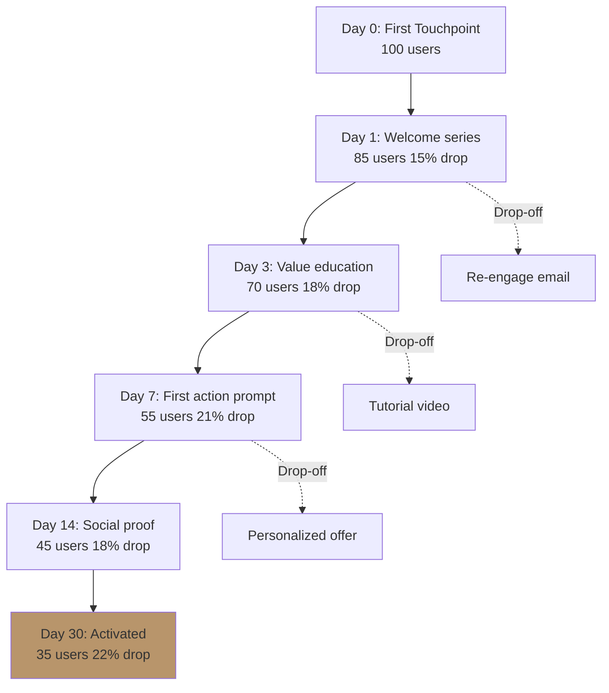

# Customer Onboarding Design

Design post-purchase / post-signup activation flow. Time-to-value mapping + touchpoint sequence + drop-off intervention.

## Triggers

Primary:
- "post-signup flow"
- "activation customer"
- "onboarding design"

Secondary:
- "time to value"
- "first 30 days customer"

## Input Required

| Field | Type | Required | Default |
|---|---|---|---|
| customer_segment | enum | yes | (1 dari 6 persona) |
| product_or_service | string | yes | - |
| desired_outcome | string | yes | "first purchase" or "repeat purchase" |

## Output Template

```markdown
# Onboarding Flow: {SEGMENT} → {OUTCOME}

**Time-to-value target:** {Days/hours}
**Activation milestone:** {What "activated" means measurable}

## Touchpoint Sequence

### Day 0 (Trigger event)
- Touchpoint: {channel + message}
- Goal: {micro goal}
- Drop-off risk: {%}

### Day 1
- Touchpoint: {...}
- Goal: {...}

### Day 3
{...}

### Day 7
{...}

### Day 14
{...}

### Day 30
- Activation check: {has user reached milestone?}
- Re-engagement if not: {fallback path}

## Drop-off Prediction & Intervention
| Stage | Expected drop-off % | Intervention | Channel |
|---|---|---|---|

## Success Metrics
- Activation rate: {target %}
- Time-to-activation: {target days}
- Repeat engagement: {target %}

## Asset List
| Touchpoint | Asset type | Owner | Status |
|---|---|---|---|
```

## Visual Output

Onboarding funnel diagram dengan drop-off:



## Knowledge Dependency

- 6 Persona spec
- Customer Journey 5-stage
- product-marketing skill

## Mode

Default: EXECUTION
Switch: NEED_CLARIFICATION jika "activated" definition ambigu

## Tools Required

- file-search
- artifacts (flowchart funnel)

## Validation Criteria

- Time-to-value target specific (bukan "as soon as possible")
- Touchpoint per stage specific channel + message
- Drop-off prediction realistic (15-25% typical per stage)
- Intervention concrete (bukan "follow up")
- Brand canon compliance

## Sample I/O

**Input:** "Onboarding flow untuk Arsitek baru daftar di community Gerai, goal repeat consultation"

**Output summary:**
- Time-to-value target: 7 hari (sampai first consultation booking)
- Activation milestone: book + complete 1 Door Expert konsultasi
- 5-touchpoint sequence: welcome → catalog tour → Door Expert intro → first booking nudge → post-konsultasi follow-up
- Drop-off prediction: 35% total to activation
- Re-engagement path: tutorial video + Arsitek peer testimonial
- Funnel diagram embedded

## Handoff

- emails (untuk sequence content)
- content-calendar (asset preparation)
- referral-program (kalau activated user jadi advocate)
