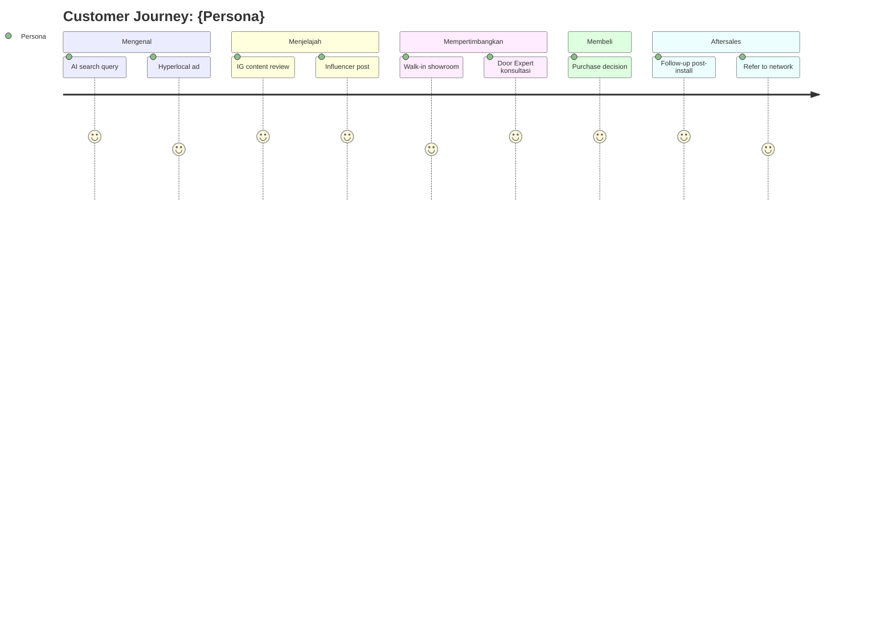

# Persona Deep-Dive

Drill 1 dari 6 persona Gerai jadi profile lengkap actionable. Output: persona card siap pakai untuk campaign, content, channel selection.

## Triggers

Primary:
- "expand persona [Retail/Mitra/Developer/Arsitek/Kontraktor/Aplikator]"
- "deep dive persona"
- "profile [persona]"

Secondary:
- "siapa [persona]"
- "expand audience X"

## Input Required

| Field | Type | Required | Default |
|---|---|---|---|
| persona_name | enum | yes | (1 dari 6) |
| context | string | no | "general" |
| campaign_purpose | string | no | "awareness" |

## Output Template

```markdown
# Persona Deep-Dive: {NAME}

**Tier prioritas Y1:** {%}
**Customer Journey entry stage:** {Mengenal/Menjelajah/Mempertimbangkan/Membeli/Setelah}

## Demographic
- Age range, Income range, Location, Education

## Psychographic
- Values, Lifestyle, Aspirations, Fears

## Pain Points (top 3)
1. {Pain} → consequence + emotional weight
2. {Pain} → ...
3. {Pain} → ...

## Trigger to Buy (specific events)
- {Event 1} → {action expected}
- {Event 2} → ...

## Top 3 Objection
1. {Objection} → counter-message
2. {Objection} → ...
3. {Objection} → ...

## Content Angle yang Resonate
- Theme 1: {description + example}
- Theme 2: {description + example}
- Theme 3: {description + example}

## Channel Preference (ranked)
| Rank | Channel | Why | Best content type |
|---|---|---|---|

## Voice Tone Resonance
{Premium emotional / Friendly Gen Z / Story-driven / Professional / Aspirational}

## Influencer Trust Type
- {Tier macro/mikro/nano}: {who they follow + why}

## Conversion Trigger
- Decision drivers (top 3)
- Cost-to-decision ratio
- Decision timeline (days/weeks/months)

## Recommended Campaign Angle
{1 paragraf: bagaimana approach persona ini}
```

## Visual Output

Persona card visual + journey stage flowchart:



## Knowledge Dependency

- 6 Persona spec (Brand Canon)
- product-marketing skill output
- Customer Journey 5-stage definition
- CRM 6-modul spec

## Mode

Default: EXECUTION
Switch: NEED_CLARIFICATION jika persona ambigu (Aplikator wholesale atau retail?)

## Tools Required

- file-search
- web-search (optional benchmark persona kompetitor)
- artifacts (Mermaid journey diagram)

## Validation Criteria

- Persona match 1 dari 6 spec (Retail/Mitra/Developer/Arsitek/Kontraktor/Aplikator)
- Pain points top 3, bukan 10+
- Trigger to buy specific event (bukan abstract)
- Channel ranked dengan reasoning
- Brand canon compliance

## Sample I/O

**Input:** "Deep dive persona Aplikator untuk campaign retention Q4"

**Output summary:**
- Aplikator 5% target Y1, entry stage Mengenal via skill content
- Pain top 3: career stagnation, tool quality inconsistent, tidak ada pathway naik
- Trigger to buy: dapat proyek besar (bonus income), atau ada training cert
- Objection: harga premium dianggap "tidak worth" untuk customer mereka
- Channel: TikTok skill content (1) > IG tutorial (2) > YouTube long-form (3)
- Voice: Story-driven dengan testimonial
- Influencer: Mikro Aplikator senior (mentor type)
- Journey Mermaid diagram embedded

## Handoff

- influencer-brief (kalau pakai influencer)
- content-strategy (kalau bikin content series)
- channel-mix-calc (untuk allocation)
