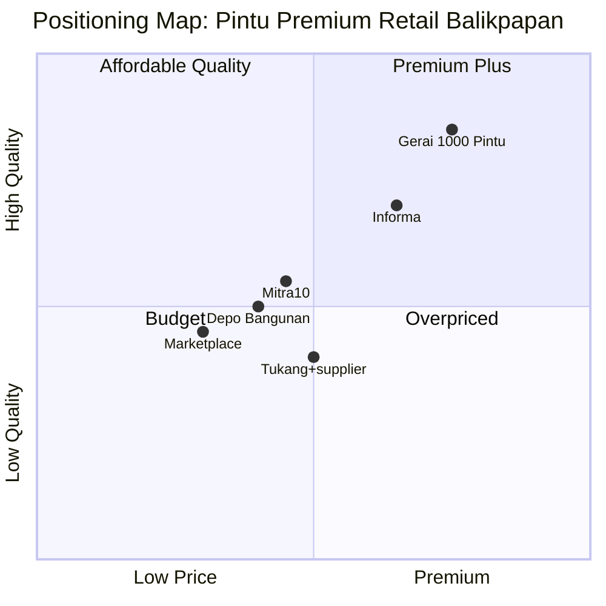

# Positioning Map Generator

Plot Gerai 1000 Pintu vs kompetisi 4-Tier dalam 2x2 matrix dengan axis yang dipilih sesuai konteks. Identify white space + competitive threat.

## Triggers

Primary:
- "positioning map"
- "competitive map"
- "X vs Y vs Z"
- "kompetitor map"

Secondary:
- "white space analysis"
- "differentiator vs kompetitor"

## Input Required

| Field | Type | Required | Default |
|---|---|---|---|
| axis_x | string | no | Price (low → premium) |
| axis_y | string | no | Quality perception (low → high) |
| focus_persona | string | no | Retail (primary) |

## Output Template

```markdown
# Positioning Map: {TOPIC}

**Axis X:** {Variable, e.g., Price}
**Axis Y:** {Variable, e.g., Quality perception}
**Focus persona:** {Persona}

## Plot
- 🟢 Gerai 1000 Pintu: [X, Y] — [reasoning + differentiator]
- 🔴 Tier 1 Direct (kosong, antisipasi Jeld-Wen): [X, Y]
- 🟡 Tier 2 Indirect:
  - Mitra10: [X, Y]
  - Depo Bangunan: [X, Y]
  - Marketplace (Tokopedia/Shopee): [X, Y]
  - Informa/Ace: [X, Y]
- 🟠 Tier 3 Substitute (tukang+supplier): [X, Y]
- 🟣 Tier 4 Adjacent Premium: [X, Y]

## White Space (opportunity area)
{Area kosong di map yang Gerai bisa exploit}

## Closest Threat
{Kompetitor terdekat + why + threat severity}

## Differentiator Gerai (3 paling kuat)
1. {Differentiator + how to amplify}
2. {Differentiator + how to amplify}
3. {Differentiator + how to amplify}

## Strategic Recommendation
{1-2 paragraf saran positioning shift atau reinforce}
```

## Visual Output



## Knowledge Dependency

- Kompetisi 4-Tier mapping (Brand Canon)
- 6 Persona spec
- Positioning statement (product-marketing)

## Mode

Default: EXECUTION
Switch: DISCUSSION kalau user minta debate positioning shift

## Tools Required

- file-search
- web-search (untuk update data kompetitor terkini)
- artifacts (Mermaid quadrantChart)

## Validation Criteria

- Plot semua 4-Tier kompetisi
- White space identified specific (bukan generic "ada gap")
- Differentiator 3 paling kuat (bukan 10 lemah)
- Brand canon compliance

## Sample I/O

**Input:** "Positioning map Gerai vs kompetitor untuk persona Arsitek"

**Output summary:**
- Axis: Curated narrative quality vs Catalog depth
- Plot: Gerai high-curated low-depth (initial), Mitra10 low-curated high-depth
- White space: high-curated mid-depth (Gerai opportunity dengan Phase 2 multi-brand)
- Threat: Adjacent premium (Informa, Ace Hardware) shift toward curated
- Differentiator: Dunia Pintu category, 4-dunia narrative, Door Expert konsultasi
- Quadrant chart Mermaid embedded

## Handoff

- competitor-profiling (untuk deep-dive 1 kompetitor)
- product-marketing (untuk update positioning statement)
- CCO Gerai (untuk narrative refinement)
