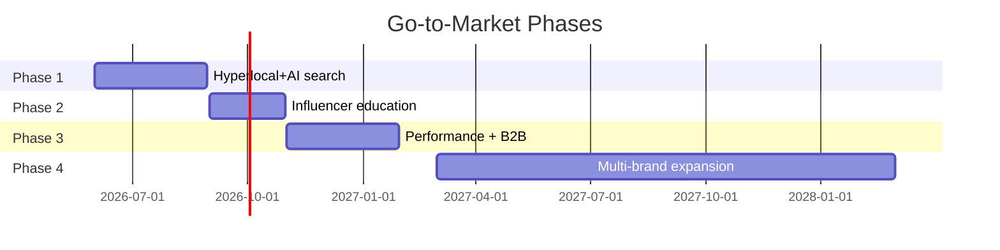

# Product Marketing (Foundational)

Foundational skill yang CMO baca DULU sebelum execute skill lain. Define product narrative, audience, value proposition, dan go-to-market thesis untuk Gerai 1000 Pintu.

## Triggers

Primary:
- "positioning produk"
- "audience define"
- "value proposition"
- "go-to-market thesis"

Secondary:
- "siapa target Gerai"
- "narrative produk"
- "PMF check"

## Input Required

| Field | Type | Required | Default |
|---|---|---|---|
| product_or_category | string | yes | "Gerai 1000 Pintu" |
| context | string | no | (read from memory) |

## Output Template

```markdown
# Product Marketing Foundation: {PRODUCT}

## Product Narrative
**Category creation:** Dunia Pintu pertama Indonesia
**3 Pilar interlock:** Product + Knowledge + Service
**Tagline locked:** "A Thousand Doors, A Thousand Dreams"

## Audience Map (6 Persona)
| Persona | % Target Y1 | Primary need | Trigger to buy |
|---|---|---|---|
| Retail (End User) | 60% | Premium home upgrade | Pindah rumah, renovasi |
| Mitra Dagang | 10% | Reliable supplier | Vendor consolidation |
| Developer | 8% | Bulk standard quality | Project tender |
| Arsitek | 12% | Curated catalog narrative | Client presentation |
| Kontraktor | 5% | Fast lead time + service | Project execution |
| Aplikator | 5% | Skill development + tools | Career growth |

## Value Proposition Canvas
- **For [persona]:** Pain X → Gain Y → Differentiator Z

## Positioning Statement
"Untuk [persona] yang [insight], Gerai 1000 Pintu adalah [category]
yang [differentiator] karena [reason to believe]."

## Go-to-Market Thesis
- Phase 1: Hyperlocal Balikpapan + AI search entry
- Phase 2: Influencer education-led (Arsitek, Designer)
- Phase 3: Performance + Lead Gen B2B
- Phase 4: Multi-brand expansion (post brand-2)
```

## Visual Output

Persona radar chart + positioning statement card + GTM phase timeline:



## Knowledge Dependency

- Brand Canon (positioning, 3 pilar, tagline)
- 6 Persona spec
- Marketing Plan ABCD
- BP Chapter Map (Bab positioning + audience)

## Mode

Default: EXECUTION (foundational, always factual)
Switch: DISCUSSION jika user minta pendapat tentang persona prioritization

## Tools Required

- file-search (knowledge base)
- artifacts (Mermaid render)

## Validation Criteria

- 6 persona koheren dengan CRM 6-modul
- Positioning statement format konsisten (untuk X, Gerai adalah Y, karena Z)
- Tidak deviate dari Tagline locked
- 3 Pilar wajib disebut
- No em-dash, "tempat" bukan "rumah"

## Sample I/O

**Input:** "Setup product marketing foundation untuk wave 1 AMK"

**Output summary:**
- 6 persona target prioritize Retail (60%) + Arsitek (12%) untuk wave 1
- Positioning statement: "Untuk pemilik tempat yang mencari kualitas pintu premium dengan kurasi otentik, Gerai 1000 Pintu adalah Dunia Pintu pertama Indonesia yang memadukan produk, pengetahuan, dan pelayanan karena setiap pintu memiliki cerita filosofi 4-dunia"
- GTM 4-phase Gantt embedded
- Handoff list ke CCO + CMO sub-skills

## Handoff

- CCO Gerai (untuk narrative refinement)
- COO Gerai (untuk Lean Store alignment)
- CFO Gerai (untuk pricing validation)
- Skill ini WAJIB baca dulu sebelum invoke skill CMO lain
