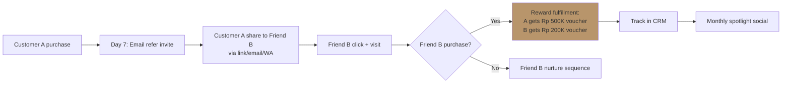

# Referral Program Design

Design referral atau advocate program: mechanic + reward structure + tracking + amplification + risk.

## Triggers

Primary:
- "referral program"
- "word of mouth"
- "advocate program"

Secondary:
- "loyalty program"
- "ambassador"

## Input Required

| Field | Type | Required | Default |
|---|---|---|---|
| goal | enum | yes | (acquisition/retention/advocacy) |
| persona_target | array | yes | - |
| budget_per_referral | number Rp | no | Rp 200K |

## Output Template

```markdown
# Referral Program: {NAME}

**Goal:** {acquisition/retention/advocacy}
**Persona target:** {persona}

## Program Mechanic
**Trigger to refer:**
- Post-purchase (after walk-in convert)
- Post-konsultasi (after Door Expert session)
- Tier achievement (after N purchases)

**How to refer:**
- Unique link (referrer code)
- Email invite template
- WhatsApp share kit
- IG story template ("Saya beli di Gerai 1000 Pintu...")

## Reward Structure (Double-sided)

### Referrer reward
- {Reward 1}: e.g., Rp 500K voucher next purchase
- {Reward 2}: e.g., Free Door Expert konsultasi extra session
- Tier-based: bigger reward setelah refer 3, 5, 10 customer

### Referee reward (referred friend)
- {Reward}: e.g., Rp 200K welcome voucher first purchase
- Eligibility: minimum purchase Rp 5jt

**Important:** Reward harus "reward" (dalam tanda kutip, sesuai Editorial Rules) bukan "discount agresif". Frame sebagai apresiasi, bukan transaksional.

## Eligibility Rules
- Referrer harus: existing customer dengan minimal 1 completed purchase
- Referee harus: new customer (verified by phone/email/NIK)
- Geographic: Indonesia (initial Balikpapan + Kaltim)
- Anti-abuse: max 10 referral per orang per tahun, no self-referral

## Tracking Method
- Unique referral code (e.g., MATTHEW-X1A2)
- Landing page UTM tracking
- CRM integration (referral source field)
- Reward fulfillment workflow

## Amplification Strategy
- In-store signage: "Refer your friend, sama-sama dapat reward"
- Email post-purchase: 1 email Day 7 + 1 email Day 30
- Door Expert mention: "Klau ada teman butuh pintu, share program kami"
- Social: monthly testimonial spotlight referrer

## Risk Register
| Risk | Likelihood | Impact | Mitigation |
|---|---|---|---|
| Self-referral abuse | Med | Med | Phone/NIK verification |
| Reward dilution margin | Med | High | Cap at 10 referral/year + minimum purchase |
| Brand devaluation (cheap promo feel) | Low | High | "Reward" framing premium, not "diskon" |
| Tracking error (lost attribution) | High | Med | CRM integration test thoroughly |

## Budget Model
| Item | Per referral | Volume Q4 | Total Q4 |
|---|---|---|---|
| Referrer reward | Rp 500K | 50 | Rp 25jt |
| Referee reward | Rp 200K | 50 | Rp 10jt |
| Amplification cost | Rp 100K | - | Rp 5jt |
| Tracking tool | - | - | Rp 2jt |
| **Total** | | | **Rp 42jt** |

**Expected new customer from referrals:** 50
**CAC via referral:** Rp 840K (vs Meta Ads Rp 500K — break-even kalau LTV >Rp 5jt)

## KPI
| Metric | Target Q4 |
|---|---|
| Referral activation rate | 15% (of customer who referred at least 1) |
| Referral conversion rate | 30% (of referee who purchase) |
| Net new customer from referrals | 50 |
| Cost per referred customer | Rp 840K |
| LTV of referred customer | Rp 6-8jt (typically 30% higher than ad-acquired) |

## Brand Canon Compliance
- "Reward" dalam tanda kutip selalu
- No "luxurious mewah", framing apresiasi
- Premium hangat tone di semua copy
- "tempat" not "rumah"
- "Gerai 1000 Pintu" lengkap
```

## Visual Output



## Knowledge Dependency

- 6 Persona spec
- Brand Canon (especially "reward" rule)
- Editorial Rules
- product-marketing skill
- onboarding skill (untuk post-purchase trigger)

## Mode

Default: EXECUTION
Switch: DISCUSSION jika reward structure debate (cash vs voucher vs experience)

## Tools Required

- file-search
- artifacts (flow diagram)

## Validation Criteria

- Double-sided reward (referrer + referee)
- Anti-abuse rules explicit
- Tracking method specified (CRM field + UTM)
- Budget model realistic (CAC vs LTV positive)
- Brand canon strict ("reward" in tanda kutip)
- No agresif diskon framing
- Risk register min 3 risk

## Sample I/O

**Input:** "Referral program post-launch Q4 untuk customer Retail, budget Rp 50jt"

**Output summary:**
- Mechanic: Trigger post-purchase Day 7, unique referral code, share kit (email + WA + IG story template)
- Reward: Referrer Rp 500K voucher + tier bonus, Referee Rp 200K voucher first purchase
- Eligibility: Existing customer with 1+ purchase, referee new customer min Rp 5jt purchase
- Tracking: CRM field + UTM
- Amplification: in-store signage + email Day 7+30 + Door Expert mention
- Budget Rp 42jt Q4, expected 50 new customer, CAC Rp 840K, LTV Rp 6-8jt
- Risk: self-abuse mitigated dengan NIK verification, dilution mitigated dengan cap + minimum purchase
- Flow diagram embedded

## Handoff

- emails (referral invite sequence)
- onboarding (post-purchase trigger)
- copywriting (referral copy material)
- CFO Gerai (validate budget + LTV assumption)
