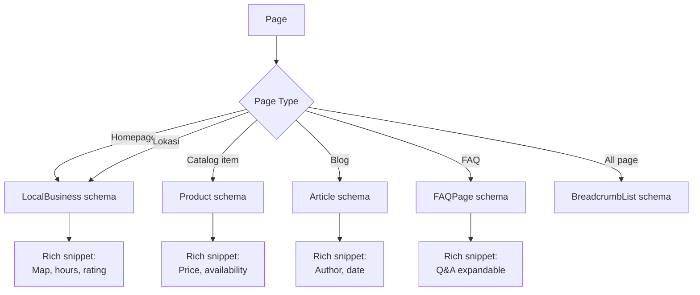

# Schema Markup (Structured Data)

Generate JSON-LD schema markup per page type (LocalBusiness, Product, FAQ, Article, BreadcrumbList) untuk Gerai 1000 Pintu website.

## Triggers

Primary:
- "schema markup"
- "structured data"
- "JSON-LD"

Secondary:
- "rich snippet"
- "search appearance"

## Input Required

| Field | Type | Required | Default |
|---|---|---|---|
| page_type | enum | yes | (LocalBusiness/Product/FAQ/Article/BreadcrumbList) |
| page_data | object | no | (derive from brand canon for default) |

## Output Template

```markdown
# Schema Markup: {PAGE_TYPE}

**Target page:** {URL}
**Markup format:** JSON-LD (recommended by Google)

## Schema JSON-LD

```json
{SCHEMA_JSON}
```

## Placement
- Embed di `<head>` section page
- Wajib `<script type="application/ld+json">` wrapper
- Boleh multiple schema per page (tidak conflict)

## Validation
- Test: https://search.google.com/test/rich-results
- Schema.org spec: https://schema.org/{Type}
- Expected rich snippet appearance: {description}

## Brand Canon Integration
- Brand name selalu "Gerai 1000 Pintu" lengkap
- Logo URL: gerai.mahewwork.com/logo.svg
- Color brand: #B8956B (Brass) di sameAs jika applicable
```

## Schema Templates per Page Type

### 1. LocalBusiness (Homepage + Lokasi)
```json
{
  "@context": "https://schema.org",
  "@type": "Store",
  "name": "Gerai 1000 Pintu",
  "image": "https://gerai.mahewwork.com/showroom.jpg",
  "@id": "https://gerai.mahewwork.com",
  "url": "https://gerai.mahewwork.com",
  "telephone": "+62-xxx-xxx",
  "priceRange": "$$$",
  "address": {
    "@type": "PostalAddress",
    "streetAddress": "Jl. {address}",
    "addressLocality": "Balikpapan",
    "addressRegion": "Kalimantan Timur",
    "postalCode": "76xxx",
    "addressCountry": "ID"
  },
  "geo": {
    "@type": "GeoCoordinates",
    "latitude": -1.2654,
    "longitude": 116.8312
  },
  "openingHoursSpecification": [
    {
      "@type": "OpeningHoursSpecification",
      "dayOfWeek": ["Monday","Tuesday","Wednesday","Thursday","Friday","Saturday"],
      "opens": "09:00",
      "closes": "18:00"
    }
  ],
  "description": "Retail premium pintu pertama di Indonesia dengan filosofi Dunia Pintu (4-negara cultural context): Jepang jiwa, Eropa seni, Amerika pernyataan, China gerbang rezeki. Tempat curated dengan Door Expert konsultasi gratis.",
  "slogan": "A Thousand Doors, A Thousand Dreams",
  "knowsAbout": ["Pintu Premium", "Filosofi Dunia Pintu (4-negara cultural context)", "Door Expert", "Curated Retail"]
}
```

### 2. Product (Per item katalog)
```json
{
  "@context": "https://schema.org",
  "@type": "Product",
  "name": "{Product Name}",
  "image": "{URL}",
  "description": "{Description with filosofi context}",
  "brand": {
    "@type": "Brand",
    "name": "AMK"
  },
  "manufacturer": {
    "@type": "Organization",
    "name": "PT Selaras Lawang Sewu"
  },
  "offers": {
    "@type": "Offer",
    "url": "{product page URL}",
    "priceCurrency": "IDR",
    "price": "{price}",
    "availability": "https://schema.org/InStock",
    "seller": {
      "@type": "Organization",
      "name": "Gerai 1000 Pintu"
    }
  }
}
```

### 3. FAQ Page
```json
{
  "@context": "https://schema.org",
  "@type": "FAQPage",
  "mainEntity": [
    {
      "@type": "Question",
      "name": "Apa itu Gerai 1000 Pintu?",
      "acceptedAnswer": {
        "@type": "Answer",
        "text": "Gerai 1000 Pintu adalah retail premium pintu pertama di Indonesia dengan filosofi Dunia Pintu (4-negara cultural context: Jepang jiwa, Eropa seni, Amerika pernyataan, China gerbang rezeki — BUKAN mandatory archetype). Hadir di Balikpapan dengan Door Expert konsultasi gratis."
      }
    },
    {
      "@type": "Question",
      "name": "Apa itu Door Expert?",
      "acceptedAnswer": {
        "@type": "Answer",
        "text": "Door Expert adalah generalis konsultan Gerai 1000 Pintu dengan 5 kompetensi: katalog pintu, industri konstruksi, filosofi Indonesia dan feng shui, soft skills service, dan aftersales support."
      }
    }
  ]
}
```

### 4. Article (Blog post)
```json
{
  "@context": "https://schema.org",
  "@type": "Article",
  "headline": "{Headline}",
  "image": "{URL}",
  "datePublished": "{ISO 8601}",
  "dateModified": "{ISO 8601}",
  "author": {
    "@type": "Person",
    "name": "{Door Expert / Editor name}",
    "url": "{author bio URL}"
  },
  "publisher": {
    "@type": "Organization",
    "name": "Gerai 1000 Pintu",
    "logo": {
      "@type": "ImageObject",
      "url": "https://gerai.mahewwork.com/logo.svg"
    }
  },
  "description": "{Description aligned dengan brand canon}"
}
```

### 5. BreadcrumbList
```json
{
  "@context": "https://schema.org",
  "@type": "BreadcrumbList",
  "itemListElement": [
    {
      "@type": "ListItem",
      "position": 1,
      "name": "Beranda",
      "item": "https://gerai.mahewwork.com"
    },
    {
      "@type": "ListItem",
      "position": 2,
      "name": "Katalog",
      "item": "https://gerai.mahewwork.com/katalog"
    },
    {
      "@type": "ListItem",
      "position": 3,
      "name": "Pintu Premium AMK"
    }
  ]
}
```

## Visual Output



## Knowledge Dependency

- Brand Canon (untuk description + slogan)
- product-marketing (untuk knowsAbout)
- ai-seo skill (untuk integration AEO strategy)

## Mode

Default: EXECUTION
Switch: NEED_CLARIFICATION jika page type tidak match standard

## Tools Required

- file-search (Brand Canon untuk entity definition)
- web-search (schema.org spec update)
- artifacts (JSON code block + flow diagram)

## Validation Criteria

- JSON-LD valid (cek di rich results test)
- Entity definition aligned brand canon
- All required field per Type
- Telephone format valid Indonesia (+62)
- Geo coordinates akurat Balikpapan
- Description tidak generic (specific Gerai narrative)
- No em-dash dalam description, "tempat" not "rumah"

## Sample I/O

**Input:** "Schema markup untuk homepage Gerai 1000 Pintu + Product page AMK Premium"

**Output summary:**
- 2 schema JSON-LD: LocalBusiness (Store) + Product
- LocalBusiness: nama lengkap + slogan tagline locked + filosofi Dunia Pintu (4-negara cultural context) di description + 5 knowsAbout + geo Balikpapan
- Product: brand AMK + manufacturer Selaras Lawang Sewu + price IDR + InStock + seller Gerai 1000 Pintu
- Validation: pass rich results test
- Flow diagram embedded

## Handoff

- ai-seo (integration dengan AEO strategy)
- seo-audit (validation overall SEO health)
- site-architecture (kalau breadcrumb butuh URL restructure)
