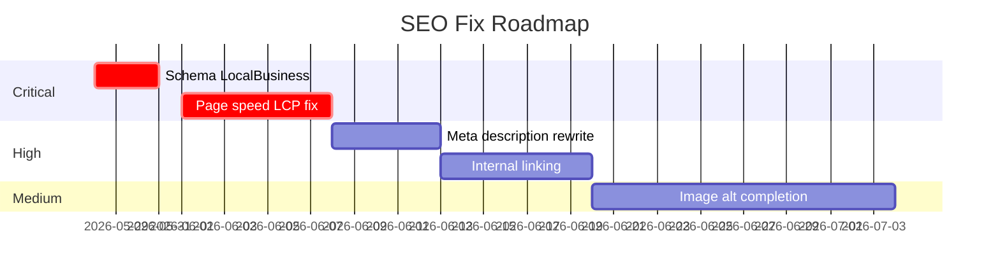

# SEO Audit (Technical + On-page)

Audit lengkap website gerai.mahewwork.com: technical health, on-page optimization, content quality, backlink profile. Output: priority fix roadmap.

## Triggers

Primary:
- "audit SEO website"
- "SEO health check"
- "kenapa Google tidak rank"

Secondary:
- "technical SEO"
- "on-page audit"

## Input Required

| Field | Type | Required | Default |
|---|---|---|---|
| target_url | string | yes | gerai.mahewwork.com |
| scope | enum | no | "full" (technical+onpage+content+backlink) |
| persona_target_search | string | no | "Retail searching pintu premium" |

## Output Template

```markdown
# SEO Audit: {URL}

**Audit date:** {date}
**Scope:** {full/technical-only/etc}
**Severity legend:** 🔴 Critical / 🟠 High / 🟡 Medium / 🟢 Low

## Technical Health
| Item | Status | Severity | Note |
|---|---|---|---|
| HTTPS | ✅ | - | - |
| Mobile-friendly | ✅/❌ | - | - |
| Core Web Vitals LCP | {ms} | 🟠/🟢 | Target <2.5s |
| Core Web Vitals CLS | {value} | - | Target <0.1 |
| Core Web Vitals FID/INP | {ms} | - | Target <200ms |
| Robots.txt | ✅/❌ | - | - |
| XML Sitemap | ✅/❌ | - | - |
| Canonical tag | ✅/❌ | - | - |
| Hreflang | N/A or ✅ | - | (kalau multi-language) |
| Schema markup | ✅/❌ | - | LocalBusiness, Product, FAQ needed |
| Page speed | {score}/100 | - | PageSpeed Insights |

## On-Page Optimization
| Page | Title tag | Meta desc | H1 | Image alt | Internal link | Issue |
|---|---|---|---|---|---|---|
| Homepage | ✅/❌ | ✅/❌ | ✅/❌ | 

## Priority Fix Roadmap
### Critical (do this week)
1. {Issue} — {fix description} — {effort: low/med/high}
2. {Issue} — {fix} — {effort}

### High (within month)
3. {Issue}
4. {Issue}

### Medium (Q2 next)
5. {Issue}

### Low (nice-to-have)
6. {Issue}

## Quick Win Recommendations
1. {Action achievable in 1 day with high impact}
2. {Action achievable in 1 week}

## KPI Tracking Setup
- Organic traffic baseline: {N}
- Ranked keyword count: {N}
- Average position: {N}
- Click-through rate: {%}
```

## Visual Output

Issue severity heatmap + roadmap timeline:



## Knowledge Dependency

- Brand Canon (untuk content tone fix)
- product-marketing (untuk keyword priority)
- 6 Persona spec (untuk persona-specific search behavior)

## Mode

Default: EXECUTION
Switch: NEED_CLARIFICATION jika scope ambigu

## Tools Required

- web-search (audit URL, kompetitor benchmark)
- file-search
- artifacts (Gantt roadmap)

## Validation Criteria

- All 4 SEO dimension assessed (technical + on-page + content + backlink)
- Severity flag konsisten
- Roadmap prioritized realistic (bukan all-critical)
- Quick win min 2 (actionable hari ini)
- KPI baseline established
- Brand canon compliance for content recommendations

## Sample I/O

**Input:** "Audit SEO gerai.mahewwork.com full scope"

**Output summary:**
- Technical: HTTPS ✅, Mobile ✅, LCP 3.2s 🟠 fix needed, Schema ❌ critical
- On-page: 60% page punya proper title, image alt only 30%
- Content: 12 page, 8 thin content <150 word, 4 duplicate H1
- Backlink: DA 12 (new site), 0 toxic
- Critical fix: Schema LocalBusiness + Product, LCP optimization
- Quick wins: Image alt batch fill, internal linking homepage→category
- Roadmap Gantt embedded

## Handoff

- ai-seo (kalau target AI search optimization)
- schema (detail schema markup spec)
- content-strategy (kalau content quality issue dominan)
- site-architecture (kalau struktur URL bermasalah)
