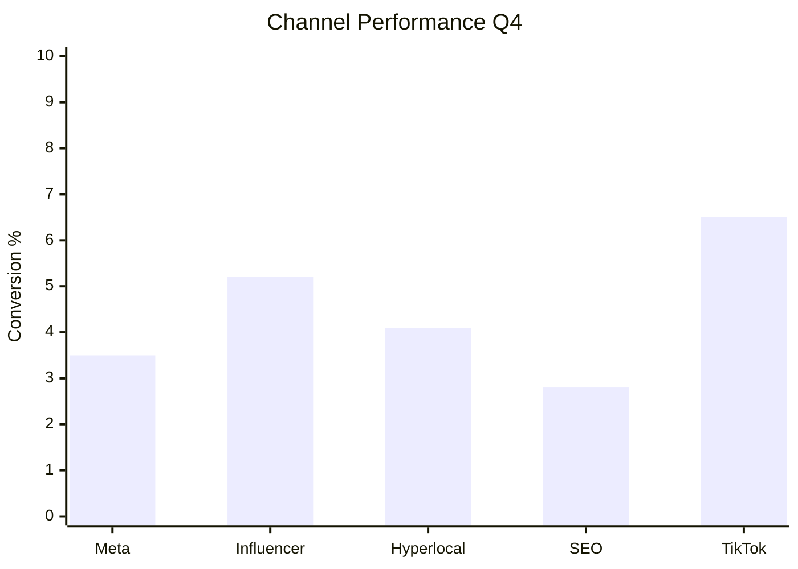
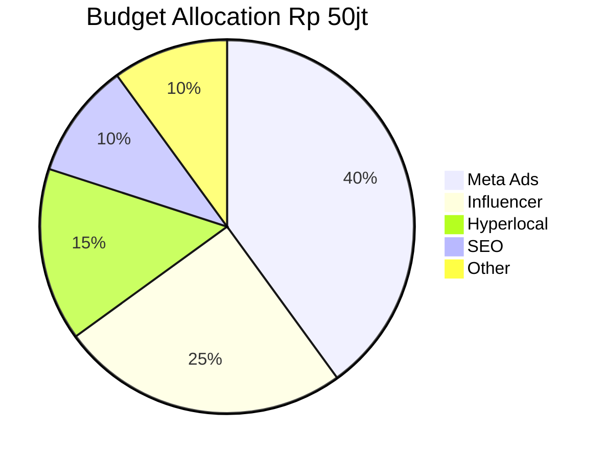
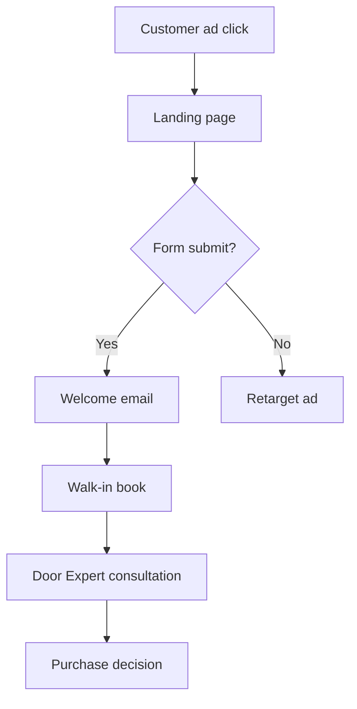
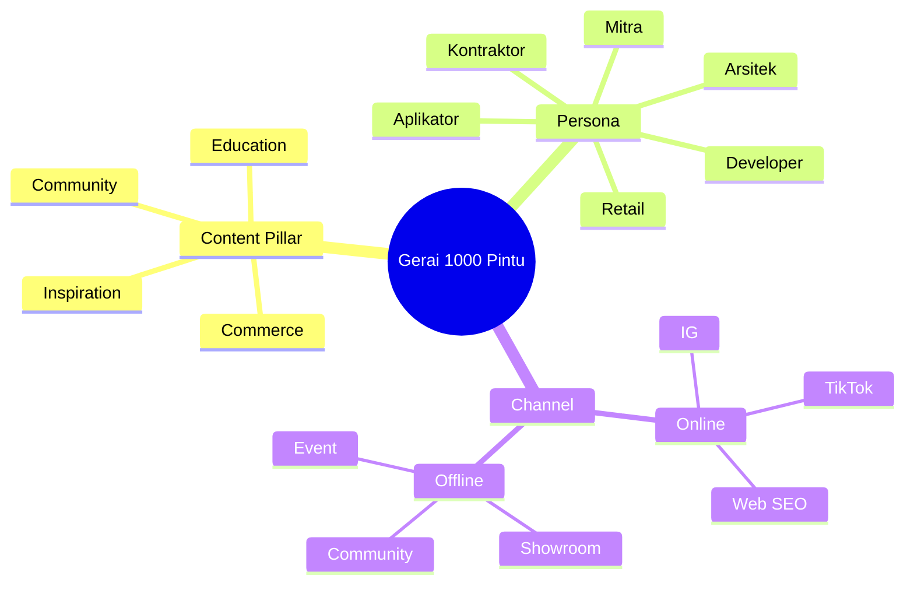
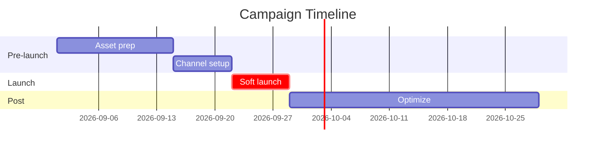
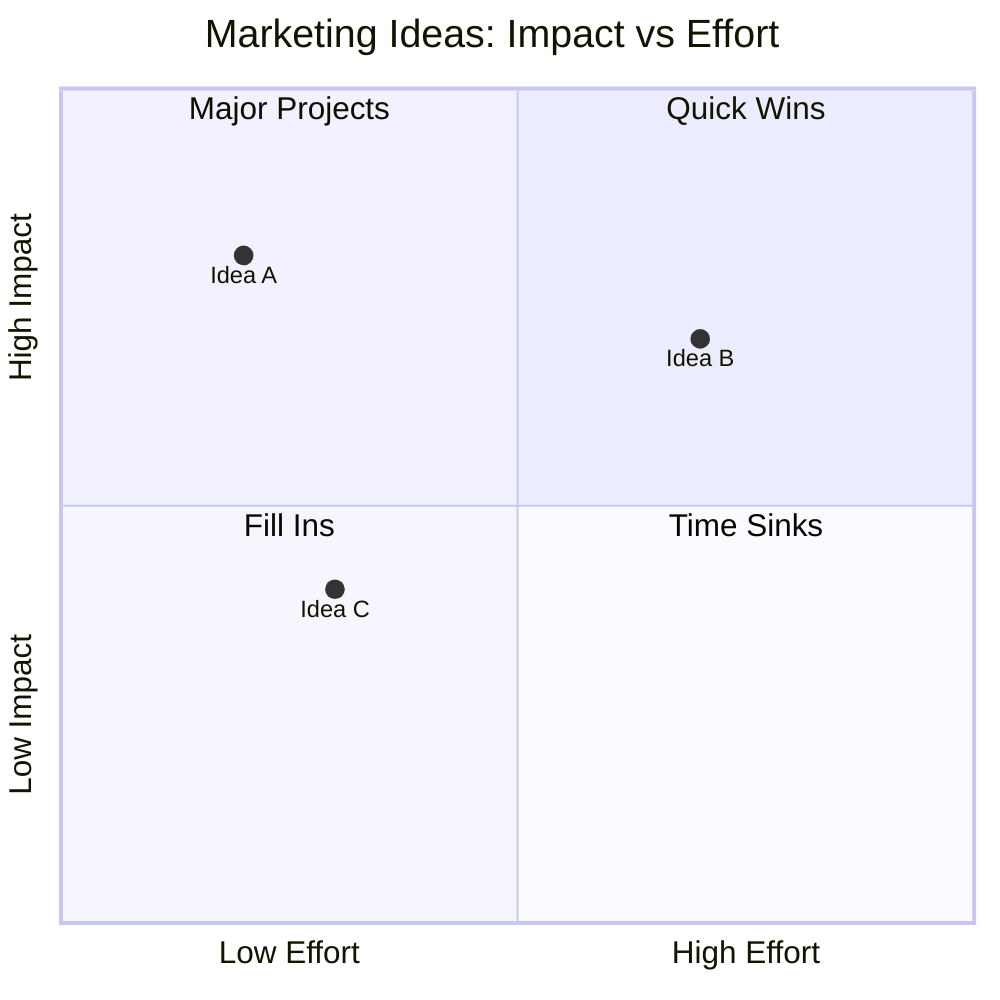
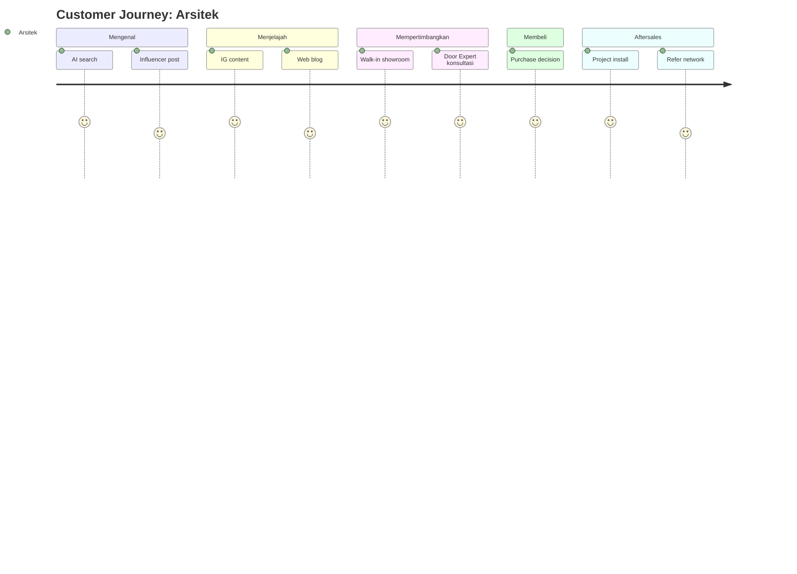

# Visual Summary (Universal Visualizer)

Convert apapun data, info, atau concept ke format visual sesuai context: chart, diagram, mockup wireframe, atau table comparison. Skill universal yang dipanggil setelah skill lain output data, atau standalone request "kasih visual".

**Why critical:** Matthew explicit request — setiap AI agent harus bisa kasih informasi arsitektural/visual supaya enak dilihat.

## Triggers

Primary:
- "kasih visual"
- "buatkan chart"
- "diagram untuk ini"
- "visualize"

Secondary:
- "format visual"
- "render diagram"
- "Mermaid"
- "ASCII art"

## Input Required

| Field | Type | Required | Default |
|---|---|---|---|
| data_or_concept | string/object | yes | - |
| format_preference | enum | no | "auto-select" |
| audience | string | no | "Matthew" |

## Format Selection Logic

```
IF data showing COMPARISON numeric
   AND <8 categories → bar chart
   AND time-based → line chart
   AND part-of-whole → pie chart

IF data showing PROCESS / FLOW → flowchart (Mermaid)
   AND multi-actor → swimlane diagram

IF data showing RELATIONSHIP → diagram
   AND hierarchy → tree
   AND topic cluster → mindmap
   AND overlap → Venn
   AND dependency → flowchart with arrow

IF data showing UI LAYOUT → mockup wireframe (ASCII or detailed)

IF data showing EXHAUSTIVE LIST or matrix → markdown table
   AND 2-axis tradeoff → 2x2 quadrant chart
   AND severity/risk → heatmap table

IF data showing TIME TREND → line chart or Gantt
   AND project timeline → Gantt chart

IF data showing COMPOSITION % → pie or stacked bar

IF data showing FUNNEL → flowchart with size variation

IF data showing JOURNEY → Mermaid journey diagram

IF data showing GEO → table dengan location + ASCII map
```

## Output Template

```markdown
# Visual: {TITLE}

**Format selected:** {Format + brief justification}
**Audience consideration:** {Why this format for Matthew}

## Visual

[Mermaid code block OR ASCII art OR Markdown table OR mockup]

## Interpretation
- **Key insight 1:** {1 sentence}
- **Key insight 2:** {1 sentence}
- **Key insight 3:** {1 sentence}

## Use Case Suggestion
- Untuk slide presentation: {how to embed}
- Untuk dashboard internal: {monitoring frequency}
- Untuk client/stakeholder report: {how to interpret to non-technical}

## Alternative Formats (kalau audience lain)
- Format B: {when to use}
- Format C: {when to use}
```

## Visual Mode Examples

### Mode 1: Bar Chart (comparison)


### Mode 2: Pie Chart (composition)


### Mode 3: Flowchart (process)


### Mode 4: Mindmap (hierarchy)


### Mode 5: Gantt (timeline)


### Mode 6: 2x2 Quadrant (tradeoff)


### Mode 7: Journey Diagram


### Mode 8: Mockup ASCII (UI layout)
```
┌────────────────────────────────────┐
│ Gerai 1000 Pintu          [Menu]  │
├────────────────────────────────────┤
│                                    │
│   [Hero: Brass detail close-up]    │
│                                    │
│   "Pintu yang Bercerita"           │
│   "Tempat yang Berkarakter"        │
│                                    │
│   [Book Konsultasi Gratis →]      │
│                                    │
│   ★★★★★ 50+ Arsitek trust kami    │
├────────────────────────────────────┤
│ [Showcase carousel]               │
└────────────────────────────────────┘
```

### Mode 9: Comparison Table
```markdown
| Aspect | Variant A | Variant B | Winner |
|---|---|---|---|
| CTR | 1.2% | 1.8% | B (+50%) |
| Conversion | 2.5% | 2.3% | A |
| CAC | Rp 300K | Rp 280K | B |
| ROAS | 4.2x | 4.5x | B |
```

### Mode 10: Heatmap (severity matrix)
```markdown
| Risk \ Impact | Low | Med | High |
|---|---|---|---|
| Low likelihood | 🟢 | 🟢 | 🟡 |
| Med likelihood | 🟢 | 🟡 | 🟠 |
| High likelihood | 🟡 | 🟠 | 🔴 |
```

## Knowledge Dependency

- minimal (universal skill)
- Brand Canon (untuk visual palette consistency)

## Mode

Default: EXECUTION (visual generation)

## Tools Required

- artifacts (LibreChat rendering Mermaid + ASCII)
- file-search (kalau perlu reference data)

## Validation Criteria

- Format selected sesuai data type (cek format selection logic)
- Mermaid syntax valid
- Interpretation 3 insight (bukan deskripsi visual)
- Use case suggestion explicit
- Alternative format kalau ada
- Brand canon palette dipakai kalau ada color: Brass #B8956B + Charcoal #1F1A14 + Ivory #FAF8F4

## Sample I/O

**Input:** "Visual customer journey 5-stage dengan touchpoint per persona Aplikator"

**Output summary:**
- Format selected: Mermaid journey diagram (cocok untuk multi-stage process dengan stakeholder)
- Lanes: Mengenal (TikTok skill content 5 score) → Menjelajah (IG tutorial + YouTube 4-5 score) → Mempertimbangkan (Walk-in 4 score + Door Expert 5 score) → Membeli (5 score) → Aftersales (refer network 4 score)
- Interpretation: Aplikator strong entry via skill TikTok, peak loyalty post-konsultasi Door Expert, opportunity di Aftersales referral
- Use case: untuk team alignment + onboarding new sales staff
- Alternative format: Flowchart kalau focus pada decision tree, atau Gantt kalau focus pada timeline

## Handoff

Tidak hand off. Visual-summary adalah TERMINAL skill yang dipanggil OLEH skill lain atau langsung user request.

## Special Note for Other Agents

**Setiap skill CMO lain WAJIB mendukung visual-summary integration:**
- Saat output skill lain, sertakan section "Visual Output" yang specify Mermaid/ASCII format
- visual-summary skill bisa diinvoke standalone ATAU sebagai post-processor

Contoh integration:
1. User: "Audit funnel campaign Q4"
2. funnel-audit skill: produce data + analysis
3. visual-summary skill (auto-invoke): render funnel diagram dengan leak highlight
4. Final output: data + analysis + diagram
