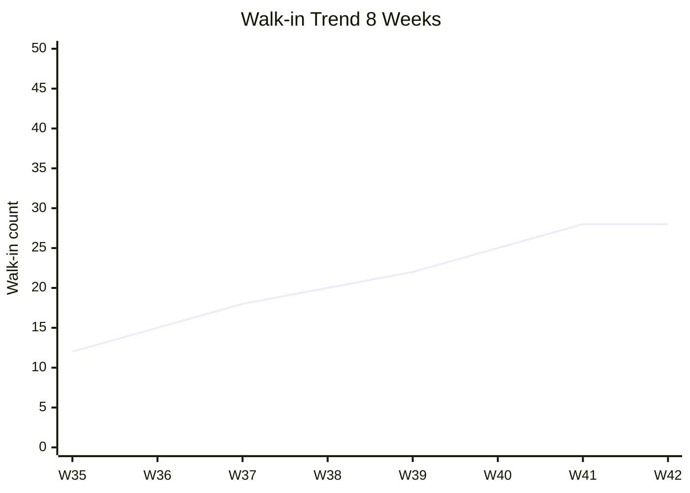

# Weekly Marketing Report

Generate executive summary mingguan untuk CMO domain: top wins, KPI dashboard, flag concern, next week priority. Format: 1-pager readable in 2 menit.

## Triggers

Primary:
- "weekly report"
- "exec summary minggu ini"
- "marketing recap"

Secondary:
- "weekly recap"
- "marketing dashboard"
- "1-pager status"

## Input Required

| Field | Type | Required | Default |
|---|---|---|---|
| period | string | yes | "Week N, [Month] 2026" |
| metrics_data | object | no | (fetch from analytics) |
| campaigns_active | array | no | (auto-list) |

## Output Template

```markdown
# Marketing Weekly Report: Week {N}, {Month} 2026

**Period:** {Start} - {End}
**Status:** {On track / At risk / Off track}

## TL;DR (read this if time-constrained)
{2-3 sentence: biggest win + biggest concern + critical decision needed}

## 🏆 Top 3 Wins
1. **{Win title}** — {1 sentence with metric}
2. **{Win}** — {...}
3. **{Win}** — {...}

## 📊 KPI Dashboard

### Acquisition
| Metric | This Week | Last Week | Δ | Target | Status |
|---|---|---|---|---|---|
| Walk-in showroom | {N} | {N} | {±%} | {N} | 🟢/🟡/🔴 |
| Online inquiry | {N} | {N} | {±%} | {N} | - |
| Social reach | {N} | {N} | {±%} | {N} | - |
| Lead form fill | {N} | {N} | {±%} | {N} | - |

### Conversion
| Metric | This Week | Last Week | Δ | Target | Status |
|---|---|---|---|---|---|
| Conversion rate |  | {±pp} |  | Rp {X} | - |
| Walk-in to purchase |  | - | {%} | - |

### Brand Health
| Metric | This Week | Last Week | Status |
|---|---|---|---|
| Mention sentiment % positive |  | - |
| Brand search volume | {N} | {N} | - |
| Share of voice (vs kompetitor) |  | - |

## 🚨 Flag Concern (top 3)
1. **{Concern}** — {Impact + recommended action}
2. **{Concern}** — {...}
3. **{Concern}** — {...}

## 🎯 Next Week Priority (top 5)
1. **{Action}** — {Owner} — {Deadline}
2. **{Action}** — {...} — {...}
3. **{Action}** — {...} — {...}
4. **{Action}** — {...} — {...}
5. **{Action}** — {...} — {...}

## 💰 Budget Status
- Spent this week: Rp {X} of Rp {Y} weekly budget ()
- Burn rate projection: {on track / over / under}

## 📈 Active Campaign Status
| Campaign | Status | Spend | Reach | Conversion | Notes |
|---|---|---|---|---|---|

## 🔮 Decision Needed from Matthew (this week)
| Decision | Context | Recommended | Deadline |
|---|---|---|---|

## 📅 Upcoming Events / Milestone
- {Date}: {Milestone}
- {Date}: {...}

---
*Generated by Gerai CMO Agent | Brand Canon compliant*
```

## Visual Output

Dashboard mockup + KPI cards:

```markdown
┌─────────────────────────────────────────────┐
│ Marketing Weekly Report — Week 42           │
│ Status: 🟢 On Track                        │
├─────────────────────────────────────────────┤
│                                             │
│  ┌─────────┐  ┌─────────┐  ┌─────────┐    │
│  │Walk-in  │  │Conv rate│  │CAC      │    │
│  │  28     │  │  18%    │  │Rp 280K  │    │
│  │ ↑ 12%   │  │ ↑ 2pp   │  │ ↓ 7%    │    │
│  │Target30 │  │Target15%│  │Target300K   │
│  └─────────┘  └─────────┘  └─────────┘    │
│                                             │
│ 🏆 Wins: Influencer mikro Plan C exceed... │
│ 🚨 Concern: Meta CTR drop minggu ini      │
│ 🎯 Next: Refresh creative + A/B test...   │
└─────────────────────────────────────────────┘
```

Plus trend chart:



## Knowledge Dependency

- All CMO skill output (aggregated)
- Brand Canon
- Marketing Plan ABCD
- product-marketing skill (KPI target context)

## Mode

Default: EXECUTION (data aggregation + summary)

## Tools Required

- file-search (historical data)
- web-search (kalau perlu benchmark)
- code-interpreter (calculation)
- artifacts (dashboard mockup + trend chart)

## Validation Criteria

- TL;DR readable in 30 detik
- Top 3 wins specific dengan metric
- KPI dashboard 4-6 metric (bukan 20+)
- Δ vs last week tampak
- Flag concern actionable
- Next week priority dengan PIC + Deadline
- Decision needed explicit untuk Matthew
- Brand canon compliance
- 1-pager principle (kalau scroll banyak = fail)

## Sample I/O

**Input:** "Weekly report Week 42 Oktober 2026"

**Output summary:**
- TL;DR: "Walk-in target tercapai 93% (28/30), Plan C Influencer mikro exceed expectation, tapi Meta Ads CTR drop 30% perlu creative refresh segera."
- Top 3 wins: (1) Influencer Plan C 8K engagement, (2) Walk-in 28 vs target 30 (93%), (3) Door Expert konsultasi 18 sessions
- KPI dashboard: Walk-in 28 (↑12%), Conv 18% (↑2pp), CAC Rp 280K (↓7%)
- Flag concern: Meta CTR drop (refresh creative needed), Hyperlocal slow ramp (event activation?), Aplikator persona engagement low
- Next week: refresh 6 ad creative, plan community event, KOL outreach Phase 2
- Budget Rp 12.5jt/50jt Q4 (25%)
- Dashboard mockup + trend chart embedded

## Handoff

- visual-summary (untuk render dashboard + chart)
- Atmaja CEO (kalau ada decision butuh escalate)
- CFO Gerai (validate CAC/ROAS health)
- Sales Strategy Designer (kalau walk-in-to-purchase issue)
