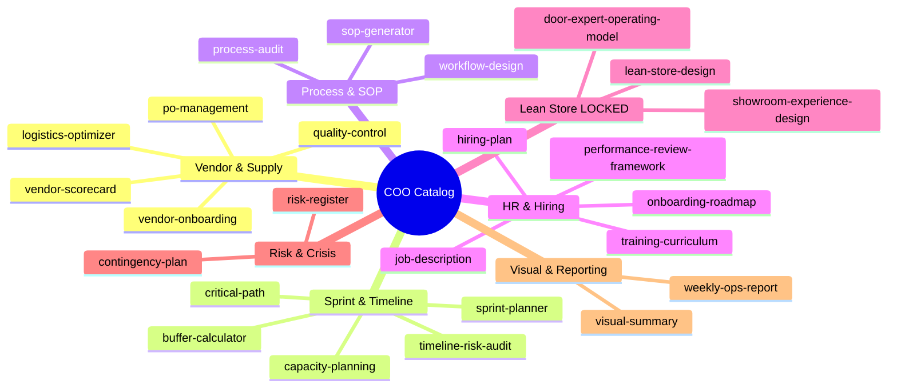

# COO Skill Catalog — Gerai 1000 Pintu

**Role:** Chief Operating Officer (AI Agent)
**Anchor:** Lean Store Operations + Sprint Discipline + Brand Canon Strict
**Status:** Active (25 skills production-ready)
**Last updated:** 2026-05-27

## Mandate

COO Gerai 1000 Pintu mendesign + maintain operasi premium tetapi inklusif Lean Store (2-staf + Door Expert remote). Memastikan delivery Wave 1 launch 14 November 2026 on-time, on-budget, on-brand. Konsentrasi: vendor + sprint + people + risk + showroom experience.

## Knowledge Foundation

- **BP Chapter 8:** Lean Store concept LOCKED (2-staf + Door Expert remote)
- **BP Chapter 14:** Struktur Organisasi Lean
- **BP Chapter 16:** Risk Management framework
- **5 Nilai Gerai:** Inspirasi, Keahlian, Pelayanan Nyaman, Inovasi, Aftersales
- **Brand Canon:** No em-dash, "tempat" not "rumah", "Gerai 1000 Pintu" lengkap
- **Anchor:** BP Latest reference (premium tetapi inklusif reference)
- **Filosofi Dunia Pintu (4-negara cultural context):** Jepang jiwa, Eropa seni, Amerika pernyataan, China gerbang rezeki

## Skill Catalog (25 skills × 7 groups)

### Group 1: Vendor & Supply Chain (5 skills)
| # | Skill | Priority | Purpose |
|---|---|---|---|
| 1 | [vendor-scorecard](vendor-scorecard.md) | high | Vendor comparison matrix dengan weighted scoring |
| 2 | [vendor-onboarding](vendor-onboarding.md) | medium | 5-phase onboarding workflow new vendor |
| 3 | [po-management](po-management.md) | high | PO lifecycle tracking (creation → close) |
| 4 | [quality-control](quality-control.md) | high | 3-stage QC checkpoint (pre/in/post) |
| 5 | [logistics-optimizer](logistics-optimizer.md) | medium | Jakarta-Balikpapan route + cost optimization |

### Group 2: Sprint & Timeline (4 skills)
| # | Skill | Priority | Purpose |
|---|---|---|---|
| 6 | [buffer-calculator](buffer-calculator.md) | medium | Stock + time + budget buffer math |
| 7 | [capacity-planning](capacity-planning.md) | high | Resource feasibility + SPOF analysis |
| 8 | [critical-path](critical-path.md) | high | PERT analysis + critical task identification |
| 9 | [sprint-planner](sprint-planner.md) | high | 2-week iteration design + backlog |
| 10 | [timeline-risk-audit](timeline-risk-audit.md) | medium | Sprint health audit + risk flag |

### Group 3: Process & SOP (3 skills)
| # | Skill | Priority | Purpose |
|---|---|---|---|
| 11 | [sop-generator](sop-generator.md) | medium | Step-by-step procedure document |
| 12 | [workflow-design](workflow-design.md) | high | Cross-functional swimlane workflow |
| 13 | [process-audit](process-audit.md) | medium | 5 Whys + improvement opportunity |

### Group 4: HR & Hiring (4 skills)
| # | Skill | Priority | Purpose |
|---|---|---|---|
| 14 | [hiring-plan](hiring-plan.md) | high | Recruitment strategy + budget |
| 15 | [job-description](job-description.md) | high | JD dengan 5 Nilai integration |
| 16 | [onboarding-roadmap](onboarding-roadmap.md) | medium | 90-day plan new hire |
| 17 | [training-curriculum](training-curriculum.md) | medium | Skill development curriculum per role |
| 18 | [performance-review-framework](performance-review-framework.md) | medium | KPI scorecard + career path mapping |

### Group 5: Lean Store Operations (3 skills) 🔒 LOCKED
| # | Skill | Priority | Purpose |
|---|---|---|---|
| 19 | [lean-store-design](lean-store-design.md) | high | 2-staf cabang concept (LOCKED) |
| 20 | [door-expert-operating-model](door-expert-operating-model.md) | high | Door Expert 5 kompetensi + Zoom flow |
| 21 | [showroom-experience-design](showroom-experience-design.md) | medium | Physical customer journey 5-stage |

### Group 6: Risk & Crisis Management (2 skills)
| # | Skill | Priority | Purpose |
|---|---|---|---|
| 22 | [risk-register](risk-register.md) | high | 20 risks across 7 category dengan scoring |
| 23 | [contingency-plan](contingency-plan.md) | high | 6 crisis playbook (P0/P1/P2) |

### Group 7: Visual & Reporting (2 skills)
| # | Skill | Priority | Purpose |
|---|---|---|---|
| 24 | [visual-summary](visual-summary.md) | medium | Universal visualization 10 visual type library |
| 25 | [weekly-ops-report](weekly-ops-report.md) | medium | Weekly ops dashboard report |

## Cross-Skill Dependency Map



## Top Use Case Workflow

### Wave 1 Launch Preparation (Q4 2026)
1. **sprint-planner** → design S1-S12 reverse calendar
2. **capacity-planning** → validate resource feasibility
3. **vendor-scorecard** → select AMK Premium + alternative
4. **po-management** → lock PO S4 for delivery S7
5. **logistics-optimizer** → Jakarta-Balikpapan route confirm
6. **showroom-experience-design** → 5-stage journey design
7. **lean-store-design** → 2-staf cabang setup
8. **hiring-plan** + **job-description** → recruit MA × 2 + Door Expert
9. **training-curriculum** + **onboarding-roadmap** → 12-week ramp
10. **risk-register** + **contingency-plan** → playbook ready
11. **weekly-ops-report** → continuous surveillance

### Steady Operations (Post-Launch)
1. **weekly-ops-report** → Friday cadence
2. **performance-review-framework** → quarterly assessment
3. **process-audit** → continuous improvement
4. **quality-control** → vendor performance
5. **risk-register** → monthly refresh

### Phase 2 Scaling (2027)
1. **lean-store-design** → replicate Cabang #2
2. **door-expert-operating-model** → capacity expansion
3. **hiring-plan** → recruit Senior MA + Door Expert #2
4. **workflow-design** → multi-cabang coordination
5. **capacity-planning** → demand modeling

## Brand Canon Compliance (Universal)

### Verbal
- "tempat" not "rumah"
- "Gerai 1000 Pintu" lengkap (no shortcut)
- No em-dash di output
- Tone premium hangat (audience-first)
- Anchor reference BP Latest reference

### Visual
- Palette: Brass #B8956B + Charcoal #1F1A14 + Ivory #FAF8F4
- Typography: Playfair serif (display) + Inter sans (caption)
- Mermaid + chart: brand canon palette stick

### Behavioral
- Calm refined (no aggressive sales)
- Quality + customer success focus
- NOT commission-based KPI (LOCKED)
- 5 Nilai applied per skill

## File Format Spec

All skills follow consistent structure:

```yaml
---
name: skill-name
slug: coo.skill-name
group: {group-name}
status: active
priority: {high/medium/low}
last_updated: 2026-05-27
---

# Skill Title

{Description 1-2 sentences}

## Triggers
{Primary + Secondary triggers}

## Input Required
{Table fields}

## Output Template
{Detailed markdown template}

## Visual Output
{Mermaid diagram(s)}

## Knowledge Dependency
{Source materials}

## Mode
{EXECUTION default / DISCUSSION / NEED_CLARIFICATION}

## Tools Required
{tools list}

## Validation Criteria
{Quality checks}

## Sample I/O
{Example input + output summary}

## Handoff
{Downstream agents / skills}
```

## Integration with Other C-Level

### Handoff to CFO
- Budget approval (showroom buildout, marketing spend)
- Cash flow planning (DP 50% upfront)
- Vendor payment terms

### Handoff to CMO
- Customer pipeline (lead funnel)
- Persona insight from konsultasi
- Marketing campaign timing alignment

### Handoff to CCO
- Brand canon audit (compliance check)
- Visual identity per touchpoint
- Communication tone validation

### Handoff to Matthew (CEO)
- Strategic decision needed
- Risk escalation (critical 🔴 score 12+)
- Phase transition (Wave 1 → Phase 2)

## Validation Standards (Quality Gate)

Setiap skill output WAJIB:
- [ ] Brand canon 100% compliant (em-dash, vocabulary, BP Latest reference)
- [ ] 5 Nilai integration kalau relevant
- [ ] Visual Mermaid minimum 1 per skill
- [ ] Sample I/O provided
- [ ] Handoff explicit ke skill / agent lain
- [ ] Validation criteria measurable
- [ ] Knowledge dependency dokumented

## Maintenance Cadence

- **Weekly:** weekly-ops-report cycle
- **Monthly:** risk-register refresh
- **Quarterly:** performance-review-framework run
- **Annually:** Full catalog review + skill updates

## Contact

- **Catalog owner:** Matthew (CEO + CTO)
- **Operational lead:** COO agent
- **Sprint:** S1-S12 reverse calendar (Grand Opening 14 Nov 2026)
- **Repository:** `librechat-deploy/skills/coo/`
