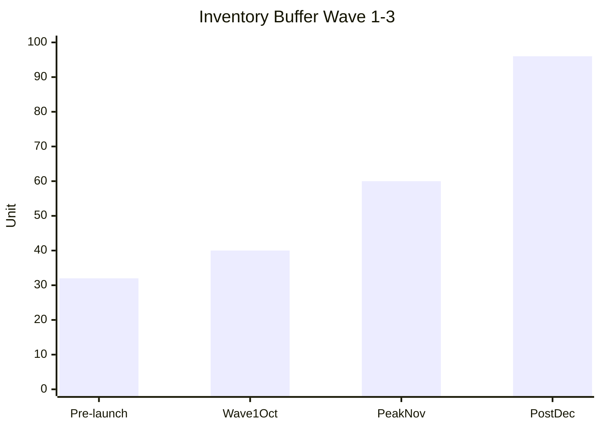

# Buffer Calculator (Stock + Time + Budget)

Calculate optimal buffer per dimension: safety stock, time buffer, budget contingency. Based on risk profile + criticality + demand variance.

## Triggers

Primary:
- "buffer"
- "safety stock"
- "contingency"

Secondary:
- "buffer berapa"
- "stock cadangan"

## Input Required

| Field | Type | Required | Default |
|---|---|---|---|
| buffer_type | enum | yes | (stock/time/budget) |
| base_value | number | yes | - |
| risk_profile | enum | no | "medium" |
| criticality | enum | no | "high" |

## Output Template

```markdown
# Buffer Calculation: {TYPE} for {CONTEXT}

**Base value:** {N}
**Risk profile:** {Low/Med/High}
**Criticality:** {Low/Med/High}

## Buffer Type 1: Stock (Inventory Safety Stock)

### Formula
Safety stock = (Demand variance × Lead time variance × Service level multiplier)
- Service level 95% = z-score 1.65
- Service level 99% = z-score 2.33

### Calculation
- Base demand: {N} unit/week
- Demand standard deviation: {%}
- Lead time avg: {days}
- Lead time standard deviation: {days}
- Service level target: {95% or 99%}

**Safety stock = {N} unit**

### Practical Buffer (Gerai context)
- Wave 1 baseline: 8-12 unit/week demand
- Vendor lead time: 21 hari ± 3 hari (variance medium)
- Logistic adds: +8 hari ± 3 hari (variance medium)
- Total cycle: 29-32 hari
- **Recommended buffer: 20% above demand × cycle time = 16 unit safety stock**

| Period | Demand | Buffer | Total inventory target |
|---|---|---|---|
| Pre-launch Sep | 0 | 20% display | 16 unit display + 16 safety |
| Wave 1 Oct (ramp 8/wk) | 32/month | 20% | 40 unit/month |
| Peak Nov (12/wk) | 48/month | 25% | 60 unit/month |
| Post-launch Dec (20/wk) | 80/month | 20% | 96 unit/month |

## Buffer Type 2: Time (Schedule Buffer)

### Formula
Time buffer = Critical path duration × Risk factor
- Risk factor Low: +10%
- Risk factor Med: +20%
- Risk factor High: +30-50%

### Calculation per Stage
| Stage | Base | Risk | Buffer | Total |
|---|---|---|---|---|
| Vendor production | 21 hari | Med (vendor SLA history) | +20% (4 hari) | 25 hari |
| Logistics Jawa-Kaltim | 8 hari | High (monsoon Q4) | +30% (3 hari) | 11 hari |
| QC + receive | 2 hari | Low | +10% (0.2 hari) | 2.2 hari |
| Showroom prep | 3 hari | Med | +20% (0.6 hari) | 3.6 hari |
| **Total** | **34 hari** | | **+8 hari** | **42 hari** |

**Order trigger: H-45 from delivery target (42 hari + 3 hari final buffer)**

## Buffer Type 3: Budget (Financial Contingency)

### Formula
Budget contingency = Project baseline × Contingency factor
- Confidence high project: +5-10%
- Confidence med project: +15-20%
- Confidence low project: +25-30%

### Calculation
- Wave 1 baseline budget: Rp 300jt (vendor + logistics + showroom + marketing)
- Contingency profile: Med (first wave, vendor relationship baru-established)
- **Buffer 20% = Rp 60jt allocated for unforeseen**

### Contingency Allocation
| Risk | Probability | Impact (Rp) | Reserved |
|---|---|---|---|
| Vendor price increase 10% | 30% | Rp 17.5jt | Rp 5jt |
| Logistics surge (peak season) | 40% | Rp 5jt | Rp 2jt |
| QC reject + rework 10% | 20% | Rp 17.5jt | Rp 4jt |
| Showroom additional fitting | 30% | Rp 10jt | Rp 3jt |
| Marketing channel pivot | 40% | Rp 5jt | Rp 2jt |
| Buffer general (unknown unknowns) | - | - | Rp 44jt |
| **Total contingency** | | | **Rp 60jt** |

## Summary Recommendation
- **Stock buffer:** 20% safety stock (16 unit Wave 1)
- **Time buffer:** +24% total cycle (8 hari over 34 base)
- **Budget buffer:** 20% contingency (Rp 60jt)

## Trigger to Adjust Buffer

### Reduce buffer (kalau):
- Vendor track record 3+ on-time delivery
- Logistics route proven 6+ cycle
- Demand variance <10% predictable
- Cashflow positive sustainable

### Increase buffer (kalau):
- New vendor onboarding
- Monsoon season approaching
- Demand volatility >20%
- Critical path event (Grand Opening)
- Cash position tight

## Brand Canon Note
- Buffer terminology pakai "buffer" atau "cadangan", BUKAN "diskon agresif" framing
- Premium curated standard maintained dengan QC strict (don't dilute by accepting more defect just to fill buffer)
```

## Visual Output

Buffer visualization:



Plus risk-adjusted timeline:

```markdown
Stage Timeline:
Base (34 hari):
[==Vendor 21d==][Logistik 8d][QC 2d][Prep 3d]

With Buffer (42 hari):
[==Vendor 21d==][+4d][Logistik 8d][+3d][QC 2d][+0.2d][Prep 3d][+0.6d][Final +3d]
```

## Knowledge Dependency

- Unit Economics Q4 2026
- Vendor SLA history
- Logistics seasonal data
- Customer Journey demand projection
- BP Chapter 7 (supply chain spec)

## Mode

Default: EXECUTION (calculation)
Switch: DISCUSSION kalau risk profile debate

## Tools Required

- code-interpreter (formula calculation)
- file-search
- artifacts (chart + table)

## Validation Criteria

- 3 buffer type covered (stock, time, budget)
- Formula explicit + assumption
- Risk profile justified
- Contingency allocation specific (bukan generic "kasih buffer")
- Trigger to adjust buffer (up/down) explicit
- Brand canon compliance
- KPI realistic vs benchmark retail

## Sample I/O

**Input:** "Buffer calculation untuk wave 1 AMK Premium 80 unit, vendor Selaras, logistik sea freight"

**Output summary:**
- Stock buffer 20% = 16 unit safety stock + 32 unit demand month 1
- Time buffer +24% = 42 hari cycle (order H-45 dari delivery target)
- Budget buffer 20% = Rp 60jt contingency dari baseline Rp 300jt
- Adjustment trigger: vendor proven 3 cycle → reduce 10%, monsoon Nov-Feb → keep high
- Visualisasi inventory ramp + timeline buffer embedded

## Handoff

- po-management (timing PO trigger H-45)
- logistics-optimizer (lead time validation)
- CFO Gerai (validate budget contingency)
- risk-register (track contingency usage)
