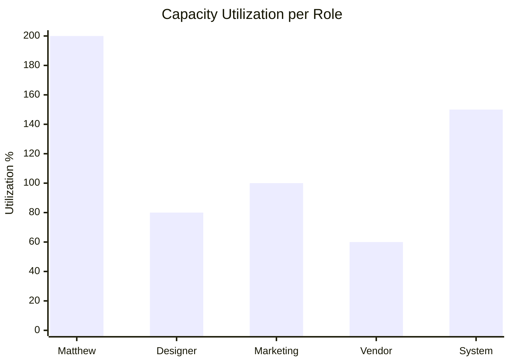
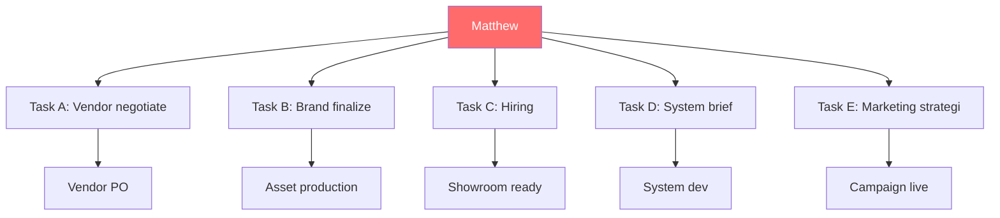

# Capacity Planning

Given timeline + resource (people + vendor + system), compute feasibility. Output: bottleneck identification + recommendation (hire / freelance / defer / scope-cut).

## Triggers

Primary:
- "kapasitas"
- "feasibility tim"
- "bisa absorb"

Secondary:
- "resource planning"
- "capacity check"

## Input Required

| Field | Type | Required | Default |
|---|---|---|---|
| project_or_sprint | string | yes | - |
| deadline | date | yes | - |
| resource_inventory | object | no | (auto-fetch current state) |

## Output Template

```markdown
# Capacity Plan: {PROJECT} → {DEADLINE}

**Days available:** {N}
**Total man-day budget:** {N}

## Resource Inventory

### People Capacity (current)
| Role | Person | Hours/week available | Skill match | Bottleneck risk |
|---|---|---|---|---|
| COO ops | Matthew | 20 (rangkap 5 peran) | High | 🔴 SPOF |
| MA (showroom) | TBH | 0 (belum hire) | - | 🔴 Block |
| Door Expert | TBH | 0 | - | 🔴 Block |
| Designer | Freelance | 10 | Med | 🟡 |
| Marketing | Freelance | 8 | Med | 🟡 |

### Vendor Capacity
| Vendor | Lead time | Volume/month | Status |
|---|---|---|---|
| Selaras Lawang Sewu | 21 hari | 200 unit | 🟢 Active |
| Backup vendor B | 35 hari | 150 unit | 🟡 Standby |

### System Capacity
| System | Status | Capacity |
|---|---|---|
| Inventory + Kiosk + Web + CRM Modul Retail | 🟡 In dev | Day-1 ready Nov 1 target |
| Door Expert konsultasi platform | 🔴 Not started | Q1 2027 |

## Task Decomposition

| Task | Effort (man-day) | Skill needed | Dependency |
|---|---|---|---|
| {Task A} | 5 | COO | None |
| {Task B} | 10 | Designer | Task A |
| {Task C} | 8 | Vendor | Task B |
| {Task D} | 3 | Marketing | Task C |
| Total | 26 man-day | | |

## Capacity vs Demand
- **Total man-day demand:** 26
- **Total man-day supply:** {available days × hours/week / 8}
- **Gap:** {surplus or deficit}

## Bottleneck Identification

### Critical bottlenecks
1. **Matthew SPOF** — rangkap 5 peran, all task dependency converge
   - Impact: kalau sakit/cuti = stop all progress
   - Severity: 🔴 Critical

2. **Hiring delay MA + Door Expert** — block showroom go-live
   - Impact: launch slip kalau hire telat
   - Severity: 🔴 Critical

3. **System dev concurrent** — 4 system live day-1 = compressed timeline
   - Impact: bug + integration issue di soft launch
   - Severity: 🟠 High

## Recommendation (Ranked by impact)

### 1. Hire Operations Partner (Chief of Staff freelance senior)
- 3 hari/week × 5 bulan
- Budget: Rp 15-20jt/bulan × 5 = Rp 75-100jt
- Impact: Reduce Matthew SPOF, parallelize 5 sektor
- ROI: Cost of delay Rp 39-46jt/minggu, breakeven kalau prevent 2-3 minggu slip

### 2. Compress sistem scope (4 → 3 live day-1)
- Defer Web atau CRM Modul Retail ke Q1 2027
- Impact: Reduce dev pressure 25%
- Trade-off: Customer experience incomplete

### 3. Pre-hire MA + Door Expert (Sep-Oct)
- 2 MA + 1 Door Expert
- Budget: Rp 25jt/bulan recurring (start Sep)
- Impact: Showroom go-live ready Nov 1

### 4. Compress brand guideline scope
- Locked items (Bab 1-8) cukup untuk launch
- Defer "WORKING" items refinement ke post-launch
- Impact: Free up CCO + Editorial 30% capacity

## Decision Required dari Matthew
| Option | Cost | Impact | Recommend |
|---|---|---|---|
| Hire Chief of Staff | Rp 75-100jt | Reduce SPOF | ✅ Strongly |
| Pre-hire MA + DE | Rp 75jt | Showroom ready | ✅ |
| Compress sistem | Rp 0 | Risk customer UX | ⚠️ Discuss |
| Defer launch ke Desember | Rp 200-400jt revenue lost | Easier | ❌ |

## KPI Tracking
- Man-day utilization: target 80-85% (avoid burnout)
- Task completion rate: target 95% on-time
- Sprint velocity trend: monthly review
- SPOF count: target reduce dari 5 ke 2 by Sep
```

## Visual Output

Capacity utilization chart + bottleneck flow:



(Red zone = >100% utilization = burnout/delay risk)

Plus dependency graph:



## Knowledge Dependency

- BP Chapter 8 (Lean Store), 14 (SDM)
- Sprint S1-S12 reverse calendar
- Matthew time allocation
- Vendor capacity baseline
- System dev roadmap

## Mode

Default: EXECUTION
Switch: DISCUSSION jika multiple recommendation perlu debate

## Tools Required

- file-search
- code-interpreter (man-day calculation)
- artifacts (chart + flowchart)

## Validation Criteria

- Resource inventory complete (people + vendor + system)
- Task decomposition realistic (man-day per task)
- Bottleneck identified 2-3 (bukan 10+)
- Recommendation ranked by impact + cost
- Decision Required tabular untuk Matthew
- KPI tracking setup
- Brand canon compliance

## Sample I/O

**Input:** "Capacity planning untuk wave 1 launch Oktober 2026"

**Output summary:**
- Resource: Matthew SPOF 5 peran 🔴, hire MA + Door Expert blocked, 4 system dev concurrent
- Demand 26 man-day vs Supply ~30 man-day (tight, no buffer)
- Bottleneck top 3: Matthew SPOF, hiring delay, system compression
- Recommendation: (1) Hire Chief of Staff Rp 75-100jt 5 bulan, (2) Pre-hire MA+DE September, (3) Compress sistem 4→3, (4) Defer launch (rejected)
- Decision matrix tabular ke Matthew
- Utilization chart + dependency graph embedded

## Handoff

- hiring-plan (kalau approve hire Chief of Staff atau MA)
- critical-path (untuk dependency detail)
- CFO Gerai (validate budget hire vs cost of delay)
- Atmaja CEO (escalate decision SPOF)
